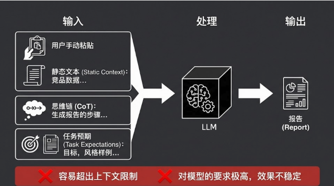
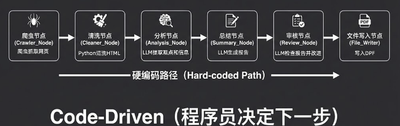
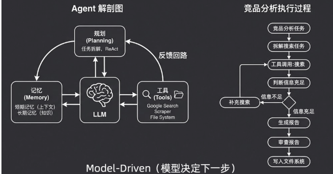
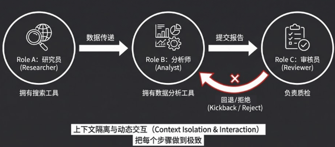
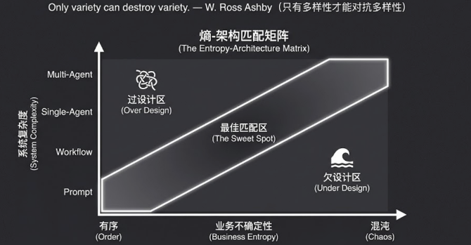

AI应用开发的四种架构范式。

- prompt Engineering。提示词工程
- workflow / chain。代码驱动的流水线
- SIngle Agent。五脏俱全的数字生命
- Multi-Agent System。组织的力量

#### 一、范式一：prompt Engineering，提示词工程

**核心理念：一切交给模型。**

在这个范式下，所有的处理逻辑都在一个大模型（LLM）的黑盒里一次性完成 。开发者要做的核心工作，就是去构建并优化给到模型的那一长串 `Message List`。

- **输入构成**：通常包括静态文本（如手动粘贴的竞品数据）、思维链 CoT（如生成报告的步骤指导），以及任务预期（目标、风格样例等）。
- **局限性**：

1. **容易超出上下文限制**：虽然现在模型号称支持 100K 甚至更大的上下文，但实战中，当文本量超过 3-5 万字后，模型的指令遵循能力和逻辑提取能力会大幅下降。
2. **对模型要求极高，效果不稳定**：你把所有的压力都给到了模型的大脑，模型一换或者稍有波动，你的提示词可能就要推翻重调。

#### 二、Workflow / Chain，代码驱动的流水线

**核心理念：预先编排，稳定执行。**

这是目前工业界落地最多、大家最熟悉的一种范式。它的本质是 **Code-Driven（程序员决定下一步）**。

开发者通过硬编码（Hard-coded Path）预先设计好整个处理路径，在其中的某些节点调用大模型的能力：

1. **爬虫抓取网页**（代码节点）
2. **Python 清洗 HTML**（代码节点）
3. **LLM 提取观点和信息**（分析节点）
4. **LLM 生成报告**（总结节点）
5. **LLM 检查报告并改进**（审核节点）
6. **写入 PDF**（代码节点）

- **优势**：极其稳定。只要边界清晰，这种方式能解决 80%-90% 的工程落地问题。
- **局限性**：一旦遇到步骤不确定、异常分支极多的复杂场景（比如排查一个未知的线上系统 Bug），工作流的枚举成本就会变得不可接受。

#### 三、Single Agent

**核心理念：模型决定下一步（Model-Driven）。**

这就超越了传统程序员的掌控范畴。在这个范式下，模型成为了真正的“大脑”。你只需要给它**任务目标**、**工具箱（Tools）\**和\**记忆（Memory）**，它会基于反馈回路自主进行**规划（Planning）**。

在竞品分析任务中，它的执行过程是动态的：

1. 接收竞品分析任务 。
2. 拆解搜索任务 。
3. 工具调用：搜索 。
4. **判断信息是否充足**：如果**信息不足** ，它会自主决定**补充搜索** 或调用爬虫；如果信息充足，则进入下一步。
5. 生成报告 -> 审查报告 -> 写入文件系统 。

- **痛点**：单体 Agent 在执行复杂长链路任务时，每一次搜索和调用结果都会堆积在上下文中，导致上下文迅速膨胀，最终引发模型幻觉或执行崩溃。

#### 四、Multi-Agent System

**核心理念：用组织的力量给模型“减负”。**

必须澄清一个误区：在一条工作流里用了三个不同的 Prompt 节点，**不叫 Multi-Agent**。真正的 Multi-Agent 系统，其每一个节点都必须是一个具备自主决策能力的 Single Agent。

为什么要有 Multi-Agent？因为我们要通过组织形态来实现两大核心目的：

1. **上下文隔离与动态交互（Context Isolation & Interaction）**：把每个步骤做到极致。原本单体 Agent 会把所有搜索和分析的历史塞满脑子；而在 MAS 中，**Role A（研究员）**只负责搜索数据并传递 ；**Role B（分析师）**拿到精简后的数据进行分析 ；**Role C（审核员）\**负责质检，不合格则\**回退 / 拒绝（Kickback / Reject）** 。子任务的隔离大幅缩短了单个 Agent 的上下文长度。
2. **工具的专注度**：研究员拥有搜索工具，分析师拥有数据分析工具 。就像企业里不同岗位的员工各司其职，这就避免了模型在海量工具库中选错工具的风险。

#### 架构选型

投射到 AI 应用开发中，就是：**业务的不确定性决定了系统的不确定能力。**

业务的不确定性（Business Entropy）主要体现在三个方面：输入的不确定性、过程的不确定性、结果的不确定性。

你可以对照上方的**“熵 - 架构匹配矩阵”**：

- 如果业务极其**有序（Order）**，规则固定，那么强行使用 Multi-Agent 就是**过设计区（Over Design）**，白白增加系统复杂度和成本。
- 如果业务非常**混沌（Chaos）**，比如开放式智能客服或复杂的代码调试，你却想用简单的 Prompt 去搞定，那就是**欠设计区（Under Design）**，系统根本无法应对。
- 我们的目标，是根据业务的实际熵值，找到那条**最佳匹配区（The Sweet Spot）**。

