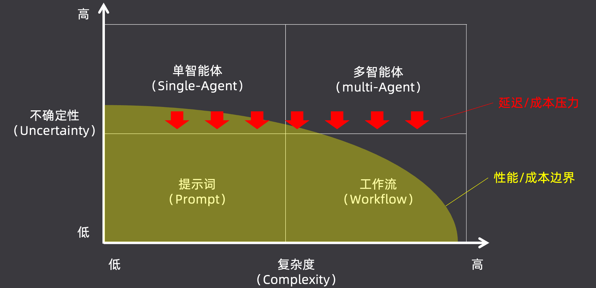

## 单 Agent 的 ReAct 的核心逻辑

Agent 遵循着一个经典的范式：ReAct（Reasoning + Acting）。是 推理和行动的缩写。比如一段 sysmtem prompt：

```
You are {role}, {backstory}. Your personal goal is: {goal}. 
You ONLY have access to the following tools: {tools schema}.
IMPORTANT: Use the following format in your response:
Thought: you should always think about what to do
Action: the action to take (must be one of the tools)
Action Input: the input to the action (JSON object)
Observation: the result of the action
Once all necessary information is gathered, return:
Thought: I now know the final answer
Final Answer: the final answer to the original input question
```

模型必须严格按照 `Thought` -> `Action` -> `Action Input` -> `Observation` 的格式来输出。但有一个问题是：模型在输出完 Action Input 后，其实还没真正调用工具。如果由着模型继续输出 Observation。一定会产生幻觉。

为了防止模型产生幻觉，工程框架中会引入一个“stop信号”。当大模型按照格式输出完 Action Input，刚开始 Observation 的时候，框架会强行掐断模型的输出。然后工程上去调用工具，结果回写上下文。然后再次调用模型。

ReAct 的核心逻辑：遵循 `Thought -> Action -> Action Input -> Observation -> Final Answer` 的范式。

真实的工业落地中，推荐“混合架构”

- **对于主链路和确定性的步骤**：坚决使用 **Workflow（工作流）**，保证极高的稳定性和极低的成本（例如：获取客户信息、数据初步校验）。
- **对于充满不确定性的特定节点**：引入 **Agent** 去自主解决。比如当工作流遇到一个复杂的“线上未知报错排查”节点时，唤醒 Agent 去自主查日志、搜资料、写总结，处理完后再把结果返回给工作流。

## Multi-Agent 系统

单Agent 的问题：

- 上下文长度爆炸。面对复杂、长链路的企业级任务时。ReAct的核心逻辑是不断将工具执行结果追加到上下文，当上下文过长时，大模型的推理速度和指令遵循能力会断崖式下降。
- 上下文内容污染。大模型基于 Transformer 架构，本质上预测下一个 Token，因此他极易受前文干扰。比如：先让模型写一份报告，然后再让他评价这份报告，那他会顺着自己之前的思考疯狂自夸，失去客观性。
- 多指令挑战。单Agent像一个全能打工人，如果同时塞给他搜索、写代码、文件操作等几十个工具，光是工具的 Schema 描述就会占满上下文。在执行过程中，很容易因为注意力分散而选错工具或者捏造错误参数，导致整个ReAct循环直接卡死。

Multi-Agent 由三个基本要素构成：

- **Agent（角色）**：相当于团队中的具体员工，如**产品经理**、**研发**、**测试**。我们需要为每个 Agent 清晰地定义其目标、职责边界以及它所掌握的专属工具。
- **Task（任务）**：团队要完成的具体工作，分为外部输入的整体任务，以及 Agent 协作过程中产生的**子任务：代码研发** 或 **子任务：项目测试**。每个任务都必须有明确的描述和预期输出。
- **Process（流程）**：类似于项目管理办公室（PMO），决定了这群人如何协同工作。是采用线性的瀑布流？还是高度交互的敏捷开发？Process 规定了 Agent 处理 Task 的流转方式。

Multi-Agent 的优势：

- **上下文更纯净 (Cleaner Context)**：这是最大的优势。每个 Agent 都在任务隔离的干净上下文中工作，互不干扰，彻底消灭了“污染”问题。
- **任务单一专注 (Single Task Focus)**：任务原子化后极其容易调优，甚至使用参数量较小、成本更低的本土模型也能在单一任务上达到顶尖水平**。**
- **利于任务拆解**：结构清晰，执行更加精准到位。
- **容错高 (High Fault Tolerance)**：很多人误以为节点越多越容易报错。实际上，因为单个 Agent 具备自主决策能力，即使“搜索专员”暂时卡死，上游的“撰写员”也能捕获错误并尝试重试或换个策略，实现了错误的有效隔离。
- **效果上限高**：专业化分工决定了系统极高的天花板**。**

Multi-Agent 的劣势：

- **总成本高 (High Total Cost)**：即便我们用尽了文件交互等手段来省钱，但在复杂的协作网中，模型调用的总 Token 消耗依然会急剧上升。
- **耗时长 (Long Duration)**：串行调度与多节点反思，导致延迟成倍增加（比如从单 Agent 的几分钟暴涨到半小时）。
- **设计难度高 (High Design Difficulty)**：架构师必须精细权衡分工与边界。如果边界设计不合理（比如让写大纲的 Agent 也拥有搜索工具），它就会陷入抢着干活的“死循环”，严重拖垮整体质量**。**

终极结论：Multi-Agent 的本质，就是用更多的计算成本和时间成本，去换取业务效果的极高上限与系统可靠性。

## 如何选型

使用 CUP 三维评估模型去决策。

1. Complexity（复杂度）

- **交互复杂性**：用户的输入是简单的“单轮对话与纯文本”（例如简单的机器翻译），还是极具挑战的“多轮交互与多模态文件”（例如阅读长文档、编写代码、持续优化并解释输出） ？
- **依赖复杂性**：任务的完成是仅依赖“模型自身”的内部知识（例如总结文章大意），还是需要深度调用外部的“工具与数据”（例如查询数据库、生成专业图表、自动发送邮件） ？
- **过程复杂性**：从输入到输出是“单步”直达（例如简单的情感分析判断），还是漫长的“多步”流转（例如经历网页爬取、数据清洗、多维分析等一系列动作） ？

2. Uncertainty（不确定性）-- 核心维度

- **输入不确定性**：输入的“边界清晰”（例如标准化的数据信息抽取），还是“边界模糊”（例如完全开放式的用户助手，你永远猜不到用户下一句会问什么） ？
- **过程不确定性**：执行路径是“固定路径”（例如 OCR 识别 -> 验真 -> 计算金额），还是充满变数的“未知路径”（例如搜索信息后发现此路不通，需要动态换策略、修改大纲） ？
- **目标不确定性**：衡量标准是“标准明确”（例如判断一个风控指标是否合规），还是主观的“标准模糊”（例如产出一篇具有深度的行业分析报告，连用户自己都很难立刻量化其好坏） ？

3. Performance Constraints（性能约束）：一票否决

- **响应时间约束**：业务是否要求响应时间必须 < 1 秒 ？如果是，哪怕再复杂的场景，你也绝不能使用需要长时间循环思考的 Agent。
- **成本约束**：这是一个高吞吐、低价值的场景吗 ？如果是给海量基层业务员日常使用的高频功能，高昂的 Token 消耗会导致 ROI（投资回报率）直接穿透底线。
- **上下文大小约束**：业务是否需要极长的历史记忆或超大文件处理（> 128k） ？这会直接限制你对模型和架构的选型。



不同场景的推荐架构范式：

- 低复杂度+低不确定性。提示词，用最简单、最直接的成本解决问题
- 高复杂度+低不确定性。工作流，步骤虽长但边界清晰，用硬编码流水线保证极高的稳定性
- 低复杂度+高不确定性。单智能体，赋予模型决策权，灵活应对未知变化
- 高复杂度+高不确定性。多智能体，组织专家团队，分工协作攻克难题

> 一旦有性能/成本的边界，巨大的延迟和成本压力会影响我们的选型。核心策略是：收缩能力边界，强行降低不确定性

举一个例子。线上问题报警后的根因定位。

- 复杂性？极高 。需要跨越系统拉取日志、比对各种 Matrix 监控大盘、追踪全链路的 Tracing 数据，依赖极度繁杂。
- 不确定性？ 极高 。表现出的症状千奇百怪，排查路径需要根据上一步的反馈随时动态调整，根本无法穷举。
- 时效性要求？ 极高 。线上事故止损黄金时间通常只有五到十分钟，留给 AI 系统排查的时间可能只有两三分钟。

因此，决策结果：虽然 C 和 U 都指向了 Multi-Agent，但极高的时效性（P）一票否决了纯 Multi-Agent 漫长的调度耗时。最终，现实的工业级解法是采用**混合架构**：以快速稳定的 Workflow 为骨架控制大方向，在遇到极其复杂的特定排查节点时，再唤醒单智能体（Single-Agent）进行局部的深度推理。


