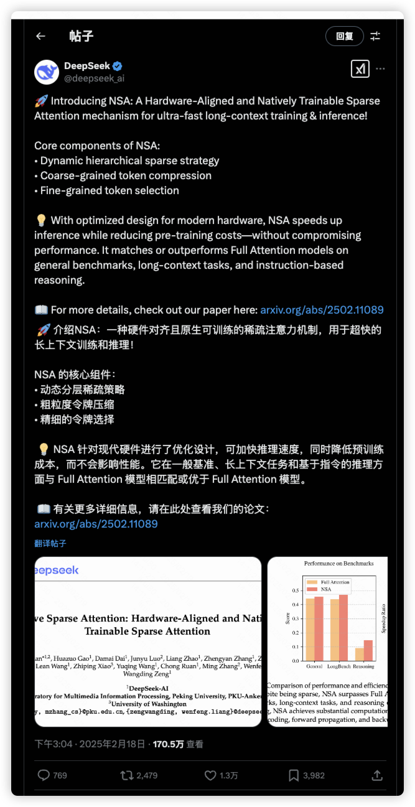
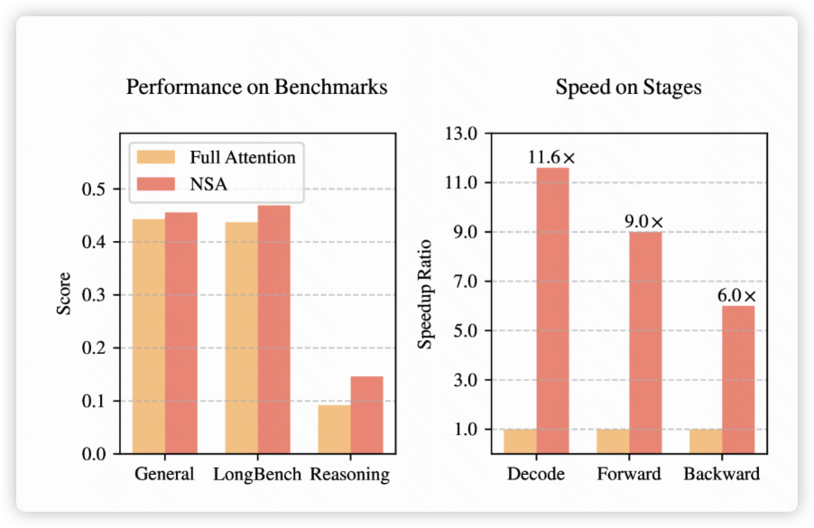
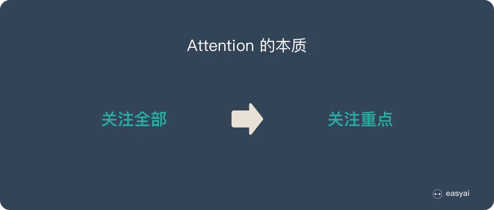
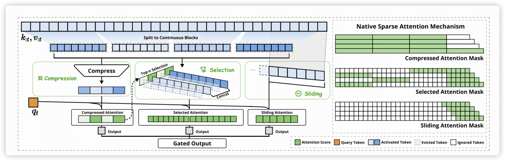
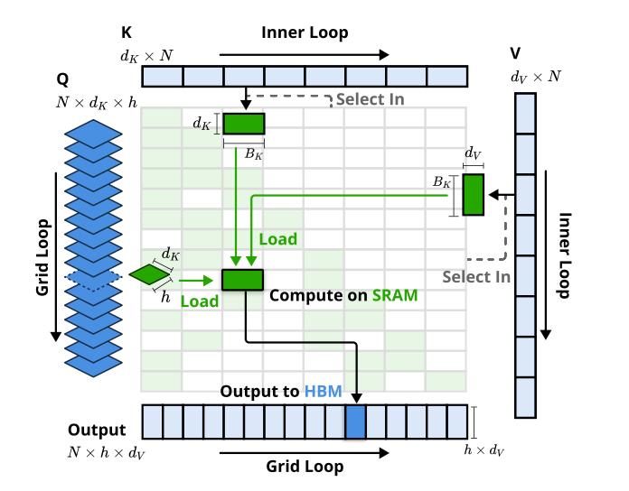
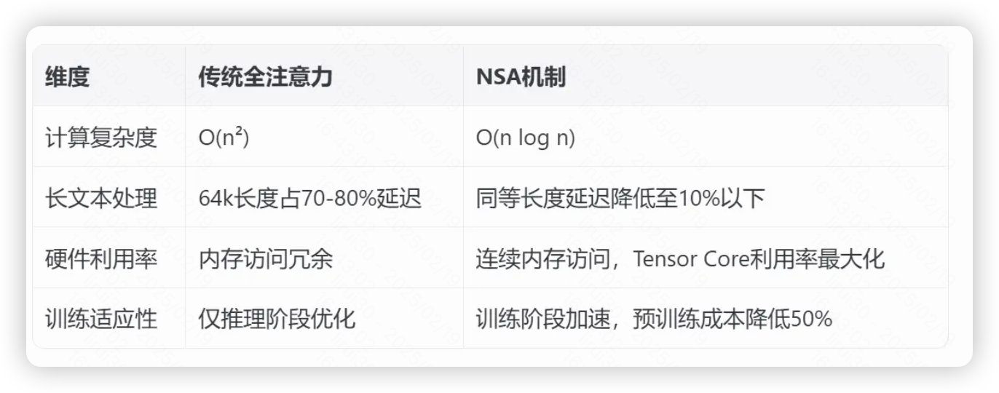

**DeepSeek新论文《NSA原生稀疏注意力机制》解读**

# **一、前言**

2月18日下午，马斯克发布号称“地球上最聪明AI”的Grok-3，发布会结束不到1小时

DeepSeek团队于2月18日下午3点，发布一篇论文介绍了新的注意力机制NSA（Natively Sparse Attention，原生稀疏注意力机制），且创始人梁文峰亲自挂帅署名；

截止目前不到24小时，仅在X上已有170.5w查看，原X链接：[DeepSeek 新论文动态](https://x.com/deepseek_ai/status/1891745487071609327)

**NSA的效果也是爆炸的**

**性能**：NSA 在通用基准、长期上下文任务和推理评估方面均超过了Attention基线；

**效率**：在6.4万字的长文档场景下，NSA能实现解码速度提升11倍多，前向传播加速9倍，反向训练效率也提升6倍。**相当于原本需要1小时处理的任务，现在5分钟就能完成**

**此项技术意义非凡，它极有希望显著增强下一代大语言模型处理长文本的能力，与此同时，还能充分兼顾运行效率。在各家都在堆资源提升效果的背景下，DeepSeek却在架构优化上走在了行业前列。**

**与2000年代的中国制造业依赖****低廉的劳动力****打造的成本优势不同，况且中国目前也没有低廉的显卡资源优势，DeepSeek趟开了基于架构优化的成本优势之路。**

# **二、为什么要做NSA**

NSA(Natively Sparse Attention，原生稀疏注意力机制)是Attention机制上的优化，因此要讲清楚什么是NSA前，我们需要先了解一下Attention注意力机制以及Attention的瓶颈。

## **2.1 什么是注意力机制**

Attention（注意力）机制如果浅层的理解，跟他的名字非常匹配。他的核心逻辑就是「**从关注全部到关注重点**」。

我们人类搜索快手时，首先关注到的就是硕大的“**橙色图标**”、红色的大字“**股票价格**”，

而就算提前告诉我们图片中有“音乐”这两个字，我们也需要找上一段时间才能再众多文字中找到，而且人眼的寻找逻辑也不是一个像素一个像素地去寻找，自然而然地忽略空白、无字图片。

#### **Attention的本质**

由上得知，我们人类观察\理解的逻辑就是关注重点，因此1998年计算机视觉领域首次提出视觉注意力系统，通过显著性图选择重点区域，而Attention机制就是模仿人类思考逻辑，计算图片中像素和像素之间的关系、文字和文字间的关系。

#### **Attention的应用**

2014年谷歌DeepMind将注意力机制引入RNN模型，用于图像分类，2017年还是由谷歌的《Attention is All You Need》论文中提出Transformer架构，完全基于注意力机制，取代传统的CNN\RNN结构，成为自然语言处理领域的里程碑。

**ChatGpt(Chat Generative Pre-trained Transformer)**也是基于Transformer(底层也是Attention)架构发展的自然语言领域模型。

大语言模型领域从此飞速发展，**那么，代价是什么呢？**

## **2.2 注意力机制的瓶颈**

#### **计算复杂度高**

**长文本 = 算力黑洞**

大家使用大模型生成答案时，很强烈的感受就是，**太慢了**，尤其是增加了推理的情况下，少则一两秒，多则几十秒，

比如扔给大模型一本书，让他总结男女主角是怎么认识的，现在的大模型的做法是通读这本书的每一个文本，**逐字逐句读完**，**相当于密集计算所有词的关系**，甚至关联性不大的文字，也需要计算之间的关联度，再输出答案。

全注意力机制的计算复杂度（O(n2)）会随着文本长度**平方级增长**，在当下token越来越大的背景下（长文本，推理任务，视频理解等），Attention的算力瓶颈越来越成为训练和推理时的主要瓶颈。

在全Attention 中，每生成一个新的 token，模型都需要对前面所有的 token 进行打分并做加权和。如果我们关注打分情况，大量值都在0附近，这也是“sparse”(稀疏)的由来，意味着大量的计算都是无意义的。有多稀疏呢？比如处理64K长度的文本时，可能只需要 20%甚至更少的 token 做加权和就可以了，意味着注意力计算可能占整体延迟的**70%-80%**。

Sparse attention 类的论文的核心出发点，其中的关键就是用什么算法去压缩参数计算量，NSA 也不例外。

#### **资源成本高**

对于企业来讲，训练成本(数据、算力、人力等等)不用多说了，没个几百万美元可能都碰不到训练的门槛，MaaS模式的部署维护成本也很高：

潞晨科技创始人尤洋在微博和朋友圈表示，短期内，中国的MaaS模式可能是最差的商业模式，大厂相互卷低价和免费，满血版DeepSeek R1每百万token（输出）只收16元。**如果每日输出1000亿token，基于DeepSeek的服务每月的机器成本是4.5亿元，亏损4亿元；用AMD芯片月收入4500万元，月机器成本2.7亿元，这意味着亏损也超过2亿元。**

## **2.3 稀疏注意力机制的优点**

由于大模型的参数过于庞大，而且标准注意力机制的计算方式是全量计算注意力，在处理长序列时计算复杂度非常高。

而**稀疏注意力机制**通过**选择性计算关键信息**(比如只分析某些词之间的关系)，大幅降低计算量。

#### **什么是稀疏注意力机制**

通俗的讲，稀疏注意力不是平等地看待每个词，而是通过只关注最重要的词来提高效率。可以把它想象成阅读摘要而不是整本书。

该机制可以从底层机制上放弃追求100%的正确率，转而极致提升效率。

仔细想想，**其实挺可怕的，因为人类的脑子就是这么干的。**

大模型越来越逼近人类的能力，超过人类看起来只是时间问题，而非遥不可及了。

效率低时，我们还可以认为只有大企业才能烧得起钱，不远的未来，人人都能训练能力超凡的大模型，甚至用于黑产、犯罪，真的很难说。

稀疏注意力机制早有人提出**：KV缓存淘汰方法、块状KV缓存选择方法、采样、聚类或哈希选择方法**等。

但这些方法在实际部署中往往未能达到理论上的加速效果。存在诸多难点，如：如何在保持模型能力的前提下提高效率，如何实现端到端训练以减少预训练计算量而不牺牲模型性能，且主要集中于推理阶段，缺乏有效的训练时支持。

## **2.4 大势所趋**

### **算力资源阻碍**

美国政府多次试图通过禁止向中国出口高端显卡，连游戏显卡都波及，甚至还有5090 D中国特供版，试图通过卡底层建筑的方法，封锁中国科技。

**长此以往，缺少高端显卡势必会导致中国的AI发展受阻，算力黑洞问题的解决志在必得。**

### **长文本应用重要性高**

随着大语言模型的发展，处理长文本 (例如，完整的代码库、长篇文档) 的能力变得越来越重要。这使得模型能够进行更深入的推理、代码生成和多轮对话，大家越来越注意到**长文本建模的重要性。**

等等。。。

**在上述的背景下，需要设计一种高效且易于训练的稀疏注意力机制，以支持长文本建模，NSA（****Natively Sparse Attention****）应运而生。**

# **三、NSA是什么**

**一句话解释**：一种压缩关键信息、硬件计算优化的Attention机制；

**通俗版解释**：让AI处理长文本时，只需要关注真正重要的信息，而不是强制计算所有内容之间的关联；

**论文名称： 《Native Sparse Attention: Hardware-Aligned and Natively Trainable Sparse Attention》**

**论文地址：**[**https://arxiv.org/pdf/2502.11089**](https://arxiv.org/pdf/2502.11089)

## **3.1 NSA实现原理**

### **3.1.1 整体框架**

- 算法层面：将key和value组织成时间块 (temporal block)，并通过三个 Attention 分支处理：压缩的粗粒度 token、选择性保留的细粒度 token 和滑动窗口。
- 工程设计：使用专门的 kernel 来最大化实际效率。

### **3.1.2 关键算法设计**

为了很好地实现这一点，原生稀疏注意力（NSA）引入了一种新的方式来过滤掉不重要的词，同时保留足够的上下文以理解全文的意思。它通过以下三种主要技术实现：

#### **1、压缩(****Compression****)**

NSA不是查看每一个单独的词，而是将词分组为“块”，并为每个块创建一个摘要。可以将其视为将一段话变成简短的总结。

比如把一本小说按章节拆分。对每个块做 「缩略图提取」：用 AI 自动生成该块的语义摘要，类似读书时先看目录。

#### **2、动态选择(****Selection****)**

让 AI 自主决定哪些块需要细读，筛选标准通过训练自动优化，相当于教 AI 什么信息值得关注。

比如当人们看到“请注意”这三个字，就自然而然加大了接下来文字的重要性，还有“重要的事情说三遍”等等。

#### **3、滑动窗口(****Sliding****)**

即使NSA进行了摘要和选择，同时也用滑动窗口覆盖周边内容，它仍然对选中的关键块启用全注意力机制，进行逐字分析，局部深挖，防止断章取义；

相当于读书先读目录、书摘，再有针对性得读重要内容。

这三个分支是并行计算的，最后求一个加权和（Gated Output，gate的值在 [0, 1]）。这三种方法核心都是在减少KV Cache的load量。共同的假设都是这个领域的一个共识——**Attention是很稀疏的**，只需要少量的KV Cache就可以达到精度很高的近似。具体请参考[[2306.14048\] H$_2$O: Heavy-Hitter Oracle for Efficient Generative Inference of Large Language Models](https://arxiv.org/abs/2306.14048)这篇论文。

### **3.1.3 工程设计**

#### **1、硬件对齐系统：**

基于 Triton 实现硬件对齐的稀疏 Attention kernel。针对GQA和MQA架构，专注于稀疏选择 Attention 的专门 kernel 设计。

通俗讲就是算法与GPU等硬件特性对齐，减少内存访问次数

- **组中心数据加载：**对于每个内部循环，加载同一组(GQA)内的所有查询及其共享的稀疏KV块索引。
- **共享KV获取：**在内部循环中，顺序加载连续的KV块到SRAM中，以最小化内存加载。
- **网格调度的外循环：**由于内部循环长度在不同Query之间几乎相同，将Query/Output循环放在Triton的grid调度器中，以简化和优化kernel。

#### **2、训练感知设计**

NSA实现了端到端训练，避免传统方法「先训练后裁剪」的性能损失。

### **3.1.4 为什么NSA更快**

NSA比传统的注意力机制快得多，简单来说因为：

1. 它通过只关注最重要的词减少了词之间的比较次数。
2. 它有效地组织数据，使计算机可以快速处理。（就像在计算机上整齐地组织文件可以更快地找到东西一样。）
3. 它针对现代计算机硬件进行了优化，使得GPU（为AI模型提供动力）可以高效处理。

# **四、NSA的意义是什么**

说到底这项技术看起来是简单的计算方式优化，但个人理解是**大语言模型未来研究方向的转移**，过度的堆算力并不是AI的正确道路，不堆资源，训练成本更低，效果也是很爆炸的：

**1. 效率显著提升**

**训练速度**提升9倍：在64k文本长度下，训练耗时从全注意力机制的 100% 降到 11%。

**推理速度**提升11.6倍：处理同长度文本，所需计算资源不到原来的十分之一。

**2. 成本重构**

同等算力下可处理 10 倍长的文本，或用1/10的算力达到相同效果。

其实减少注意力机制计算复杂度一直是学术界的研究热点，但工业界看到了**「大力出奇迹」**的效果是出奇的好，都在堆资源上做训练，毕竟性价比太高了**。**

Scaling law当然很有效，以往只需要堆参数、堆数据量、屯卡、烧钱，大企业就能训练出效果不错的大模型。但就像几十年前的第一台计算机ENIAC重30吨，全球的面积能放得下多少个ENIAC，而现在的个人电脑，mac才几公斤重，人手一个，甚至可以从文件袋中拿出来。

**未来的大模型一定是轻量化的、架构更优的，不应该只是「大力出奇迹」。**

而马斯克的“首个突破 1400 分的模型 、 首个十万卡集群训练出来的Grok-3”，还在走「大力出奇迹」的老路，效果如何留给各位看官评价吧。

**未来会有更多长文本的应用场景，**我们可应用到到更长的上下文应用：

**文档助手**：上传几百页的行业报告，AI能在几秒内总结；

**教育革命**：学生用AI快速学习一本书、一门课，了解一个行业；

**代码开发**：AI真正理解整个代码库的架构，而不只是片段补全；

**内容审核**：平台能实时分析超长视频的完整上下文，而不只是截取片段。

更重要的是，**中国团队这次抢到了算法创新的先手 —— 在注意力机制这个最核心的领域，我们第一次提出了被国际学界认可的基础架构改进。**