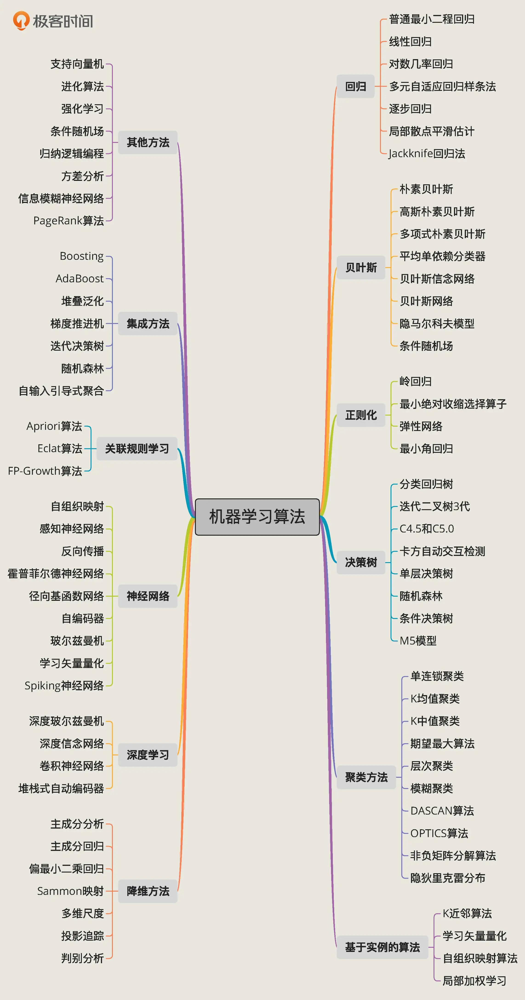

机器学习：是一种从数据生成规则、发现模型，来帮忙我们预测、判断、分组和解决问题的技术。

具体来看，机器学习分为四大类：监督学习、无监督学习、半监督学习、强化学习。

- 监督学习：训练数据集全部有标签
- 无监督学习：训练数据集没有标签。目前大多应用在聚类、降维等场景
  - 聚类：把数据特征彼此邻近的用户聚成一组。“特征彼此邻近”指的是这些用户的数据特征在坐标系中有更短的向量空间距离。也就是说，聚类算法是把空间位置相近的特征数据归为同一组。
  - 降维：通过数学变换，将原始高维属性空间转变为一个低维“子空间”。本质上是通过最主要的几个特征维度实现对数据的描述

- 半监督学习：训练数据集中，有的数据有标签，有的数据没有标签。因为获取数据标签的难度很高，有些无标签的数据会人工“贴标签”。

监督学习可以被分为两类：回归问题和分类问题。

- 回归问题的标签是连续数值。
- 分类问题的标签是离散性数值

强化学习，研究的目标是智能体（agent、机器学习模型）如何基于环境而做出行动反应，以取得最大化的累积奖励。

- 监督学习是从数据中学习，而强化学习是从环境给他的奖惩中学习。

深度学习，是一种使用深层神经网络算法的机器学习模型。深层神经网络能够对非结构的数据集进行自动的复杂特征提取，完全不需要人工干预。

- 比如，图形图像、自然语言和文本的处理是计算机行业的难题，因为这类信息的数据集，并不是结构化的，需要人工跟进信息的类型来选择特征进行提取

机器学习的算法：

## 机器学习的步骤

机器学习项目一般分为 5 步：定义问题、收集数据和预处理、选择算法和确定模型、训练拟合模型、评估并优化模型性能。

