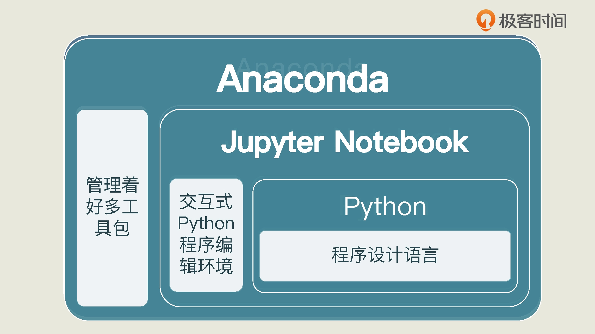

一般使用  `Python + Anaconda + Jupyter Notebook` 这三样工具是机器学习的标配。

 

常见命令：

```
启动 jupyter 服务
nohup  jupyter notebook --port 10999 1>&1  2>/dev/null &

conda env list
conda activate py-3.10
```


kaggle 平台：数据科学爱好者的交流平台，里面有数据集、源代码、课程资料等

