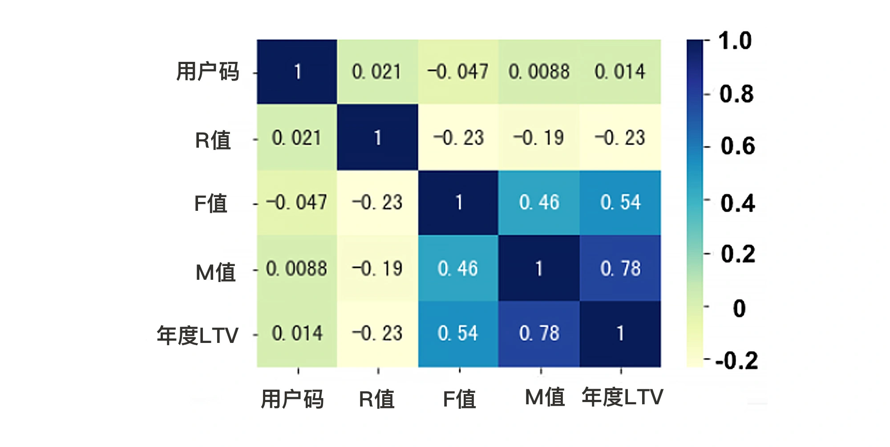

## 特征工程

数据和特征决定了机器学习的上限，而模型和算法只是无限逼近这个上限而已。

特征工程的思路：特征选择、特征变换、特征构建。

#### 1. 特征选择 - 相关性热力图

特征的作用大小？常用的方法：相关性热力图。

```
# 对所有的标签和特征两两显示其相关性热力图(heatmap)
import seaborn as sns
sns.heatmap(df_LTV.corr(), cmap="YlGnBu", annot = True)
```

会输出一个相关性热力图。



图中的数字叫做“皮尔逊相关系数”，表示两个变量间的线性相关性，数值越接近1，代表相关性越大。正数代表正相关，负数代表负相关（即指标A越大，指标 B 就越小）

#### 2. 自动特征选择

单变量特征选择工具：SelectKBest。它会对每个特征和标签之间进行统计检验，根据 X 和 y 之间的相关性统计结果，来选择最好的 K 个特征。

```
from sklearn.feature_selection import SelectKBest, mutual_info_regression  #导入特征选择工具
selector = SelectKBest(mutual_info_regression, k = 2) #选择最重要的两个特征
selector.fit(X, y) #用特征选择模型拟合数据集
X.columns[selector.get_support()] #输出选中的两个特征
```


