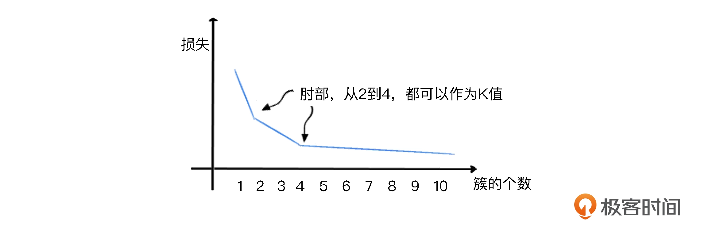

### 无监督学习中的聚类算法之 K-Means 算法

聚类：把数据特征彼此邻近的用户聚成一组。“特征彼此邻近”指的是这些用户的数据特征在坐标系中有更短的向量空间距离。也就是说，聚类算法是把空间位置相近的特征数据归为同一组。

- 在 K-Means 算法中，“K”是一个关键。K 代表聚类的簇（也就是组）的个数。比如说，我们想把 M 值作为特征，将用户分成 3 个簇（即高、中、低三个用户组），那这里的 K 值就是 3，并且需要我们人工指定。
- 指定 K 的数值后，K-Means 算法会在数据中随机挑选出 K 个数据点，作为簇的质心（centroid），这些质心就是未来每一个簇的中心点，算法会根据其它数据点和它的距离来进行聚类。 挑选出质心后，K-Means 算法会遍历每一个数据点，计算它们与每一个质心的距离（比如欧式距离）。数据点离哪个质心近，就跟哪个质心属于一类。
- 遍历结束后，每一个质心周围就都聚集了很多数据点，这时候啊，算法会在数据簇中选择更靠近中心的质心，如果原来随机选择的质心不合适，就会让它下岗。
- 在整个聚类过程中，为了选择出更好的质心，“挑选质心”和“遍历数据点与质心的距离”会不断重复，直到质心的移动变化很小了，或者说固定不变了，那 K-Means 算法就可以停止了。

#### 1. 手肘法选取 K 值

手肘法是通过聚类算法的损失值曲线来直观确定簇的数量。损失值曲线，就是以图像的方法绘出，取每一个 K 值时，各个数据点距离质心的平均距离。

如下图，当 K 值取值较小时，整体损失很大，也就是说各个数据点距离质心的距离比较大。而随着 K 的增大，损失函数的值会在逐渐收敛前出现一个拐点。此时的K 值就是一个比较好的值。



代码如下：

```
from sklearn.cluster import KMeans #导入KMeans模块
def show_elbow(df): #定义手肘函数
    distance_list = [] #聚质心的距离（损失）
    K = range(1,9) #K值范围
    for k in K:
        kmeans = KMeans(n_clusters=k, max_iter=100) #创建KMeans模型
        kmeans = kmeans.fit(df) #拟合模型
        distance_list.append(kmeans.inertia_) #创建每个K值的损失
    plt.plot(K, distance_list, 'bx-') #绘图
    plt.xlabel('k') #X轴
    plt.ylabel('距离均方误差') #Y轴
    plt.title('k值手肘图') #标题
```

#### 2. 聚类结果

聚类作为一种无监督学习算法，只是盲目的把用户分群（按照其空间距离的邻近性），而不管每个群的具体意义，因此不会有排序功能。

因此我们对于聚类的结果还需要进一步处理。也即“聚类后概念化”。


