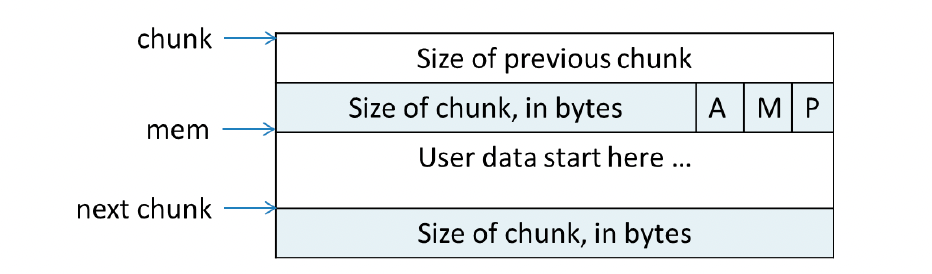
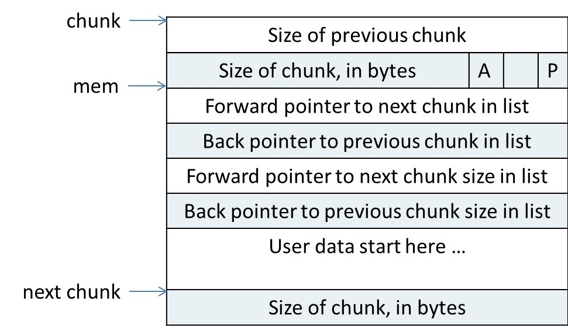

malloc_chunk 的定义：

```
struct malloc_chunk {

  INTERNAL_SIZE_T      mchunk_prev_size;  /* Size of previous chunk (if free).  */
  INTERNAL_SIZE_T      mchunk_size;       /* Size in bytes, including overhead. */

  struct malloc_chunk* fd;         /* double links -- used only if free. */
  struct malloc_chunk* bk;

  /* Only used for large blocks: pointer to next larger size.  */
  struct malloc_chunk* fd_nextsize; /* double links -- used only if free. */
  struct malloc_chunk* bk_nextsize;
};
```

已经分配的 chunk 格式如下：



空闲的 chunk 格式如下：



##### mchunk_prev_size

8 字节。 如果前一个 chunk 是空闲的，该域表示前一个 chunk 的大小，如果前一个 chunk 不空闲，该域无意义

##### mchunk_size

8 字节。当前 chunk 的大小，并且记录了当前 chunk 和前一个 chunk 的一些属性，包括前一个 chunk 是否在使用中，当前 chunk 是否是通过 mmap 获得的内存，当前 chunk 是否属于非主分配区。

最后的三位分别是 A、M、P。

最低的 P 位，表示前一个块是否在使用中，P 为 0 则表示前一个 chunk 为空闲。这时 mchunk_prev_size 域才有效。P 为 1 表示前一个 chunk 正在使用中，mchunk_prev_size 域无效。ptmalloc 分配的第一个块总是将 P 设置为 1，以防止程序引用到不存在的区域。

M 位表示当前 chunk 从那个内存区域获取的虚拟内存。M 为 1 表示该 chunk 是从 mmap 映射区域分配的，否则是从 heap 区域分配的。

A 位表示该 chunk 属于主分配区或者非主分配区，如果属于非主分配区，将改位置为 1，否则置为 0

##### fd 和 bk

指针 fd 和 bk 只有当该 chunk 空闲时才存在，其作用是用于将对应的空闲 chunk 块加入到空闲 chunk 块链表中统一管理。

如果该 chunk 块被分配给应用程序使用，那么这两个指针也就没有用。所以当作应用程序的使用空间，不会浪费。

##### fd_nextsize 和 bk_nextsize

当前的 chunk 存在于 large bins 中时，large bins 中的空闲 chunk 是按照大小排序的，但同一个大小的 chunk 可能有多个，增加了这两个字段可以加快遍历空闲chunk，并查找满足需要的空闲 chunk。

fd_nextsize 指向下一个比当前 chunk 大小大的空闲 chunk，bk_nextsize 指向前一个比当前 chunk 大小小的空闲 chunk。

如果该 chunk 被分配给应用程序使用，那么这两个指针没有用，会当前应用程序的使用空闲，避免浪费。

### 注意

已经分配的 chunk 和空闲的 chunk 形式不一样。

空闲的 chunk，会在原本是用户数据区的地址存储四个指针，指针 fd 指向后一个空闲的 chunk，而 bk 指向前一个空闲的 chunk，ptmalloc 通过这两个指针将大小相近的 chunk 连成一个双向链表。对于 large bin 中的空闲 chunk，还有两个指针 fd_nextsize 和 bk_nextsize 用来加快在 large bin 中查看最近匹配的空闲 chunk。


