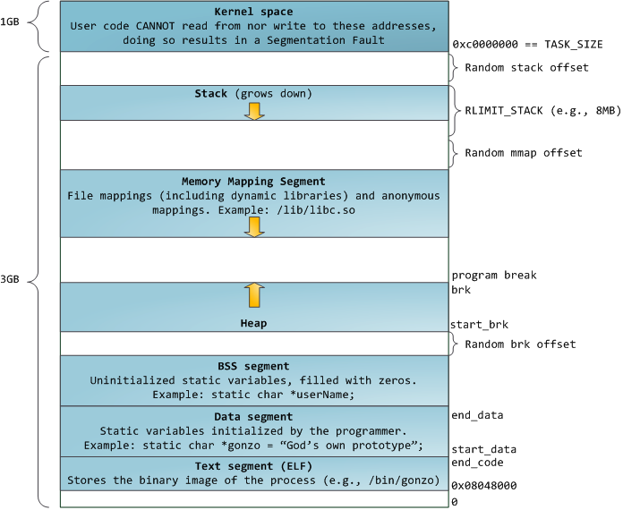
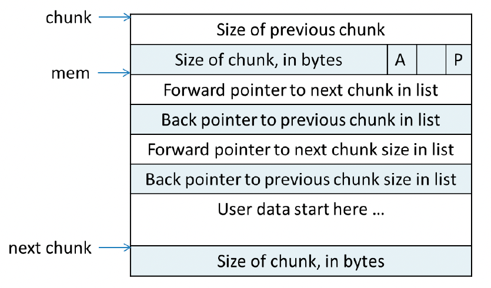
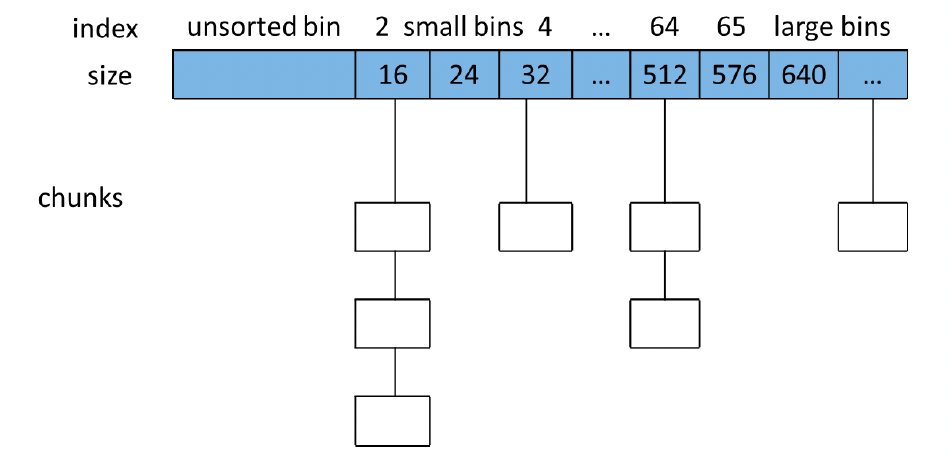

内存管理不外乎三个层面，用户管理层、C运行时库层、操作系统层。我们一般使用 top 或者 `/proc/pid/status` 看到的是操作系统层的进程的内存占用。同时，可以通过代码来排查用户管理层的一些内存问题，比如内存泄漏之类。但是C运行时库的内存占用对于我们来说，排查问题很需要知道他的原理。我们需要解决如下问题：

- Glibc 在什么情况下不会将内存归还给操作系统？
- Glibc 的内存管理方式有哪些约束？适合什么样的内存分配场景？
- Glibc 是如何管理内存的。

研究的源码是 `glibc-2.12.1` 版本，如下是**内存管理数据结构概述**

## 一、sbrk 与 mmap

进程的内存布局如下：

- 其中 start_brk 指向 heap 的开始，而 brk 指向 heap 的顶部。可以使用系统调用 `brk()` 和 `sbrk()` 来增加 heap 顶部的 brk 值，从而线性的增加分配给用户的 heap 空间。

- 在使用 malloc 之前，start_brk 和 brk 的值是相等的，也就是 heap 大小为 0。

- ptmalloc 在开始时，若请求的空间小于 mmap 分配阈值（默认 128KB）时，主分配区会调用 sbrk 增加一块大小为 `(128KB + chunk_size) align 4KB` 的空间作为 heap。非主分配区会调用 mmap 映射一块大小为 `HEAP_MAX_SIZE(32 位系统上默认为 1MB，64 位系统上默认为 64MB)` 的空间作为 sub-heap。

- 当用户请求内存分配时，首先会在这个区域内找一块合适的 chunk 给用户。当用户释放 chunk 时，ptmalloc 又会使用 fast bins 和 bins 来组织空闲 chunk。已备用户的下一次分配。

- 如果需要分配的 chunk 大小大于 mmap 分配阈值，而 heap 空间又不够，则此时主分配区会通过 sbrk 调用来增加 heap 大小，非主分配区会调用 mmap 映射一块新的 sub-heap，也就是增加 top chunk 的大小，每次 heap 增加的值都会对齐到 4KB。

- 当用户的请求超过 mmap 分配阈值，并且主分配区使用 sbrk 分配失败的时候，或是非主分配区在 top chunk 中不能分配到需要的内存时，ptmalloc 会尝试使用 mmap 直接映射一块内存到进程内存空间。使用 mmap 直接映射的 chunk 在释放时直接解除映射，而不再属于进程的内存空间。

- 当 ptmalloc 进行 munmap 一个 chunk 时，如果回收的 chunk 空间大小大于 mmap 分配阈值的当前值，并且小于 DEFAULT_MMAP_THRESHOLD_MAX （32 位系统默认 512KB，64位系统默认 32MB），ptmalloc 会把 mmap 分配阈值调整为当前回收的 chunk 的大小。并将 mmap 收缩阈值设置为 mmap 分配阈值的 2 倍。 

  这是 ptmalloc 对 mmap 分配阈值的动态调整机制，该机制是默认开启的。

## 二、main_arena 和 non_main_arena

每个进程只有一个主分配区，但可能存在多个非主分配区。主分配区和非主分配区用环形链表进行管理。每一个分配区使用互斥锁使线程对于该分配区的访问互斥。

ptmalloc 根据系统对分配区的争用情况动态增加非主分配区的数量，分配区的数量一旦增加，就不会减少了。

主分配区可以访问进程的 heap 区域和 mmap 映射区域，而非主分配区只能访问进程的 mmap 映射区域，非主分配区每次使用 mmap 向操作系统“批发” `HEAP_MAX_SIZE`（32 位系统上默认为 1MB，64 位系统默认为 64MB）大小的虚拟内存，然后当用户向非主分配区请求分配内存时再切割成小块 “零售” 出去。

主分配区可以访问 heap 区域，如果用户不调用 `brk()` 或使 `sbrk()` 函数，分配程序就可以保证分配到连续的虚拟地址空间，因为每个进程只有一个主分配区使用 `sbrk()` 分配 heap 区域的虚拟内存。如果主分配区的内存是通过 mmap 向系统申请的，当释放该内存时，主分配区会直接调用 munmap 将该内存归还给系统。

当某一个线程申请内存时，该线程会先查看线程私有缓存 TLS 中是否已经存在一个分配区，如果存在，尝试对该分配区加锁，如果加锁成功，使用该分配区分配内存。如果失败，，该线程搜索循环链表试图获得一个没有加锁的分配区。如果所有的分配区都已经加锁，那么会开辟一个新的分配区，把该分配区加入到全局分配区循环链表并加锁，然后使用该分配区进行分配内存操作。在释放操作中，线程同样试图获得待释放内存块所在分配区的锁，如果该分配区正在被别的线程使用，则需要等待直到其他线程释放该分配区的互斥锁之后才可以进行释放操作。 

申请小块内存时会产生很多内存碎片，ptmalloc 在整理时也需要对分配区做加锁操作。每个加锁操作大概需要 5～10 个cpu指令，而且程序线程很多的情况下，锁等待的时间就会延长，导致 malloc 性能下降。一次加锁操作需要消耗 100ns 左右，正是锁的缘故，导致ptmalloc 在多线程竞争情况下性能不佳。

## 三、 chunk 的组织

不管内存是在哪里被分配，用什么方法分配，用户请求分配的空间在 ptmalloc 中都使用 chunk 来表示。ptmalloc 使用特定的数据结构来管理这些空闲的 chunk。

### 1. chunk 格式

正在使用的

ptmalloc 在给用户分配的空间中加上了一些控制信息，正是使用这些信息，来完成分配和释放工作。正在使用中的 chunk 和空闲 chunk 有所不同。

如下是一个**正在使用中的 chunk**（没有被 free 掉）在内存中的样子：

一个 chunk 中包含了用户请求的内存区域和相关的控制信息。mem 指针才是真正返回给用户的内存指针。

P 位表示前一个块是否在使用中，P 为 0 表示前一个 chunk 为 空闲，这时 chunk 的 第一个域 prev_size 才有效，prev_size 表示前一个 chunk 的大小，程序可以使用这个值来找到前一个 chunk 的开始地址。当 P 为 1 时，表示前一个 chunk 正在使用中，prev_size 无效，程序也就不可以得到前一个 chunk 的大小，不能对前一个 chunk 进行操作。ptmalloc 分配的第一个块总是将 P 设为 1，以防止程序引用到不存在的区域。

M 位表示当前 chunk 是从那个内存区域获得的虚拟内存。M 为 1 表示该 chunk 是从 mmap 映射区域分配的，否则是从 heap 区域分配的。

A 位为 1 表示属于非主分配区，为 0 表示主分配区。

再来看看**空闲 chunk 在内存中的结构**。

当 chunk 空闲时，M 状态不存在，只有 AP 位。原本是用户数据区的地方存储了四个指针：

- fd 指针（Forward Pointer）指向后一个空闲的 chunk
- bk 指针（Back Pointer）指向前一个空闲的 chunk

ptmalloc 通过这两个指针将大小相近的 chunk 连成一个双向链表。对于 large bin 中的空闲 chunk，还有两个指针

- fd_nextsize 指针和 bk_nextsize 指针，这两个指针用于加快在 large bin 中查找最近匹配的空闲 chunk。不同的 chunk 链表又是通过 bins 或者 fastbins 来组织的。

### 2. chunk 中的空间复用

一个 chunk 可以处于正在使用中，或者空闲状态，所以 chunk 中的一些区域在不同状态下表示不同意义，来达到空间复用的效果。

以 32 位系统为例

- 一个 chunk 空闲时，至少需要 4 个 `size_t(4B)` 大小的空间，用来存储 prev_size、size、fd 和 bk，也就是 16B。
- 一个 chunk 正在使用时，他的下一个 chunk 的 prev_size 域肯定是无效的。所以世纪上，这个空间也可以被当前 chunk 使用。因此实际上，一个使用中的 chunk 的大小的计算公式应该是：`in_use_size=(用户请求大小 + 8 - 4) align to 8B`。
  - 这里加 8 是因为需要存储 prev_size 和 size，但又因为向下一个 chunk 借了 4B，所以要减去 4
  - 最后，因为空间的 chunk 和使用中的 chunk 使用的是同一块空间。所以需要取最大者作为实际的分配空间，即最终的分配空间为：`chunk_size = max(in_use_size, 16)`
  - 这就是当用户请求内存分配时，ptmalloc 实际需要分配的内存大小。

## 四、 空闲的 chunk 容器

### 1. Bins

用户 free 掉的内存并不是马上归还给系统，ptmalloc 会统一管理这些空闲 chunk，当用户进行下一次分配请求时，ptmalloc 会首先试图在空闲的 chunk 中挑选一块给用户，这样就避免了频繁的系统调用，降低了内存分配的开销。ptmalloc 将相似大小的 chunk 用双向链表链接起来，这样的一个链表被称为一个 bin。ptmalloc 一共维护了 128 个 bin，并使用一个数组来存储这些 bin。

- 数组中的第一个为 `unsorted bin`
- 数组中从 2 开始编号的前 64 个 bin 称为 small bins，同一个 small bin 中的 chunk 具有相同的大小。两个相邻的 samll bin 中的 chunk 大小相差 8B。small bins 中的 chunk 按照最近使用顺序进行排列，最后释放的 chunk 被链接到链表的头部，而申请 chunk 是从链表尾部开始。这样，每一个 chunk 都有相同的机会被 ptmalloc 选中。
- small bins 后面的 bin 被称为 large bins。large bins 中的每一个 bin 分别包含了一个给定范围内的 chunk，其中的 chunk 按大小序排列。相同大小的 chunk 同样按照最近使用顺序排列。ptmalloc 使用 `smallest-first, best-fit` 原则在空闲 `large bins` 中查找合适的 chunk。

当空闲的 chunk 被链接到 bin 中的时候，ptmalloc 会把表示该 chunk 是否处于使用中的标志位 P 设置为 0（注意，这个标志实际上处于下一个 chunk 中），同时 ptmalloc 还会检查他前后的 chunk 是否也是空闲的，如果是的话，ptmalloc 会首先把他们合并为一个大的 chunk，然后将合并后的 chunk 放到 `unsorted bin` 中。

要注意的是，并不是所有的 chunk 被释放后就立即放到 bin 中。ptmalloc 为了提高分配的速度，会把一些小的 chunk 先放到一个叫做 fast bins 的容器内。

### 2. Fast Bins

**场景**：程序在运行时会经常需要申请和释放一些较小的内存空间。当分配器合并了相邻的几个小的 chunk 之后，也许马上就会有另一个小块内存的请求，这样分配器又需要从大的空闲内存中切分出一块，这样无疑是比较低效的。

因此，ptmalloc 中在分配过程中引入了 `fast bins`，不大于 `max_fast（默认值为 64B）`的 chunk 被释放后，首先会释放到 fast bins 中，fast bins 中的 chunk 并不改变他的使用标志 P，这样也就无法将他们合并。

当需要给用户分配的 chunk 小于或等于 max_fast 时，ptmalloc 首先会在 fast bins 中查找相应的空闲块，然后才会去查找 bins 中的空闲 chunk。

在某个特定的时候，ptmalloc 会遍历 fast bins 中的 chunk，将相邻的空闲 chunk 进行合并，并将合并后的 chunk 加入到 unsorted bin 中，然后再将 unsorted bin 中的 chunk 加入 bins 中。

### 3. Unsorted Bin

Unsorted Bin 处于 bins 数组中的第一个位置。如果被用户释放的 chunk 大于 max_fast，或者 fast bins 中的空闲 chunk 合并后，这些chunk 首先会被放到 unsorted bin 队列中，在进行 malloc 操作的时候，如果在 fast bins 中没有找到合适的 chunk，则 ptmalloc 会先 unsorted bin 中查找合适的空闲 chunk，然后才查找 bins。

如果 unsorted bin 不能满足分配要求。malloc 便会将 unsorted bin 中的 chunk 加入 bins 中。然后再从 bins 中继续进行查找和分配过程。从这个过程可以看出来，unsorted bin可以看做是 bins 的一个缓冲区，增加它只是为了加快分配的速度。 

### 4. Top chunk

并不是所有的 chunk 都按照上面的方式来组织，实际上，有三种例外情况。`Top chunk`、`mmaped chunk` 和 `last remainder`。下面会介绍三类特殊的 chunk。

top chunk 对于主分配区和非主分配区是不一样的。

**对于非主分配区**，会预先从 mmap 区域分配一块较大的空闲内存模拟 `sub-heap`，通过管理 sub-heap 来响应用户的需求，因为内存是按地址从低向高进行分配的，在空闲内存的最高处，必然存在着一块空闲 chunk，叫做 top chunk。

当 bins 和 fast bins 都不能满足分配需求时，ptmalloc 会设法在 top chunk 中分出一块内存给用户，如果 top chunk 本身不够大，分配程序会重新分配一个 sub-heap，并将 top chunk 迁移到新的 sub-heap 上，新的 sub-heap 与已有的 sub-heap 用单向链表连接起来，然后在新的 top chunk 上分配所需的内存以满足分配的需要，实际上，top chunk 在分配时总是在 fast bins 和 bins 之后被考虑，所以，不管 top chunk 有多大，他都不会被放到 fast bins 或者 bins 中。

top chunk 的大小是随着分配和回收不停变换的，

- 如果从 top chunk 分配内存会导致 top chunk 减小。
- 如果回收的 chunk 恰好与 top chunk 相邻，那么这两个 chunk 就会合并成新的 top chunk，从而使 top chunk 变大。
- 如果在 free 时回收的内存大于某个阈值，并且 top chunk 的大小也超过了收缩阈值，ptmalloc 会收缩 sub-heap。
- 如果 top chunk  包含了整个 sub-heap，ptmalloc 会调用 munmap 把整个 sub-heap 的内存返回给操作系统。

**对于主分配区**，由于主分配区是唯一能够映射进程 heap 区域的分配区，他可以通过 `sbrk()` 来增大或者收缩进程 heap 的大小，ptmalloc 在开始时会预先分配一块较大的空闲内存，也就是堆内存，主分配区的 top chunk 在第一次调用 malloc 时会分配一块：`(chunk_size + 128KB) align 4KB` 大小的空间作为初始空间。

- 用户从 top chunk 分配内存时，可以直接取出一块内存给用户。
- 在回收内存时，回收的内存恰好与 top chunk 相邻的话，会合并成新的 top chunk，当该次回收的空闲内存大小达到某个阈值，并且 top chunk 的大小页超过了收缩阈值，会执行内存收缩，减小 top chunk 的大小，但至少要保留一个页大小的空闲内存，从而把内存归还给操作系统。
- 如果向主分配的 top chunk 申请内存，而 top chunk 中没有空闲内存，ptmalloc 会调用 `sbrk()` 将进程 heap 的边界 brk 上移，然后修改 top chunk 的大小。

### 5. mmaped chunk

当需要分配的 chunk 足够大，而且 fast bins 和 bins 都不能满足要求，甚至 top chunk 本身也不能满足分配需求时，ptmalloc 会使用mmap 来直接使用内存映射来将页映射到进程空间。这样分配的 chunk 在被 free 时将直接解除映射，于是就将内存归还给了操作系统，再次对这样的内存区的引用将导致 segmentation fault 错误。这样的 chunk 也不会包含在任何 bin 中。

### 6. Last remainder

`Last remainder` 是另外一种特殊的 chunk，就像 `top chunk` 和 `mmaped chunk` 一样，不会在任何 bins 中找到这种 chunk。当需要分配一个 `small chunk`，但在 `small bins` 中找不到合适的 chunk，如果 `last remainder chunk` 的大小大于所需的 `small chunk` 大小，`last remainder chunk` 被分裂成两个 chunk，其中一个 chunk 返回给用户，另一个 chunk 变成新的 `last remainder chuk`。