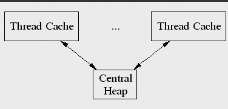
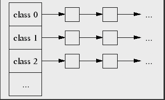
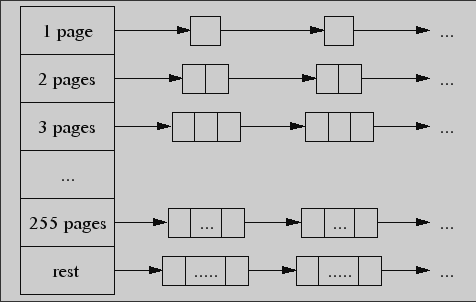
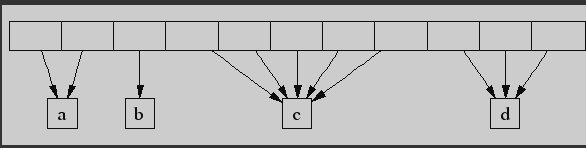

### 一、总体概述

- ptmalloc2 在机器 `4核 CPU 2.8GHz` 上对于小对象，执行 `malloc/free` 两个操作大约需要 300 ns，而对于同一操作，tcmalloc 只需要大约 50ns。

- tcmalloc 减少了多线程程序的锁竞争。对于小对象，使用 TLS，几乎没有竞争。对于大对象，tcmalloc 尝试使用细粒度且高效的自旋锁。在 ptmalloc2 中，不同的分配区之间的内存不能发生移动、复用，可能导致大量的空间浪费。

  比如，有一个多阶段的任务，第一阶段为某一个数据结构申请 100MB 内存，第一阶段完成后，释放了空间；在第二阶段，在同一地址空间开始申请内存，但是有很大可能使用的是不同的分配区，此阶段不会重用第一阶段留下的任何内存，并且会在新的分配区再添加 100MB 空间。造成内存暴增问题

### 二、原理

tcmalloc 通过 `Thread Cache` 和 `Central heap` 组成的双层结构分配内存。

线程分配内存时，tcmalloc 从线程的 TLS 中取出恰当尺寸的内存块。线程释放时，也释放回线程 TLS，最后会由垃圾回收机制收纳回中央堆区（`Central heap`）。具体来说，tcmalloc 的内存分配分两种情况：

- 小对象分配（小于等于 32KB）
- 大对象分配（大于 32KB）

#### 1. 小对象分配

当线程请求分配不超过 32KB 的小对象时，线程缓存为其分配恰当尺寸的内存块。

线程缓存维护着一个数组，数组中每一个节点从小到大依次代表一个可分配的内存尺寸（总共约 170 种），每个尺寸以单链表的形式维护多个内存块。

当一个线程请求分配内存时：

- 首先根据内存需求，找到合适的尺寸
- 在该尺寸的链表上，检查是否有可分配的内存块
  - 如果有该尺寸的内存块，那么取出链表中第一个可分配内存块供线程使用即可
  - 如果没有该尺寸的内存块，那就得从中央堆区去拿一些内存来使用
    - 如果中央堆区有该尺寸的内存，那么从中央堆区取来一些内存对象补充到该尺寸的链表中，并从补充后的链表中拿一个内存块给应用层
    - 如果中央堆区也没有该尺寸的内存了，那就需要为其补充更多的内存：
      - 通过中央页分配器（`Central page allocator`）来分配内存页
      - 将分配到的内存页切割为该尺寸的一系列内存块
      - 把分解出的这些对象补充到中央堆区该尺寸的链表上
      - 再从中央堆区拿一些内存块补充到请求线程的线程缓存中，供其分配使用

#### 2. 大对象分配

超过 32KB 的大对象以 4KB 内存页为单位进行分配。直接由中央堆区负责维护空页，通过链表分别归纳维护长度为 `1~255` 页的空内存块，长度超过 255 页的内存块由 rest 链表统一管理。

当请求内存时，根据需求的页面数量找到对应页面数的链表

1. 如果链表内有内存，则分配
2. 如果链表内没有内存，则找下一个更大尺寸的链表
   1. 如果找到了，则分配内存，并将剩余页面插入对应尺寸的链表中
   2. 如果整个中央堆区都找不到合适尺寸的内存，则向操作系统申请内存以补充到中央堆区中

#### 3. Spans

TCMalloc 通过 span 对象来组织内存页。一个 span 代表一些连续的内存页。

通过一个数据结构来维护从页号到 span 地址的映射：

在 32 位环境下，32 位的地址能够寻址 `2^20` 个 4K 页，因此这个中央数组需要 4MB 的空间来实现从页号到 span 地址的寻址。

在 64 位环境下，考虑到地址空间很大，因此通过一个 3 层的基数数（`radix tree`）来建立页号到 span 地址的映射。

#### 4. 释放

当内存对象释放时，首先根据内存页号查出对应的 span 对象。通过span对象进行判断：

- 当内存对象释放时，首先根据内存页号查出对应的 span 对象。通过 span 对象进行判断：

  如果线程缓存超出了预设尺寸（默认 2MB），则需要运行垃圾回收，将线程缓存中不用的对象还给中央堆的空闲链表。

- 如果是大对象，则将 span 管理的内存页与相邻内存页合并后，还给中央堆区的空闲链表。

#### 5. 线程缓存的垃圾回收

当线程缓存中的空余内存超过阈值（默认2MB）时，会触发垃圾回收，把线程缓存中的内存还给中央堆区的空闲链表。

当线程数量增加时，垃圾回收阈值会减小，以免线程数量很多时浪费内存空间。

垃圾回收机制会记录线程缓存中每一个空闲链表的低水位 L。L 指的是自上一次垃圾回收以来该链表的最短长度。TCMalloc 每次将空闲链表中 `L/2` 个内存对象回收到中央堆区。每次回收 `L/2`，这样的回收速度能够很快地将长期不用的空闲链表回收到中央堆区的空闲链表中，以便其他有需要的线程快速获取。

### 三、优缺点

- 小内存可以在 ThreadCache 中不加锁分配(加锁的代价大约 100ns)
- 大内存可以直接按照大小分配不需要再像 ptmalloc一样进行查找
- 大内存加锁使用更高效的自旋锁
- 减少了内存碎片

然而，tcmalloc 也带来了一些问题，使用自旋锁虽然减少了加锁效率，但是如果使用大内存较多的情况下，内存在Central Cache或者Page Heap 加锁分配。而 tcmalloc 对大小内存的分配过于保守，在一些内存需求较大的服务（如推荐系统），小内存上限过低，当请求量上来，锁冲突严重，CPU使用率将指数暴增。

