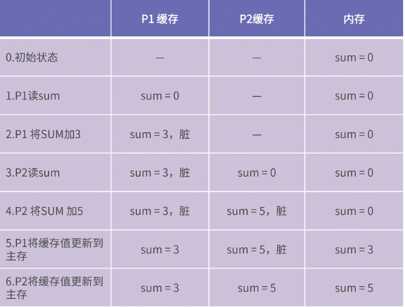
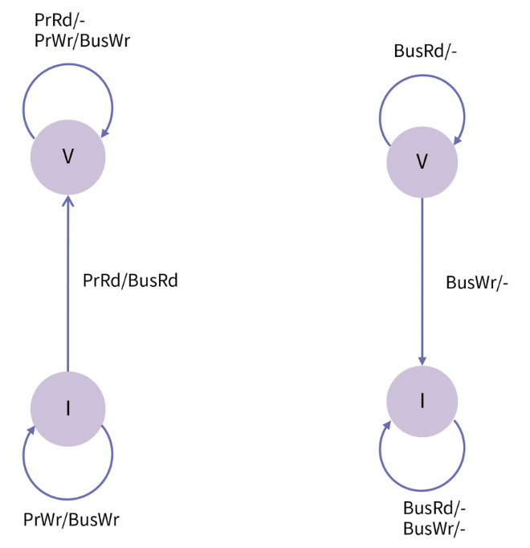
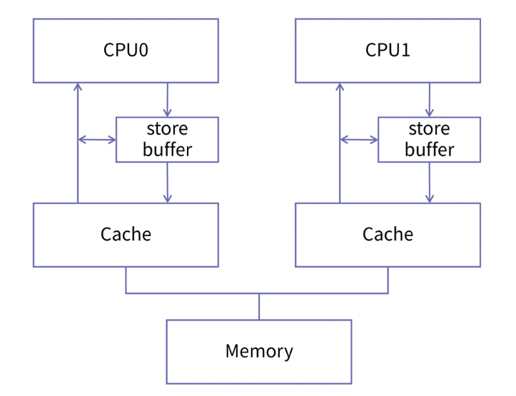
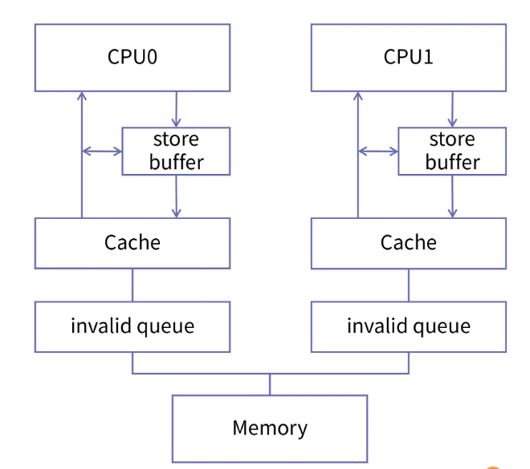

在多核体系结构中，如果有一个 CPU 修改了内存中的某个值，那么必须有一种机制保证其他 CPU 能够观察到这个修改。于是人们设计了一些协议来规定一个 CPU 对缓存数据的修改，如何同步到另一个 CPU。

本文会介绍简单的 VI 协议和比较完善的 MESI 协议。

### 一、缓存写策略

第一种场景：当 CPU 修改了缓存中的数据，这些修改什么时候能传播到内存？有两种策略：写回（`Write Back`）和写直达（`Write Through`）。

- 写回策略，CPU 对缓存的修改不会立刻传播到内存，只有当缓存块被替换时，这些被修改的缓存块，才会写回并覆盖内存中过时的数据。
- 写直达策略，缓存中任何一个字节的修改，都会立刻传播到内存，这种做法就像穿透缓存了一样，因此用 `through` 命名。

第二种场景：当某个 CPU 修改了缓存中某个值时，其他 CPU 的缓存所持有的该数据副本的更新策略有两种：写更新（`Write Update`）和写无效（`Write Invalidate`）

- 写更新策略，CPU 向他的缓存写入新的值时，该 CPU 都必须发起一次总线请求，通知其他 CPU 将他们的缓存值更新为刚写入的值，所以写更新会很占用总线带宽。因为如果一个 CPU 缓存执行了写操作，其他 CPU 需要多次读这个被写过的数据时，那么写更新的效率就会变得很高，因为写操作执行之后马上更新其他缓存中的副本，所以可以使其他处理器立刻获得最新的值。
- 写无效策略，在一个 CPU 修改缓存时，将其他 CPU 中的缓存全部设置为无效。也就是说，当其他 CPU 再次访问该缓存副本时，会发现这一部分缓存已经失效，此时 CPU 就会从内存中重新载入最新的数据。

绝大多数 CPU 都会采用 “写无效” 策略，这是因为多次写操作只需要发起一次总线事件即可，第一次写已经将其他缓存的值置为无效，之后的写不必再更新状态，这样就可以有效节省 CPU 核间总线带宽。因此我们只讨论写无效策略。

第三种场景：当前要写入的数据不在缓存中时，根据是否要先将数据加载到缓存中，写策略分为两种：写分配（`Write Allocate`）和写不分配（`Not Write Allocate`）

- 写分配策略，在写入数据前将数据读入缓存。当缓存块中的数据在未来读写概率较高，也就是程序空间局部性较好时，写分配的效率比较好
- 写不分配策略，在写入数据时，直接将要写入的数据传播内存，而不将数据块读入缓存。当数据块中的数据在未来使用的概率较低时，写不分配性能较好。

因此，如果缓存块的大小比较大，该缓存未来被多次访问的概率也会增加，此时，写分配的策略性能要优于写不分配。

小总结：

- 从缓存和内存的更新关系看，写策略分为写回和写直达
- 从写缓存时 CPU 之间的更新策略来看，写策略分为写更新和写无效
- 从写缓存时数据是否被加载来看，写策略分为写分配和写不分配

### 二、缓存一致性问题

缓存一致性问题，就是保证同一个数据在每个 CPU 的私有缓存（一般为 `L1 Cache`）中副本是相同的。

我们举一个例子，如下的代码：

```
global sum = 0
// Thread1：
sum += 3
// Thread2：
sum += 5
```

假设 Thread1 由 CPU 核 P1 执行，Thread2 由 P2 执行，那么 P1、P2 的私有缓存和内存的状态可能出现下表所示的情况：



如这个例子，为了保证缓存一致性，必须解决两个问题，分别是 “第三步的写传播” 和 “第五、六步的事务串行化”。

- 写传播：一个处理器对缓存中的值进行了修改，需要通知其他处理器。也就是需要用到 “写更新” 或 “写无效” 策略。
- 事务串行化：多个处理器对同一个值进行修改，在同一时刻只能有一个处理器写成功，必须保证写操作的原子性，多个写操作必须串行执行。

如何解决写传播所来的缓存一致性问题？我们需要根据不同的策略（写回和写直达）来设计不同的缓存一致性协议。

### 三、基于 “写直达” 的缓存一致性协议

我们假设一个单级缓存，他既可以接受来自处理器的请求，也可以处理来自总线侦听器请求。其中处理器的请求包括：

- PrRd：处理器请求从缓存块中读出
- PrWr：处理器请求向缓存块写入

来自总线的请求包括：

- BusRd：总线侦听到一个来自另一个处理器的读出缓存请求
- BusWr：总线侦听到来自另一个处理器写入缓存的请求。在 “写直达” 策略中，BusWr 即另一个处理器向内存的写入请求

每个缓存块都有两种状态，包括：

- `Valid(V)`：缓存块是有效且干净的，意味着该缓存块中的内容与主存中相同
- `Invalid(I)`：缓存块无效，访问该缓存块会出现缓存缺失

我们只讨论 “写无效” 和 “写直达” 的组合策略，因为“写直达” 会导致更新直接穿透缓存，所以这种情况只能采用 “写不分配” 策略。因此我们讨论的策略组合是 “写无效”、“写直达” 和 “写不分配”。



如上图，“/” 前表示的是请求，这个请求可能来自 CPU 自己，也可能来自总线，“/” 后表示的是当前请求所引起的总线事件，“-” 表示不产生总线事件。

图的左边，这部分代表了当前 CPU 所发起的操作，考虑缓存块的状态为 I，I 状态代表了两种情况：尚未使用的缓存块和无效的缓存块，尚未使用的缓存块其中也没有有效的数据，所以可以与无效的缓存块同等对待。

- 先讨论状态 I，当处理器发出读请求时，发现缓存缺失，但是要把数据加载进缓存，这时，总线上随机产生一个 BusRd 请求，内存控制器响应 BusRd，将所需的块从内存中取出，取出的块放入缓存中，同时将状态设置为 V，表示当前缓存的状态有效。当处理器发出写请求时，因为采用写直达策略，写操作通过 BusWr 被传递到内存，而不是将数据写入缓存，所以状态仍为无效。
- 接着考虑状态 V。当处理器发出读请求时，该数据在缓存中被找到，缓存命中，不会产生总线事务，缓存块状态不变。当处理器发出写请求时，缓存块被更新，并且这个更新通过 BusWr 被传递到内存，缓存块的状态保持有效。

图的右边，这部分代表总线发起的请求。

- 先讨论状态 I，所有侦听到的 BusRd 和 BusWr 都不会影响他，保持无效，所以这种情况被忽略。
- 再考虑状态 V，当一个 BusRd 被侦听到时，这意味着有其他处理器遇到了缓存缺失，并且需要从内存中取出需要的块，所以该缓存块的状态不用改变，但是当侦听到一个 BusWr 时，表示有其他处理器想要获取该缓存块的唯一所有权（要保证事务串行化），所以该缓存块的状态变为 I。

小结：“写传播” 的缓存一致性的缺点是需要很高的带宽。原因是对于缓存块的每次写入，都会触发 BusWr 从而占用带宽。相反的是，在 “写无效” 缓存策略下，如果同一个缓存块中的数据被多次写入，只需占用一次总线带宽来失效其他处理器的缓存副本即可。

### 四、MESI 协议

基于 “写回” 策略的缓存一致性协议，也被称为 MESI 协议。

处理器对缓存的请求：

- PrRd：处理器请求从缓存块中读出
- PrWr：处理器请求向缓存块写入

而总线对缓存的请求分别是：

- BusRd：总线侦听到一个来自另一个处理器的读出缓存请求；
- BusRdX：总线侦听到来自另一个尚未取得该缓存块所有权的处理器读独占（或者写）缓存的请求；
- BusUpgr：侦听到一个其他处理器要写入本地缓存块上的数据的请求；
- Flush：总线侦听到一个缓存块被另一个处理器写回到主存的请求；
- FlushOpt：侦听到一个缓存块被放置在总线以提供给另一个处理器的请求，和 Flush 类似，但只不过是从缓存到缓存的传输请求。

缓存块的状态分为 4 种，也是 MESI 协议名字的由来：

- Modified（M）：缓存块有效，但是是“脏”的，其数据与主存中的原始数据不同，同时还表示处理器对于该缓存块的唯一所有权，表示数据只在这个处理器的缓存上是有效的；
- Exclusive（E）：缓存块是干净有效且唯一的； 
- Shared（S）：缓存块是有效且干净的，有多个处理器持有相同的缓存副本；
- Invalid（I）：缓存块无效。

我们用状态机来表示缓存块状态的变化。


图中的黑色箭头表示是由当前处理器发起的，红色箭头表示，这个事件是从总线来的，也就是由其他处理器发起的。

我们先看由处理器发起的请求（黑线部分）：

- M 状态：读写操作都不会改变状态，并且因为能够确定不会有其他副本，因此不会产生任何总线事务
- E 状态：任何对该缓存块的读操作都会缓存命中，且不触发任何总线事务。一个对 E 状态的写操作，也不会产生总线事务，只需将缓存块状态改为 M；
- S 状态：当处理器读时，缓存命中，不产生总线事务。当处理器写时，需要产生 BusUpgr 事件，通知其他处理器我要写这个缓存块，并将缓存块状态置为 M；
- I 状态：当处理器发出读请求时，遇到缓存块缺失，要把数据加载进缓存，产生一个 BusRd 总线请求。内存控制器响应 BusRd 请求，将所需要的缓存块从内存中取出，同时会检查有没有其他处理器也有该缓存块拷贝，如果发现拷贝则将状态置为 S, 并且把其他有拷贝的处理器的状态也相应地置为 S；如果没有发现其他拷贝，则将状态置为 E。

我们再来看由总线发起的请求（红色部分）：

- M 状态：该缓存块是整个系统里唯一有效的，并且内存的数据也是过时的。因此当侦听到 BusRd 时，缓存块必须被清空以保证写传播，所以会产生 Flush 事件。并且将状态置为 S。当侦听到 BusRdX 时，也必须产生 Flush 事件，因为有其他处理器要写，所以当前缓存块置为 I；
- E 状态：当侦听到 BusRd 请求时，说明另一个处理器遇到了缓存缺失，并试图获取该缓存块，因为最终的结果是要将这个缓存块，放在不止一个处理器缓存上，所以状态必须被置为 S。这样就会产生 FlushOpt 事件，来完成缓存到缓存的传输。

当 BusRdX 被侦听到时，说明有其他处理器想要独占这个缓存块上的数据，这种情况下，本地缓存块将会被清空并且状态需要置为 I，同时也会产生 FlushOpt 事件，完成缓存到缓存的传输，将当前数据的最新值同步给需要进行写操作的其他处理器。

而当侦听到 BusUpgr 时，说明其他处理器要写当前处理器持有的缓存副本，所以要将状态置为 I，但是不必产生总线事务；

- S 状态：当侦听到 BusRd 时，也就是另一个处理器遇到缓存缺失而试图获取该缓存块，因为 S 状态本身是共享的，所以状态保持 S 不 变；
- I 状态：侦听到的 BusRd、BusRdX、BusUpgr 都不会影响它，所以忽略该情况，状态保持不变。

**总体来讲，MESI 协议通过引入了 Modified 和 Exclusive 两种状态，并且引入了处理器缓存之间可以相互同步的机制，非常有效地降低了 CPU 核间带宽。它是当前设计中进行 CPU 核间通讯的主流协议，被广泛地使用在各种 CPU 中。**

### 五、MESI 协议的问题

如果 CPU 严格按照 MESI 协议进行核间通讯和同步，核间同步就会给 CPU 带来性能问题。

严格遵守 MESI 协议的 CPU 设计，在他的某一个 CPU 在写一块缓存时，他需要通知所有的 CPU，如果其他的 CPU 有这块缓存的副本，需要把它设置为 Invalid 状态。Invalid 状态意味着该缓存失效，如果其他 CPU 再访问这一缓存区时，就会从内存中加载正确的值。

发起写请求的 CPU 中的缓存状态可能是 `Exclusive、Modified` 和 Share，每个状态下的处理是不一样的。

- 如果缓存状态是 Exclusive 和 Modified，那么 CPU 一个核修改缓存时不需要通知其他核
- 但是在 Share 状态下，如果一个 CPU 想独占缓存进行修改，就需要先给所有 Share 状态的 CPU 发出 Invalid 消息，等所有 CPU 确认并回复他 “Invalid acknowledgement” 以后，他才能把这块缓存的状态更改为 Modified，这是保持多核信息同步的必然要求。这个过程相对于直接在核内缓存里修改缓存内容，非常漫长。这也会导致，某个核请求独占时间较长。

如下提供一些解决这个问题的办法

### 六、写缓冲和写屏障

CPU 的设计者为每个核都添加了一个名为 `store buffer` 的结构，`store buffer` 是硬件实现的缓存区，他的读写速度比缓存的速度更快，所有面向缓存的写操作都会先经过 `store buffer`。如下是增加 `store buffer` 后的 CPU 缓存结构：



在这样的结构中，如果 CPU 的某个核再要对一个变量进行赋值，他就不必等到所有的核都确认完，而是直接把新的值放入 `store buffer` ，然后再由 `store buffer` 慢慢去做核间同步，并且将新的值刷入到 cache 中去就好了。而且，每个核的 `store buffer` 都是私有的，其他核不可见。

举例子来说明下。我们使用两个 CPU0 和 CPU1，假如 CPU0 刚刚更新了变量 a 的值，并且将他放到了 `store buffer` 中，CPU0 自己接着又要读取 a 的值，此时，他会在自己的 `store buffer` 中读到正确的值。如果在这一次修改的 a 值被写入 cache 之前，CPU0 又一次对 a 值进行了修改，这次更新就可以直接写入 `store buffer`。因为 `store buffer` 是 CPU0 私有的，修改他不涉及任何核间同步和缓存一致性问题，所以效率也得到了比较大提升。

但有一个问题，就是他**不能保证变量写入缓存和内存的顺序**。如下代码

```
// CPU0
void foo() {
    a = 1;
    b = 1;
}
// CPU1
void bar() {
    while (b == 0) continue;
    assert(a == 1);
}
```

在对变量 a 和 b 进行赋值时，有两种情况会导致他们的赋值顺序被打乱。

- 第一种情况是 CPU 的乱序执行。
- 第二种情况是 `store buffer` 在写入时，有可能 b 所对应的缓存行会先于 a 所对应的缓存行进入独占状态，也就是说 b 会先写入缓存。

比如，如果 a 是 Share 状态，b 是 Exclusive 状态，那么尽管 CPU0 在执行时没有乱序，这两个变量由 `store buffer` 写入缓存时也是不能保证顺序的。那这个时候，我们假设 CPU1 开始执行时，a 和 b 所对应的缓存行都是 Invalid 状态。当 CPU1 开始执行 `while (b == 0) continue;` 时，由于 b 所对应的缓存区域时 Invalid 状态，他就会向总线发出 BusRd 请求，那么 CPU1 就会把 b 的最新值读到本地，完成变量 b 的值的更新，从而跳出 `while (b == 0) continue;` 这个循环。继续执行 `assert(a == 1);` 这时，CPU1 的 a 缓存区域也处于 Invalid 状态，他也会产生 BusRd 请求，但是前面我们分析过，CPU0 对 a 的赋值可能晚于 b，所以此时 CPU1 在读取变量 a 的值时，加载的就可能是老的值，也就是 0，那这个时候 `assert(a == 1);` 就会执行失败。

再举一个例子，

```
// CPU0
void foo() {
    a = 1;
    b = a;
}
```

b 和 a 之间因为有数据依赖，是不可能乱序执行的。但由于 store buffer 的存在，上面的第二种情况也会发生，也会出现 `assert(a == 1);` 会失败。

为了解决这个问题，CPU 设计者引入了**内存屏障**，屏障的作用是前边的读写操作未完成的情况下，后面的读写操作不能发生。如下的代码，我们加上了内存屏障：

```
// CPU0
void foo() {
    a = 1;
    smp_mb();
    b = 1;
}

// CPU1
void bar() {
    while (b == 0) continue;
    assert(a == 1);
}
```

在这里，smp_mb 就代表了多核体系结构上的内存屏障。由于在不同的体系结构上，指令各不相同，我们使用一个函数对它进行封装。加上这一道屏障以后，CPU 会保证 a 和 b 的赋值指令不会乱序执行，同时写入 cache 的顺序也与程序代码保持一致。

所以说，内存屏障保证了，其他 CPU 能观察到 CPU0 按照我们期望的顺序更新变量。

总的来说，store buffer 的存在是为提升写性能，放弃了缓存的顺序一致性，我们把这种现象称为弱缓存一致性。在正常的程序中，多个 CPU 一起操作同一个变量的情况是比较少的，所以 store buffer 可以大大提升程序的运行性能。但在需要核间同步的情况下，我们还是需要这种一致性的，这就需要软件工程师自己在合适的地方添加内存屏障了。

我们前面说的都是 CPU 核间同步的“写”的问题，但是核间同步还有另外一个瓶颈，也就是“读”的问题。这个如何解决呢？

### 七、失效队列和读屏障

当一个 CPU 向其他 CPU 发出 Invalid 消息的时候，其他 CPU 要先把自己的缓存置为 Invalid，然后再发出 acknowledgement。这个从 “把缓存置为 Invalid” 到 “发出 acknowledgement” 的过程所需要的时间也是比较长的。

而且，由于 `store buffer` 的存在提升了写入速度，那么 invalid 消息确认速度相比起来就慢了，这就带来了速度的不匹配，很容易导致 `store buffer` 的内容还没有及时更新到 cache 里，自己的容量就被撑爆了，从而失去了加速的作用。

为了解决这个问题，CPU 设计者又引入了 `invalid queue`，也就是失效队列这个结构。比如，加入这个结构后，收到 invalid 消息的 CPU1，立即给 CPU0 发回确认消息，但这个时候 CPU1 并没有把自己的 cache 由 Share 置为 invalid，而是把这个失效的消息放到失效队列中，等到空闲的时候再去处理失效消息。

如下是带有 `invalid queue` 的缓存结构：



> Reference：https://time.geekbang.org/column/article/462113


### 五、小结

缓存一致性协议是个约定，具体实现上实际是由硬件电路保证的。


