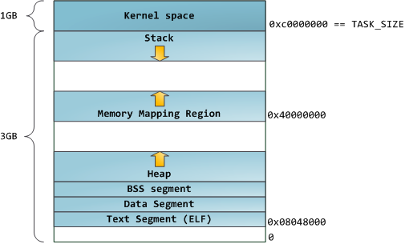
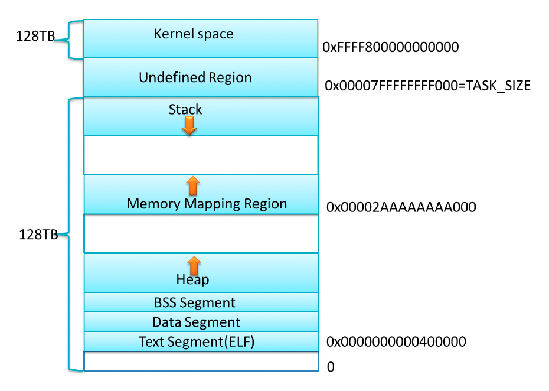

本文简单介绍下 x86 平台 Linux 进程内存布局

### 一、X86 平台 Linux 进程内存布局

Linux 系统在装载 `elf` 格式的程序文件时，会调用 `loader` 把可执行文件中的各个段依次载入到从某一地址开始的空间中（载入地址取决`link editor(ld)` 和机器地址位数，在 32 位机器上是 `0x8048000`，即 `128M` 处）。如下图所示，以 `32` 位机器为例，首先被载入的是 `.text` 段，然后是 `.data` 段，最后是 `.bss` 段。这可以看作是程序的开始空间。程序所能访问的最后的地址是 `0xbfffffff`，也就是到 3G 地址处，3G 以上的 1G 空间是内核使用的，应用程序不可以直接访问。应用程序的堆栈从最高地址处开始向下生长，`.bss` 段与堆栈之间的空间是空闲的，空闲空间被分成两部分，一部分为 heap，一部分为 mmap 映射区域，mmap 映射区域一般从`TASK_SIZE/3` 的地方开始，但在不同的 Linux 内核和机器上，mmap 区域的开始位置一般是不同的。Heap 和 mmap 区域都可以供用户自由使用，但是它在刚开始的时候并没有映射到内存空间内，是不可访问的。在向内核请求分配该空间之前，对这个空间的访问会导致`segmentation fault`。用户程序可以直接使用系统调用来管理 heap 和 mmap 映射区域，但更多的时候程序都是使用 C 语言提供的`malloc()` 和 `free()` 函数来动态的分配和释放内存。Stack 区域是唯一不需要映射，用户却可以访问的内存区域，这也是利用堆栈溢出进行攻击的基础。 

#### 1. 32位模式下进程内存经典布局



这种布局是 Linux 内核 2.6.7 以前的默认进程内存布局形式，mmap 区域与栈区域相对增长，这意味着堆只有 1GB 的虚拟地址空间可以使用，继续增长就会进入 mmap 映射区域，这显然不是我们想要的。这是由于 32 模式地址空间限制造成的，所以内核引入了另一种虚拟地址空间的布局形式，将在下面介绍。但对于 64 位系统，提供了巨大的虚拟地址空间，这种布局就相当好。 

#### 2. 32位模式下进程默认内存布局


从上图可以看到，栈至顶向下扩展，并且栈是有界的。堆至底向上扩展，mmap 映射区域至顶向下扩展，mmap 映射区域和堆相对扩展，直至耗尽虚拟地址空间中的剩余区域，这种结构便于 C运行时库使用 mmap 映射区域和堆进行内存分配。上图的布局形式是在内核 2.6.7以后才引入的，这是 32 位模式下进程的默认内存布局形式。 可以看到在不同的段之间会有一定偏移，解决越界问题。

#### 3. 64位模式下进程内存布局



上图是 X86_64 下 Linux 进程的默认内存布局形式，这只是一个示意图，当前内核默认配置下，进程的栈和 mmap 映射区域并不是从一个固定地址开始，并且每次启动时的值都不一样，这是程序在启动时随机改变这些值的设置，使得使用缓冲区溢出进行攻击更加困难。当然也可以让进程的栈和 mmap 映射区域从一个固定位置开始，只需要设置全局变量 `randomize_va_space` 值为0，这个变量默认值为1。用户可以通过设置 `/proc/sys/kernel/randomize_va_space` 来停用该特性，也可以用如下命令： 

```
sudo sysctl -w kernel.randomize_va_space=0
```