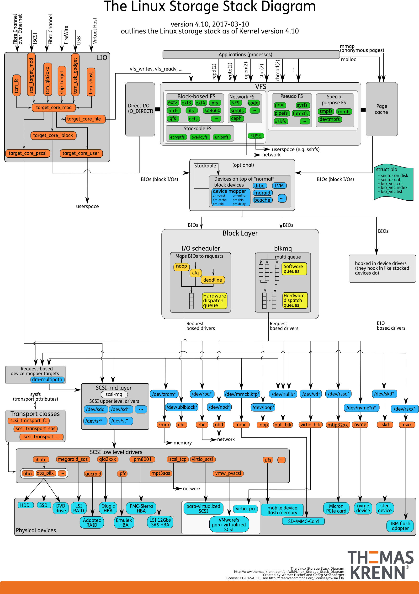
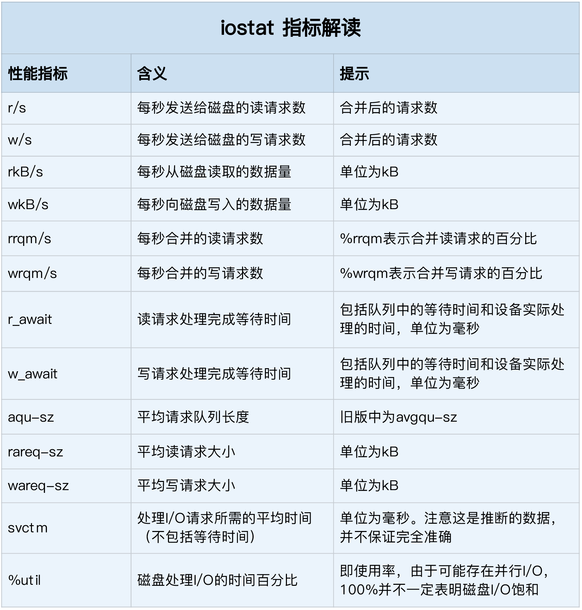

## 一、磁盘

#### 1. 按照存储介质，常见磁盘分为两类：机械磁盘和固态磁盘

- 机械磁盘，也称为硬盘驱动器（Hard Disk Driver），通常缩写为 HDD。机械磁盘主要由盘片和读写磁头组成，数据就存储在盘片的环状磁道中。在读写数据前，需要移动读写磁头，定位到数据所在的磁道，然后才能访问数据。
    - 如果 I/O 请求刚好连续，那就不需要磁道寻址，自然可以获得最佳性能、
    - 如果 IO 随机，需要不停地移动磁头，来定位数据位置，所以读写速度就会比较慢
- 固态磁盘（Solid State Disk）通常缩写为 SSD。由固态电子元器件组成，固态磁盘不需要磁道寻址，所以性能比机械磁盘要好很多

无论是机械磁盘还是固态磁盘，随机 IO 都要比连续 IO 慢很多，因为：

- 对机械磁盘来说，由于随机 I/O 需要更多的磁头寻道和盘片旋转，它的性能自然要比连续 I/O 慢
- 对固态磁盘来说，虽然它的随机性能比机械硬盘好很多，但同样存在“先擦除再写入”的限制。随机读写会导致大量的垃圾回收，所以相对应的，随机 I/O 的性能比起连续 I/O 来，也还是差了很多。
- 连续 I/O 还可以通过预读的方式，来减少 I/O 请求的次数

机械磁盘的最小读写单位是扇区，一般大小为 512 字节；固态磁盘的最小读写单位是页，通常大小是4KB、8KB等。

每次读写 512 字节这么小的单位的话，效率很低。文件系统会把连续的扇区或页，组成逻辑块，然后以逻辑块作为最小单元来管理数据。常见的逻辑块的大小是 4KB，也就是说，连续 8 个扇区，或者单独的一个页，都可以组成一个逻辑块

### 2. 按照接口来分类

可以把硬盘分为：IDE（Integrated Drive Electronics）、SCSI（Small Computer System Interface） 、SAS（Serial Attached SCSI） 、SATA（Serial ATA） 、FC（Fibre Channel） 等

#### 3. 按照磁盘在服务器中的使用方式，可以划分成多种架构

- 直接作为独立磁盘设备来使用。这些磁盘，往往还会根据需要，划分为不同的逻辑分区，每个分区再用数字编号。比如 `/dev/sda1` 或 `/dev/sda2` 等

- 把多块磁盘组合成一个逻辑磁盘，构成冗余独立磁盘阵列，也就是 RAID（Redundant Array of Independent Disks），从而可以提高数据访问的性能，并且增强数据存储的可靠性。

    根据容量、性能和可靠性需求的不同，RAID 一般可以划分为多个级别，如 RAID0、RAID1、RAID5、RAID10 等。

    - RAID0 有最优的读写性能，但不提供数据冗余的功能
    - 而其他级别的 RAID，在提供数据冗余的基础上，对读写性能也有一定程度的优化

- 把这些磁盘组合成一个网络存储集群，再通过 NFS、SMB、iSCSI 等网络存储协议，暴露给服务器使用

在 Linux 中，磁盘实际上是作为一个块设备来管理的，也就是以块为单位读写数据，并且支持随机读写。每个块设备都会被赋予两个设备号，分别是主、次设备号。主设备号用在驱动程序中，用来区分设备类型；而次设备号则是用来给多个同类设备编号。

## 二、通用块层

为了减小不同块设备的差异带来的影响，Linux 通过一个统一的通用块层，来管理各种不同的块设备。通用块层，其实是处在文件系统和磁盘驱动中间的一个块设备抽象层。它主要有两个功能。

- 第一个功能跟虚拟文件系统的功能类似。向上，为文件系统和应用程序，提供访问块设备的标准接口；向下，把各种异构的磁盘设备抽象为统一的块设备，并提供统一框架来管理这些设备的驱动程序
- 第二个功能，通用块层还会给文件系统和应用程序发来的 I/O 请求排队，并通过重新排序、请求合并等方式，提高磁盘读写的效率

对于 IO 请求排序的过程，也就是 IO 调度。Linux 内核支持四种 IO 调度算法，分别是 NONE、NOOP、CFQ 以及 DeadLine

- NONE，更确切来说，并不能算 I/O 调度算法。因为它完全不使用任何 I/O 调度器，对文件系统和应用程序的 I/O 其实不做任何处理，常用在虚拟机中（此时磁盘 I/O 调度完全由物理机负责）
- NOOP ，是最简单的一种 I/O 调度算法。它实际上是一个先入先出的队列，只做一些最基本的请求合并，常用于 SSD 磁盘
- CFQ（Completely Fair Scheduler），也被称为完全公平调度器，是现在很多发行版的默认 I/O 调度器，它为每个进程维护了一个 I/O 调度队列，并按照时间片来均匀分布每个进程的 I/O 请求。类似于进程 CPU 调度，CFQ 还支持进程 I/O 的优先级调度，所以它适用于运行大量进程的系统，像是桌面环境、多媒体应用等
- DeadLine 调度算法，分别为读、写请求创建了不同的 I/O 队列，可以提高机械磁盘的吞吐量，并确保达到最终期限（deadline）的请求被优先处理。DeadLine 调度算法，多用在 I/O 压力比较重的场景，比如数据库等

## 三、存储系统的 IO 栈

整体来看 Linux 存储系统的 IO 原理。可以把 Linux 存储系统的 IO 栈，由上到下分为三个层次，分别为**文件系统层、通用块层和设备层**。



存储系统 IO 的工作原理：

- 文件系统层，包括虚拟文件系统和其他各种文件系统的具体实现。它为上层的应用程序，提供标准的文件访问接口；对下会通过通用块层，来存储和管理磁盘数据。
- 通用块层，包括块设备 I/O 队列和 I/O 调度器。它会对文件系统的 I/O 请求进行排队，再通过重新排序和请求合并，然后才要发送给下一级的设备层。
- 设备层，包括存储设备和相应的驱动程序，负责最终物理设备的 I/O 操作。

其中，通用块层是 Linux 磁盘 I/O 的核心。向上，它为文件系统和应用程序，提供访问了块设备的标准接口；向下，把各种异构的磁盘设备，抽象为统一的块设备，并会对文件系统和应用程序发来的 I/O 请求进行重新排序、请求合并等，提高了磁盘访问的效率。

存储系统的 I/O ，通常是整个系统中最慢的一环。所以， Linux 通过多种缓存机制来优化 I/O 效率。比如为了优化文件访问的性能，会使用页缓存、索引节点缓存、目录项缓存等多种缓存机制，以减少对下层块设备的直接调用。

## 四、查看磁盘性能指标

### 1. 磁盘性能的衡量指标

- 使用率：是指磁盘处理 I/O 的时间百分比。过高的使用率（比如超过 80%），通常意味着磁盘 I/O 存在性能瓶颈。使用率只考虑有没有 IO，而不考虑 IO 大小，也就是说，当使用率是 100% 时，磁盘依然有可能接受新的 IO 请求。
- 饱和度，是指磁盘处理 I/O 的繁忙程度。过高的饱和度，意味着磁盘存在严重的性能瓶颈。当饱和度为 100% 时，磁盘无法接受新的 I/O 请求。
- IOPS（Input/Output Per Second），是指每秒的 I/O 请求数
- 吞吐量，是指每秒的 I/O 请求大小 
- 响应时间，是指 I/O 请求从发出到收到响应的间隔时间

对于磁盘性能，不要孤立的去比较某一指标，而要结合读写比例、IO 类型（随机还是连续）以及 IO 大小，综合分析，比如：

- 在数据库、大量小文件等这类随机读写比较多的场景中，IOPS 更能反映系统的整体性能
- 在多媒体等顺序读写较多的场景中，吞吐量才更反映系统的整体性能

### 2. 磁盘 IO 观测

iostat 是最常用的磁盘 I/O 性能观测工具，它提供了每个磁盘的使用率、IOPS、吞吐量等各种常见的性能指标，当然，这些指标实际上来自 /proc/diskstats

```shell
# -d -x 表示显示所有磁盘 IO 的指标
➜  [/usr/local/bin] iostat -d -x 1
Device            r/s     rkB/s   rrqm/s  %rrqm r_await rareq-sz     w/s     wkB/s   wrqm/s  %wrqm w_await wareq-sz     d/s     dkB/s   drqm/s  %drqm d_await dareq-sz     f/s f_await  aqu-sz  %util
sr0              0.00      0.00     0.00  50.00    0.73     4.00    0.00      0.00     0.00   0.00    0.00     0.00    0.00      0.00     0.00   0.00    0.00     0.00    0.00    0.00    0.00   0.00
vda              2.84     20.93     0.00   0.03    1.09     7.36    3.90     99.44     6.16  61.26    2.78    25.52    0.00      0.00     0.00   0.00    0.00     0.00    0.00    0.00    0.01   0.40
vdb              0.78     21.41     0.00   0.12    1.70    27.48    1.45     45.95     2.13  59.62    9.62    31.79    0.00      0.00     0.00   0.00    0.00     0.00    0.00    0.00    0.02   0.13
```



这些指标中：

- %util ，就是我们前面提到的磁盘 I/O 使用率
- r/s+ w/s ，就是 IOPS
- rkB/s+wkB/s ，就是吞吐量
- r_await+w_await ，就是响应时间

还需要结合请求的大小（ rareq-sz 和 wareq-sz）一起分析

### 3. 进程 IO 观测

观察进程的 IO 情况，可以使用 pidstat 和 iotop 工具

```shell
➜  [/usr/local/bin] pidstat -d 1

08:40:21 PM   UID       PID   kB_rd/s   kB_wr/s kB_ccwr/s iodelay  Command
08:40:22 PM     0      2653      0.00      4.00      0.00       0  sap1014
08:40:22 PM     0     22710      0.00    132.00    124.00       0  agent
```

从 pidstat 的输出就可以实时查看每个进程的 IO 情况

- 用户 ID（UID）和进程 ID（PID） 。
- 每秒读取的数据大小（kB_rd/s） ，单位是 KB。
- 每秒发出的写请求数据大小（kB_wr/s） ，单位是 KB。
- 每秒取消的写请求数据大小（kB_ccwr/s） ，单位是 KB。
- 块 I/O 延迟（iodelay），包括等待同步块 I/O 和换入块 I/O 结束的时间，单位是时钟周期。

```shell
➜  [/usr/local/bin] iotop
Total DISK READ :       0.00 B/s | Total DISK WRITE :      11.55 K/s
Actual DISK READ:       0.00 B/s | Actual DISK WRITE:       0.00 B/s
  TID  PRIO  USER     DISK READ  DISK WRITE  SWAPIN     IO>    COMMAND                                                                                                                                          
23318 be/4 root        0.00 B/s    0.00 B/s  0.00 %  0.01 % [kworker/0:0]
16430 be/5 root        0.00 B/s    7.70 K/s  0.00 %  0.00 % java --add-opens java.desktop/sun.awt=ALL-UNNAMED --add-opens java.deskto~ort_result.jtl [\xe5\xb0\x8f\xe7\xa8\x8b\xe5\xba\x8f-\xe7\xbd\x91\xe7\xbb]
 7837 be/4 root        0.00 B/s    3.85 K/s  0.00 %  0.00 % ./cmlb_server ../conf/cmlb_server.conf
16384 be/5 root        0.00 B/s    0.00 B/s  0.00 %  0.00 % java --add-opens java.desktop/sun.awt=ALL-UNNAMED --
```

iotop 工具可以按照 IO 大小对进程排序，然后找到 IO 比较大的那些进程

- 前两行分别表示，进程的磁盘读写大小总数和磁盘真实的读写大小总数。因为缓存、缓冲区、I/O 合并等因素的影响，它们可能并不相等
- 剩下的部分，则是从各个角度来分别表示进程的 I/O 情况，包括线程 ID、I/O 优先级、每秒读磁盘的大小、每秒写磁盘的大小、换入和等待 I/O 的时钟百分比等


