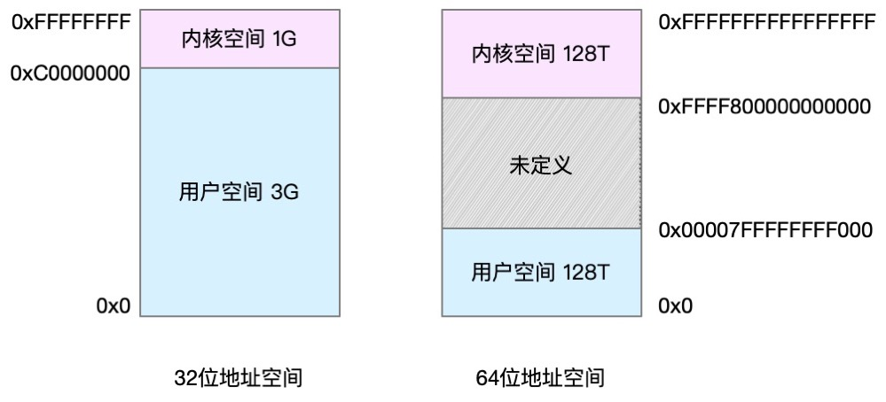
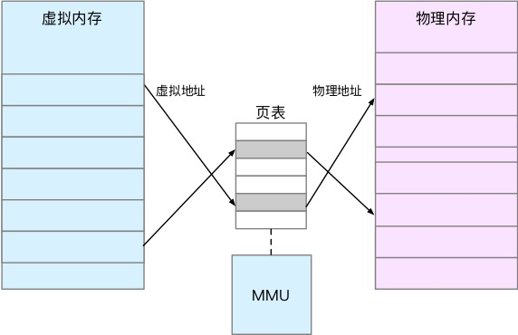
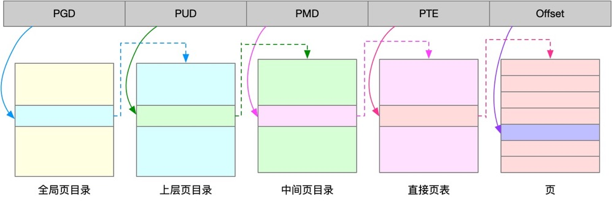
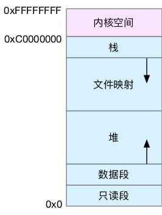

## 一、内存映射

Linux 内核给每个进程都提供了一个独立的虚拟地址空间，并且这个地址空间是连续的。虚拟地址空间又被分为**内核空间**和**用户空间**。不同位的处理器，虚拟地址空间布局不一样，如下是 32 位和64 位虚拟地址空间



进程在用户态时，只能访问用户空间内存；只有进入内核态后，才可以访问内核空间内存。虽然每个进程的地址空间都包含了内核空间，但这些内核空间都关联相同的物理内存。

并不是所有的虚拟内存都会分配物理内存，只有那些实际使用的虚拟内存才会分配物理内存，并且分配后的物理内存，是通过内存映射来管理的

内存映射：将虚拟内存地址映射到物理内存地址。内核为每个进程都维护了一张页表，记录虚拟地址和物理地址的映射关系。页表实际上存储在 CPU 的内存管理单元 MMU 中，正常情况下，处理器就可以直接通过硬件，找出要访问的内存



当进程访问的虚拟地址在页表中查不到时，系统会产生一个缺页异常，进入内核空间分配物理内存、更新进程页表，最后再返回用户空间，恢复进程的运行。

注意：MMU 并不以字节为单位来管理内存，而是规定了一个内存映射的最小单元，也就是页，通常是 4KB 大小。但是导致一个问题，整个页表会变得非常大，比如：仅 32 位系统就需要 100 多万页表项（4GB/4KB），才可以实现整个地址空间的映射。为了解决页表项过多的问题，Linux 提供了两种机制，多级页表和大页

-  多级页表：多级页表就是把内存分成区块来管理，将原来的映射关系改成区块索引和区块内的偏移。由于虚拟内存空间通常只用了很少一部分，那么，多级页表就只保存这些使用中的区块，这样就可以大大地减少页表的项数。Linux 用的正是四级页表来管理内存页，如下图所示，虚拟地址被分为 5 个部分，前 4 个表项用于选择页，而最后一个索引表示页内偏移。
    
- 大页：比普通页更大的内存块，通常用在使用大量内存的进程上，比如 数据库等

## 二、虚拟内存空间分布

以 32 位系统为例



用户空间内存，从低到高分别是五种不同的内存段。

1. 只读段，包括代码和常量等。
2. 数据段，包括全局变量等。
3. 堆，包括动态分配的内存，从低地址开始向上增长。
4. 文件映射段，包括动态库、共享内存等，从高地址开始向下增长。
5. 栈，包括局部变量和函数调用的上下文等。栈的大小是固定的，一般是 8 MB。

在这五个内存段中，堆和文件映射段的内存是动态分配的。比如说，使用 C 标准库的 malloc() 或者 mmap() ，就可以分别在堆和文件映射段动态分配内存。

## 三、内存分配与回收

malloc 有两种实现方式，即 `brk()` 和 `mmap()`

- 对于小块内存（小于 128K），使用 brk 来分配，也就是通过移动堆顶的位置来分配内存。这些内存释放后并不会立刻归还系统，而是被缓存起来，这样就可以重复使用
- 对于大块内存（大于 128K），则直接使用内存映射 mmap() 来分配，也就是在文件映射段找一块空闲内存分配出去

优缺点：

- brk() 方式的缓存，可以减少缺页异常的发生，提高内存访问效率。不过，由于这些内存没有归还系统，在内存工作繁忙时，频繁的内存分配和释放会造成内存碎片
- mmap() 方式分配的内存，会在释放时直接归还系统，所以每次 mmap 都会发生缺页异常。在内存工作繁忙时，频繁的内存分配会导致大量的缺页异常，使内核的管理负担增大。这也是 malloc 只对大块内存使用 mmap 的原因

在内核空间，Linux 通过 slab 分配器来管理小内存。主要作用就是分配并释放内核中的小对象。

注意：当这两种调用发生之后，其实并没有真正分配内存。这些内存，都只有在首次访问时才分配，也就是通过缺页异常进入内核中，再有内核来分配内存

应用程序用完内存后，应该调用 free() 或 unmap() 来释放这些不用的内存。当系统发现内存紧张时，会通过一系列机制来回收内存，比如：

- 回收缓存，比如使用 LRU（Least Recently Used）算法，回收最近使用最少的内存页面
- 回收不常访问的内存，把不常用的内存通过交换分区（swap）直接写到磁盘中
- 杀死进程，内存紧张时系统还会通过 OOM（out of memory），直接杀掉占用大量内存的进程

## 四、查看内存使用情况

### 1. free 命令

系统的整体内存使用情况

```
➜  [/tmp] free
              total        used        free      shared  buff/cache   available
Mem:       16092188     3242348     4977192      647560     7872648    12142184
Swap:             0           0           0
```

默认以字节为单位，每列数据的含义：

- total：总内存大小
- used：已使用内存的大小，包含了共享内存
- free：未使用内存的大小
- shared：共享内存的大小
- buff/cache：缓存和缓冲区的大小
- available：是新进程可用内存的大小。不仅包含未使用内存，还包含了可回收的缓存，所以一半比未使用内存更大

### 2. top / ps 命令

查看进程的内存使用情况

```
KiB Mem : 16092188 total,  4976116 free,  3241592 used,  7874480 buff/cache
KiB Swap:        0 total,        0 free,        0 used. 12142944 avail Mem 

  PID USER      PR  NI    VIRT    RES    SHR S  %CPU %MEM     TIME+ COMMAND
  9601 root      25   5 6401328   1.1g   6660 S   2.0  7.4   1434:42 java     
```

- VIRT 是进程虚拟内存的大小，只要是进程申请过的内存，即便还没有真正分配物理内存，也会计算在内
- RES 是常驻内存的大小，也就是进程实际使用的物理内存大小，但不包括 Swap 和共享内存
- SHR 是共享内存的大小，比如与其他进程共同使用的共享内存、加载的动态链接库以及程序的代码段等
- %MEM 是进程使用物理内存占系统总内存的百分比

注意：

- 虚拟内存通常并不会全部分配物理内存，每个进程的虚拟内存都比常驻内存大得多。
- 共享内存 SHR 并不一定是共享的，比方说，程序的代码段、非共享的动态链接库，也都算在 SHR 里。当然，SHR 也包括了进程间真正共享的内存。所以在计算多个进程的内存使用时，不要把所有进程的 SHR 直接相加得出结果