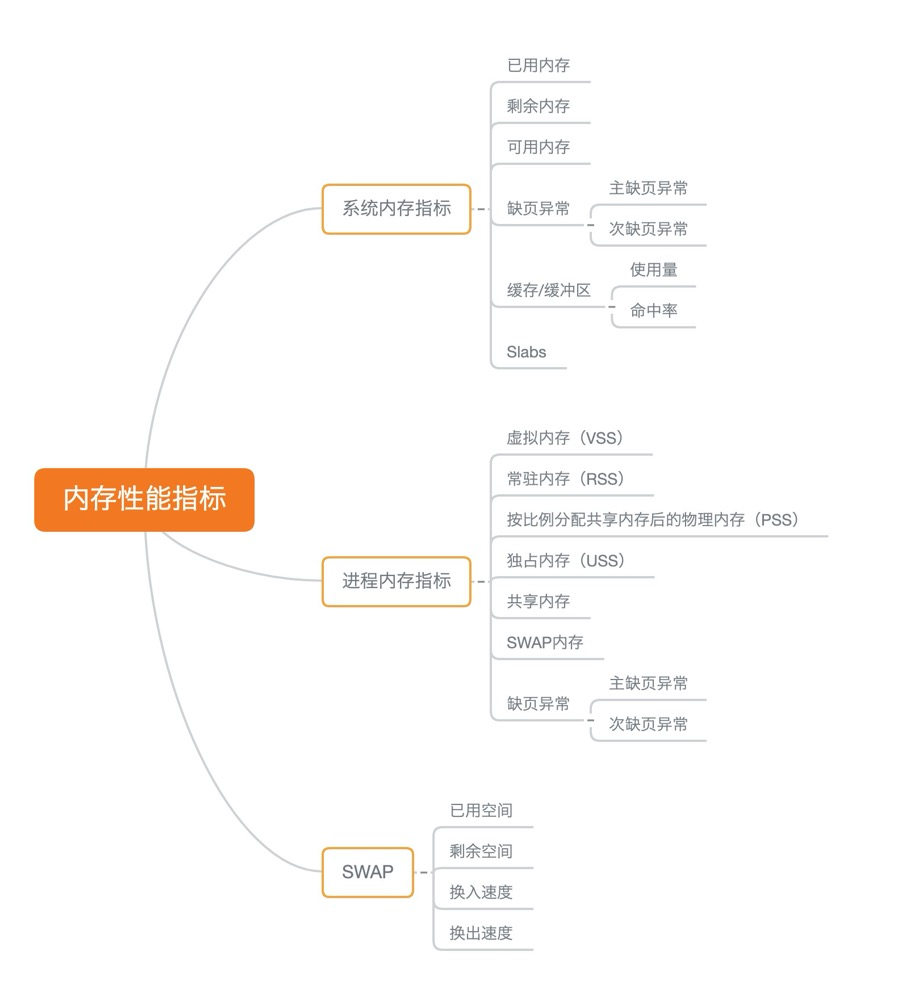
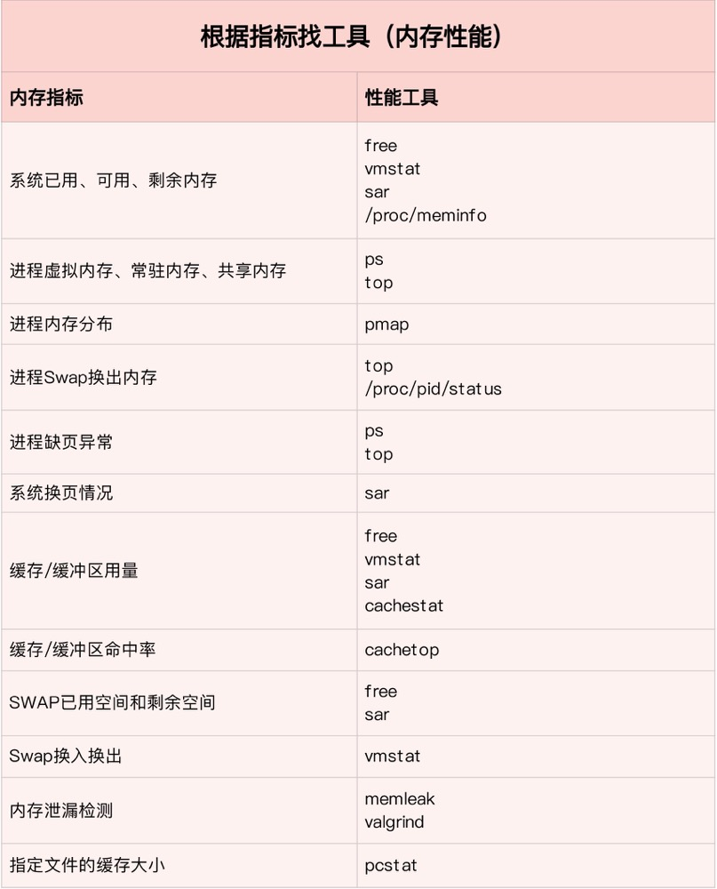
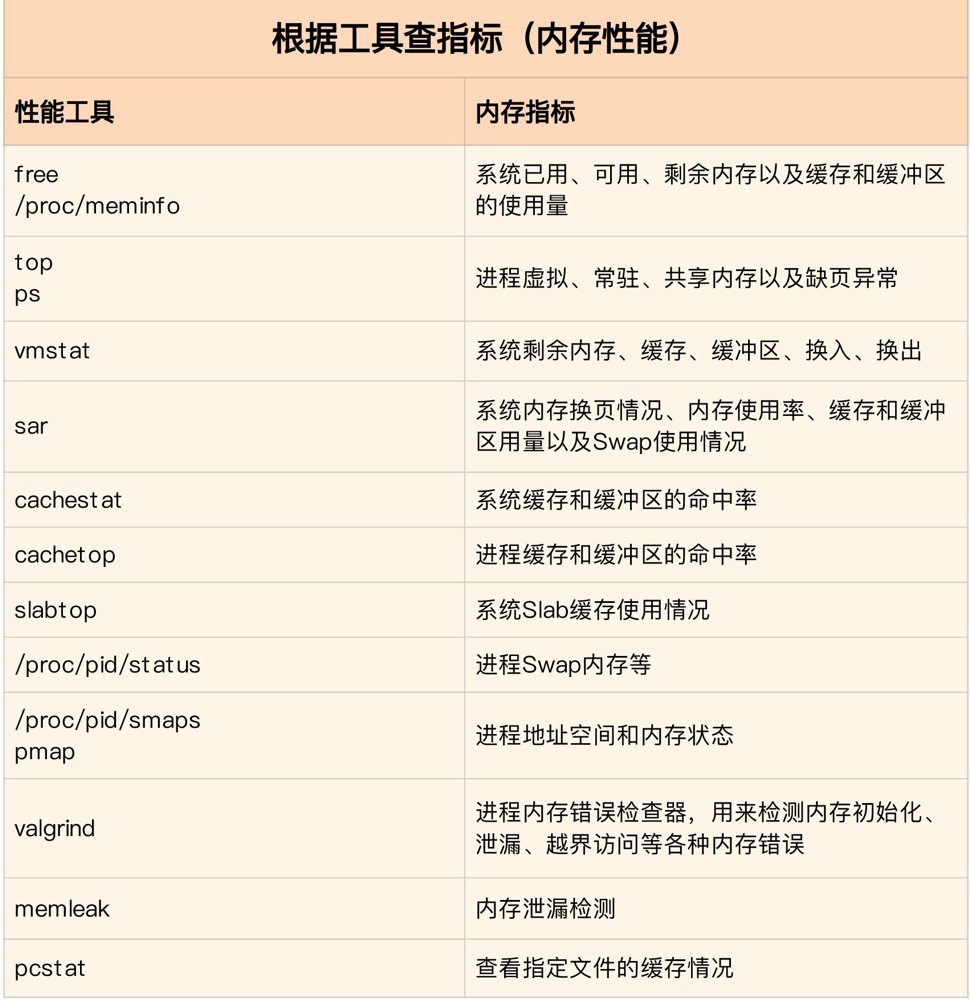
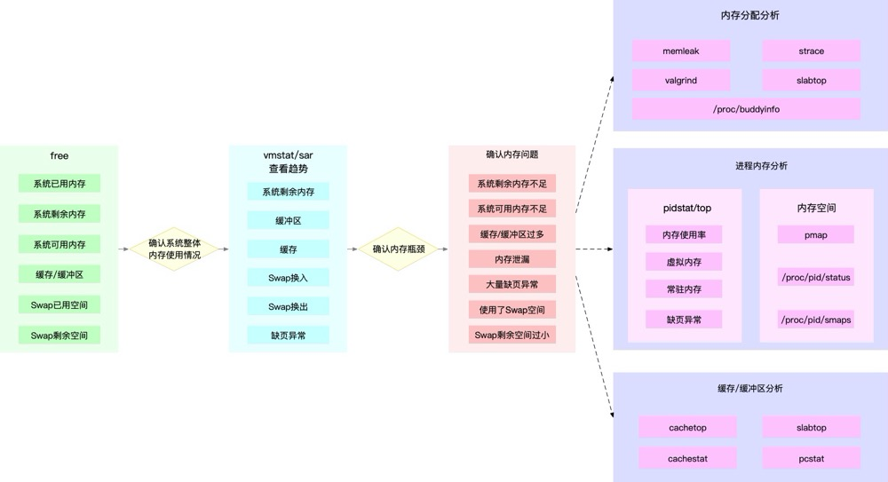

## 如何快速定位系统内存问题

### 一、内存性能指标

#### 1. 系统内存使用情况

- 已用内存和剩余内存，就是已经使用和还未使用的内存。
- 共享内存是通过 tmpfs 实现的，所以它的大小也就是 tmpfs 使用的内存大小。tmpfs 其实也是一种特殊的缓存。
- 可用内存是新进程可以使用的最大内存，它包括剩余内存和可回收缓存。
- 缓存包括两部分，一部分是磁盘读取文件的页缓存，用来缓存从磁盘读取的数据，可以加快以后再次访问的速度。另一部分，则是 Slab 分配器中的可回收内存
- 缓冲区是对原始磁盘块的临时存储，用来缓存将要写入磁盘的数据。这样，内核就可以把分散的写集中起来，统一优化磁盘写入。

#### 2. 进程内存使用情况

- 虚拟内存，包括了进程代码段、数据段、共享内存、已经申请的堆内存和已经换出的内存等。这里要注意，已经申请的内存，即使还没有分配物理内存，也算作虚拟内存。
- 常驻内存是进程实际使用的物理内存，不过，它不包括 Swap 和共享内存。
- 共享内存，既包括与其他进程共同使用的真实的共享内存，还包括了加载的动态链接库以及程序的代码段等。
- Swap 内存，是指通过 Swap 换出到磁盘的内存。

系统调用内存分配请求后，并会立刻为其分配物理内存，而是在请求首次访问时，通过缺页异常来分配。缺页异常分为如下两个场景：

- 可以直接从物理内存中分配时，被称为次缺页异常
- 需要磁盘 IO 介入（比如 Swap）时，被称为主缺页异常。主缺页异常，意味着需要磁盘IO，那么内存访问就会慢很多

#### 3. Swap 的使用情况

- Swap 的已用空间和剩余空间，也就是已经使用和没有使用的内存空间
- 换入和换出速度，则表示每秒钟换入和换出内存的大小

### 二、内存性能工具

- free、top、ps 
- 通过 proc 文件系统，内存指标的来源，通过 vmstat 可动态观察内存的变化情况。
- cachestat 查看整个系统缓存的读写命中情况，使用 cachetop 观察每个进程缓存的读写命中情况
- memleak 查看内存泄露
- sar 

### 三、如何快速分析内存的性能瓶颈

1. 先用 free 和 top，查看系统整体的内存使用情况。
2. 再用 vmstat 和 pidstat，查看一段时间的趋势，从而判断出内存问题的类型。
3. 最后进行详细分析，比如内存分配分析、缓存 / 缓冲区分析、具体进程的内存使用分析等。

