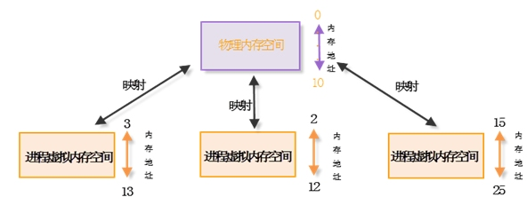
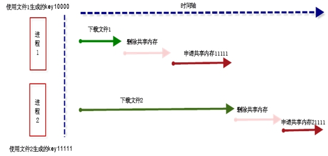

# Linux 共享内存使用常见的陷阱与分析

所谓共享内存就是使得多个进程可以访问同一块内存空间，是最快的可用IPC形式。是针对其他通信机制运行效率较低而设计的。往往与其它通信机制，如 信号量结合使用，来达到进程间的同步及互斥。其他进程能把同一段共享内存段“连接到”他们自己的地址空间里去。所有进程都能访问共享内存中的地址。如果一 个进程向这段共享内存写了数据，所做的改动会即时被有访问同一段共享内存的其他进程看到。共享内存的使用大大降低了在大规模数据处理过程中内存的消耗，但 是共享内存的使用中有很多的陷阱，一不注意就很容易导致程序崩溃。 

**超过共享内存的大小限制？**

在一个linux服务器上，共享内存的总体大小是有限制的，这个大小通过SHMMAX参数来定义（以字节为单位），您可以通过执行以下命令来确定 SHMMAX 的值： 

1. # cat /proc/sys/kernel/shmmax

如果机器上创建的共享内存的总共大小超出了这个限制，在程序中使用标准错误perror可能会出现以下的信息： 

1. unable to attach to shared memory

解决方法： 

**1、设置 SHMMAX**

SHMMAX 的默认值是 32MB 。一般使用下列方法之一种将 SHMMAX 参数设为 2GB ： 

通过直接更改 /proc 文件系统，你不需重新启动机器就可以改变 SHMMAX 的默认设置。我使用的方法是将以下命令放入 />etc/rc.local 启动文件中： 

1. # echo "2147483648" &gt; /proc/sys/kernel/shmmax

您还可以使用 sysctl 命令来更改 SHMMAX 的值： 

1. # sysctl -w kernel.shmmax=2147483648

最后，通过将该内核参数插入到 /etc/sysctl.conf 启动文件中，您可以使这种更改永久有效： 

1. # echo "kernel.shmmax=2147483648" &gt;&gt; /etc/sysctl.conf

**2、设置 SHMMNI**

我们现在来看 SHMMNI 参数。这个内核参数用于设置系统范围内共享内存段的最大数量。该参数的默认值是 4096 。这一数值已经足够，通常不需要更改。 

您可以通过执行以下命令来确定 SHMMNI 的值： 

1. # cat /proc/sys/kernel/shmmni 
2. 4096

**3、设置 SHMALL**

最后，我们来看 SHMALL 共享内存内核参数。该参数控制着系统一次可以使用的共享内存总量（以页为单位）。简言之，该参数的值始终应该至少为： 

1. ceil(SHMMAX/PAGE_SIZE)

SHMALL 的默认大小为 2097152 ，可以使用以下命令进行查询： 

1. # cat /proc/sys/kernel/shmall 
2. 2097152

SHMALL 的默认设置对于我们来说应该足够使用。 

注意： 在 i386 平台上 Red Hat Linux 的 页面大小 为 4096 字节。但是，您可以使用 bigpages ，它支持配置更大的内存页面尺寸。 

**多次进行shmat会出现什么问题？**

当首次创建共享内存段时，它并不能被任何进程所访问。为了使共享内存区可以被访问，则必须通过 shmat 函数将其附加( attach )到自己的进程空间中，这样进程就与共享内存建立了连接。该函数声明在 linux/shm.h中： 

1. #include 
2. #include 
3. void *shmat(int shmid, const void *shmaddr, int shmflg);

参数 shmid 是 shmget() 的返回值，是个标识符； 

参数 shmflg 是存取权限标志；如果为 0 ，则不设置任何限制权限。在 中定义了几个权限： 

1. #define SHM_RDONLY 010000 /* attach read-only else read-write */ 
2. #define SHM_RND 020000 /* round attach address to SHMLBA */ 
3. #define SHM_REMAP 040000 /* take-over region on attach */

如果指定 SHM_RDONLY ，那么共享内存区只有读取权限。 

参数 shmaddr 是共享内存的附加点，不同的取值有不同的含义： 

?如果为空，则由内核选择一个空闲的内存区；如果非空，返回地址取决于调用者是否给 shmflg 参数指定 SHM_RND 值，如果没有指定，则共享内存区附加到由 shmaddr 指定的地址；否则附加地址为 shmaddr 向下舍入一个共享内存低端边界地址后的地址 (SHMLBA ，一个常址)。 

Ø通常将参数 shmaddr 设置为 NULL 。 

shmat() 调用成功后返回一个指向共享内存区的指针，使用该指针就可以访问共享内存区了，如果失败则返回 -1。 

其映射关系如下图所示： 

[http://s4.51cto.com/wyfs01/M02/33/00/wKioJlKUWEbS_kyKAACf8a9TgX4617.jpg](http://s4.51cto.com/wyfs01/M02/33/00/wKioJlKUWEbS_kyKAACf8a9TgX4617.jpg)

图1.1 共享内存映射图 

其中，shmaddr表示的是物理内存空间映射到进程的虚拟内存空间时候，虚拟内存空间中该块内存的起始地址，在使用中，因为我们一般不清楚进程中哪些地址没有被占用，所以不好指定物理空间的内存要映射到本进程的虚拟内存地址，一般会让内核自己指定： 

1. void ptr = shmat(shmid, NULL,0);

这样挂载一个共享内存如果是一次调用是没有问题的，但是一个进程是可以对同一个共享内存多次 shmat进行挂载的，物理内存是指向同一块，如果shmaddr为NULL，则每次返回的线性地址空间都不同。而且指向这块共享内存的引用计数会增加。 也就是进程多块线性空间会指向同一块物理地址。这样，如果之前挂载过这块共享内存的进程的线性地址没有被shmdt掉，即申请的线性地址都没有释放，就会 一直消耗进程的虚拟内存空间，很有可能会最后导致进程线性空间被使用完而导致下次shmat或者其他操作失败。 

解决方法： 

可以通过判断需要申请的共享内存指针是否为空来标识是否是第一次挂载共享内存，若是则使用进行挂载，若不是则退出。 

1. void* ptr = NULL; 
2. ... 
3. if (NULL != ptr) 
4. return; 
5. ptr = shmat(shmid,ptr,0666);

附： 

函数shmat将标识号为shmid共享内存映射到调用进程的地址空间中，映射的地址由参数shmaddr和shmflg共同确定，其准则为： 

(1) 如果参数shmaddr取值为NULL，系统将自动确定共享内存链接到进程空间的首地址。 

(2) 如果参数shmaddr取值不为NULL且参数shmflg没有指定SHM_RND标志，系统将运用地址shmaddr链接共享内存。 

(3) 如果参数shmaddr取值不为NULL且参数shmflg指定了SHM_RND标志位，系统将地址shmaddr对齐后链接共享内存。其中选项 SHM_RND的意思是取整对齐，常数SHMLBA代表了低边界地址的倍数，公式“shmaddr – (shmaddr % SHMLBA)”的意思是将地址shmaddr移动到低边界地址的整数倍上。 

Shmget创建共享内存，当key相同时，什么情况下会出错？ 

shmget() 用来创建一个共享内存区，或者访问一个已存在的共享内存区。该函数定义在头文件 linux/shm.h中，原型如下： 

1. #include 
2. #include 
3. int shmget(key_t key, size_t size, int shmflg);

参数 key是由 ftok() 得到的键值； 

参数 size 是以字节为单位指定内存的大小； 

参数 shmflg 是操作标志位，它的一些宏定义如下： 

IPC_CREATE : 调用 shmget 时，系统将此值与其他共享内存区的 key 进行比较，如果存在相同的 key ，说明共享内存区已存在，此时返回该共享内存区的标识符，否则新建一个共享内存区并返回其标识符。 

IPC_EXCL : 该宏必须和 IPC_CREATE 一起使用，否则没意义。当 shmflg 取 IPC_CREATE | IPC_EXCL 时，表示如果发现内存区已经存在则返回 -1，错误代码为 EEXIST 。 

注意，当创建一个新的共享内存区时，size 的值必须大于 0 ；如果是访问一个已经存在的内存共享区，则置 size 为 0 。 

一般我们创建共享内存的时候会在一个进程中使用shmget来创建共享内存， 

1. Int shmid = shmget(key, size, IPC_CREATE|0666);

而在另外的进程中，使用shmget和同样的key来获取到这个已经创建了的共享内存, 

1. Int shmid = shmget(key, size, IPC_CREATE|0666);

如果创建进程和挂接进程key相同，而对应的size大小不同，是否会shmget失败？ 

Ø 已经创建的共享内存的大小是可以调整的，但是已经创建的共享内存的大小只能调小，不能调大 

如： 

1. shm_id = shmget(key,4194304,IPC_CREAT);

创建了一个4M大小的共享内存，如果这个共享内存没有删掉，我们再使用 

1. shm_id = shmget(key,10485760,IPC_CREAT);

来创建一个10M大小的共享内存的时候，使用标准错误输出会有如下错误信息： 

1. shmget error: Invalid argument

但是，如果我们使用： 

1. shm_id = shmget(key,3145728,IPC_CREAT);

来创建一个3M大小的共享内存的时候，并不会输出错误信息，只是共享内存大小会被修改为3145728，这也说明，使用共享内存的时候，是用key来作为共享内存的唯一标识的，共享内存的大小不能区分共享内存。 

**这样会导致什么问题？**

当多个进程都能创建共享内存的时候，如果key出现相同的情况，并且一个进程需要创建的共享内存的大小要比另外一个进程要创建的共享内存小，共享内 存大的进程先创建共享内存，共享内存小的进程后创建共享内存，小共享内存的进程就会获取到大的共享内存进程的共享内存， 并修改其共享内存的大小和内容（留意下面的评论补充），从而可能导致大的共享内存进程崩溃。 

解决方法： 

方法一： 

在所有的共享内存创建的时候，使用排他性创建，即使用IPC_EXCL标记： 

1. Shmget(key, size,IPC_CREATE|IPC_EXCL);

在共享内存挂接的时候，先使用排他性创建判断共享内存是否已经创建，如果还没创建则进行出错处理，若已经创建，则挂接： 

1. Shmid = Shmget(key, size,IPC_CREATE|IPC_EXCL); 
2. If (-1 != shmid) 
3. { 
4. Printf("error"); 
5. } 
6. Shmid = Shmget(key, size,IPC_CREATE);

方法二： 

虽然都希望自己的程序能和其他的程序预先约定一个唯一的键值，但实际上并不是总可能的成行的，因为自己的程序无法为一块共享内存选择一个键值。因 此，在此把key设为IPC_PRIVATE，这样，操作系统将忽略键，建立一个新的共享内存，指定一个键值，然后返回这块共享内存IPC标识符ID。而 将这个新的共享内存的标识符ID告诉其他进程可以在建立共享内存后通过派生子进程，或写入文件或管道来实现，即这种方法不使用key来创建共享内存，由操 作系统来保证唯一性。 

**ftok是否一定会产生唯一的key值？**

系统建立IPC通讯（如消息队列、共享内存时）必须指定一个ID值。通常情况下，该id值通过ftok函数得到。 

ftok原型如下： 

1. key_t ftok( char * pathname, int proj_id)

pathname就时你指定的文件名，proj_id是子序号。 

在一般的UNIX实现中，是将文件的索引节点号取出，前面加上子序号得到key_t的返回值。如指定文件的索引节点号为65538，换算成16进制 为0×010002，而你指定的proj_id值为38，换算成16进制为0×26，则最后的key_t返回值为0×26010002。 

查询文件索引节点号的方法是： ls -i 

但当删除重建文件后，索引节点号由操作系统根据当时文件系统的使用情况分配，因此与原来不同，所以得到的索引节点号也不同。 

根据pathname指定的文件（或目录）名称，以及proj_id参数指定的数字，ftok函数为IPC对象生成一个唯一性的键值。在实际应用 中，很容易产生的一个理解是，在proj_id相同的情况下，只要文件（或目录）名称不变，就可以确保ftok返回始终一致的键值。然而，这个理解并非完 全正确，有可能给应用开发埋下很隐晦的陷阱。因为ftok的实现存在这样的风险，即在访问同一共享内存的多个进程先后调用ftok函数的时间段中，如果 pathname指定的文件（或目录）被删除且重新创建，则文件系统会赋予这个同名文件（或目录）新的i节点信息，于是这些进程所调用的ftok虽然都能 正常返回，但得到的键值却并不能保证相同。由此可能造成的后果是，原本这些进程意图访问一个相同的共享内存对象，然而由于它们各自得到的键值不同，实际上 进程指向的共享内存不再一致；如果这些共享内存都得到创建，则在整个应用运行的过程中表面上不会报出任何错误，然而通过一个共享内存对象进行数据传输的目 的将无法实现。 

所以如果要确保key_t值不变， 要么确保ftok的文件不被删除，要么不用ftok，指定一个固定的key_t值。 

如果存在生成key_t值的文件被删除过，则很有可能自己现在使用的共享内存key_t值会和另外一个进程的key_t值冲突，如下面这种情况： 

[http://s2.51cto.com/wyfs01/M00/33/04/wKioJlKUWkSB9XL8AACeOtS_IEI037.jpg](http://s2.51cto.com/wyfs01/M00/33/04/wKioJlKUWkSB9XL8AACeOtS_IEI037.jpg)

进程1使用文件1来ftok生成了key10000，进程2使用文件2来ftok生成了key 11111，此时如果进程1和进程2都需要下载文件，并将文件的内容更新到共享内存，此时进程1和2都需要先下文件，再删掉之前的共享内存，再使用 ftok生成新的key，再用这个key去申请新的共享内存来装载新的问题，但是可能文件2比较大，下载慢，而文件1比较小，下载比较慢，由于文件1和文 件2都被修改，此时文件1所占用的文件节点号可能是文件2之前所占用的，此时如果下载的文件1的ftok生成的key为11111的话，就会和此时还没有 是否11111这个key的进程2的共享内存冲突，导致出现问题。 

解决方法： 

方法一： 

在有下载文件操作的程序中，对下载的文件使用ftok获取key的时候，需要进行冲突避免的措施，如使用独占的方式获取共享内存，如果不成功，则对key进行加一操作，再进行获取共享内存，一直到不会产生冲突为止。 

方法二： 

下载文件之前，将之前的文件进行mv一下，先“占”着这个文件节点号，防止其他共享内存申请key的时候获取到。 

另外： 

创建进程在通知其他进程挂接的时候，建议不使用ftok方式来获取Key，而使用文件或者进程间通信的方式告知。 

**共享内存删除的陷阱？**

当进程结束使用共享内存区时，要通过函数 shmdt 断开与共享内存区的连接。该函数声明在 sys/shm.h 中，其原型如下： 

1. #include 
2. #include 
3. int shmdt(const void *shmaddr);

参数 shmaddr 是 shmat 函数的返回值。 

进程脱离共享内存区后，数据结构 shmid_ds 中的 shm_nattch 就会减 1 。但是共享段内存依然存在，只有 shm_attch 为 0 后，即没有任何进程再使用该共享内存区，共享内存区才在内核中被删除。一般来说，当一个进程终止时，它所附加的共享内存区都会自动脱离。 

我们通过： 

1. int shmctl( int shmid , int cmd , struct shmid_ds *buf );

来删除已经存在的共享内存。 

第一个参数，shmid，是由shmget所返回的标记符。 

第二个参数，cmd，是要执行的动作。他可以有三个值： 

**命令 描述**

* IPC_STAT 设置shmid_ds结构中的数据反射与共享内存相关联的值。
* IPC_SET 如果进程有相应的权限，将与共享内存相关联的值设置为shmid_ds数据结构中所提供的值。
* IPC_RMID 删除共享内存段。

第三个参数，buf，是一个指向包含共享内存模式与权限的结构的指针，删除的时候可以默认为0。 

如果共享内存已经与所有访问它的进程断开了连接，则调用IPC_RMID子命令后，系统将立即删除共享内存的标识符，并删除该共享内存区，以及所有相关的数据结构； 

如果仍有别的进程与该共享内存保持连接，则调用IPC_RMID子命令后，该共享内存并不会被立即从系统中删除，而是被设置为 IPC_PRIVATE状态，并被标记为”已被删除”（使用ipcs命令可以看到dest字段）；直到已有连接全部断开，该共享内存才会最终从系统中消 失。 

需要说明的是：一旦通过shmctl对共享内存进行了删除操作，则该共享内存将不能再接受任何新的连接，即使它依然存在于系统中！所以，可以确知， 在对共享内存删除之后不可能再有新的连接，则执行删除操作是安全的；否则，在删除操作之后如仍有新的连接发生，则这些连接都将可能失败！ 

**Shmdt和shmctl的区别：**

Shmdt 是将共享内存从进程空间detach出来，使进程中的shmid无效化，不可以使用。但是保留空间。 

而shmctl(sid,IPC_RMID,0)则是删除共享内存，彻底不可用，释放空间。 

