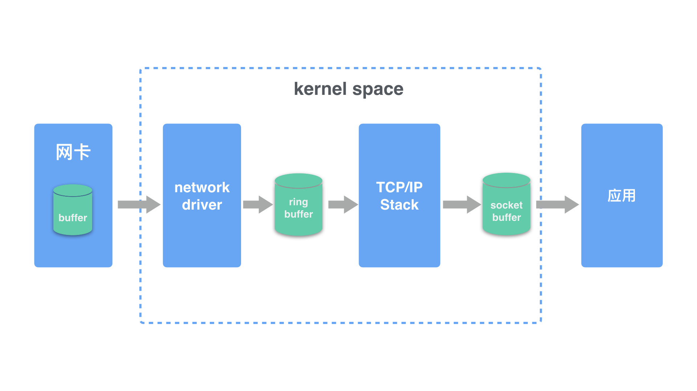

https://cizixs.com/2018/01/13/linux-udp-packet-drop-debug/
//todo
// ethtool 命令的熟悉

## Linux系统UDP丢包分析
UDP是不可靠的传输协议，没有TCP的流量控制、丢包重传等机制。可能会出现丢包，出现丢包时我们该如何排查确认是什么原因导致的丢包呢？

### 一、Linux系统接收网络报文过程
1. 首先网络报文通过物理网线发送到网卡
2. 网络驱动程序会把网络中的报文读出来放到 ring buffer 中，这个过程使用 DMA(Direct Memory Access)，不需要CPU参与
3. 内核从 ring buffer 中读取报文进行处理，执行 IP 和 TCP/UDP 层逻辑，然后把报文放到应用程序的 socket buffer 中
4. 应用程序从 socket buffer 中读取报文进行处理



在接收UDP报文的过程中，网卡、驱动、系统socket、应用都有可能主动或者被动的丢弃报文

### 二、 网卡丢包
1. 命令：ifconfig eth1 
```shell
root@9-134-239-95:~# ifconfig eth1
eth1: flags=4163<UP,BROADCAST,RUNNING,MULTICAST>  mtu 1500
        inet 9.134.239.95  netmask 255.255.248.0  broadcast 9.134.239.255
        ether 52:54:00:d2:e6:38  txqueuelen 1000  (Ethernet)
        RX packets 864587259  bytes 159935845567 (148.9 GiB)
        RX errors 0  dropped 489  overruns 0  frame 0
        TX packets 1011035426  bytes 344001848682 (320.3 GiB)
        TX errors 0  dropped 0 overruns 0  carrier 0  collisions 0
```
其中 RX 表示 receive接收报文；TX 表示 transmit发送报文

2. 命令：netstat -i
提供了每个网卡的发送接收报文以及丢包的情况
```shell
root@9-134-239-95:~# netstat -i
Kernel Interface table
Iface             MTU    RX-OK RX-ERR RX-DRP RX-OVR    TX-OK TX-ERR TX-DRP TX-OVR Flg
docker0          1500    40843      0      0 0        101513      0      0      0 BMRU
eth1             1500 864595745      0    489 0      1011044124      0      0      0 BMRU
lo              65536 75048319392      0   4120 0      75048319392      0      0      0 LRU
veth2c2dd08      1500       39      0      0 0            86      0      0      0 BMRU
veth90a5b84      1500      239      0      0 0           255      0      0      0 BMRU
```

3. 命令：ethtool -g
查看某个网卡的 ring buffer
```shell
root@9-134-239-95:~# ethtool -g eth1
Ring parameters for eth1:
Pre-set maximums:
RX:             1024
RX Mini:        0
RX Jumbo:       0
TX:             1024
Current hardware settings:
RX:             1024
RX Mini:        0
RX Jumbo:       0
TX:             1024
```
其中 Pre-set 表示网卡最大的 ring buffer 的值

### 三、 系统内核层丢包
系统内核从 ring buffer 读取报文，执行 IP和TCP/UDP层逻辑，然后放到 socket buffer 中。
1. 命令：netstat -s 
```shell
root@9-134-239-95:~# netstat -s --udp
IcmpMsg:
    InType0: 12298
    InType3: 77155204
    InType8: 15240966
    OutType0: 15240966
    OutType3: 76606062
    OutType8: 12310
Udp:
    1393930905 packets received
    76606038 packets to unknown port received.
    37785175 packet receive errors
    1518092459 packets sent
    37785175 receive buffer errors
    0 send buffer errors
UdpLite:
IpExt:
    InNoRoutes: 57
    InMcastPkts: 323791
    InOctets: 30487182248192
    OutOctets: 30669237483341
    InMcastOctets: 11656476
```
加上 --udp 可以只看UDP相关的报文数据
- packet receive errors：不为空，并且在一直增长说明系统有UDP丢白
- packets to unkown port received: 表示系统接收到的UDP报文所在的目标端口没有应用在监听，一般是服务没有启动导致
- receive buffer errors: 表示因为UDP的 socket buffer 太小导致丢包的数量

对于UDP来说，如果有少量的丢包很可能是预期的行为，比如丢包率(丢包数量/接收报文数量)在万分之一

UDP buffer 满导致的丢数据，可能因为UDP报文过大、接收报文的速率高等原因
linux 设置 receive buffer 的相关配置，一般是 linux 启动时根据内存大小设置一个初始值 
```shell
# 允许设置的 receive buffer 的最大值
root@9-134-239-95:~# cat /proc/sys/net/core/rmem_max 
33554433
# 默认使用的 receive buffer 的值
root@9-134-239-95:~# cat /proc/sys/net/core/rmem_default 
229376
# 允许设置的 send buffer 的最大值
root@9-134-239-95:~# cat /proc/sys/net/core/wmem_max 
33554433
# 默认使用的 send buffer 的值
root@9-134-239-95:~# cat /proc/sys/net/core/wmem_default 
229376
```
如何修改这些值
```shell
# 立即生效
sysctl -w net.core.rmem_max = 26214400 # 设置为 25M
# 一直生效
vim /etc/sysctl.conf
```
另外一个可以配置的参数是 netdev_max_backlog，表示linux 内核从网卡驱动中读取报文后可以缓存的报文数量，默认是1000，可以调大这个值，比如设置成2000
```shell
# 查看
root@9-134-239-95:~# cat /proc/sys/net/core/netdev_max_backlog 
1000
# 设置可以缓存的报文数量
sysctl -w net.core.netdev_max_backlog=2000
```

2. UDP报文错误
如果在传输过程中UDP报文被修改，会导致 checksum 错误，或者长度错误，linux在接收到UDP报文时会对此进行校验，一旦发现错误会把报文丢弃。
如果希望UDP报文 checksum 即使有错也要发送给应用程序，可以在通过 socket 参数禁用UDP checkout 检查
```shell
int disable = 1;
setsockopt(sock_fd, SOL_SOCKET, SO_NO_CHECK, (void*)&disable, sizeof(disable)
```

### 四、应用层丢包
1. 防火墙
可以先检查防火墙规则，保证防火墙没有主动 drop UDP 报文

2. 系统负载过高
- CPU负载过高，系统没有时间进行报文的 checksum 计算、复制内存等操作，从而导致网卡或者 socket buffer 满而丢包
- memory 负载过高，应用程序处理过慢，无法及时处理报文
- IO负载过高，CPU 都用来响应 IO wait，没有时间处理缓存中的 UDP 报文

linux 系统是一个组件之间关联性比较强的系统，对于系统负载过高，要么是应用程序有问题，要么是系统资源不够。

3. 设置 socket 的 buffer size
linux 系统会把接收到的报文放到 socket 的 buffer 中，应用程序在从 socket buffer 中读取报文，因此这里影响丢包的两个因素分别是：socket buffer size 大小；应用程序读取报文的速度
```shell
# 设置 socket receive buffer 大小
uint64_t receive_buf_size = 20*1024*1024;  //20 MB
setsockopt(socket_fd, SOL_SOCKET, SO_RCVBUF, &receive_buf_size, sizeof(receive_buf_size));
```
对于应用程序来说，最好采取异步的方式来读取 socket buffer 中数据，提高读取报文的速度

### 五、工具
1. dropwatch：监听系统丢包信息，并打印出丢包发生的函数地址
```shell
# dropwatch -l kas
Initalizing kallsyms db
dropwatch> start
Enabling monitoring...
Kernel monitoring activated.
Issue Ctrl-C to stop monitoring

1 drops at tcp_v4_do_rcv+cd (0xffffffff81799bad)
10 drops at tcp_v4_rcv+80 (0xffffffff8179a620)
1 drops at sk_stream_kill_queues+57 (0xffffffff81729ca7)
4 drops at unix_release_sock+20e (0xffffffff817dc94e)
1 drops at igmp_rcv+e1 (0xffffffff817b4c41)
1 drops at igmp_rcv+e1 (0xffffffff817b4c41)
```

2. perf 工具监听 kfree_skb (网络报文丢弃时会调用该函数)事件发生
```shell
sudo perf record -g -a -e skb:kfree_skb
sudo perf script
```