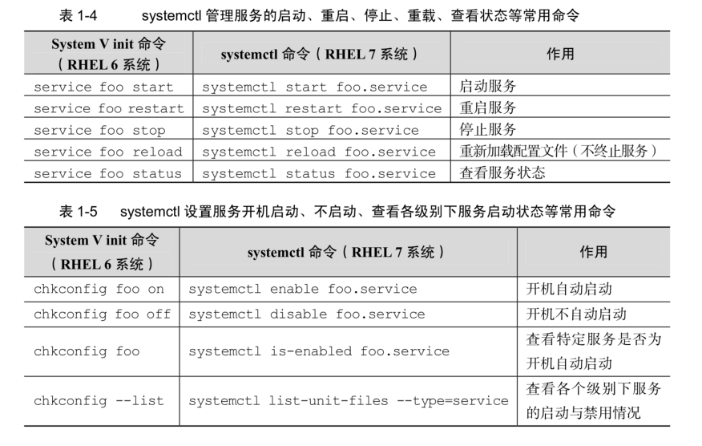
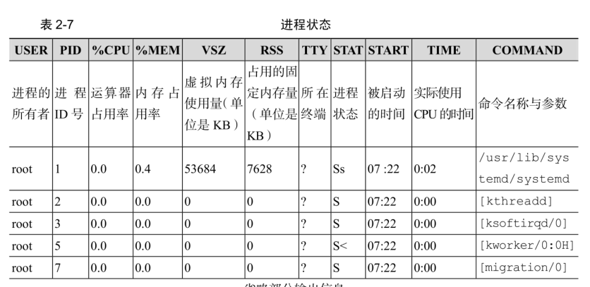
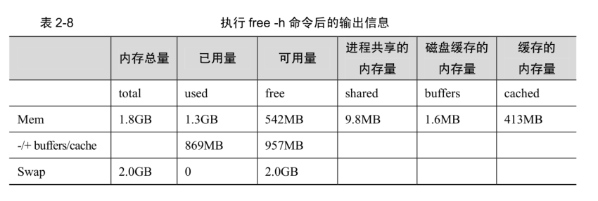

# 【linux就该这么学总结】一些名词的解析和基本的命令

#### 虚拟化技术

您的电脑的 CPU 需要支持 VT（VirtualizationTechnology，虚拟化技术）。所谓 VT，指的是让单台计算机能够分割出多个独立资源

区，并让每个资源区按照需要模拟出系统的一项技术，其本质就是通过中间层实现计算机资源的管理和再分配，让系统资源的利用率最大化。

#### RPM 软件包管理器

RPM 有点像 Windows 系统中的控制面板，会建立统一的数据库文件，详细记录软件信息并能够自动分析依赖关系。

常用的RPM软件包命令：

安装软件的命令格式 rpm -ivh filename.rpm

升级软件的命令格式 rpm -Uvh filename.rpm

卸载软件的命令格式 rpm -e filename.rpm

查询软件描述信息的命令格式 rpm -qpi filename.rpm

列出软件文件信息的命令格式 rpm -qpl filename.rpm

查询文件属于哪个 RPM 的命令格式 rpm -qf filename

#### yum软件仓库

Yum 软件仓库便是为了进一步降低软件安装难度和复杂度而设计的技术。Yum 软件仓库可以根据用户的要求分析出所需软件包及其相关的依赖关系，然后自动从服务器下载软件包并安装到系统。

yum repolist all 列出所有仓库

yum list all 列出仓库中所有软件包

yum info 软件包名称 查看软件包信息

yum install 软件包名称 安装软件包

yum reinstall 软件包名称 重新安装软件包

yum update 软件包名称 升级软件包

yum remove 软件包 移除软件包

yum clean all 清除所有仓库缓存

yum check-update 检查可更新的软件包

yum grouplist 查看系统中已经安装的软件包组

yum groupinstall 软件包组 安装指定的软件包组

yum groupremove 软件包组 移除指定的软件包组

yum groupinfo 软件包组 查询指定的软件包组信息

#### systemctl 的对比

#### man命令常用按键

#### 命令

echo、date、reboot (root) 、poweroff (root关闭系统)

* wget：用于在终端中下载网络文件    * -b：后台下载模式
    * -P：下载到指定目录
    * -t：最大尝试次数
    * -c：断点续传
    * -p：下载页面内所有资源，包括图片、视频等
    * -r：递归下载

* ps命令    * -a：显示所有进程（包括其他用户的进程）
    * -u：用户以及其他详细信息
    * -x：显示没有控制终端的进程
    
    
    R 运行：进程正在运行或者在运行队列中等待
    
    
    S 中断：进程处于休眠中，当某个条件形成后或者接收到信号时，则脱离该状态
    
    
    D 不可中断：进程不响应系统异步信号，即便用kill 命令也不能将其中断
    
    
    **注意：睡眠态是一个非常宽泛的概念，分为可中断睡眠和不可中断睡眠。可中断睡眠是允许接收外界信号和内核信号而被唤醒的睡眠，绝大多数睡眠都是可中断睡眠，能ps或top捕捉到的睡眠也几乎总是可中断睡眠；不可中断睡眠只能由内核发起信号来唤醒，外界无法通过信号来唤醒，主要表现在和硬件交互的时候。例如cat一个文件时，从硬盘上加载数据到内存中，在和硬件交互的那一小段时间一定是不可中断的，否则在加载数据的时候突然被人为发送的信号手动唤醒，而被唤醒时和硬件交互的过程又还没完成，所以即使唤醒了也没法将cpu交给它运行，所以cat一个文件的时候不可能只显示一部分内容。而且，不可中断睡眠若能被人为唤醒，更严重的后果是硬件崩溃。由此可知，不可中断睡眠是为了保护某些重要进程，也是为了让cpu不被浪费。**
    
    Z 僵死：进程已经终止，但是进程描述符依然存在，直到父进程调用wait 系统函数后将其释放
    
    
    T 停止：进程收到停止信号后停止运行
    
    
    
    
    注意：ps 命令可允许参数不加减号（-），因此可以直接写成ps aux 的样子

* top：用于动态的监视进程活动与系统负载等信息

top 命令执行结果的前 5 行为系统整体的统计信息，其所代表的含义如下：    * 第 1 行：系统时间、运行时间、登录终端数、系统负载（三个数值分别为 1 分钟、5分钟、15 分钟内的平均值，数值越小意味着负载越低）。
    * 第 2 行：进程总数、运行中的进程数、睡眠中的进程数、停止的进程数、僵死的进程数。
    * 第 3 行：用户占用资源百分比、系统内核占用资源百分比、改变过优先级的进程资源百分比、空闲的资源百分比等。
    * 第 4 行：物理内存总量、内存使用量、内存空闲量、作为内核缓存的内存量。
    * 第 5 行：虚拟内存总量、虚拟内存使用量、虚拟内存空闲量、已被提前加载的内存量。

* pidof 命令：用于查询某个指定服务进程的 PID 值

pidof 命令用于查询某个指定服务进程的 PID 值，格式为“pidof [参数] [服务名称]”。

pidof sshd
* kill：kill 命令用于终止某个指定 PID 的服务进程，格式为“kill [参数] [进程 PID]”。
* killall：killall 命令用于终止某个指定名称的服务所对应的全部进程，格式为：“killall [参数] [进程名称]”。

killall httpd

注意：在执行命令时在末尾添加上一个 & 符号，这样命令将进入系统后台来执行
* ifconfig
* uname：查看系统内核与系统版本等信息    * uname -a：一般会固定搭配 -a 参数来完整的查看当前系统的内核名称、主机名、内核发行版本、节点名、硬件名称、硬件平台、处理器类型以及操作系统名称等信息
    * 如果要查看当前系统版本的详细信息，则需要查看 redhat-release 文件

* uptime 命令：用于查看系统的负载信息    * 可以显示当前系统时间、系统已运行时间、启用终端数量以及平均负载值等信息。平均负载值指的是系统在最近1分钟、5分钟、15分钟内的压力情况，越低越好，尽量不要长期超过1，在生产环境下不要超过5。

* free 命令：显示当前系统中内存的使用量信息

-free -h

* who：用于查看当前登入主机的用户终端信息
* last：查看所有系统的登录记录

使用 last 命令可以查看本机的登录记录。但是这些信息都时以日志文件的形式保存在系统中，因此黑客可以很容易的对内容进行篡改。因此这些输出不能判断系统有无被恶意入侵。
* history：用于显示历史执行过的命令。    * -c：清空所有的命令历史记录
    * 使用 ”!编码数字“来重复执行某一次的命令
    * 历史命令会被保存到用户家目录中的 .bash_history 文件中，其中，history -c：不会清除这个文件中的内容

* ls ：-d：查看目录的属性信息
* cat：-n：查看的时候显示行号
* more：查看比较长的文件，可以使用它来翻页，空格翻页，回车换行
* head -n 20 xx.log：查看文件的前N行
* tail -n 20 xx.log：查看文件的后N行。tail -f xx.log：实时的刷新一个文件内容
* tr 命令用于替换文本文件中的字符，格式为“tr [原始字符] [目标字符]”。例如：cat xx.log | tr [a-z] [A-Z]
* wc：统计指定文本的 -l：行数 -w：单词数 -c：字节数

-stat：查看文件的具体存储信息和时间等信息，会显示出文件的三种时间状态：Access、Modify、Change
* cut：用于按“列”提取文本字符。-d：设置间隔符号，-

f：设置需要看的列数。例如：cut -d: -f1 /etc/passwd
* diff：用于比较多个文本文件之间的差异。    * -c：详细比较多个文件的差异之处
    * -brief：来确认两个文件是否不同
#### 文件目录管理命令

* touch：可以用于创建空白文件或者设置文件的时间    * 文件的内容的修改时间(mtime)、文件权限或者属性的更改时间(ctime)、文件的读取时间(atime)。
    * -a：仅修改atime。-m：仅修改mtime。-d：同时修改atime与mtime。
    * 例如：touch -d "2017-05-04 15:44" anaconda-ks.cfg
    * 很多黑客就是这样做的哦

* mkdir：创建空白的目录    * mkdir -p：可以递归创建具有嵌套叠层的文件目录

* cp：用于复制文件或者目录。cp [选项] 源文件 目标文件    * 如果目标文件是目录，则会把源文件复制到该目录中
    * 如果目标文件也是普通文件，则会询问是否要覆盖它
    * 如果目标文件不存在，则执行正常的复制操作
    * -p：保留原始文件的属性
    * -d：若对象为 链接文件，则保留该链接文件的属性
    * -r：递归持续复制(用于目录)
    * -i：若目标文件存在则询问是否覆盖
    * -a：相当于 -pdr 三个参数

* mv：用于剪切文件或者将文件重命名
* rm：用于删除文件或目录    * -f：强制删除。-r：递归删除

* dd：可以按照指定大小和个数的数据库来复制文件或者转换文件    * if：输入文件名称。of：输出文件名称。bs：设置每个块的大小。count：设置要复制的块的个数。
    * linux系统中有一个名为/dev/zero 的设备文件，这个文件不会占用系统存储空间，但却可以提供无穷的数据。可以使用它来作为dd 的输入文件，来生成一个指定大小的文件.
    * dd if=/dev/zero of=560_file count=1 bs=560M
    * 重点：如果想把光驱设备中的光盘制作成iso格式的镜像文件，就可以直接使用dd命令来完成：dd if=/dev/cdrom of=RHEL-server-7.0-x86_64-LinuxProbe.Com.iso

* file：用于查看文件的类型。    * linux下一切皆文件，可以使用file命令来查看文件类型了。
#### 打包压缩与搜索命令

* tar：用于对文件进行打包压缩或者解压    * -c：创建压缩文件。-x：解开压缩文件。-z：用Gzip压缩或者解压。-j：用bzip2压缩或者解压。-v：现实压缩或者解压的过程。-f：目标文件名 -p：保留原始的权限与属性。-P：使用绝对路径来压缩。-C：指定解压到的目录
    * 注意：-f参数必要要放到参数的最后一位。
    * 添加：--exclude 排除某个目录。例如：
    * 例如：tar -zcvf tomcat.tar.gz --exclude=tomcat/logs --exclude=tomcat/libs tomcat 等价于 tar -zcvf tomcat.tar.gz --exclude=tomcat/{logs,libs} tomcat

* grep：用于在文本中执行关键字搜索，并显示匹配的结果。    * -b：将可执行文件当作文本文件来搜索
    * -c：仅显示找到的行数
    * -i：忽略大小写
    * -n：显示行号
    * -v：反向选择，列出没有关键字的行

* find：按照指定条件来查找文件。find [查找路径] 寻找条件 操作    * -name：匹配名称
    * -perm：匹配权限(mode为完全匹配，-mode：包含即可)
    * -user：匹配所有者
    * -group：匹配所有组
    * -mtime -n +n：匹配修改内容的时间（-n指n天以内，+n指n天以前）
    * -atime -n +n：匹配访问文件的时间,上同。
    * -ctime -n +n：匹配修改文件权限的时间，上同。
    * -nouser：匹配无所有者的文件
    * -nogroup：匹配无所有组的文件
    * -newer f1 !f2：匹配比文件f1新但是比f2旧的文件
    * --type b/d/c/p/l/f：匹配文件类型(后面的字幕参数依次表示块设备、目录、字符设备、管道、链接文件、文本文件)
    * -size：匹配文件的大小(+50k为查找超过50KB的文件，而-50KB为查找小于50KB的文件)
    * -prune：忽略某个目录
    * -exec ...... {}; 后面可跟用于进一步处理搜索结果的命令.举例：find / -user linuxprobe -exec cp -a {} /root/findresults/ ; # 在整个文件系统中找出所有归属于linuxprobe用户的文件并复制到/root/findresults目录。
#### 输入输出重定向

* 标准输入重定向（STDIN，文件描述符为0）。标准输出重定向（STDOUT，文件描述符为1）。错误输出重定向（STDERR，文件描述符为2）。
* 命令 < 文件：将文件作为命令的标准输入
* 命令 << 分界符：从标准输入中读入，直到遇见分界符才停止
* 命令 < 文件1 > 文件2：将文件1作为命令的标准输入并将标准输出到文件2
* 命令 > 文件：将标准输出重定向到一个文件中（清空原有文件的数据）
* 命令 2> 文件：将错误输出重定向到一个文件中（清空原有文件的数据）
* 命令 >> 文件：将标准输出重定向到一个文件中（追加到原有内容的后面）
* 命令 2>> 文件：将错误输出重定向到一个文件中（追加）
* 命令 >> 文件 2 >&1 或者 命令 &>> 文件 :将标准输出与错误输出共同写入到文件（追加）

#### 管道符

#### 通配符

*     * 代笔匹配零个或者多个字符

* ？ 代表匹配单个字符
* [0-9] 代表匹配0-9之间的单个数字的字符
* [abc] 代表匹配a、b、c 三个字符中的任意一个字符识别
#### 转义字符

* 反斜杠（\）:使反斜杠后面的一个变量变为单纯的字符串
* 单引号（''）:转义其中的所有的变量为单纯的字符串
* 双引号（""）:保留其中的变量属性，不进行转义处理
* 反引号（``）：把其中的命令执行后返回结果
#### 环境变量

* 将环境变量添加到全局，所有用户。 /etc/profile
* 将环境变量添加到某个用户某个终端，export $PATH。环境变量以 ： 为分割。
### vim的使用

* 命令模式的常用命令：dd、5dd、yy、5yy、n、N、u、p
* :q！强制退出(放弃对文档的修改内容)。:set nu 显示行号。:set nonu 不显示行号。
* :s/one/two 将当前光标所在行的第一个one替换为two
* :s/one/two/g 将当前光标所在行的所有one替换为two
* :%s/one/two/g 将全文的所有one替换为two
* ?字符串 在文本中从下至上搜索该字符串
* /字符串 在文本中从上至下搜索字符串
#### 配置主机名称

* /etc/hostname 这个文件是这台主机的名称
#### 配置网卡信息

* /etc/sysconfig/network-scripts 这个目录存放着网卡的配置文件
#### shell脚本的交互性

* shell脚本用于接收参数的变量。# 对应总共有几个参数。* 对应所有位置的参数值。 $? 对应的是显示上一次命令的执行返回值。$1、$2、$3... 对应第n个位置的参数值
#### 定时任务

* crontab -e：创建、编辑计划任务。-l：查看当前计划任务。-r：删除某条计划任务。-u：如果是管理员，可以编辑他人的计划任务。
* crond服务设置任务的参数格式。“分、时、日、月、星期、命令”。如果有些字段没有设置，则需要使用星号(* )占位。
* 分：取值0-59的整数。时：取值0-23的任意整数。日：取值1-31的任意整数。月：取值1-12的任意整数。星期：取值0-7的任意整数，其中0和7都为星期日。命令：要执行的命令或者程序脚本。
* 例如：25 3 * * 1,3,5 命令。代表每周一、三、五的凌晨3点25分来执行一个命令。
* 逗号(,)表示多个时间段。减号(-)表示一段连续的时间周期（字段“日”的取值为“12-15”，表示每月的12-15日）。除号(/)表示执行任务的间隔时间(例如“/2”表示每隔2分钟执行一次任务)。
* 注意：所有命令一定要用绝对路径的方式来写。**计划任务中的“分”字段必须有数值，绝对不能为空或者是 * 号，而“日”和“星期”字段不能同时使用，否则就会发生冲突。**
### 用户身份与文件权限

* 管理员UID为0:系统的管理员用户
* 系统用户UID 为 1~999: Linux 系统为了避免因某个服务程序出现漏洞而被黑客提权至整台服务器，默认服务程序会有独立的系统用户负责运行，进而有效控制被破坏范围。
* 普通用户 UID 从 1000 开始:是由管理员创建的用于日常工作的用户。
* useradd：创建新的用户。默认的用户家目录会被存放在/home目录中，默认的shell解释器为/bin/bash，而且会创建一个与该用户同名的基本用户组。    * -d：指定用户的家目录
    * -e：账户的到期时间，格式为YYYY-MM-DD
    * -u：指定该用户的默认UID
    * -g：指定一个初始的用户基本组(必须已存在)
    * -G：指定一个或者多个扩展用户组
    * -N：不创建与用户同名的基本用户组
    * -s：指定该用户的默认shell解释器

* groupadd：创建用户组
* usermod：修改用户的属性    * -d -m 连用，可重新指定用户的家目录并自动把旧的数据转移过去。
    * -e：账户的到期时间
    * -g：变更所属用户组
    * -G：变更扩展用户组
    * -L：锁定用户禁止其登陆系统
    * -U：解锁用户，允许其登陆系统
    * -s：变更默认终端
    * -u：修改用户的UID

* passwd命令：修改用户密码、过期时间、认证信息等。    * 普通用户只能修改自己的系统密码，而root管理员则有权限修改其他所有人的密码。
    * -l：锁定用户，禁止其登陆
    * -u：解除锁定，允许用户登陆
    * --stdin：允许通过标准输入修改用户密码，echo "NewPassWord" | passwd --stdin Username
    * -d：使该用户可用空密码登陆系统
    * -e：强制用户在下次登陆时修改密码
    * -S：显示用户的密码是否被锁定，以及密码所采用的加密算法名称

* userdel：删除用户    * 在执行删除操作时，该用户的家目录默认会保留下来，此时可使用-r参数将其删除
    * -f：强制删除用户
    * -r：同时删除用户以及家目录

* chmod、chown：chmod [参数] 权限 文件或者目录名称 针对目录的时候一定加上 -R表示递归操作。
* 目录或者文件的隐藏权限。chattr、lsattr、
* su 命令与用户名之间有一个减号（-），这意味着完全切换到新的用户，即把环境变量信息也变更为新用户的相应信息，而不是保留原始的信息。强烈建议在切换用户身份时添加这个减号（-）。
|/boot      |开机所需文件 — 内核、开机菜单以及所需配置文件等           |
|/dev       |以文件形式存放任何设备与接口                               |
|/etc       |配置文件                                                   |
|/home      |用户家目录                                                 |
|/bin       |存放单用户模式下还可以操作的命令                           |
|/lib       |开机时用到的函数库，以及/bin 与/sbin 下面的命令要调用的函数|
|/sbin      |开机过程中需要的命令                                       |
|/media     |用于挂载设备文件的目录                                     |
|/opt       |放置第三方的软件                                           |
|/root      |系统管理员的家目录                                         |
|/srv       |一些网络服务的数据文件目录                                 |
|/tmp       |任何人均可使用的“共享”临时目录                           |
|/proc      |虚拟文件系统，例如系统内核、进程、外部设备及网络状态等     |
|/usr/local |用户自行安装的软件                                         |
|/usr/sbin  |Linux 系统开机时不会使用到的软件/命令/脚本                 |
|/usr/share |帮助与说明文件，也可放置共享文件                           |
|/var       |主要存放经常变化的文件，如日志                             |
|/lost+found|当文件系统发生错误时，将一些丢失的文件片段存放在这里       |

%23%23%23%23%20%E8%99%9A%E6%8B%9F%E5%8C%96%E6%8A%80%E6%9C%AF%0A%E6%82%A8%E7%9A%84%E7%94%B5%E8%84%91%E7%9A%84%20CPU%20%E9%9C%80%E8%A6%81%E6%94%AF%E6%8C%81%20VT%EF%BC%88VirtualizationTechnology%EF%BC%8C%E8%99%9A%E6%8B%9F%E5%8C%96%E6%8A%80%E6%9C%AF%EF%BC%89%E3%80%82%E6%89%80%E8%B0%93%20VT%EF%BC%8C%E6%8C%87%E7%9A%84%E6%98%AF%E8%AE%A9%E5%8D%95%E5%8F%B0%E8%AE%A1%E7%AE%97%E6%9C%BA%E8%83%BD%E5%A4%9F%E5%88%86%E5%89%B2%E5%87%BA%E5%A4%9A%E4%B8%AA%E7%8B%AC%E7%AB%8B%E8%B5%84%E6%BA%90%0A%E5%8C%BA%EF%BC%8C%E5%B9%B6%E8%AE%A9%E6%AF%8F%E4%B8%AA%E8%B5%84%E6%BA%90%E5%8C%BA%E6%8C%89%E7%85%A7%E9%9C%80%E8%A6%81%E6%A8%A1%E6%8B%9F%E5%87%BA%E7%B3%BB%E7%BB%9F%E7%9A%84%E4%B8%80%E9%A1%B9%E6%8A%80%E6%9C%AF%EF%BC%8C%E5%85%B6%E6%9C%AC%E8%B4%A8%E5%B0%B1%E6%98%AF%E9%80%9A%E8%BF%87%E4%B8%AD%E9%97%B4%E5%B1%82%E5%AE%9E%E7%8E%B0%E8%AE%A1%E7%AE%97%E6%9C%BA%E8%B5%84%E6%BA%90%E7%9A%84%E7%AE%A1%E7%90%86%E5%92%8C%E5%86%8D%E5%88%86%E9%85%8D%EF%BC%8C%E8%AE%A9%E7%B3%BB%E7%BB%9F%E8%B5%84%E6%BA%90%E7%9A%84%E5%88%A9%E7%94%A8%E7%8E%87%E6%9C%80%E5%A4%A7%E5%8C%96%E3%80%82%0A%0A%23%23%23%23%20RPM%20%E8%BD%AF%E4%BB%B6%E5%8C%85%E7%AE%A1%E7%90%86%E5%99%A8%0ARPM%20%E6%9C%89%E7%82%B9%E5%83%8F%20Windows%20%E7%B3%BB%E7%BB%9F%E4%B8%AD%E7%9A%84%E6%8E%A7%E5%88%B6%E9%9D%A2%E6%9D%BF%EF%BC%8C%E4%BC%9A%E5%BB%BA%E7%AB%8B%E7%BB%9F%E4%B8%80%E7%9A%84%E6%95%B0%E6%8D%AE%E5%BA%93%E6%96%87%E4%BB%B6%EF%BC%8C%E8%AF%A6%E7%BB%86%E8%AE%B0%E5%BD%95%E8%BD%AF%E4%BB%B6%E4%BF%A1%E6%81%AF%E5%B9%B6%E8%83%BD%E5%A4%9F%E8%87%AA%E5%8A%A8%E5%88%86%E6%9E%90%E4%BE%9D%E8%B5%96%E5%85%B3%E7%B3%BB%E3%80%82%0A%E5%B8%B8%E7%94%A8%E7%9A%84RPM%E8%BD%AF%E4%BB%B6%E5%8C%85%E5%91%BD%E4%BB%A4%EF%BC%9A%0A%20%20%20%20%E5%AE%89%E8%A3%85%E8%BD%AF%E4%BB%B6%E7%9A%84%E5%91%BD%E4%BB%A4%E6%A0%BC%E5%BC%8F%20%20rpm%20-ivh%20filename.rpm%0A%20%20%20%20%E5%8D%87%E7%BA%A7%E8%BD%AF%E4%BB%B6%E7%9A%84%E5%91%BD%E4%BB%A4%E6%A0%BC%E5%BC%8F%20%20rpm%20-Uvh%20filename.rpm%0A%20%20%20%20%E5%8D%B8%E8%BD%BD%E8%BD%AF%E4%BB%B6%E7%9A%84%E5%91%BD%E4%BB%A4%E6%A0%BC%E5%BC%8F%20%20rpm%20-e%20filename.rpm%0A%20%20%20%20%E6%9F%A5%E8%AF%A2%E8%BD%AF%E4%BB%B6%E6%8F%8F%E8%BF%B0%E4%BF%A1%E6%81%AF%E7%9A%84%E5%91%BD%E4%BB%A4%E6%A0%BC%E5%BC%8F%20%20rpm%20-qpi%20filename.rpm%0A%20%20%20%20%E5%88%97%E5%87%BA%E8%BD%AF%E4%BB%B6%E6%96%87%E4%BB%B6%E4%BF%A1%E6%81%AF%E7%9A%84%E5%91%BD%E4%BB%A4%E6%A0%BC%E5%BC%8F%20%20rpm%20-qpl%20filename.rpm%0A%20%20%20%20%E6%9F%A5%E8%AF%A2%E6%96%87%E4%BB%B6%E5%B1%9E%E4%BA%8E%E5%93%AA%E4%B8%AA%20RPM%20%E7%9A%84%E5%91%BD%E4%BB%A4%E6%A0%BC%E5%BC%8F%20%20rpm%20-qf%20filename%0A%20%20%20%20%0A%23%23%23%23%20yum%E8%BD%AF%E4%BB%B6%E4%BB%93%E5%BA%93%0AYum%20%E8%BD%AF%E4%BB%B6%E4%BB%93%E5%BA%93%E4%BE%BF%E6%98%AF%E4%B8%BA%E4%BA%86%E8%BF%9B%E4%B8%80%E6%AD%A5%E9%99%8D%E4%BD%8E%E8%BD%AF%E4%BB%B6%E5%AE%89%E8%A3%85%E9%9A%BE%E5%BA%A6%E5%92%8C%E5%A4%8D%E6%9D%82%E5%BA%A6%E8%80%8C%E8%AE%BE%E8%AE%A1%E7%9A%84%E6%8A%80%E6%9C%AF%E3%80%82Yum%20%E8%BD%AF%E4%BB%B6%E4%BB%93%E5%BA%93%E5%8F%AF%E4%BB%A5%E6%A0%B9%E6%8D%AE%E7%94%A8%E6%88%B7%E7%9A%84%E8%A6%81%E6%B1%82%E5%88%86%E6%9E%90%E5%87%BA%E6%89%80%E9%9C%80%E8%BD%AF%E4%BB%B6%E5%8C%85%E5%8F%8A%E5%85%B6%E7%9B%B8%E5%85%B3%E7%9A%84%E4%BE%9D%E8%B5%96%E5%85%B3%E7%B3%BB%EF%BC%8C%E7%84%B6%E5%90%8E%E8%87%AA%E5%8A%A8%E4%BB%8E%E6%9C%8D%E5%8A%A1%E5%99%A8%E4%B8%8B%E8%BD%BD%E8%BD%AF%E4%BB%B6%E5%8C%85%E5%B9%B6%E5%AE%89%E8%A3%85%E5%88%B0%E7%B3%BB%E7%BB%9F%E3%80%82%0A%20%20%20%20yum%20repolist%20all%20%20%E5%88%97%E5%87%BA%E6%89%80%E6%9C%89%E4%BB%93%E5%BA%93%0A%20%20%20%20yum%20list%20all%20%20%E5%88%97%E5%87%BA%E4%BB%93%E5%BA%93%E4%B8%AD%E6%89%80%E6%9C%89%E8%BD%AF%E4%BB%B6%E5%8C%85%0A%20%20%20%20yum%20info%20%E8%BD%AF%E4%BB%B6%E5%8C%85%E5%90%8D%E7%A7%B0%20%20%E6%9F%A5%E7%9C%8B%E8%BD%AF%E4%BB%B6%E5%8C%85%E4%BF%A1%E6%81%AF%0A%20%20%20%20yum%20install%20%E8%BD%AF%E4%BB%B6%E5%8C%85%E5%90%8D%E7%A7%B0%20%20%E5%AE%89%E8%A3%85%E8%BD%AF%E4%BB%B6%E5%8C%85%0A%20%20%20%20yum%20reinstall%20%E8%BD%AF%E4%BB%B6%E5%8C%85%E5%90%8D%E7%A7%B0%20%20%E9%87%8D%E6%96%B0%E5%AE%89%E8%A3%85%E8%BD%AF%E4%BB%B6%E5%8C%85%0A%20%20%20%20yum%20update%20%E8%BD%AF%E4%BB%B6%E5%8C%85%E5%90%8D%E7%A7%B0%20%20%E5%8D%87%E7%BA%A7%E8%BD%AF%E4%BB%B6%E5%8C%85%0A%20%20%20%20yum%20remove%20%E8%BD%AF%E4%BB%B6%E5%8C%85%20%20%E7%A7%BB%E9%99%A4%E8%BD%AF%E4%BB%B6%E5%8C%85%0A%20%20%20%20yum%20clean%20all%20%20%E6%B8%85%E9%99%A4%E6%89%80%E6%9C%89%E4%BB%93%E5%BA%93%E7%BC%93%E5%AD%98%0A%20%20%20%20yum%20check-update%20%20%E6%A3%80%E6%9F%A5%E5%8F%AF%E6%9B%B4%E6%96%B0%E7%9A%84%E8%BD%AF%E4%BB%B6%E5%8C%85%0A%20%20%20%20yum%20grouplist%20%20%E6%9F%A5%E7%9C%8B%E7%B3%BB%E7%BB%9F%E4%B8%AD%E5%B7%B2%E7%BB%8F%E5%AE%89%E8%A3%85%E7%9A%84%E8%BD%AF%E4%BB%B6%E5%8C%85%E7%BB%84%0A%20%20%20%20yum%20groupinstall%20%E8%BD%AF%E4%BB%B6%E5%8C%85%E7%BB%84%20%20%E5%AE%89%E8%A3%85%E6%8C%87%E5%AE%9A%E7%9A%84%E8%BD%AF%E4%BB%B6%E5%8C%85%E7%BB%84%0A%20%20%20%20yum%20groupremove%20%E8%BD%AF%E4%BB%B6%E5%8C%85%E7%BB%84%20%20%E7%A7%BB%E9%99%A4%E6%8C%87%E5%AE%9A%E7%9A%84%E8%BD%AF%E4%BB%B6%E5%8C%85%E7%BB%84%0A%20%20%20%20yum%20groupinfo%20%E8%BD%AF%E4%BB%B6%E5%8C%85%E7%BB%84%20%20%E6%9F%A5%E8%AF%A2%E6%8C%87%E5%AE%9A%E7%9A%84%E8%BD%AF%E4%BB%B6%E5%8C%85%E7%BB%84%E4%BF%A1%E6%81%AF%0A%20%20%20%20%0A%23%23%23%23%20systemctl%20%E7%9A%84%E5%AF%B9%E6%AF%94%0A!%5B5fc499318c17757d4b5ff0972137f31f.png%5D(evernotecid%3A%2F%2FF58EB868-BE9D-4226-A005-3F08447F494A%2Fappyinxiangcom%2F20773489%2FENResource%2Fp39)%0A%0A%0A%23%23%23%23%20man%E5%91%BD%E4%BB%A4%E5%B8%B8%E7%94%A8%E6%8C%89%E9%94%AE%0A!%5B95c94e4df339180087e9515136fcb931.png%5D(evernotecid%3A%2F%2FF58EB868-BE9D-4226-A005-3F08447F494A%2Fappyinxiangcom%2F20773489%2FENResource%2Fp40)%0A%0A%23%23%23%23%20%E5%91%BD%E4%BB%A4%0Aecho%E3%80%81date%E3%80%81reboot%20(root)%20%E3%80%81poweroff%20(root%E5%85%B3%E9%97%AD%E7%B3%BB%E7%BB%9F)%20%0A-%20wget%EF%BC%9A%E7%94%A8%E4%BA%8E%E5%9C%A8%E7%BB%88%E7%AB%AF%E4%B8%AD%E4%B8%8B%E8%BD%BD%E7%BD%91%E7%BB%9C%E6%96%87%E4%BB%B6%0A%20%20%20%20-%20-b%EF%BC%9A%E5%90%8E%E5%8F%B0%E4%B8%8B%E8%BD%BD%E6%A8%A1%E5%BC%8F%0A%20%20%20%20-%20-P%EF%BC%9A%E4%B8%8B%E8%BD%BD%E5%88%B0%E6%8C%87%E5%AE%9A%E7%9B%AE%E5%BD%95%0A%20%20%20%20-%20-t%EF%BC%9A%E6%9C%80%E5%A4%A7%E5%B0%9D%E8%AF%95%E6%AC%A1%E6%95%B0%0A%20%20%20%20-%20-c%EF%BC%9A%E6%96%AD%E7%82%B9%E7%BB%AD%E4%BC%A0%0A%20%20%20%20-%20-p%EF%BC%9A%E4%B8%8B%E8%BD%BD%E9%A1%B5%E9%9D%A2%E5%86%85%E6%89%80%E6%9C%89%E8%B5%84%E6%BA%90%EF%BC%8C%E5%8C%85%E6%8B%AC%E5%9B%BE%E7%89%87%E3%80%81%E8%A7%86%E9%A2%91%E7%AD%89%0A%20%20%20%20-%20-r%EF%BC%9A%E9%80%92%E5%BD%92%E4%B8%8B%E8%BD%BD%0A-%20ps%E5%91%BD%E4%BB%A4%0A%20%20%20%20-%20-a%EF%BC%9A%E6%98%BE%E7%A4%BA%E6%89%80%E6%9C%89%E8%BF%9B%E7%A8%8B%EF%BC%88%E5%8C%85%E6%8B%AC%E5%85%B6%E4%BB%96%E7%94%A8%E6%88%B7%E7%9A%84%E8%BF%9B%E7%A8%8B%EF%BC%89%0A%20%20%20%20-%20-u%EF%BC%9A%E7%94%A8%E6%88%B7%E4%BB%A5%E5%8F%8A%E5%85%B6%E4%BB%96%E8%AF%A6%E7%BB%86%E4%BF%A1%E6%81%AF%0A%20%20%20%20-%20-x%EF%BC%9A%E6%98%BE%E7%A4%BA%E6%B2%A1%E6%9C%89%E6%8E%A7%E5%88%B6%E7%BB%88%E7%AB%AF%E7%9A%84%E8%BF%9B%E7%A8%8B%0A%20%20%20%20R%20%E8%BF%90%E8%A1%8C%EF%BC%9A%E8%BF%9B%E7%A8%8B%E6%AD%A3%E5%9C%A8%E8%BF%90%E8%A1%8C%E6%88%96%E8%80%85%E5%9C%A8%E8%BF%90%E8%A1%8C%E9%98%9F%E5%88%97%E4%B8%AD%E7%AD%89%E5%BE%85%0A%20%20%20%20S%20%E4%B8%AD%E6%96%AD%EF%BC%9A%E8%BF%9B%E7%A8%8B%E5%A4%84%E4%BA%8E%E4%BC%91%E7%9C%A0%E4%B8%AD%EF%BC%8C%E5%BD%93%E6%9F%90%E4%B8%AA%E6%9D%A1%E4%BB%B6%E5%BD%A2%E6%88%90%E5%90%8E%E6%88%96%E8%80%85%E6%8E%A5%E6%94%B6%E5%88%B0%E4%BF%A1%E5%8F%B7%E6%97%B6%EF%BC%8C%E5%88%99%E8%84%B1%E7%A6%BB%E8%AF%A5%E7%8A%B6%E6%80%81%0A%20%20%20%20D%20%E4%B8%8D%E5%8F%AF%E4%B8%AD%E6%96%AD%EF%BC%9A%E8%BF%9B%E7%A8%8B%E4%B8%8D%E5%93%8D%E5%BA%94%E7%B3%BB%E7%BB%9F%E5%BC%82%E6%AD%A5%E4%BF%A1%E5%8F%B7%EF%BC%8C%E5%8D%B3%E4%BE%BF%E7%94%A8kill%20%E5%91%BD%E4%BB%A4%E4%B9%9F%E4%B8%8D%E8%83%BD%E5%B0%86%E5%85%B6%E4%B8%AD%E6%96%AD%0A%20%20%20%20**%E6%B3%A8%E6%84%8F%EF%BC%9A%E7%9D%A1%E7%9C%A0%E6%80%81%E6%98%AF%E4%B8%80%E4%B8%AA%E9%9D%9E%E5%B8%B8%E5%AE%BD%E6%B3%9B%E7%9A%84%E6%A6%82%E5%BF%B5%EF%BC%8C%E5%88%86%E4%B8%BA%E5%8F%AF%E4%B8%AD%E6%96%AD%E7%9D%A1%E7%9C%A0%E5%92%8C%E4%B8%8D%E5%8F%AF%E4%B8%AD%E6%96%AD%E7%9D%A1%E7%9C%A0%E3%80%82%E5%8F%AF%E4%B8%AD%E6%96%AD%E7%9D%A1%E7%9C%A0%E6%98%AF%E5%85%81%E8%AE%B8%E6%8E%A5%E6%94%B6%E5%A4%96%E7%95%8C%E4%BF%A1%E5%8F%B7%E5%92%8C%E5%86%85%E6%A0%B8%E4%BF%A1%E5%8F%B7%E8%80%8C%E8%A2%AB%E5%94%A4%E9%86%92%E7%9A%84%E7%9D%A1%E7%9C%A0%EF%BC%8C%E7%BB%9D%E5%A4%A7%E5%A4%9A%E6%95%B0%E7%9D%A1%E7%9C%A0%E9%83%BD%E6%98%AF%E5%8F%AF%E4%B8%AD%E6%96%AD%E7%9D%A1%E7%9C%A0%EF%BC%8C%E8%83%BDps%E6%88%96top%E6%8D%95%E6%8D%89%E5%88%B0%E7%9A%84%E7%9D%A1%E7%9C%A0%E4%B9%9F%E5%87%A0%E4%B9%8E%E6%80%BB%E6%98%AF%E5%8F%AF%E4%B8%AD%E6%96%AD%E7%9D%A1%E7%9C%A0%EF%BC%9B%E4%B8%8D%E5%8F%AF%E4%B8%AD%E6%96%AD%E7%9D%A1%E7%9C%A0%E5%8F%AA%E8%83%BD%E7%94%B1%E5%86%85%E6%A0%B8%E5%8F%91%E8%B5%B7%E4%BF%A1%E5%8F%B7%E6%9D%A5%E5%94%A4%E9%86%92%EF%BC%8C%E5%A4%96%E7%95%8C%E6%97%A0%E6%B3%95%E9%80%9A%E8%BF%87%E4%BF%A1%E5%8F%B7%E6%9D%A5%E5%94%A4%E9%86%92%EF%BC%8C%E4%B8%BB%E8%A6%81%E8%A1%A8%E7%8E%B0%E5%9C%A8%E5%92%8C%E7%A1%AC%E4%BB%B6%E4%BA%A4%E4%BA%92%E7%9A%84%E6%97%B6%E5%80%99%E3%80%82%E4%BE%8B%E5%A6%82cat%E4%B8%80%E4%B8%AA%E6%96%87%E4%BB%B6%E6%97%B6%EF%BC%8C%E4%BB%8E%E7%A1%AC%E7%9B%98%E4%B8%8A%E5%8A%A0%E8%BD%BD%E6%95%B0%E6%8D%AE%E5%88%B0%E5%86%85%E5%AD%98%E4%B8%AD%EF%BC%8C%E5%9C%A8%E5%92%8C%E7%A1%AC%E4%BB%B6%E4%BA%A4%E4%BA%92%E7%9A%84%E9%82%A3%E4%B8%80%E5%B0%8F%E6%AE%B5%E6%97%B6%E9%97%B4%E4%B8%80%E5%AE%9A%E6%98%AF%E4%B8%8D%E5%8F%AF%E4%B8%AD%E6%96%AD%E7%9A%84%EF%BC%8C%E5%90%A6%E5%88%99%E5%9C%A8%E5%8A%A0%E8%BD%BD%E6%95%B0%E6%8D%AE%E7%9A%84%E6%97%B6%E5%80%99%E7%AA%81%E7%84%B6%E8%A2%AB%E4%BA%BA%E4%B8%BA%E5%8F%91%E9%80%81%E7%9A%84%E4%BF%A1%E5%8F%B7%E6%89%8B%E5%8A%A8%E5%94%A4%E9%86%92%EF%BC%8C%E8%80%8C%E8%A2%AB%E5%94%A4%E9%86%92%E6%97%B6%E5%92%8C%E7%A1%AC%E4%BB%B6%E4%BA%A4%E4%BA%92%E7%9A%84%E8%BF%87%E7%A8%8B%E5%8F%88%E8%BF%98%E6%B2%A1%E5%AE%8C%E6%88%90%EF%BC%8C%E6%89%80%E4%BB%A5%E5%8D%B3%E4%BD%BF%E5%94%A4%E9%86%92%E4%BA%86%E4%B9%9F%E6%B2%A1%E6%B3%95%E5%B0%86cpu%E4%BA%A4%E7%BB%99%E5%AE%83%E8%BF%90%E8%A1%8C%EF%BC%8C%E6%89%80%E4%BB%A5cat%E4%B8%80%E4%B8%AA%E6%96%87%E4%BB%B6%E7%9A%84%E6%97%B6%E5%80%99%E4%B8%8D%E5%8F%AF%E8%83%BD%E5%8F%AA%E6%98%BE%E7%A4%BA%E4%B8%80%E9%83%A8%E5%88%86%E5%86%85%E5%AE%B9%E3%80%82%E8%80%8C%E4%B8%94%EF%BC%8C%E4%B8%8D%E5%8F%AF%E4%B8%AD%E6%96%AD%E7%9D%A1%E7%9C%A0%E8%8B%A5%E8%83%BD%E8%A2%AB%E4%BA%BA%E4%B8%BA%E5%94%A4%E9%86%92%EF%BC%8C%E6%9B%B4%E4%B8%A5%E9%87%8D%E7%9A%84%E5%90%8E%E6%9E%9C%E6%98%AF%E7%A1%AC%E4%BB%B6%E5%B4%A9%E6%BA%83%E3%80%82%E7%94%B1%E6%AD%A4%E5%8F%AF%E7%9F%A5%EF%BC%8C%E4%B8%8D%E5%8F%AF%E4%B8%AD%E6%96%AD%E7%9D%A1%E7%9C%A0%E6%98%AF%E4%B8%BA%E4%BA%86%E4%BF%9D%E6%8A%A4%E6%9F%90%E4%BA%9B%E9%87%8D%E8%A6%81%E8%BF%9B%E7%A8%8B%EF%BC%8C%E4%B9%9F%E6%98%AF%E4%B8%BA%E4%BA%86%E8%AE%A9cpu%E4%B8%8D%E8%A2%AB%E6%B5%AA%E8%B4%B9%E3%80%82**%0A%20%20%20%20Z%20%E5%83%B5%E6%AD%BB%EF%BC%9A%E8%BF%9B%E7%A8%8B%E5%B7%B2%E7%BB%8F%E7%BB%88%E6%AD%A2%EF%BC%8C%E4%BD%86%E6%98%AF%E8%BF%9B%E7%A8%8B%E6%8F%8F%E8%BF%B0%E7%AC%A6%E4%BE%9D%E7%84%B6%E5%AD%98%E5%9C%A8%EF%BC%8C%E7%9B%B4%E5%88%B0%E7%88%B6%E8%BF%9B%E7%A8%8B%E8%B0%83%E7%94%A8wait%20%E7%B3%BB%E7%BB%9F%E5%87%BD%E6%95%B0%E5%90%8E%E5%B0%86%E5%85%B6%E9%87%8A%E6%94%BE%0A%20%20%20%20T%20%E5%81%9C%E6%AD%A2%EF%BC%9A%E8%BF%9B%E7%A8%8B%E6%94%B6%E5%88%B0%E5%81%9C%E6%AD%A2%E4%BF%A1%E5%8F%B7%E5%90%8E%E5%81%9C%E6%AD%A2%E8%BF%90%E8%A1%8C%0A%20%20%20%20!%5Bb7e679111fa409ab2617b68e61432d38.png%5D(evernotecid%3A%2F%2FF58EB868-BE9D-4226-A005-3F08447F494A%2Fappyinxiangcom%2F20773489%2FENResource%2Fp41)%0A%20%20%20%20%E6%B3%A8%E6%84%8F%EF%BC%9Aps%20%E5%91%BD%E4%BB%A4%E5%8F%AF%E5%85%81%E8%AE%B8%E5%8F%82%E6%95%B0%E4%B8%8D%E5%8A%A0%E5%87%8F%E5%8F%B7%EF%BC%88-%EF%BC%89%EF%BC%8C%E5%9B%A0%E6%AD%A4%E5%8F%AF%E4%BB%A5%E7%9B%B4%E6%8E%A5%E5%86%99%E6%88%90ps%20aux%20%E7%9A%84%E6%A0%B7%E5%AD%90%0A-%20top%EF%BC%9A%E7%94%A8%E4%BA%8E%E5%8A%A8%E6%80%81%E7%9A%84%E7%9B%91%E8%A7%86%E8%BF%9B%E7%A8%8B%E6%B4%BB%E5%8A%A8%E4%B8%8E%E7%B3%BB%E7%BB%9F%E8%B4%9F%E8%BD%BD%E7%AD%89%E4%BF%A1%E6%81%AF%0A%20%20%20%20top%20%E5%91%BD%E4%BB%A4%E6%89%A7%E8%A1%8C%E7%BB%93%E6%9E%9C%E7%9A%84%E5%89%8D%205%20%E8%A1%8C%E4%B8%BA%E7%B3%BB%E7%BB%9F%E6%95%B4%E4%BD%93%E7%9A%84%E7%BB%9F%E8%AE%A1%E4%BF%A1%E6%81%AF%EF%BC%8C%E5%85%B6%E6%89%80%E4%BB%A3%E8%A1%A8%E7%9A%84%E5%90%AB%E4%B9%89%E5%A6%82%E4%B8%8B%EF%BC%9A%0A%20%20%20%20-%20%E7%AC%AC%201%20%E8%A1%8C%EF%BC%9A%E7%B3%BB%E7%BB%9F%E6%97%B6%E9%97%B4%E3%80%81%E8%BF%90%E8%A1%8C%E6%97%B6%E9%97%B4%E3%80%81%E7%99%BB%E5%BD%95%E7%BB%88%E7%AB%AF%E6%95%B0%E3%80%81%E7%B3%BB%E7%BB%9F%E8%B4%9F%E8%BD%BD%EF%BC%88%E4%B8%89%E4%B8%AA%E6%95%B0%E5%80%BC%E5%88%86%E5%88%AB%E4%B8%BA%201%20%E5%88%86%E9%92%9F%E3%80%815%E5%88%86%E9%92%9F%E3%80%8115%20%E5%88%86%E9%92%9F%E5%86%85%E7%9A%84%E5%B9%B3%E5%9D%87%E5%80%BC%EF%BC%8C%E6%95%B0%E5%80%BC%E8%B6%8A%E5%B0%8F%E6%84%8F%E5%91%B3%E7%9D%80%E8%B4%9F%E8%BD%BD%E8%B6%8A%E4%BD%8E%EF%BC%89%E3%80%82%0A%20%20%20%20-%20%E7%AC%AC%202%20%E8%A1%8C%EF%BC%9A%E8%BF%9B%E7%A8%8B%E6%80%BB%E6%95%B0%E3%80%81%E8%BF%90%E8%A1%8C%E4%B8%AD%E7%9A%84%E8%BF%9B%E7%A8%8B%E6%95%B0%E3%80%81%E7%9D%A1%E7%9C%A0%E4%B8%AD%E7%9A%84%E8%BF%9B%E7%A8%8B%E6%95%B0%E3%80%81%E5%81%9C%E6%AD%A2%E7%9A%84%E8%BF%9B%E7%A8%8B%E6%95%B0%E3%80%81%E5%83%B5%E6%AD%BB%E7%9A%84%E8%BF%9B%E7%A8%8B%E6%95%B0%E3%80%82%0A%20%20%20%20-%20%E7%AC%AC%203%20%E8%A1%8C%EF%BC%9A%E7%94%A8%E6%88%B7%E5%8D%A0%E7%94%A8%E8%B5%84%E6%BA%90%E7%99%BE%E5%88%86%E6%AF%94%E3%80%81%E7%B3%BB%E7%BB%9F%E5%86%85%E6%A0%B8%E5%8D%A0%E7%94%A8%E8%B5%84%E6%BA%90%E7%99%BE%E5%88%86%E6%AF%94%E3%80%81%E6%94%B9%E5%8F%98%E8%BF%87%E4%BC%98%E5%85%88%E7%BA%A7%E7%9A%84%E8%BF%9B%E7%A8%8B%E8%B5%84%E6%BA%90%E7%99%BE%E5%88%86%E6%AF%94%E3%80%81%E7%A9%BA%E9%97%B2%E7%9A%84%E8%B5%84%E6%BA%90%E7%99%BE%E5%88%86%E6%AF%94%E7%AD%89%E3%80%82%0A%20%20%20%20-%20%E7%AC%AC%204%20%E8%A1%8C%EF%BC%9A%E7%89%A9%E7%90%86%E5%86%85%E5%AD%98%E6%80%BB%E9%87%8F%E3%80%81%E5%86%85%E5%AD%98%E4%BD%BF%E7%94%A8%E9%87%8F%E3%80%81%E5%86%85%E5%AD%98%E7%A9%BA%E9%97%B2%E9%87%8F%E3%80%81%E4%BD%9C%E4%B8%BA%E5%86%85%E6%A0%B8%E7%BC%93%E5%AD%98%E7%9A%84%E5%86%85%E5%AD%98%E9%87%8F%E3%80%82%0A%20%20%20%20-%20%E7%AC%AC%205%20%E8%A1%8C%EF%BC%9A%E8%99%9A%E6%8B%9F%E5%86%85%E5%AD%98%E6%80%BB%E9%87%8F%E3%80%81%E8%99%9A%E6%8B%9F%E5%86%85%E5%AD%98%E4%BD%BF%E7%94%A8%E9%87%8F%E3%80%81%E8%99%9A%E6%8B%9F%E5%86%85%E5%AD%98%E7%A9%BA%E9%97%B2%E9%87%8F%E3%80%81%E5%B7%B2%E8%A2%AB%E6%8F%90%E5%89%8D%E5%8A%A0%E8%BD%BD%E7%9A%84%E5%86%85%E5%AD%98%E9%87%8F%E3%80%82%0A-%20pidof%20%E5%91%BD%E4%BB%A4%EF%BC%9A%E7%94%A8%E4%BA%8E%E6%9F%A5%E8%AF%A2%E6%9F%90%E4%B8%AA%E6%8C%87%E5%AE%9A%E6%9C%8D%E5%8A%A1%E8%BF%9B%E7%A8%8B%E7%9A%84%20PID%20%E5%80%BC%0A%20%20%20%20pidof%20%E5%91%BD%E4%BB%A4%E7%94%A8%E4%BA%8E%E6%9F%A5%E8%AF%A2%E6%9F%90%E4%B8%AA%E6%8C%87%E5%AE%9A%E6%9C%8D%E5%8A%A1%E8%BF%9B%E7%A8%8B%E7%9A%84%20PID%20%E5%80%BC%EF%BC%8C%E6%A0%BC%E5%BC%8F%E4%B8%BA%E2%80%9Cpidof%20%5B%E5%8F%82%E6%95%B0%5D%20%5B%E6%9C%8D%E5%8A%A1%E5%90%8D%E7%A7%B0%5D%E2%80%9D%E3%80%82%0A%20%20%20%20pidof%20sshd%0A-%20kill%EF%BC%9Akill%20%E5%91%BD%E4%BB%A4%E7%94%A8%E4%BA%8E%E7%BB%88%E6%AD%A2%E6%9F%90%E4%B8%AA%E6%8C%87%E5%AE%9A%20PID%20%E7%9A%84%E6%9C%8D%E5%8A%A1%E8%BF%9B%E7%A8%8B%EF%BC%8C%E6%A0%BC%E5%BC%8F%E4%B8%BA%E2%80%9Ckill%20%5B%E5%8F%82%E6%95%B0%5D%20%5B%E8%BF%9B%E7%A8%8B%20PID%5D%E2%80%9D%E3%80%82%0A-%20killall%EF%BC%9Akillall%20%E5%91%BD%E4%BB%A4%E7%94%A8%E4%BA%8E%E7%BB%88%E6%AD%A2%E6%9F%90%E4%B8%AA%E6%8C%87%E5%AE%9A%E5%90%8D%E7%A7%B0%E7%9A%84%E6%9C%8D%E5%8A%A1%E6%89%80%E5%AF%B9%E5%BA%94%E7%9A%84%E5%85%A8%E9%83%A8%E8%BF%9B%E7%A8%8B%EF%BC%8C%E6%A0%BC%E5%BC%8F%E4%B8%BA%EF%BC%9A%E2%80%9Ckillall%20%5B%E5%8F%82%E6%95%B0%5D%20%5B%E8%BF%9B%E7%A8%8B%E5%90%8D%E7%A7%B0%5D%E2%80%9D%E3%80%82%0A%20%20%20%20killall%20httpd%0A%E6%B3%A8%E6%84%8F%EF%BC%9A%E5%9C%A8%E6%89%A7%E8%A1%8C%E5%91%BD%E4%BB%A4%E6%97%B6%E5%9C%A8%E6%9C%AB%E5%B0%BE%E6%B7%BB%E5%8A%A0%E4%B8%8A%E4%B8%80%E4%B8%AA%20%26%20%E7%AC%A6%E5%8F%B7%EF%BC%8C%E8%BF%99%E6%A0%B7%E5%91%BD%E4%BB%A4%E5%B0%86%E8%BF%9B%E5%85%A5%E7%B3%BB%E7%BB%9F%E5%90%8E%E5%8F%B0%E6%9D%A5%E6%89%A7%E8%A1%8C%0A-%20ifconfig%0A-%20uname%EF%BC%9A%E6%9F%A5%E7%9C%8B%E7%B3%BB%E7%BB%9F%E5%86%85%E6%A0%B8%E4%B8%8E%E7%B3%BB%E7%BB%9F%E7%89%88%E6%9C%AC%E7%AD%89%E4%BF%A1%E6%81%AF%20%0A%20%20%20%20-%20uname%20-a%EF%BC%9A%E4%B8%80%E8%88%AC%E4%BC%9A%E5%9B%BA%E5%AE%9A%E6%90%AD%E9%85%8D%20-a%20%E5%8F%82%E6%95%B0%E6%9D%A5%E5%AE%8C%E6%95%B4%E7%9A%84%E6%9F%A5%E7%9C%8B%E5%BD%93%E5%89%8D%E7%B3%BB%E7%BB%9F%E7%9A%84%E5%86%85%E6%A0%B8%E5%90%8D%E7%A7%B0%E3%80%81%E4%B8%BB%E6%9C%BA%E5%90%8D%E3%80%81%E5%86%85%E6%A0%B8%E5%8F%91%E8%A1%8C%E7%89%88%E6%9C%AC%E3%80%81%E8%8A%82%E7%82%B9%E5%90%8D%E3%80%81%E7%A1%AC%E4%BB%B6%E5%90%8D%E7%A7%B0%E3%80%81%E7%A1%AC%E4%BB%B6%E5%B9%B3%E5%8F%B0%E3%80%81%E5%A4%84%E7%90%86%E5%99%A8%E7%B1%BB%E5%9E%8B%E4%BB%A5%E5%8F%8A%E6%93%8D%E4%BD%9C%E7%B3%BB%E7%BB%9F%E5%90%8D%E7%A7%B0%E7%AD%89%E4%BF%A1%E6%81%AF%0A%20%20%20%20-%20%E5%A6%82%E6%9E%9C%E8%A6%81%E6%9F%A5%E7%9C%8B%E5%BD%93%E5%89%8D%E7%B3%BB%E7%BB%9F%E7%89%88%E6%9C%AC%E7%9A%84%E8%AF%A6%E7%BB%86%E4%BF%A1%E6%81%AF%EF%BC%8C%E5%88%99%E9%9C%80%E8%A6%81%E6%9F%A5%E7%9C%8B%20redhat-release%20%E6%96%87%E4%BB%B6%0A-%20uptime%20%E5%91%BD%E4%BB%A4%EF%BC%9A%E7%94%A8%E4%BA%8E%E6%9F%A5%E7%9C%8B%E7%B3%BB%E7%BB%9F%E7%9A%84%E8%B4%9F%E8%BD%BD%E4%BF%A1%E6%81%AF%0A%20%20%20%20-%20%E5%8F%AF%E4%BB%A5%E6%98%BE%E7%A4%BA%E5%BD%93%E5%89%8D%E7%B3%BB%E7%BB%9F%E6%97%B6%E9%97%B4%E3%80%81%E7%B3%BB%E7%BB%9F%E5%B7%B2%E8%BF%90%E8%A1%8C%E6%97%B6%E9%97%B4%E3%80%81%E5%90%AF%E7%94%A8%E7%BB%88%E7%AB%AF%E6%95%B0%E9%87%8F%E4%BB%A5%E5%8F%8A%E5%B9%B3%E5%9D%87%E8%B4%9F%E8%BD%BD%E5%80%BC%E7%AD%89%E4%BF%A1%E6%81%AF%E3%80%82%E5%B9%B3%E5%9D%87%E8%B4%9F%E8%BD%BD%E5%80%BC%E6%8C%87%E7%9A%84%E6%98%AF%E7%B3%BB%E7%BB%9F%E5%9C%A8%E6%9C%80%E8%BF%911%E5%88%86%E9%92%9F%E3%80%815%E5%88%86%E9%92%9F%E3%80%8115%E5%88%86%E9%92%9F%E5%86%85%E7%9A%84%E5%8E%8B%E5%8A%9B%E6%83%85%E5%86%B5%EF%BC%8C%E8%B6%8A%E4%BD%8E%E8%B6%8A%E5%A5%BD%EF%BC%8C%E5%B0%BD%E9%87%8F%E4%B8%8D%E8%A6%81%E9%95%BF%E6%9C%9F%E8%B6%85%E8%BF%871%EF%BC%8C%E5%9C%A8%E7%94%9F%E4%BA%A7%E7%8E%AF%E5%A2%83%E4%B8%8B%E4%B8%8D%E8%A6%81%E8%B6%85%E8%BF%875%E3%80%82%0A-%20free%20%E5%91%BD%E4%BB%A4%EF%BC%9A%E6%98%BE%E7%A4%BA%E5%BD%93%E5%89%8D%E7%B3%BB%E7%BB%9F%E4%B8%AD%E5%86%85%E5%AD%98%E7%9A%84%E4%BD%BF%E7%94%A8%E9%87%8F%E4%BF%A1%E6%81%AF%0A%20%20%20%20-free%20-h%20%0A%20%20%20%20!%5Ba68131866fff18ca463f7f26a209195e.png%5D(evernotecid%3A%2F%2FF58EB868-BE9D-4226-A005-3F08447F494A%2Fappyinxiangcom%2F20773489%2FENResource%2Fp42)%0A-%20who%EF%BC%9A%E7%94%A8%E4%BA%8E%E6%9F%A5%E7%9C%8B%E5%BD%93%E5%89%8D%E7%99%BB%E5%85%A5%E4%B8%BB%E6%9C%BA%E7%9A%84%E7%94%A8%E6%88%B7%E7%BB%88%E7%AB%AF%E4%BF%A1%E6%81%AF%0A-%20last%EF%BC%9A%E6%9F%A5%E7%9C%8B%E6%89%80%E6%9C%89%E7%B3%BB%E7%BB%9F%E7%9A%84%E7%99%BB%E5%BD%95%E8%AE%B0%E5%BD%95%0A%20%20%20%20%20%E4%BD%BF%E7%94%A8%20last%20%E5%91%BD%E4%BB%A4%E5%8F%AF%E4%BB%A5%E6%9F%A5%E7%9C%8B%E6%9C%AC%E6%9C%BA%E7%9A%84%E7%99%BB%E5%BD%95%E8%AE%B0%E5%BD%95%E3%80%82%E4%BD%86%E6%98%AF%E8%BF%99%E4%BA%9B%E4%BF%A1%E6%81%AF%E9%83%BD%E6%97%B6%E4%BB%A5%E6%97%A5%E5%BF%97%E6%96%87%E4%BB%B6%E7%9A%84%E5%BD%A2%E5%BC%8F%E4%BF%9D%E5%AD%98%E5%9C%A8%E7%B3%BB%E7%BB%9F%E4%B8%AD%EF%BC%8C%E5%9B%A0%E6%AD%A4%E9%BB%91%E5%AE%A2%E5%8F%AF%E4%BB%A5%E5%BE%88%E5%AE%B9%E6%98%93%E7%9A%84%E5%AF%B9%E5%86%85%E5%AE%B9%E8%BF%9B%E8%A1%8C%E7%AF%A1%E6%94%B9%E3%80%82%E5%9B%A0%E6%AD%A4%E8%BF%99%E4%BA%9B%E8%BE%93%E5%87%BA%E4%B8%8D%E8%83%BD%E5%88%A4%E6%96%AD%E7%B3%BB%E7%BB%9F%E6%9C%89%E6%97%A0%E8%A2%AB%E6%81%B6%E6%84%8F%E5%85%A5%E4%BE%B5%E3%80%82%0A-%20history%EF%BC%9A%E7%94%A8%E4%BA%8E%E6%98%BE%E7%A4%BA%E5%8E%86%E5%8F%B2%E6%89%A7%E8%A1%8C%E8%BF%87%E7%9A%84%E5%91%BD%E4%BB%A4%E3%80%82%0A%20%20%20%20-%20-c%EF%BC%9A%E6%B8%85%E7%A9%BA%E6%89%80%E6%9C%89%E7%9A%84%E5%91%BD%E4%BB%A4%E5%8E%86%E5%8F%B2%E8%AE%B0%E5%BD%95%0A%20%20%20%20-%20%E4%BD%BF%E7%94%A8%20%E2%80%9D!%E7%BC%96%E7%A0%81%E6%95%B0%E5%AD%97%E2%80%9C%E6%9D%A5%E9%87%8D%E5%A4%8D%E6%89%A7%E8%A1%8C%E6%9F%90%E4%B8%80%E6%AC%A1%E7%9A%84%E5%91%BD%E4%BB%A4%0A%20%20%20%20-%20%E5%8E%86%E5%8F%B2%E5%91%BD%E4%BB%A4%E4%BC%9A%E8%A2%AB%E4%BF%9D%E5%AD%98%E5%88%B0%E7%94%A8%E6%88%B7%E5%AE%B6%E7%9B%AE%E5%BD%95%E4%B8%AD%E7%9A%84%20.bash_history%20%E6%96%87%E4%BB%B6%E4%B8%AD%EF%BC%8C%E5%85%B6%E4%B8%AD%EF%BC%8Chistory%20-c%EF%BC%9A%E4%B8%8D%E4%BC%9A%E6%B8%85%E9%99%A4%E8%BF%99%E4%B8%AA%E6%96%87%E4%BB%B6%E4%B8%AD%E7%9A%84%E5%86%85%E5%AE%B9%0A-%20ls%20%EF%BC%9A-d%EF%BC%9A%E6%9F%A5%E7%9C%8B%E7%9B%AE%E5%BD%95%E7%9A%84%E5%B1%9E%E6%80%A7%E4%BF%A1%E6%81%AF%0A-%20cat%EF%BC%9A-n%EF%BC%9A%E6%9F%A5%E7%9C%8B%E7%9A%84%E6%97%B6%E5%80%99%E6%98%BE%E7%A4%BA%E8%A1%8C%E5%8F%B7%0A-%20more%EF%BC%9A%E6%9F%A5%E7%9C%8B%E6%AF%94%E8%BE%83%E9%95%BF%E7%9A%84%E6%96%87%E4%BB%B6%EF%BC%8C%E5%8F%AF%E4%BB%A5%E4%BD%BF%E7%94%A8%E5%AE%83%E6%9D%A5%E7%BF%BB%E9%A1%B5%EF%BC%8C%E7%A9%BA%E6%A0%BC%E7%BF%BB%E9%A1%B5%EF%BC%8C%E5%9B%9E%E8%BD%A6%E6%8D%A2%E8%A1%8C%0A-%20head%20-n%2020%20xx.log%EF%BC%9A%E6%9F%A5%E7%9C%8B%E6%96%87%E4%BB%B6%E7%9A%84%E5%89%8DN%E8%A1%8C%0A-%20tail%20-n%2020%20xx.log%EF%BC%9A%E6%9F%A5%E7%9C%8B%E6%96%87%E4%BB%B6%E7%9A%84%E5%90%8EN%E8%A1%8C%E3%80%82tail%20-f%20xx.log%EF%BC%9A%E5%AE%9E%E6%97%B6%E7%9A%84%E5%88%B7%E6%96%B0%E4%B8%80%E4%B8%AA%E6%96%87%E4%BB%B6%E5%86%85%E5%AE%B9%0A-%20tr%20%E5%91%BD%E4%BB%A4%E7%94%A8%E4%BA%8E%E6%9B%BF%E6%8D%A2%E6%96%87%E6%9C%AC%E6%96%87%E4%BB%B6%E4%B8%AD%E7%9A%84%E5%AD%97%E7%AC%A6%EF%BC%8C%E6%A0%BC%E5%BC%8F%E4%B8%BA%E2%80%9Ctr%20%5B%E5%8E%9F%E5%A7%8B%E5%AD%97%E7%AC%A6%5D%20%5B%E7%9B%AE%E6%A0%87%E5%AD%97%E7%AC%A6%5D%E2%80%9D%E3%80%82%E4%BE%8B%E5%A6%82%EF%BC%9Acat%20xx.log%20%7C%20tr%20%5Ba-z%5D%20%5BA-Z%5D%0A-%20wc%EF%BC%9A%E7%BB%9F%E8%AE%A1%E6%8C%87%E5%AE%9A%E6%96%87%E6%9C%AC%E7%9A%84%20-l%EF%BC%9A%E8%A1%8C%E6%95%B0%20-w%EF%BC%9A%E5%8D%95%E8%AF%8D%E6%95%B0%20-c%EF%BC%9A%E5%AD%97%E8%8A%82%E6%95%B0%0A-stat%EF%BC%9A%E6%9F%A5%E7%9C%8B%E6%96%87%E4%BB%B6%E7%9A%84%E5%85%B7%E4%BD%93%E5%AD%98%E5%82%A8%E4%BF%A1%E6%81%AF%E5%92%8C%E6%97%B6%E9%97%B4%E7%AD%89%E4%BF%A1%E6%81%AF%EF%BC%8C%E4%BC%9A%E6%98%BE%E7%A4%BA%E5%87%BA%E6%96%87%E4%BB%B6%E7%9A%84%E4%B8%89%E7%A7%8D%E6%97%B6%E9%97%B4%E7%8A%B6%E6%80%81%EF%BC%9AAccess%E3%80%81Modify%E3%80%81Change%0A-%20cut%EF%BC%9A%E7%94%A8%E4%BA%8E%E6%8C%89%E2%80%9C%E5%88%97%E2%80%9D%E6%8F%90%E5%8F%96%E6%96%87%E6%9C%AC%E5%AD%97%E7%AC%A6%E3%80%82-d%EF%BC%9A%E8%AE%BE%E7%BD%AE%E9%97%B4%E9%9A%94%E7%AC%A6%E5%8F%B7%EF%BC%8C-%0Af%EF%BC%9A%E8%AE%BE%E7%BD%AE%E9%9C%80%E8%A6%81%E7%9C%8B%E7%9A%84%E5%88%97%E6%95%B0%E3%80%82%E4%BE%8B%E5%A6%82%EF%BC%9Acut%20-d%3A%20-f1%20%2Fetc%2Fpasswd%0A-%20diff%EF%BC%9A%E7%94%A8%E4%BA%8E%E6%AF%94%E8%BE%83%E5%A4%9A%E4%B8%AA%E6%96%87%E6%9C%AC%E6%96%87%E4%BB%B6%E4%B9%8B%E9%97%B4%E7%9A%84%E5%B7%AE%E5%BC%82%E3%80%82%0A%20%20%20%20-%20-c%EF%BC%9A%E8%AF%A6%E7%BB%86%E6%AF%94%E8%BE%83%E5%A4%9A%E4%B8%AA%E6%96%87%E4%BB%B6%E7%9A%84%E5%B7%AE%E5%BC%82%E4%B9%8B%E5%A4%84%0A%20%20%20%20-%20-brief%EF%BC%9A%E6%9D%A5%E7%A1%AE%E8%AE%A4%E4%B8%A4%E4%B8%AA%E6%96%87%E4%BB%B6%E6%98%AF%E5%90%A6%E4%B8%8D%E5%90%8C%0A%23%23%23%23%20%E6%96%87%E4%BB%B6%E7%9B%AE%E5%BD%95%E7%AE%A1%E7%90%86%E5%91%BD%E4%BB%A4%0A-%20touch%EF%BC%9A%E5%8F%AF%E4%BB%A5%E7%94%A8%E4%BA%8E%E5%88%9B%E5%BB%BA%E7%A9%BA%E7%99%BD%E6%96%87%E4%BB%B6%E6%88%96%E8%80%85%E8%AE%BE%E7%BD%AE%E6%96%87%E4%BB%B6%E7%9A%84%E6%97%B6%E9%97%B4%0A%20%20%20%20-%20%E6%96%87%E4%BB%B6%E7%9A%84%E5%86%85%E5%AE%B9%E7%9A%84%E4%BF%AE%E6%94%B9%E6%97%B6%E9%97%B4(mtime)%E3%80%81%E6%96%87%E4%BB%B6%E6%9D%83%E9%99%90%E6%88%96%E8%80%85%E5%B1%9E%E6%80%A7%E7%9A%84%E6%9B%B4%E6%94%B9%E6%97%B6%E9%97%B4(ctime)%E3%80%81%E6%96%87%E4%BB%B6%E7%9A%84%E8%AF%BB%E5%8F%96%E6%97%B6%E9%97%B4(atime)%E3%80%82%0A%20%20%20%20-%20-a%EF%BC%9A%E4%BB%85%E4%BF%AE%E6%94%B9atime%E3%80%82-m%EF%BC%9A%E4%BB%85%E4%BF%AE%E6%94%B9mtime%E3%80%82-d%EF%BC%9A%E5%90%8C%E6%97%B6%E4%BF%AE%E6%94%B9atime%E4%B8%8Emtime%E3%80%82%0A%20%20%20%20-%20%E4%BE%8B%E5%A6%82%EF%BC%9Atouch%20-d%20%222017-05-04%2015%3A44%22%20anaconda-ks.cfg%0A%20%20%20%20-%20%E5%BE%88%E5%A4%9A%E9%BB%91%E5%AE%A2%E5%B0%B1%E6%98%AF%E8%BF%99%E6%A0%B7%E5%81%9A%E7%9A%84%E5%93%A6%0A-%20mkdir%EF%BC%9A%E5%88%9B%E5%BB%BA%E7%A9%BA%E7%99%BD%E7%9A%84%E7%9B%AE%E5%BD%95%0A%20%20%20%20-%20mkdir%20-p%EF%BC%9A%E5%8F%AF%E4%BB%A5%E9%80%92%E5%BD%92%E5%88%9B%E5%BB%BA%E5%85%B7%E6%9C%89%E5%B5%8C%E5%A5%97%E5%8F%A0%E5%B1%82%E7%9A%84%E6%96%87%E4%BB%B6%E7%9B%AE%E5%BD%95%0A-%20cp%EF%BC%9A%E7%94%A8%E4%BA%8E%E5%A4%8D%E5%88%B6%E6%96%87%E4%BB%B6%E6%88%96%E8%80%85%E7%9B%AE%E5%BD%95%E3%80%82cp%20%5B%E9%80%89%E9%A1%B9%5D%20%E6%BA%90%E6%96%87%E4%BB%B6%20%E7%9B%AE%E6%A0%87%E6%96%87%E4%BB%B6%0A%20%20%20%20-%20%E5%A6%82%E6%9E%9C%E7%9B%AE%E6%A0%87%E6%96%87%E4%BB%B6%E6%98%AF%E7%9B%AE%E5%BD%95%EF%BC%8C%E5%88%99%E4%BC%9A%E6%8A%8A%E6%BA%90%E6%96%87%E4%BB%B6%E5%A4%8D%E5%88%B6%E5%88%B0%E8%AF%A5%E7%9B%AE%E5%BD%95%E4%B8%AD%0A%20%20%20%20-%20%E5%A6%82%E6%9E%9C%E7%9B%AE%E6%A0%87%E6%96%87%E4%BB%B6%E4%B9%9F%E6%98%AF%E6%99%AE%E9%80%9A%E6%96%87%E4%BB%B6%EF%BC%8C%E5%88%99%E4%BC%9A%E8%AF%A2%E9%97%AE%E6%98%AF%E5%90%A6%E8%A6%81%E8%A6%86%E7%9B%96%E5%AE%83%0A%20%20%20%20-%20%E5%A6%82%E6%9E%9C%E7%9B%AE%E6%A0%87%E6%96%87%E4%BB%B6%E4%B8%8D%E5%AD%98%E5%9C%A8%EF%BC%8C%E5%88%99%E6%89%A7%E8%A1%8C%E6%AD%A3%E5%B8%B8%E7%9A%84%E5%A4%8D%E5%88%B6%E6%93%8D%E4%BD%9C%0A%20%20%20%20-%20-p%EF%BC%9A%E4%BF%9D%E7%95%99%E5%8E%9F%E5%A7%8B%E6%96%87%E4%BB%B6%E7%9A%84%E5%B1%9E%E6%80%A7%0A%20%20%20%20-%20-d%EF%BC%9A%E8%8B%A5%E5%AF%B9%E8%B1%A1%E4%B8%BA%20%E9%93%BE%E6%8E%A5%E6%96%87%E4%BB%B6%EF%BC%8C%E5%88%99%E4%BF%9D%E7%95%99%E8%AF%A5%E9%93%BE%E6%8E%A5%E6%96%87%E4%BB%B6%E7%9A%84%E5%B1%9E%E6%80%A7%0A%20%20%20%20-%20-r%EF%BC%9A%E9%80%92%E5%BD%92%E6%8C%81%E7%BB%AD%E5%A4%8D%E5%88%B6(%E7%94%A8%E4%BA%8E%E7%9B%AE%E5%BD%95)%0A%20%20%20%20-%20-i%EF%BC%9A%E8%8B%A5%E7%9B%AE%E6%A0%87%E6%96%87%E4%BB%B6%E5%AD%98%E5%9C%A8%E5%88%99%E8%AF%A2%E9%97%AE%E6%98%AF%E5%90%A6%E8%A6%86%E7%9B%96%0A%20%20%20%20-%20-a%EF%BC%9A%E7%9B%B8%E5%BD%93%E4%BA%8E%20-pdr%20%E4%B8%89%E4%B8%AA%E5%8F%82%E6%95%B0%0A-%20mv%EF%BC%9A%E7%94%A8%E4%BA%8E%E5%89%AA%E5%88%87%E6%96%87%E4%BB%B6%E6%88%96%E8%80%85%E5%B0%86%E6%96%87%E4%BB%B6%E9%87%8D%E5%91%BD%E5%90%8D%0A-%20rm%EF%BC%9A%E7%94%A8%E4%BA%8E%E5%88%A0%E9%99%A4%E6%96%87%E4%BB%B6%E6%88%96%E7%9B%AE%E5%BD%95%0A%20%20%20%20-%20-f%EF%BC%9A%E5%BC%BA%E5%88%B6%E5%88%A0%E9%99%A4%E3%80%82-r%EF%BC%9A%E9%80%92%E5%BD%92%E5%88%A0%E9%99%A4%0A-%20dd%EF%BC%9A%E5%8F%AF%E4%BB%A5%E6%8C%89%E7%85%A7%E6%8C%87%E5%AE%9A%E5%A4%A7%E5%B0%8F%E5%92%8C%E4%B8%AA%E6%95%B0%E7%9A%84%E6%95%B0%E6%8D%AE%E5%BA%93%E6%9D%A5%E5%A4%8D%E5%88%B6%E6%96%87%E4%BB%B6%E6%88%96%E8%80%85%E8%BD%AC%E6%8D%A2%E6%96%87%E4%BB%B6%0A%20%20%20%20-%20if%EF%BC%9A%E8%BE%93%E5%85%A5%E6%96%87%E4%BB%B6%E5%90%8D%E7%A7%B0%E3%80%82of%EF%BC%9A%E8%BE%93%E5%87%BA%E6%96%87%E4%BB%B6%E5%90%8D%E7%A7%B0%E3%80%82bs%EF%BC%9A%E8%AE%BE%E7%BD%AE%E6%AF%8F%E4%B8%AA%E5%9D%97%E7%9A%84%E5%A4%A7%E5%B0%8F%E3%80%82count%EF%BC%9A%E8%AE%BE%E7%BD%AE%E8%A6%81%E5%A4%8D%E5%88%B6%E7%9A%84%E5%9D%97%E7%9A%84%E4%B8%AA%E6%95%B0%E3%80%82%0A%20%20%20%20-%20linux%E7%B3%BB%E7%BB%9F%E4%B8%AD%E6%9C%89%E4%B8%80%E4%B8%AA%E5%90%8D%E4%B8%BA%2Fdev%2Fzero%20%E7%9A%84%E8%AE%BE%E5%A4%87%E6%96%87%E4%BB%B6%EF%BC%8C%E8%BF%99%E4%B8%AA%E6%96%87%E4%BB%B6%E4%B8%8D%E4%BC%9A%E5%8D%A0%E7%94%A8%E7%B3%BB%E7%BB%9F%E5%AD%98%E5%82%A8%E7%A9%BA%E9%97%B4%EF%BC%8C%E4%BD%86%E5%8D%B4%E5%8F%AF%E4%BB%A5%E6%8F%90%E4%BE%9B%E6%97%A0%E7%A9%B7%E7%9A%84%E6%95%B0%E6%8D%AE%E3%80%82%E5%8F%AF%E4%BB%A5%E4%BD%BF%E7%94%A8%E5%AE%83%E6%9D%A5%E4%BD%9C%E4%B8%BAdd%20%E7%9A%84%E8%BE%93%E5%85%A5%E6%96%87%E4%BB%B6%EF%BC%8C%E6%9D%A5%E7%94%9F%E6%88%90%E4%B8%80%E4%B8%AA%E6%8C%87%E5%AE%9A%E5%A4%A7%E5%B0%8F%E7%9A%84%E6%96%87%E4%BB%B6.%0A%20%20%20%20-%20dd%20if%3D%2Fdev%2Fzero%20of%3D560_file%20count%3D1%20bs%3D560M%0A%20%20%20%20-%20%E9%87%8D%E7%82%B9%EF%BC%9A%E5%A6%82%E6%9E%9C%E6%83%B3%E6%8A%8A%E5%85%89%E9%A9%B1%E8%AE%BE%E5%A4%87%E4%B8%AD%E7%9A%84%E5%85%89%E7%9B%98%E5%88%B6%E4%BD%9C%E6%88%90iso%E6%A0%BC%E5%BC%8F%E7%9A%84%E9%95%9C%E5%83%8F%E6%96%87%E4%BB%B6%EF%BC%8C%E5%B0%B1%E5%8F%AF%E4%BB%A5%E7%9B%B4%E6%8E%A5%E4%BD%BF%E7%94%A8dd%E5%91%BD%E4%BB%A4%E6%9D%A5%E5%AE%8C%E6%88%90%EF%BC%9Add%20if%3D%2Fdev%2Fcdrom%20of%3DRHEL-server-7.0-x86_64-LinuxProbe.Com.iso%0A-%20file%EF%BC%9A%E7%94%A8%E4%BA%8E%E6%9F%A5%E7%9C%8B%E6%96%87%E4%BB%B6%E7%9A%84%E7%B1%BB%E5%9E%8B%E3%80%82%0A%20%20%20%20-%20linux%E4%B8%8B%E4%B8%80%E5%88%87%E7%9A%86%E6%96%87%E4%BB%B6%EF%BC%8C%E5%8F%AF%E4%BB%A5%E4%BD%BF%E7%94%A8file%E5%91%BD%E4%BB%A4%E6%9D%A5%E6%9F%A5%E7%9C%8B%E6%96%87%E4%BB%B6%E7%B1%BB%E5%9E%8B%E4%BA%86%E3%80%82%0A%23%23%23%23%20%E6%89%93%E5%8C%85%E5%8E%8B%E7%BC%A9%E4%B8%8E%E6%90%9C%E7%B4%A2%E5%91%BD%E4%BB%A4%0A-%20tar%EF%BC%9A%E7%94%A8%E4%BA%8E%E5%AF%B9%E6%96%87%E4%BB%B6%E8%BF%9B%E8%A1%8C%E6%89%93%E5%8C%85%E5%8E%8B%E7%BC%A9%E6%88%96%E8%80%85%E8%A7%A3%E5%8E%8B%0A%20%20%20%20-%20-c%EF%BC%9A%E5%88%9B%E5%BB%BA%E5%8E%8B%E7%BC%A9%E6%96%87%E4%BB%B6%E3%80%82-x%EF%BC%9A%E8%A7%A3%E5%BC%80%E5%8E%8B%E7%BC%A9%E6%96%87%E4%BB%B6%E3%80%82-z%EF%BC%9A%E7%94%A8Gzip%E5%8E%8B%E7%BC%A9%E6%88%96%E8%80%85%E8%A7%A3%E5%8E%8B%E3%80%82-j%EF%BC%9A%E7%94%A8bzip2%E5%8E%8B%E7%BC%A9%E6%88%96%E8%80%85%E8%A7%A3%E5%8E%8B%E3%80%82-v%EF%BC%9A%E7%8E%B0%E5%AE%9E%E5%8E%8B%E7%BC%A9%E6%88%96%E8%80%85%E8%A7%A3%E5%8E%8B%E7%9A%84%E8%BF%87%E7%A8%8B%E3%80%82-f%EF%BC%9A%E7%9B%AE%E6%A0%87%E6%96%87%E4%BB%B6%E5%90%8D%20-p%EF%BC%9A%E4%BF%9D%E7%95%99%E5%8E%9F%E5%A7%8B%E7%9A%84%E6%9D%83%E9%99%90%E4%B8%8E%E5%B1%9E%E6%80%A7%E3%80%82-P%EF%BC%9A%E4%BD%BF%E7%94%A8%E7%BB%9D%E5%AF%B9%E8%B7%AF%E5%BE%84%E6%9D%A5%E5%8E%8B%E7%BC%A9%E3%80%82-C%EF%BC%9A%E6%8C%87%E5%AE%9A%E8%A7%A3%E5%8E%8B%E5%88%B0%E7%9A%84%E7%9B%AE%E5%BD%95%0A%20%20%20%20-%20%E6%B3%A8%E6%84%8F%EF%BC%9A-f%E5%8F%82%E6%95%B0%E5%BF%85%E8%A6%81%E8%A6%81%E6%94%BE%E5%88%B0%E5%8F%82%E6%95%B0%E7%9A%84%E6%9C%80%E5%90%8E%E4%B8%80%E4%BD%8D%E3%80%82%0A%20%20%20%20-%20%E6%B7%BB%E5%8A%A0%EF%BC%9A--exclude%20%E6%8E%92%E9%99%A4%E6%9F%90%E4%B8%AA%E7%9B%AE%E5%BD%95%E3%80%82%0A%20%20%20%20-%20%E4%BE%8B%E5%A6%82%EF%BC%9Atar%20-zcvf%20tomcat.tar.gz%20--exclude%3Dtomcat%2Flogs%20--exclude%3Dtomcat%2Flibs%20tomcat%20%E7%AD%89%E4%BB%B7%E4%BA%8E%20tar%20-zcvf%20tomcat.tar.gz%20--exclude%3Dtomcat%2F%7Blogs%2Clibs%7D%20tomcat%0A-%20grep%EF%BC%9A%E7%94%A8%E4%BA%8E%E5%9C%A8%E6%96%87%E6%9C%AC%E4%B8%AD%E6%89%A7%E8%A1%8C%E5%85%B3%E9%94%AE%E5%AD%97%E6%90%9C%E7%B4%A2%EF%BC%8C%E5%B9%B6%E6%98%BE%E7%A4%BA%E5%8C%B9%E9%85%8D%E7%9A%84%E7%BB%93%E6%9E%9C%E3%80%82%0A%20%20%20%20-%20-b%EF%BC%9A%E5%B0%86%E5%8F%AF%E6%89%A7%E8%A1%8C%E6%96%87%E4%BB%B6%E5%BD%93%E4%BD%9C%E6%96%87%E6%9C%AC%E6%96%87%E4%BB%B6%E6%9D%A5%E6%90%9C%E7%B4%A2%0A%20%20%20%20-%20-c%EF%BC%9A%E4%BB%85%E6%98%BE%E7%A4%BA%E6%89%BE%E5%88%B0%E7%9A%84%E8%A1%8C%E6%95%B0%0A%20%20%20%20-%20-i%EF%BC%9A%E5%BF%BD%E7%95%A5%E5%A4%A7%E5%B0%8F%E5%86%99%0A%20%20%20%20-%20-n%EF%BC%9A%E6%98%BE%E7%A4%BA%E8%A1%8C%E5%8F%B7%0A%20%20%20%20-%20-v%EF%BC%9A%E5%8F%8D%E5%90%91%E9%80%89%E6%8B%A9%EF%BC%8C%E5%88%97%E5%87%BA%E6%B2%A1%E6%9C%89%E5%85%B3%E9%94%AE%E5%AD%97%E7%9A%84%E8%A1%8C%0A-%20find%EF%BC%9A%E6%8C%89%E7%85%A7%E6%8C%87%E5%AE%9A%E6%9D%A1%E4%BB%B6%E6%9D%A5%E6%9F%A5%E6%89%BE%E6%96%87%E4%BB%B6%E3%80%82find%20%5B%E6%9F%A5%E6%89%BE%E8%B7%AF%E5%BE%84%5D%20%E5%AF%BB%E6%89%BE%E6%9D%A1%E4%BB%B6%20%E6%93%8D%E4%BD%9C%0A%20%20%20%20-%20-name%EF%BC%9A%E5%8C%B9%E9%85%8D%E5%90%8D%E7%A7%B0%0A%20%20%20%20-%20-perm%EF%BC%9A%E5%8C%B9%E9%85%8D%E6%9D%83%E9%99%90(mode%E4%B8%BA%E5%AE%8C%E5%85%A8%E5%8C%B9%E9%85%8D%EF%BC%8C-mode%EF%BC%9A%E5%8C%85%E5%90%AB%E5%8D%B3%E5%8F%AF)%0A%20%20%20%20-%20-user%EF%BC%9A%E5%8C%B9%E9%85%8D%E6%89%80%E6%9C%89%E8%80%85%0A%20%20%20%20-%20-group%EF%BC%9A%E5%8C%B9%E9%85%8D%E6%89%80%E6%9C%89%E7%BB%84%0A%20%20%20%20-%20-mtime%20-n%20%2Bn%EF%BC%9A%E5%8C%B9%E9%85%8D%E4%BF%AE%E6%94%B9%E5%86%85%E5%AE%B9%E7%9A%84%E6%97%B6%E9%97%B4%EF%BC%88-n%E6%8C%87n%E5%A4%A9%E4%BB%A5%E5%86%85%EF%BC%8C%2Bn%E6%8C%87n%E5%A4%A9%E4%BB%A5%E5%89%8D%EF%BC%89%0A%20%20%20%20-%20-atime%20-n%20%2Bn%EF%BC%9A%E5%8C%B9%E9%85%8D%E8%AE%BF%E9%97%AE%E6%96%87%E4%BB%B6%E7%9A%84%E6%97%B6%E9%97%B4%2C%E4%B8%8A%E5%90%8C%E3%80%82%0A%20%20%20%20-%20-ctime%20-n%20%2Bn%EF%BC%9A%E5%8C%B9%E9%85%8D%E4%BF%AE%E6%94%B9%E6%96%87%E4%BB%B6%E6%9D%83%E9%99%90%E7%9A%84%E6%97%B6%E9%97%B4%EF%BC%8C%E4%B8%8A%E5%90%8C%E3%80%82%0A%20%20%20%20-%20-nouser%EF%BC%9A%E5%8C%B9%E9%85%8D%E6%97%A0%E6%89%80%E6%9C%89%E8%80%85%E7%9A%84%E6%96%87%E4%BB%B6%0A%20%20%20%20-%20-nogroup%EF%BC%9A%E5%8C%B9%E9%85%8D%E6%97%A0%E6%89%80%E6%9C%89%E7%BB%84%E7%9A%84%E6%96%87%E4%BB%B6%0A%20%20%20%20-%20-newer%20f1%20!f2%EF%BC%9A%E5%8C%B9%E9%85%8D%E6%AF%94%E6%96%87%E4%BB%B6f1%E6%96%B0%E4%BD%86%E6%98%AF%E6%AF%94f2%E6%97%A7%E7%9A%84%E6%96%87%E4%BB%B6%0A%20%20%20%20-%20--type%20b%2Fd%2Fc%2Fp%2Fl%2Ff%EF%BC%9A%E5%8C%B9%E9%85%8D%E6%96%87%E4%BB%B6%E7%B1%BB%E5%9E%8B(%E5%90%8E%E9%9D%A2%E7%9A%84%E5%AD%97%E5%B9%95%E5%8F%82%E6%95%B0%E4%BE%9D%E6%AC%A1%E8%A1%A8%E7%A4%BA%E5%9D%97%E8%AE%BE%E5%A4%87%E3%80%81%E7%9B%AE%E5%BD%95%E3%80%81%E5%AD%97%E7%AC%A6%E8%AE%BE%E5%A4%87%E3%80%81%E7%AE%A1%E9%81%93%E3%80%81%E9%93%BE%E6%8E%A5%E6%96%87%E4%BB%B6%E3%80%81%E6%96%87%E6%9C%AC%E6%96%87%E4%BB%B6)%0A%20%20%20%20-%20-size%EF%BC%9A%E5%8C%B9%E9%85%8D%E6%96%87%E4%BB%B6%E7%9A%84%E5%A4%A7%E5%B0%8F(%2B50k%E4%B8%BA%E6%9F%A5%E6%89%BE%E8%B6%85%E8%BF%8750KB%E7%9A%84%E6%96%87%E4%BB%B6%EF%BC%8C%E8%80%8C-50KB%E4%B8%BA%E6%9F%A5%E6%89%BE%E5%B0%8F%E4%BA%8E50KB%E7%9A%84%E6%96%87%E4%BB%B6)%0A%20%20%20%20-%20-prune%EF%BC%9A%E5%BF%BD%E7%95%A5%E6%9F%90%E4%B8%AA%E7%9B%AE%E5%BD%95%0A%20%20%20%20-%20-exec%20......%20%7B%7D%5C%3B%20%E5%90%8E%E9%9D%A2%E5%8F%AF%E8%B7%9F%E7%94%A8%E4%BA%8E%E8%BF%9B%E4%B8%80%E6%AD%A5%E5%A4%84%E7%90%86%E6%90%9C%E7%B4%A2%E7%BB%93%E6%9E%9C%E7%9A%84%E5%91%BD%E4%BB%A4.%E4%B8%BE%E4%BE%8B%EF%BC%9Afind%20%2F%20-user%20linuxprobe%20-exec%20cp%20-a%20%7B%7D%20%2Froot%2Ffindresults%2F%20%5C%3B%20%23%20%E5%9C%A8%E6%95%B4%E4%B8%AA%E6%96%87%E4%BB%B6%E7%B3%BB%E7%BB%9F%E4%B8%AD%E6%89%BE%E5%87%BA%E6%89%80%E6%9C%89%E5%BD%92%E5%B1%9E%E4%BA%8Elinuxprobe%E7%94%A8%E6%88%B7%E7%9A%84%E6%96%87%E4%BB%B6%E5%B9%B6%E5%A4%8D%E5%88%B6%E5%88%B0%2Froot%2Ffindresults%E7%9B%AE%E5%BD%95%E3%80%82%0A%0A%23%23%23%23%20%E8%BE%93%E5%85%A5%E8%BE%93%E5%87%BA%E9%87%8D%E5%AE%9A%E5%90%91%0A-%20%E6%A0%87%E5%87%86%E8%BE%93%E5%85%A5%E9%87%8D%E5%AE%9A%E5%90%91%EF%BC%88STDIN%EF%BC%8C%E6%96%87%E4%BB%B6%E6%8F%8F%E8%BF%B0%E7%AC%A6%E4%B8%BA0%EF%BC%89%E3%80%82%E6%A0%87%E5%87%86%E8%BE%93%E5%87%BA%E9%87%8D%E5%AE%9A%E5%90%91%EF%BC%88STDOUT%EF%BC%8C%E6%96%87%E4%BB%B6%E6%8F%8F%E8%BF%B0%E7%AC%A6%E4%B8%BA1%EF%BC%89%E3%80%82%E9%94%99%E8%AF%AF%E8%BE%93%E5%87%BA%E9%87%8D%E5%AE%9A%E5%90%91%EF%BC%88STDERR%EF%BC%8C%E6%96%87%E4%BB%B6%E6%8F%8F%E8%BF%B0%E7%AC%A6%E4%B8%BA2%EF%BC%89%E3%80%82%0A-%20%E5%91%BD%E4%BB%A4%20%3C%20%E6%96%87%E4%BB%B6%EF%BC%9A%E5%B0%86%E6%96%87%E4%BB%B6%E4%BD%9C%E4%B8%BA%E5%91%BD%E4%BB%A4%E7%9A%84%E6%A0%87%E5%87%86%E8%BE%93%E5%85%A5%0A-%20%E5%91%BD%E4%BB%A4%20%3C%3C%20%E5%88%86%E7%95%8C%E7%AC%A6%EF%BC%9A%E4%BB%8E%E6%A0%87%E5%87%86%E8%BE%93%E5%85%A5%E4%B8%AD%E8%AF%BB%E5%85%A5%EF%BC%8C%E7%9B%B4%E5%88%B0%E9%81%87%E8%A7%81%E5%88%86%E7%95%8C%E7%AC%A6%E6%89%8D%E5%81%9C%E6%AD%A2%0A-%20%E5%91%BD%E4%BB%A4%20%3C%20%E6%96%87%E4%BB%B61%20%3E%20%E6%96%87%E4%BB%B62%EF%BC%9A%E5%B0%86%E6%96%87%E4%BB%B61%E4%BD%9C%E4%B8%BA%E5%91%BD%E4%BB%A4%E7%9A%84%E6%A0%87%E5%87%86%E8%BE%93%E5%85%A5%E5%B9%B6%E5%B0%86%E6%A0%87%E5%87%86%E8%BE%93%E5%87%BA%E5%88%B0%E6%96%87%E4%BB%B62%0A-%20%E5%91%BD%E4%BB%A4%20%3E%20%E6%96%87%E4%BB%B6%EF%BC%9A%E5%B0%86%E6%A0%87%E5%87%86%E8%BE%93%E5%87%BA%E9%87%8D%E5%AE%9A%E5%90%91%E5%88%B0%E4%B8%80%E4%B8%AA%E6%96%87%E4%BB%B6%E4%B8%AD%EF%BC%88%E6%B8%85%E7%A9%BA%E5%8E%9F%E6%9C%89%E6%96%87%E4%BB%B6%E7%9A%84%E6%95%B0%E6%8D%AE%EF%BC%89%0A-%20%E5%91%BD%E4%BB%A4%202%3E%20%E6%96%87%E4%BB%B6%EF%BC%9A%E5%B0%86%E9%94%99%E8%AF%AF%E8%BE%93%E5%87%BA%E9%87%8D%E5%AE%9A%E5%90%91%E5%88%B0%E4%B8%80%E4%B8%AA%E6%96%87%E4%BB%B6%E4%B8%AD%EF%BC%88%E6%B8%85%E7%A9%BA%E5%8E%9F%E6%9C%89%E6%96%87%E4%BB%B6%E7%9A%84%E6%95%B0%E6%8D%AE%EF%BC%89%0A-%20%E5%91%BD%E4%BB%A4%20%3E%3E%20%E6%96%87%E4%BB%B6%EF%BC%9A%E5%B0%86%E6%A0%87%E5%87%86%E8%BE%93%E5%87%BA%E9%87%8D%E5%AE%9A%E5%90%91%E5%88%B0%E4%B8%80%E4%B8%AA%E6%96%87%E4%BB%B6%E4%B8%AD%EF%BC%88%E8%BF%BD%E5%8A%A0%E5%88%B0%E5%8E%9F%E6%9C%89%E5%86%85%E5%AE%B9%E7%9A%84%E5%90%8E%E9%9D%A2%EF%BC%89%0A-%20%E5%91%BD%E4%BB%A4%202%3E%3E%20%E6%96%87%E4%BB%B6%EF%BC%9A%E5%B0%86%E9%94%99%E8%AF%AF%E8%BE%93%E5%87%BA%E9%87%8D%E5%AE%9A%E5%90%91%E5%88%B0%E4%B8%80%E4%B8%AA%E6%96%87%E4%BB%B6%E4%B8%AD%EF%BC%88%E8%BF%BD%E5%8A%A0%EF%BC%89%0A-%20%E5%91%BD%E4%BB%A4%20%3E%3E%20%E6%96%87%E4%BB%B6%202%20%3E%261%20%E6%88%96%E8%80%85%20%E5%91%BD%E4%BB%A4%20%26%3E%3E%20%E6%96%87%E4%BB%B6%20%3A%E5%B0%86%E6%A0%87%E5%87%86%E8%BE%93%E5%87%BA%E4%B8%8E%E9%94%99%E8%AF%AF%E8%BE%93%E5%87%BA%E5%85%B1%E5%90%8C%E5%86%99%E5%85%A5%E5%88%B0%E6%96%87%E4%BB%B6%EF%BC%88%E8%BF%BD%E5%8A%A0%EF%BC%89%0A%23%23%23%23%20%E7%AE%A1%E9%81%93%E7%AC%A6%0A%23%23%23%23%20%E9%80%9A%E9%85%8D%E7%AC%A6%0A-%20*%20%E4%BB%A3%E7%AC%94%E5%8C%B9%E9%85%8D%E9%9B%B6%E4%B8%AA%E6%88%96%E8%80%85%E5%A4%9A%E4%B8%AA%E5%AD%97%E7%AC%A6%0A-%20%EF%BC%9F%20%E4%BB%A3%E8%A1%A8%E5%8C%B9%E9%85%8D%E5%8D%95%E4%B8%AA%E5%AD%97%E7%AC%A6%0A-%20%5B0-9%5D%20%E4%BB%A3%E8%A1%A8%E5%8C%B9%E9%85%8D0-9%E4%B9%8B%E9%97%B4%E7%9A%84%E5%8D%95%E4%B8%AA%E6%95%B0%E5%AD%97%E7%9A%84%E5%AD%97%E7%AC%A6%0A-%20%5Babc%5D%20%E4%BB%A3%E8%A1%A8%E5%8C%B9%E9%85%8Da%E3%80%81b%E3%80%81c%20%E4%B8%89%E4%B8%AA%E5%AD%97%E7%AC%A6%E4%B8%AD%E7%9A%84%E4%BB%BB%E6%84%8F%E4%B8%80%E4%B8%AA%E5%AD%97%E7%AC%A6%E8%AF%86%E5%88%AB%0A%23%23%23%23%20%E8%BD%AC%E4%B9%89%E5%AD%97%E7%AC%A6%0A-%20%E5%8F%8D%E6%96%9C%E6%9D%A0%EF%BC%88%5C%EF%BC%89%3A%E4%BD%BF%E5%8F%8D%E6%96%9C%E6%9D%A0%E5%90%8E%E9%9D%A2%E7%9A%84%E4%B8%80%E4%B8%AA%E5%8F%98%E9%87%8F%E5%8F%98%E4%B8%BA%E5%8D%95%E7%BA%AF%E7%9A%84%E5%AD%97%E7%AC%A6%E4%B8%B2%0A-%20%E5%8D%95%E5%BC%95%E5%8F%B7%EF%BC%88''%EF%BC%89%3A%E8%BD%AC%E4%B9%89%E5%85%B6%E4%B8%AD%E7%9A%84%E6%89%80%E6%9C%89%E7%9A%84%E5%8F%98%E9%87%8F%E4%B8%BA%E5%8D%95%E7%BA%AF%E7%9A%84%E5%AD%97%E7%AC%A6%E4%B8%B2%0A-%20%E5%8F%8C%E5%BC%95%E5%8F%B7%EF%BC%88%22%22%EF%BC%89%3A%E4%BF%9D%E7%95%99%E5%85%B6%E4%B8%AD%E7%9A%84%E5%8F%98%E9%87%8F%E5%B1%9E%E6%80%A7%EF%BC%8C%E4%B8%8D%E8%BF%9B%E8%A1%8C%E8%BD%AC%E4%B9%89%E5%A4%84%E7%90%86%0A-%20%E5%8F%8D%E5%BC%95%E5%8F%B7%EF%BC%88%60%20%60%EF%BC%89%EF%BC%9A%E6%8A%8A%E5%85%B6%E4%B8%AD%E7%9A%84%E5%91%BD%E4%BB%A4%E6%89%A7%E8%A1%8C%E5%90%8E%E8%BF%94%E5%9B%9E%E7%BB%93%E6%9E%9C%0A%23%23%23%23%20%E7%8E%AF%E5%A2%83%E5%8F%98%E9%87%8F%0A-%20%E5%B0%86%E7%8E%AF%E5%A2%83%E5%8F%98%E9%87%8F%E6%B7%BB%E5%8A%A0%E5%88%B0%E5%85%A8%E5%B1%80%EF%BC%8C%E6%89%80%E6%9C%89%E7%94%A8%E6%88%B7%E3%80%82%20%2Fetc%2Fprofile%0A-%20%E5%B0%86%E7%8E%AF%E5%A2%83%E5%8F%98%E9%87%8F%E6%B7%BB%E5%8A%A0%E5%88%B0%E6%9F%90%E4%B8%AA%E7%94%A8%E6%88%B7%E6%9F%90%E4%B8%AA%E7%BB%88%E7%AB%AF%EF%BC%8Cexport%20%24PATH%E3%80%82%E7%8E%AF%E5%A2%83%E5%8F%98%E9%87%8F%E4%BB%A5%20%EF%BC%9A%20%E4%B8%BA%E5%88%86%E5%89%B2%E3%80%82%0A%0A%23%23%23%20vim%E7%9A%84%E4%BD%BF%E7%94%A8%0A-%20%E5%91%BD%E4%BB%A4%E6%A8%A1%E5%BC%8F%E7%9A%84%E5%B8%B8%E7%94%A8%E5%91%BD%E4%BB%A4%EF%BC%9Add%E3%80%815dd%E3%80%81yy%E3%80%815yy%E3%80%81n%E3%80%81N%E3%80%81u%E3%80%81p%0A-%20%3Aq%EF%BC%81%E5%BC%BA%E5%88%B6%E9%80%80%E5%87%BA(%E6%94%BE%E5%BC%83%E5%AF%B9%E6%96%87%E6%A1%A3%E7%9A%84%E4%BF%AE%E6%94%B9%E5%86%85%E5%AE%B9)%E3%80%82%3Aset%20nu%20%E6%98%BE%E7%A4%BA%E8%A1%8C%E5%8F%B7%E3%80%82%3Aset%20nonu%20%E4%B8%8D%E6%98%BE%E7%A4%BA%E8%A1%8C%E5%8F%B7%E3%80%82%0A-%20%3As%2Fone%2Ftwo%20%E5%B0%86%E5%BD%93%E5%89%8D%E5%85%89%E6%A0%87%E6%89%80%E5%9C%A8%E8%A1%8C%E7%9A%84%E7%AC%AC%E4%B8%80%E4%B8%AAone%E6%9B%BF%E6%8D%A2%E4%B8%BAtwo%0A-%20%3As%2Fone%2Ftwo%2Fg%20%E5%B0%86%E5%BD%93%E5%89%8D%E5%85%89%E6%A0%87%E6%89%80%E5%9C%A8%E8%A1%8C%E7%9A%84%E6%89%80%E6%9C%89one%E6%9B%BF%E6%8D%A2%E4%B8%BAtwo%0A-%20%3A%25s%2Fone%2Ftwo%2Fg%20%E5%B0%86%E5%85%A8%E6%96%87%E7%9A%84%E6%89%80%E6%9C%89one%E6%9B%BF%E6%8D%A2%E4%B8%BAtwo%0A-%20%3F%E5%AD%97%E7%AC%A6%E4%B8%B2%20%E5%9C%A8%E6%96%87%E6%9C%AC%E4%B8%AD%E4%BB%8E%E4%B8%8B%E8%87%B3%E4%B8%8A%E6%90%9C%E7%B4%A2%E8%AF%A5%E5%AD%97%E7%AC%A6%E4%B8%B2%0A-%20%2F%E5%AD%97%E7%AC%A6%E4%B8%B2%20%E5%9C%A8%E6%96%87%E6%9C%AC%E4%B8%AD%E4%BB%8E%E4%B8%8A%E8%87%B3%E4%B8%8B%E6%90%9C%E7%B4%A2%E5%AD%97%E7%AC%A6%E4%B8%B2%0A%0A%23%23%23%23%20%E9%85%8D%E7%BD%AE%E4%B8%BB%E6%9C%BA%E5%90%8D%E7%A7%B0%0A-%20%2Fetc%2Fhostname%20%E8%BF%99%E4%B8%AA%E6%96%87%E4%BB%B6%E6%98%AF%E8%BF%99%E5%8F%B0%E4%B8%BB%E6%9C%BA%E7%9A%84%E5%90%8D%E7%A7%B0%0A%23%23%23%23%20%E9%85%8D%E7%BD%AE%E7%BD%91%E5%8D%A1%E4%BF%A1%E6%81%AF%0A-%20%2Fetc%2Fsysconfig%2Fnetwork-scripts%20%E8%BF%99%E4%B8%AA%E7%9B%AE%E5%BD%95%E5%AD%98%E6%94%BE%E7%9D%80%E7%BD%91%E5%8D%A1%E7%9A%84%E9%85%8D%E7%BD%AE%E6%96%87%E4%BB%B6%0A%23%23%23%23%20shell%E8%84%9A%E6%9C%AC%E7%9A%84%E4%BA%A4%E4%BA%92%E6%80%A7%0A-%20shell%E8%84%9A%E6%9C%AC%E7%94%A8%E4%BA%8E%E6%8E%A5%E6%94%B6%E5%8F%82%E6%95%B0%E7%9A%84%E5%8F%98%E9%87%8F%E3%80%82%24%23%20%E5%AF%B9%E5%BA%94%E6%80%BB%E5%85%B1%E6%9C%89%E5%87%A0%E4%B8%AA%E5%8F%82%E6%95%B0%E3%80%82%24*%20%E5%AF%B9%E5%BA%94%E6%89%80%E6%9C%89%E4%BD%8D%E7%BD%AE%E7%9A%84%E5%8F%82%E6%95%B0%E5%80%BC%E3%80%82%20%24%3F%20%E5%AF%B9%E5%BA%94%E7%9A%84%E6%98%AF%E6%98%BE%E7%A4%BA%E4%B8%8A%E4%B8%80%E6%AC%A1%E5%91%BD%E4%BB%A4%E7%9A%84%E6%89%A7%E8%A1%8C%E8%BF%94%E5%9B%9E%E5%80%BC%E3%80%82%241%E3%80%81%242%E3%80%81%243...%20%E5%AF%B9%E5%BA%94%E7%AC%ACn%E4%B8%AA%E4%BD%8D%E7%BD%AE%E7%9A%84%E5%8F%82%E6%95%B0%E5%80%BC%0A%23%23%23%23%20%E5%AE%9A%E6%97%B6%E4%BB%BB%E5%8A%A1%0A-%20crontab%20-e%EF%BC%9A%E5%88%9B%E5%BB%BA%E3%80%81%E7%BC%96%E8%BE%91%E8%AE%A1%E5%88%92%E4%BB%BB%E5%8A%A1%E3%80%82-l%EF%BC%9A%E6%9F%A5%E7%9C%8B%E5%BD%93%E5%89%8D%E8%AE%A1%E5%88%92%E4%BB%BB%E5%8A%A1%E3%80%82-r%EF%BC%9A%E5%88%A0%E9%99%A4%E6%9F%90%E6%9D%A1%E8%AE%A1%E5%88%92%E4%BB%BB%E5%8A%A1%E3%80%82-u%EF%BC%9A%E5%A6%82%E6%9E%9C%E6%98%AF%E7%AE%A1%E7%90%86%E5%91%98%EF%BC%8C%E5%8F%AF%E4%BB%A5%E7%BC%96%E8%BE%91%E4%BB%96%E4%BA%BA%E7%9A%84%E8%AE%A1%E5%88%92%E4%BB%BB%E5%8A%A1%E3%80%82%0A-%20crond%E6%9C%8D%E5%8A%A1%E8%AE%BE%E7%BD%AE%E4%BB%BB%E5%8A%A1%E7%9A%84%E5%8F%82%E6%95%B0%E6%A0%BC%E5%BC%8F%E3%80%82%E2%80%9C%E5%88%86%E3%80%81%E6%97%B6%E3%80%81%E6%97%A5%E3%80%81%E6%9C%88%E3%80%81%E6%98%9F%E6%9C%9F%E3%80%81%E5%91%BD%E4%BB%A4%E2%80%9D%E3%80%82%E5%A6%82%E6%9E%9C%E6%9C%89%E4%BA%9B%E5%AD%97%E6%AE%B5%E6%B2%A1%E6%9C%89%E8%AE%BE%E7%BD%AE%EF%BC%8C%E5%88%99%E9%9C%80%E8%A6%81%E4%BD%BF%E7%94%A8%E6%98%9F%E5%8F%B7(*%20)%E5%8D%A0%E4%BD%8D%E3%80%82%0A-%20%E5%88%86%EF%BC%9A%E5%8F%96%E5%80%BC0-59%E7%9A%84%E6%95%B4%E6%95%B0%E3%80%82%E6%97%B6%EF%BC%9A%E5%8F%96%E5%80%BC0-23%E7%9A%84%E4%BB%BB%E6%84%8F%E6%95%B4%E6%95%B0%E3%80%82%E6%97%A5%EF%BC%9A%E5%8F%96%E5%80%BC1-31%E7%9A%84%E4%BB%BB%E6%84%8F%E6%95%B4%E6%95%B0%E3%80%82%E6%9C%88%EF%BC%9A%E5%8F%96%E5%80%BC1-12%E7%9A%84%E4%BB%BB%E6%84%8F%E6%95%B4%E6%95%B0%E3%80%82%E6%98%9F%E6%9C%9F%EF%BC%9A%E5%8F%96%E5%80%BC0-7%E7%9A%84%E4%BB%BB%E6%84%8F%E6%95%B4%E6%95%B0%EF%BC%8C%E5%85%B6%E4%B8%AD0%E5%92%8C7%E9%83%BD%E4%B8%BA%E6%98%9F%E6%9C%9F%E6%97%A5%E3%80%82%E5%91%BD%E4%BB%A4%EF%BC%9A%E8%A6%81%E6%89%A7%E8%A1%8C%E7%9A%84%E5%91%BD%E4%BB%A4%E6%88%96%E8%80%85%E7%A8%8B%E5%BA%8F%E8%84%9A%E6%9C%AC%E3%80%82%0A-%20%E4%BE%8B%E5%A6%82%EF%BC%9A25%203%20*%20*%201%2C3%2C5%20%E5%91%BD%E4%BB%A4%E3%80%82%E4%BB%A3%E8%A1%A8%E6%AF%8F%E5%91%A8%E4%B8%80%E3%80%81%E4%B8%89%E3%80%81%E4%BA%94%E7%9A%84%E5%87%8C%E6%99%A83%E7%82%B925%E5%88%86%E6%9D%A5%E6%89%A7%E8%A1%8C%E4%B8%80%E4%B8%AA%E5%91%BD%E4%BB%A4%E3%80%82%0A-%20%E9%80%97%E5%8F%B7(%2C)%E8%A1%A8%E7%A4%BA%E5%A4%9A%E4%B8%AA%E6%97%B6%E9%97%B4%E6%AE%B5%E3%80%82%E5%87%8F%E5%8F%B7(-)%E8%A1%A8%E7%A4%BA%E4%B8%80%E6%AE%B5%E8%BF%9E%E7%BB%AD%E7%9A%84%E6%97%B6%E9%97%B4%E5%91%A8%E6%9C%9F%EF%BC%88%E5%AD%97%E6%AE%B5%E2%80%9C%E6%97%A5%E2%80%9D%E7%9A%84%E5%8F%96%E5%80%BC%E4%B8%BA%E2%80%9C12-15%E2%80%9D%EF%BC%8C%E8%A1%A8%E7%A4%BA%E6%AF%8F%E6%9C%88%E7%9A%8412-15%E6%97%A5%EF%BC%89%E3%80%82%E9%99%A4%E5%8F%B7(%2F)%E8%A1%A8%E7%A4%BA%E6%89%A7%E8%A1%8C%E4%BB%BB%E5%8A%A1%E7%9A%84%E9%97%B4%E9%9A%94%E6%97%B6%E9%97%B4(%E4%BE%8B%E5%A6%82%E2%80%9C%2F2%E2%80%9D%E8%A1%A8%E7%A4%BA%E6%AF%8F%E9%9A%942%E5%88%86%E9%92%9F%E6%89%A7%E8%A1%8C%E4%B8%80%E6%AC%A1%E4%BB%BB%E5%8A%A1)%E3%80%82%0A-%20%E6%B3%A8%E6%84%8F%EF%BC%9A%E6%89%80%E6%9C%89%E5%91%BD%E4%BB%A4%E4%B8%80%E5%AE%9A%E8%A6%81%E7%94%A8%E7%BB%9D%E5%AF%B9%E8%B7%AF%E5%BE%84%E7%9A%84%E6%96%B9%E5%BC%8F%E6%9D%A5%E5%86%99%E3%80%82**%E8%AE%A1%E5%88%92%E4%BB%BB%E5%8A%A1%E4%B8%AD%E7%9A%84%E2%80%9C%E5%88%86%E2%80%9D%E5%AD%97%E6%AE%B5%E5%BF%85%E9%A1%BB%E6%9C%89%E6%95%B0%E5%80%BC%EF%BC%8C%E7%BB%9D%E5%AF%B9%E4%B8%8D%E8%83%BD%E4%B8%BA%E7%A9%BA%E6%88%96%E8%80%85%E6%98%AF%20*%20%E5%8F%B7%EF%BC%8C%E8%80%8C%E2%80%9C%E6%97%A5%E2%80%9D%E5%92%8C%E2%80%9C%E6%98%9F%E6%9C%9F%E2%80%9D%E5%AD%97%E6%AE%B5%E4%B8%8D%E8%83%BD%E5%90%8C%E6%97%B6%E4%BD%BF%E7%94%A8%EF%BC%8C%E5%90%A6%E5%88%99%E5%B0%B1%E4%BC%9A%E5%8F%91%E7%94%9F%E5%86%B2%E7%AA%81%E3%80%82**%0A%23%23%23%20%E7%94%A8%E6%88%B7%E8%BA%AB%E4%BB%BD%E4%B8%8E%E6%96%87%E4%BB%B6%E6%9D%83%E9%99%90%0A-%20%E7%AE%A1%E7%90%86%E5%91%98UID%E4%B8%BA0%3A%E7%B3%BB%E7%BB%9F%E7%9A%84%E7%AE%A1%E7%90%86%E5%91%98%E7%94%A8%E6%88%B7%0A-%20%E7%B3%BB%E7%BB%9F%E7%94%A8%E6%88%B7UID%20%E4%B8%BA%201~999%3A%20Linux%20%E7%B3%BB%E7%BB%9F%E4%B8%BA%E4%BA%86%E9%81%BF%E5%85%8D%E5%9B%A0%E6%9F%90%E4%B8%AA%E6%9C%8D%E5%8A%A1%E7%A8%8B%E5%BA%8F%E5%87%BA%E7%8E%B0%E6%BC%8F%E6%B4%9E%E8%80%8C%E8%A2%AB%E9%BB%91%E5%AE%A2%E6%8F%90%E6%9D%83%E8%87%B3%E6%95%B4%E5%8F%B0%E6%9C%8D%E5%8A%A1%E5%99%A8%EF%BC%8C%E9%BB%98%E8%AE%A4%E6%9C%8D%E5%8A%A1%E7%A8%8B%E5%BA%8F%E4%BC%9A%E6%9C%89%E7%8B%AC%E7%AB%8B%E7%9A%84%E7%B3%BB%E7%BB%9F%E7%94%A8%E6%88%B7%E8%B4%9F%E8%B4%A3%E8%BF%90%E8%A1%8C%EF%BC%8C%E8%BF%9B%E8%80%8C%E6%9C%89%E6%95%88%E6%8E%A7%E5%88%B6%E8%A2%AB%E7%A0%B4%E5%9D%8F%E8%8C%83%E5%9B%B4%E3%80%82%0A-%20%E6%99%AE%E9%80%9A%E7%94%A8%E6%88%B7%20UID%20%E4%BB%8E%201000%20%E5%BC%80%E5%A7%8B%3A%E6%98%AF%E7%94%B1%E7%AE%A1%E7%90%86%E5%91%98%E5%88%9B%E5%BB%BA%E7%9A%84%E7%94%A8%E4%BA%8E%E6%97%A5%E5%B8%B8%E5%B7%A5%E4%BD%9C%E7%9A%84%E7%94%A8%E6%88%B7%E3%80%82%0A-%20useradd%EF%BC%9A%E5%88%9B%E5%BB%BA%E6%96%B0%E7%9A%84%E7%94%A8%E6%88%B7%E3%80%82%E9%BB%98%E8%AE%A4%E7%9A%84%E7%94%A8%E6%88%B7%E5%AE%B6%E7%9B%AE%E5%BD%95%E4%BC%9A%E8%A2%AB%E5%AD%98%E6%94%BE%E5%9C%A8%2Fhome%E7%9B%AE%E5%BD%95%E4%B8%AD%EF%BC%8C%E9%BB%98%E8%AE%A4%E7%9A%84shell%E8%A7%A3%E9%87%8A%E5%99%A8%E4%B8%BA%2Fbin%2Fbash%EF%BC%8C%E8%80%8C%E4%B8%94%E4%BC%9A%E5%88%9B%E5%BB%BA%E4%B8%80%E4%B8%AA%E4%B8%8E%E8%AF%A5%E7%94%A8%E6%88%B7%E5%90%8C%E5%90%8D%E7%9A%84%E5%9F%BA%E6%9C%AC%E7%94%A8%E6%88%B7%E7%BB%84%E3%80%82%0A%20%20%20%20-%20-d%EF%BC%9A%E6%8C%87%E5%AE%9A%E7%94%A8%E6%88%B7%E7%9A%84%E5%AE%B6%E7%9B%AE%E5%BD%95%0A%20%20%20%20-%20-e%EF%BC%9A%E8%B4%A6%E6%88%B7%E7%9A%84%E5%88%B0%E6%9C%9F%E6%97%B6%E9%97%B4%EF%BC%8C%E6%A0%BC%E5%BC%8F%E4%B8%BAYYYY-MM-DD%0A%20%20%20%20-%20-u%EF%BC%9A%E6%8C%87%E5%AE%9A%E8%AF%A5%E7%94%A8%E6%88%B7%E7%9A%84%E9%BB%98%E8%AE%A4UID%0A%20%20%20%20-%20-g%EF%BC%9A%E6%8C%87%E5%AE%9A%E4%B8%80%E4%B8%AA%E5%88%9D%E5%A7%8B%E7%9A%84%E7%94%A8%E6%88%B7%E5%9F%BA%E6%9C%AC%E7%BB%84(%E5%BF%85%E9%A1%BB%E5%B7%B2%E5%AD%98%E5%9C%A8)%0A%20%20%20%20-%20-G%EF%BC%9A%E6%8C%87%E5%AE%9A%E4%B8%80%E4%B8%AA%E6%88%96%E8%80%85%E5%A4%9A%E4%B8%AA%E6%89%A9%E5%B1%95%E7%94%A8%E6%88%B7%E7%BB%84%0A%20%20%20%20-%20-N%EF%BC%9A%E4%B8%8D%E5%88%9B%E5%BB%BA%E4%B8%8E%E7%94%A8%E6%88%B7%E5%90%8C%E5%90%8D%E7%9A%84%E5%9F%BA%E6%9C%AC%E7%94%A8%E6%88%B7%E7%BB%84%0A%20%20%20%20-%20-s%EF%BC%9A%E6%8C%87%E5%AE%9A%E8%AF%A5%E7%94%A8%E6%88%B7%E7%9A%84%E9%BB%98%E8%AE%A4shell%E8%A7%A3%E9%87%8A%E5%99%A8%0A-%20groupadd%EF%BC%9A%E5%88%9B%E5%BB%BA%E7%94%A8%E6%88%B7%E7%BB%84%0A-%20usermod%EF%BC%9A%E4%BF%AE%E6%94%B9%E7%94%A8%E6%88%B7%E7%9A%84%E5%B1%9E%E6%80%A7%0A%20%20%20%20-%20-d%20-m%20%E8%BF%9E%E7%94%A8%EF%BC%8C%E5%8F%AF%E9%87%8D%E6%96%B0%E6%8C%87%E5%AE%9A%E7%94%A8%E6%88%B7%E7%9A%84%E5%AE%B6%E7%9B%AE%E5%BD%95%E5%B9%B6%E8%87%AA%E5%8A%A8%E6%8A%8A%E6%97%A7%E7%9A%84%E6%95%B0%E6%8D%AE%E8%BD%AC%E7%A7%BB%E8%BF%87%E5%8E%BB%E3%80%82%0A%20%20%20%20-%20-e%EF%BC%9A%E8%B4%A6%E6%88%B7%E7%9A%84%E5%88%B0%E6%9C%9F%E6%97%B6%E9%97%B4%0A%20%20%20%20-%20-g%EF%BC%9A%E5%8F%98%E6%9B%B4%E6%89%80%E5%B1%9E%E7%94%A8%E6%88%B7%E7%BB%84%0A%20%20%20%20-%20-G%EF%BC%9A%E5%8F%98%E6%9B%B4%E6%89%A9%E5%B1%95%E7%94%A8%E6%88%B7%E7%BB%84%0A%20%20%20%20-%20-L%EF%BC%9A%E9%94%81%E5%AE%9A%E7%94%A8%E6%88%B7%E7%A6%81%E6%AD%A2%E5%85%B6%E7%99%BB%E9%99%86%E7%B3%BB%E7%BB%9F%0A%20%20%20%20-%20-U%EF%BC%9A%E8%A7%A3%E9%94%81%E7%94%A8%E6%88%B7%EF%BC%8C%E5%85%81%E8%AE%B8%E5%85%B6%E7%99%BB%E9%99%86%E7%B3%BB%E7%BB%9F%0A%20%20%20%20-%20-s%EF%BC%9A%E5%8F%98%E6%9B%B4%E9%BB%98%E8%AE%A4%E7%BB%88%E7%AB%AF%0A%20%20%20%20-%20-u%EF%BC%9A%E4%BF%AE%E6%94%B9%E7%94%A8%E6%88%B7%E7%9A%84UID%0A-%20passwd%E5%91%BD%E4%BB%A4%EF%BC%9A%E4%BF%AE%E6%94%B9%E7%94%A8%E6%88%B7%E5%AF%86%E7%A0%81%E3%80%81%E8%BF%87%E6%9C%9F%E6%97%B6%E9%97%B4%E3%80%81%E8%AE%A4%E8%AF%81%E4%BF%A1%E6%81%AF%E7%AD%89%E3%80%82%0A%20%20%20%20-%20%E6%99%AE%E9%80%9A%E7%94%A8%E6%88%B7%E5%8F%AA%E8%83%BD%E4%BF%AE%E6%94%B9%E8%87%AA%E5%B7%B1%E7%9A%84%E7%B3%BB%E7%BB%9F%E5%AF%86%E7%A0%81%EF%BC%8C%E8%80%8Croot%E7%AE%A1%E7%90%86%E5%91%98%E5%88%99%E6%9C%89%E6%9D%83%E9%99%90%E4%BF%AE%E6%94%B9%E5%85%B6%E4%BB%96%E6%89%80%E6%9C%89%E4%BA%BA%E7%9A%84%E5%AF%86%E7%A0%81%E3%80%82%0A%20%20%20%20-%20-l%EF%BC%9A%E9%94%81%E5%AE%9A%E7%94%A8%E6%88%B7%EF%BC%8C%E7%A6%81%E6%AD%A2%E5%85%B6%E7%99%BB%E9%99%86%0A%20%20%20%20-%20-u%EF%BC%9A%E8%A7%A3%E9%99%A4%E9%94%81%E5%AE%9A%EF%BC%8C%E5%85%81%E8%AE%B8%E7%94%A8%E6%88%B7%E7%99%BB%E9%99%86%0A%20%20%20%20-%20--stdin%EF%BC%9A%E5%85%81%E8%AE%B8%E9%80%9A%E8%BF%87%E6%A0%87%E5%87%86%E8%BE%93%E5%85%A5%E4%BF%AE%E6%94%B9%E7%94%A8%E6%88%B7%E5%AF%86%E7%A0%81%EF%BC%8Cecho%20%22NewPassWord%22%20%7C%20passwd%20--stdin%20Username%0A%20%20%20%20-%20-d%EF%BC%9A%E4%BD%BF%E8%AF%A5%E7%94%A8%E6%88%B7%E5%8F%AF%E7%94%A8%E7%A9%BA%E5%AF%86%E7%A0%81%E7%99%BB%E9%99%86%E7%B3%BB%E7%BB%9F%0A%20%20%20%20-%20-e%EF%BC%9A%E5%BC%BA%E5%88%B6%E7%94%A8%E6%88%B7%E5%9C%A8%E4%B8%8B%E6%AC%A1%E7%99%BB%E9%99%86%E6%97%B6%E4%BF%AE%E6%94%B9%E5%AF%86%E7%A0%81%0A%20%20%20%20-%20-S%EF%BC%9A%E6%98%BE%E7%A4%BA%E7%94%A8%E6%88%B7%E7%9A%84%E5%AF%86%E7%A0%81%E6%98%AF%E5%90%A6%E8%A2%AB%E9%94%81%E5%AE%9A%EF%BC%8C%E4%BB%A5%E5%8F%8A%E5%AF%86%E7%A0%81%E6%89%80%E9%87%87%E7%94%A8%E7%9A%84%E5%8A%A0%E5%AF%86%E7%AE%97%E6%B3%95%E5%90%8D%E7%A7%B0%0A-%20userdel%EF%BC%9A%E5%88%A0%E9%99%A4%E7%94%A8%E6%88%B7%0A%20%20%20%20-%20%E5%9C%A8%E6%89%A7%E8%A1%8C%E5%88%A0%E9%99%A4%E6%93%8D%E4%BD%9C%E6%97%B6%EF%BC%8C%E8%AF%A5%E7%94%A8%E6%88%B7%E7%9A%84%E5%AE%B6%E7%9B%AE%E5%BD%95%E9%BB%98%E8%AE%A4%E4%BC%9A%E4%BF%9D%E7%95%99%E4%B8%8B%E6%9D%A5%EF%BC%8C%E6%AD%A4%E6%97%B6%E5%8F%AF%E4%BD%BF%E7%94%A8-r%E5%8F%82%E6%95%B0%E5%B0%86%E5%85%B6%E5%88%A0%E9%99%A4%0A%20%20%20%20-%20-f%EF%BC%9A%E5%BC%BA%E5%88%B6%E5%88%A0%E9%99%A4%E7%94%A8%E6%88%B7%0A%20%20%20%20-%20-r%EF%BC%9A%E5%90%8C%E6%97%B6%E5%88%A0%E9%99%A4%E7%94%A8%E6%88%B7%E4%BB%A5%E5%8F%8A%E5%AE%B6%E7%9B%AE%E5%BD%95%0A-%20chmod%E3%80%81chown%EF%BC%9Achmod%20%5B%E5%8F%82%E6%95%B0%5D%20%E6%9D%83%E9%99%90%20%E6%96%87%E4%BB%B6%E6%88%96%E8%80%85%E7%9B%AE%E5%BD%95%E5%90%8D%E7%A7%B0%20%E9%92%88%E5%AF%B9%E7%9B%AE%E5%BD%95%E7%9A%84%E6%97%B6%E5%80%99%E4%B8%80%E5%AE%9A%E5%8A%A0%E4%B8%8A%20-R%E8%A1%A8%E7%A4%BA%E9%80%92%E5%BD%92%E6%93%8D%E4%BD%9C%E3%80%82%0A-%20%E7%9B%AE%E5%BD%95%E6%88%96%E8%80%85%E6%96%87%E4%BB%B6%E7%9A%84%E9%9A%90%E8%97%8F%E6%9D%83%E9%99%90%E3%80%82chattr%E3%80%81lsattr%E3%80%81%0A-%20su%20%E5%91%BD%E4%BB%A4%E4%B8%8E%E7%94%A8%E6%88%B7%E5%90%8D%E4%B9%8B%E9%97%B4%E6%9C%89%E4%B8%80%E4%B8%AA%E5%87%8F%E5%8F%B7%EF%BC%88-%EF%BC%89%EF%BC%8C%E8%BF%99%E6%84%8F%E5%91%B3%E7%9D%80%E5%AE%8C%E5%85%A8%E5%88%87%E6%8D%A2%E5%88%B0%E6%96%B0%E7%9A%84%E7%94%A8%E6%88%B7%EF%BC%8C%E5%8D%B3%E6%8A%8A%E7%8E%AF%E5%A2%83%E5%8F%98%E9%87%8F%E4%BF%A1%E6%81%AF%E4%B9%9F%E5%8F%98%E6%9B%B4%E4%B8%BA%E6%96%B0%E7%94%A8%E6%88%B7%E7%9A%84%E7%9B%B8%E5%BA%94%E4%BF%A1%E6%81%AF%EF%BC%8C%E8%80%8C%E4%B8%8D%E6%98%AF%E4%BF%9D%E7%95%99%E5%8E%9F%E5%A7%8B%E7%9A%84%E4%BF%A1%E6%81%AF%E3%80%82%E5%BC%BA%E7%83%88%E5%BB%BA%E8%AE%AE%E5%9C%A8%E5%88%87%E6%8D%A2%E7%94%A8%E6%88%B7%E8%BA%AB%E4%BB%BD%E6%97%B6%E6%B7%BB%E5%8A%A0%E8%BF%99%E4%B8%AA%E5%87%8F%E5%8F%B7%EF%BC%88-%EF%BC%89%E3%80%82%0A%0A%0A%20%7C%20%E7%9B%AE%E5%BD%95%E5%90%8D%E7%A7%B0%20%7C%20%E5%BA%94%E6%94%BE%E7%BD%AE%E6%96%87%E4%BB%B6%E7%9A%84%E5%86%85%E5%AE%B9%20%7C%0A%20%7C%20---%7C---%7C%0A%7C%20%2Fboot%20%7C%20%20%E5%BC%80%E6%9C%BA%E6%89%80%E9%9C%80%E6%96%87%E4%BB%B6%20%E2%80%94%20%E5%86%85%E6%A0%B8%E3%80%81%E5%BC%80%E6%9C%BA%E8%8F%9C%E5%8D%95%E4%BB%A5%E5%8F%8A%E6%89%80%E9%9C%80%E9%85%8D%E7%BD%AE%E6%96%87%E4%BB%B6%E7%AD%89%20%7C%0A%7C%20%2Fdev%20%7C%20%20%E4%BB%A5%E6%96%87%E4%BB%B6%E5%BD%A2%E5%BC%8F%E5%AD%98%E6%94%BE%E4%BB%BB%E4%BD%95%E8%AE%BE%E5%A4%87%E4%B8%8E%E6%8E%A5%E5%8F%A3%20%7C%0A%7C%20%2Fetc%20%7C%20%20%E9%85%8D%E7%BD%AE%E6%96%87%E4%BB%B6%20%7C%0A%7C%20%2Fhome%20%7C%20%20%E7%94%A8%E6%88%B7%E5%AE%B6%E7%9B%AE%E5%BD%95%20%7C%0A%7C%20%2Fbin%20%7C%20%E5%AD%98%E6%94%BE%E5%8D%95%E7%94%A8%E6%88%B7%E6%A8%A1%E5%BC%8F%E4%B8%8B%E8%BF%98%E5%8F%AF%E4%BB%A5%E6%93%8D%E4%BD%9C%E7%9A%84%E5%91%BD%E4%BB%A4%20%7C%0A%7C%20%2Flib%20%20%7C%20%20%E5%BC%80%E6%9C%BA%E6%97%B6%E7%94%A8%E5%88%B0%E7%9A%84%E5%87%BD%E6%95%B0%E5%BA%93%EF%BC%8C%E4%BB%A5%E5%8F%8A%2Fbin%20%E4%B8%8E%2Fsbin%20%E4%B8%8B%E9%9D%A2%E7%9A%84%E5%91%BD%E4%BB%A4%E8%A6%81%E8%B0%83%E7%94%A8%E7%9A%84%E5%87%BD%E6%95%B0%20%7C%0A%7C%20%2Fsbin%20%7C%20%E5%BC%80%E6%9C%BA%E8%BF%87%E7%A8%8B%E4%B8%AD%E9%9C%80%E8%A6%81%E7%9A%84%E5%91%BD%E4%BB%A4%20%7C%0A%7C%20%2Fmedia%20%7C%20%20%E7%94%A8%E4%BA%8E%E6%8C%82%E8%BD%BD%E8%AE%BE%E5%A4%87%E6%96%87%E4%BB%B6%E7%9A%84%E7%9B%AE%E5%BD%95%20%7C%0A%7C%20%2Fopt%20%20%7C%20%E6%94%BE%E7%BD%AE%E7%AC%AC%E4%B8%89%E6%96%B9%E7%9A%84%E8%BD%AF%E4%BB%B6%20%7C%0A%7C%20%2Froot%20%7C%20%20%E7%B3%BB%E7%BB%9F%E7%AE%A1%E7%90%86%E5%91%98%E7%9A%84%E5%AE%B6%E7%9B%AE%E5%BD%95%20%7C%0A%7C%20%2Fsrv%20%20%7C%20%E4%B8%80%E4%BA%9B%E7%BD%91%E7%BB%9C%E6%9C%8D%E5%8A%A1%E7%9A%84%E6%95%B0%E6%8D%AE%E6%96%87%E4%BB%B6%E7%9B%AE%E5%BD%95%20%7C%0A%7C%20%2Ftmp%20%7C%20%E4%BB%BB%E4%BD%95%E4%BA%BA%E5%9D%87%E5%8F%AF%E4%BD%BF%E7%94%A8%E7%9A%84%E2%80%9C%E5%85%B1%E4%BA%AB%E2%80%9D%E4%B8%B4%E6%97%B6%E7%9B%AE%E5%BD%95%20%7C%0A%7C%20%2Fproc%20%7C%20%20%E8%99%9A%E6%8B%9F%E6%96%87%E4%BB%B6%E7%B3%BB%E7%BB%9F%EF%BC%8C%E4%BE%8B%E5%A6%82%E7%B3%BB%E7%BB%9F%E5%86%85%E6%A0%B8%E3%80%81%E8%BF%9B%E7%A8%8B%E3%80%81%E5%A4%96%E9%83%A8%E8%AE%BE%E5%A4%87%E5%8F%8A%E7%BD%91%E7%BB%9C%E7%8A%B6%E6%80%81%E7%AD%89%20%7C%20%0A%7C%20%2Fusr%2Flocal%20%7C%20%20%E7%94%A8%E6%88%B7%E8%87%AA%E8%A1%8C%E5%AE%89%E8%A3%85%E7%9A%84%E8%BD%AF%E4%BB%B6%20%7C%0A%7C%20%2Fusr%2Fsbin%20%7C%20%20Linux%20%E7%B3%BB%E7%BB%9F%E5%BC%80%E6%9C%BA%E6%97%B6%E4%B8%8D%E4%BC%9A%E4%BD%BF%E7%94%A8%E5%88%B0%E7%9A%84%E8%BD%AF%E4%BB%B6%2F%E5%91%BD%E4%BB%A4%2F%E8%84%9A%E6%9C%AC%20%7C%0A%7C%20%2Fusr%2Fshare%20%7C%20%20%E5%B8%AE%E5%8A%A9%E4%B8%8E%E8%AF%B4%E6%98%8E%E6%96%87%E4%BB%B6%EF%BC%8C%E4%B9%9F%E5%8F%AF%E6%94%BE%E7%BD%AE%E5%85%B1%E4%BA%AB%E6%96%87%E4%BB%B6%20%7C%20%0A%7C%20%2Fvar%20%7C%20%20%E4%B8%BB%E8%A6%81%E5%AD%98%E6%94%BE%E7%BB%8F%E5%B8%B8%E5%8F%98%E5%8C%96%E7%9A%84%E6%96%87%E4%BB%B6%EF%BC%8C%E5%A6%82%E6%97%A5%E5%BF%97%20%7C%0A%7C%20%2Flost%2Bfound%20%20%7C%20%20%E5%BD%93%E6%96%87%E4%BB%B6%E7%B3%BB%E7%BB%9F%E5%8F%91%E7%94%9F%E9%94%99%E8%AF%AF%E6%97%B6%EF%BC%8C%E5%B0%86%E4%B8%80%E4%BA%9B%E4%B8%A2%E5%A4%B1%E7%9A%84%E6%96%87%E4%BB%B6%E7%89%87%E6%AE%B5%E5%AD%98%E6%94%BE%E5%9C%A8%E8%BF%99%E9%87%8C%20%7C%0A%0A%20%20%20%20%0A
