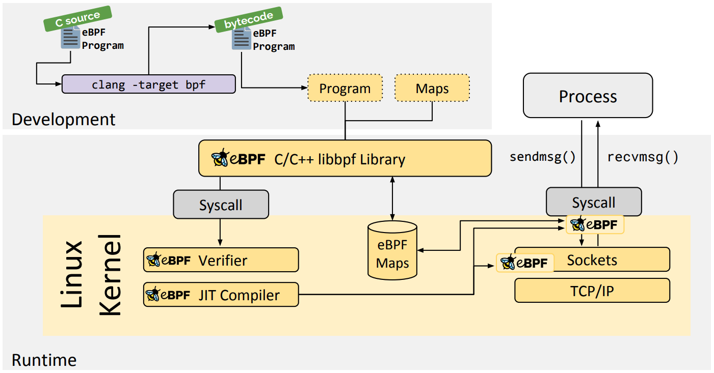

### 一、eBPF 介绍

eBPF 全称是“扩展的伯克利数据包过滤器”（`Extended Berkeley Packet Filter`），是一种数据包过滤技术，是从 BPF 技术扩展而来。BPF 提供了一种在内核事件和用户程序事件发生时安全注入代码的机制，这就让非内核开发人员也可以对内核进行控制。随着内核的发展，BPF 逐步从最初的数据包过滤扩展到了网络、内核、安全、跟踪等，而且它的功能特性还在快速发展中，这种扩展后的 BPF 被简称为 eBPF。

在 eBPF 之前，内核模块是注入内核的最主要机制。由于缺乏对内核模块的安全控制，内核的基本功能很容易被一个有缺陷的内核模块破坏。**而 eBPF 则借助即时编译器（JIT），在内核中运行了一个虚拟机，保证只有被验证安全的 eBPF 指令才会被内核执行**。同时，因为 eBPF 指令依然运行在内核中，无需向用户态复制数据，这就大大提高了事件处理的效率。

正是由于这些突出的特性，eBPF 现如今已经在故障诊断、网络优化、安全控制、性能监控等领域获得大量应用。比如，Facebook 开源的高性能网络负载均衡器 Katran、Isovalent 开源的容器网络方案 Cilium ，以及著名的内核跟踪排错工具 BCC 和 bpftrace 等，都是基于 eBPF 技术实现的。

我们在开发新的 eBPF 程序时，内核社区提供的 libbpf 库（https://github.com/libbpf/libbpf）不仅可以帮我们避免直接调用内核函数，而且还提供了跨内核版本的兼容性（即一次编译到处执行，简称 `CO-RE`）

### 二、eBPF 的工作原理

eBPF 需要事件触发后才会执行，这些事件包括系统调用、内核跟踪点、内核函数和用户态函数的调用退出、网络事件等。借助于强大的内核态插桩和用户态插桩，eBPF 程序几乎可以在内核和应用的任意位置进行插桩。

Linux 内核是如何实现 eBPF 程序的安全和稳定呢？

- 通常我们借助 LLVM 把编写的 eBPF 程序转换为 BPF 字节码，然后再通过 bpf 系统调用提交给内核执行。内核在接受 BPF 字节码之前，会首先通过验证器对字节码进行校验，只有校验通过的 BPF 字节码才会提交到即时编译器执行。
- 如果 BPF 字节码中包含了不安全的操作，验证器会直接拒绝 BPF 程序的执行。比如一些典型的验证过程：只有特权进程才可以执行 bpf 系统调用、BPF 程序不能包含无限循环、BPF 程序不能导致内核崩溃、BPF 程序必须在有限时间内完成

如下是 eBPF 程序执行过程

BPF 程序可以利用 BPF 映射（map）进行存储，而用户程序通常也需要通过 BPF 映射同运行在内核中的 BPF 程序进行交互。比如在性能观测中，BPF 程序收集内核运行状态存储在映射中，用户程序再从映射中读出这些状态。

如上，eBPF 程序的运行需要经历编译、加载、验证和内核态执行等过程，而用户态程序则需要借助 BPF 映射来获取内核态 eBPF 程序的运行状态。

### 三、eBPF 的限制

- eBPF 程序必须被验证器校验通过后才能执行，且不能包含无法到达的指令
- eBPF 程序不能随意调用内核函数，只能调用在 API 中定义的辅助函数
- eBPF 程序栈空间最多只有 512 字节，想要更大的存储，就必须要借助映射存储
- 在内核 5.2 之前，eBPF 字节码最多只支持 4096 条指令，而 5.2 内核把这个限制提高到了 100 万条
- 由于内核的快速变化，在不同版本内核中运行时，需要访问内核数据结构的 eBPF 程序很可能需要调整源码，并重新编译。

虽然 Linux 内核很早就已经支持了 eBPF，但很多新特性都是在 4.x 版本中逐步增加的。所以，想要稳定运行 eBPF 程序，内核版本至少需要 4.9 或者更新。推荐使用 5.x 内核。