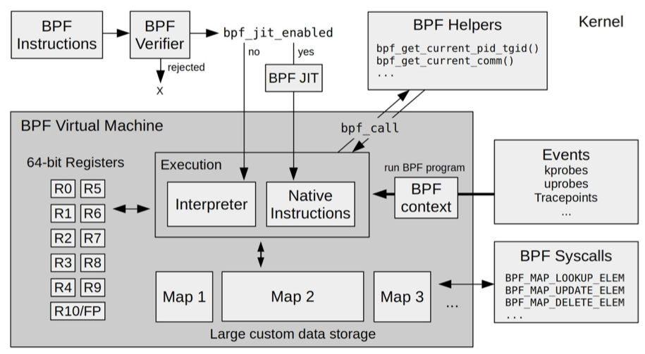
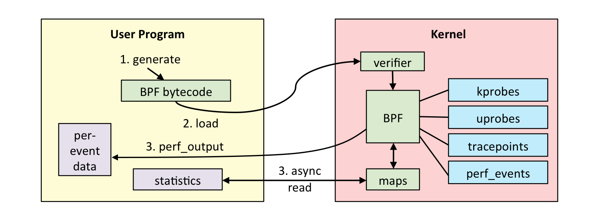
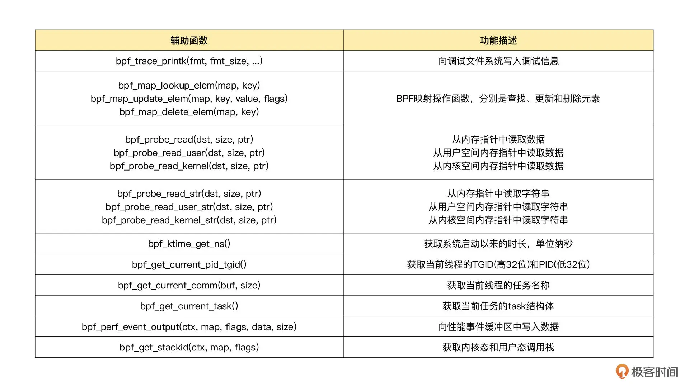
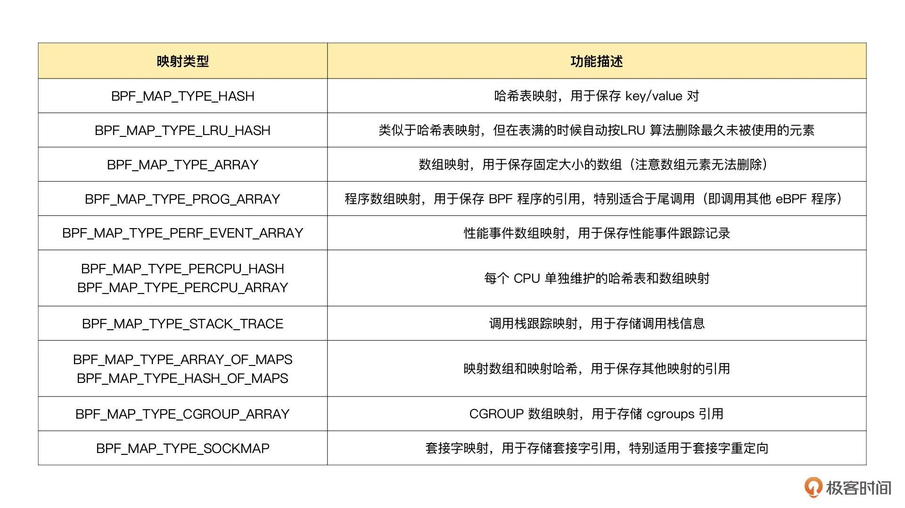
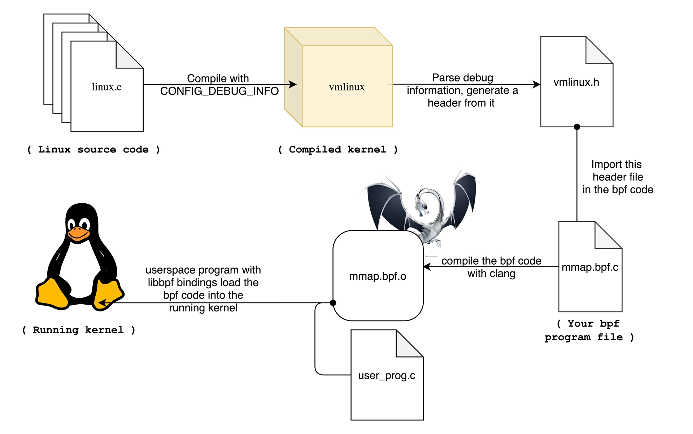

### 一、eBPF 虚拟机如何工作

区别概念

- 系统虚拟化（KVM）基于 x86 或 arm64 等通用指令集，这些指令集可以完成完整计算机的所有功能
- eBPF 只提供有限的指令集。这些指令集可用于完成一部分内核的功能，但却远不足以模拟完整的计算机。为了更高效地与内核进行交互，eBPF 指令还有意采用了 C 调用约定，其提供的辅助函数可以在 C 语言中直接调用，极大地方便了 eBPF 程序的开发。

eBPF 在内核中的运行时主要由 5 个模块组成：



- 第一个模块是  eBPF 辅助函数。它提供了一系列用于 eBPF 程序与内核其他模块进行交互的函数。这些函数并不是任意一个 eBPF 程序都可以调用的，具体可用的函数集由 BPF 程序类型决定。
- 第二个模块是  eBPF 验证器。它用于确保 eBPF 程序的安全。验证器会将待执行的指令创建为一个有向无环图（DAG），确保程序中不包含不可达指令；接着再模拟指令的执行过程，确保不会执行无效指令。
- 第三个模块是由  11 个 64 位寄存器、一个程序计数器和一个 512 字节的栈组成的存储模块。这个模块用于控制 eBPF 程序的执行。其中，R0 寄存器用于存储函数调用和 eBPF 程序的返回值，这意味着函数调用最多只能有一个返回值；R1-R5 寄存器用于函数调用的参数，因此函数调用的参数最多不能超过 5 个；而 R10 则是一个只读寄存器，用于从栈中读取数据。
- 第四个模块是即时编译器，它将 eBPF 字节码编译成本地机器指令，以便更高效地在内核中执行。
- 第五个模块是  BPF 映射（map），它用于提供大块的存储。这些存储可被用户空间程序用来进行访问，进而控制 eBPF 程序的运行状态。

### 二、BPF 系统调用

一个完整的 eBPF 程序通常包含用户态和内核态两部分。其中，用户态负责 eBPF 程序的加载、事件绑定以及 eBPF 程序运行结果的汇总输出；内核态运行在 eBPF 虚拟机中，负责定制和控制系统的运行状态。



对于用户态程序，与内核进行交互时必须要通过系统调用来完成，而对应到 eBPF 程序中，就需要使用 BPF 系统调用：

```
#include <linux/bpf.h>
int bpf(int cmd, union bpf_attr *attr, unsigned int size);
```

- 第一个，cmd ，代表操作命令，比如上一讲中我们看到的 BPF_PROG_LOAD 就是加载 eBPF 程序
- 第二个，attr，代表 bpf_attr 类型的 eBPF 属性指针，不同类型的操作命令需要传入不同的属性参数
- 第三个，size ，代表属性的大小

如下，简单的罗列一下 bpf 的 cmd，用户程序中常用的命令

| BPF 命令                                                     | 功能描述                                                     |
| ------------------------------------------------------------ | ------------------------------------------------------------ |
| BPF_MAP_CREATE                                               | 创建一个 BPF 映射                                            |
| BPF_MAP_LOOKUP_ELEM<br />BPF_MAP_UPDATE_ELEM<br />BPF_MAP_UPDATE_ELEM<br />BPF_MAP_LOOKUP_AND_DELETE_ELEM<br />BPF_MAP_GET_NEXT_KEY | BPF 映射相关的操作命令，包括查找、更新、删除和遍历等         |
| BPF_PROG_LOAD                                                | 验证并加载 BPF 程序                                          |
| BPF_PROG_ATTACH<br />BPF_PROG_DETACH                         | 把 BPF 程序挂载到内核事件上<br />把 BPF 程序从内核事件上卸载 |
| BPF_OBJ_PIN                                                  | 把 BPF 程序或映射挂载到 sysfs 中的 /sys/fs/bpf 目录中<br />常用于保持 BPF 程序在内核中储存 |
| BPF_OBJ_GET                                                  | 从 /sys/fs/bpf 目录中查找 BPF 程序                           |
| BPF_BTF_LOAD                                                 | 验证并加载 BTF 信息                                          |

### 三、BPF 辅助函数

接下来看看内核态的 eBPF 程序。内核定义了一系列的辅助函数，用于 eBPF 程序与内核其他模块进行交互。

可以通过 `bpftool feature probe` 来查询当前系统支持的辅助函数列表。如下是比较常用的



注意，eBPF 内部的内存空间只有寄存器和栈，所以，要访问其他的内核空间或用户空间地址，就需要借助 `bpf_probe_read` 这一系列的辅助函数。这些函数会进行安全性检查，并禁止缺页中断的发生。

而在 eBPF 程序需要大块存储时，就不能像常规的内核代码那样去直接分配内存了，而是必须通过 BPF 映射（BPF Map）来完成。

### 四、BPF 映射

BPF 映射用于提供大块的键值存储，这些存储可被用户空间程序访问，进而获取 eBPF 程序的运行状态。eBPF 程序最多可以访问 64 个不同的 BPF 映射，并且不同的 eBPF 程序也可以通过相同的 BPF 映射来共享它们的状态。

BPF 映射只能通过用户态程序的系统调用来创建，并返回映射的文件描述符。如下：

```
int bpf_create_map(enum bpf_map_type map_type,
       unsigned int key_size,
       unsigned int value_size, unsigned int max_entries) {
  union bpf_attr attr = {
    .map_type = map_type,
    .key_size = key_size,
    .value_size = value_size,
    .max_entries = max_entries
  };
  return bpf(BPF_MAP_CREATE, &attr, sizeof(attr));
}
```

最关键的是设置映射的类型，可以通过 `bpftool feature probe | greo map_type` 来查询当前系统支持哪些映射类型。如下是常用的映射类型及其功能和使用场景。



如果我们的 eBPF 程序使用了 BCC 库，还可以使用预定义的宏来简化 BPF 映射的创建过程。比如，对哈希表映射来说，BCC 定义了 `BPF_HASH(name, key_type=u64, leaf_type=u64, size=10240)` ，于是，我们可以使用如下几种方法来创建一个哈希映射：

```

// 使用默认参数 key_type=u64, leaf_type=u64, size=10240
BPF_HASH(stats);

// 使用自定义key类型，保持默认 leaf_type=u64, size=10240
struct key_t {
  char c[80];
};
BPF_HASH(counts, struct key_t);

// 自定义所有参数
BPF_HASH(cpu_time, uint64_t, uint64_t, 4096);
```

BPF 系统调用中并没有删除映射的命令，因为**BPF映射会在用户态程序关闭文件描述符的时候自动删除**。如果想在程序退出后还保留映射，需要调用 `BPF_OBJ_PIN` 命令，将映射挂载到 `sys/fs/bpf` 中

### 五、BPF 类型格式（BTF）

编译时依赖内核头文件会有很多问题，主要有三个方面：

- 首先，在开发 eBPF 程序时，为了获得内核数据结构的定义，就需要引入一大堆的内核头文件
- 其次，内核头文件的路径和数据结构定义在不同内核版本中很可能不同。因此，你在升级内核版本时，就会遇到找不到头文件和数据结构定义错误的问题
- 最后，在很多生产环境的机器中，出于安全考虑，并不允许安装内核头文件，这时就无法得到内核数据结构的定义。在程序中重定义数据结构虽然可以暂时解决这个问题，但也很容易把使用着错误数据结构的 eBPF 程序带入新版本内核中运行

从内核 5.2 开始，只要开启了 CONFIG_DEBUG_INFO_BTF，在编译内核时，内核数据结构的定义就会自动内嵌在内核二进制文件 vmlinux 中。并且借助如下命令，可以把这些数据结构的定义导出到一个头文件中

```
bpftool btf dump file /sys/kernel/btf/vmlinux format c > vmlinux.h
```

然后在开发 eBPF 程序时只需要引入一个 `vmlinux.h` 即可，不需要再引入一大堆内核头文件了



接下来有个问题，如何让 eBPF 程序在内核升级之后，不需要重新编译就可以直接运行（Compile Once Run Everywhere，简称 CO-RE），借助了 BTF 提供的调试信息，再通过下面的两个步骤，使 eBPF 程序可以适配不同版本的内核：

- 第一，通过对 BPF 代码中的访问偏移量进行重写，解决了不同内核版本中数据结构偏移量不同的问题
- 第二，在 libbpf 中预定义不同内核版本中的数据结构的修改，解决了不同内核中数据结构不兼容的问题