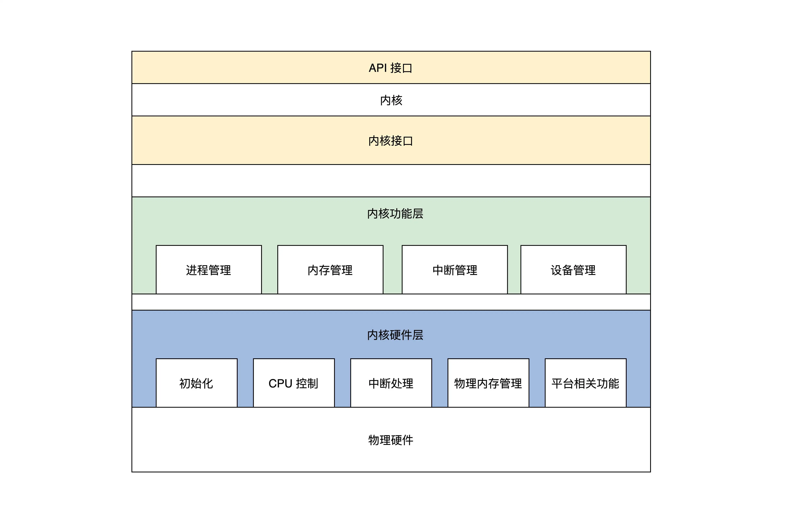

## 内核设计

内核在开发之前需要进行设计，也就是设计架构。

从抽象角度来说，内核是计算机资源的管理者，管理资源是为了让应用使用资源。那么先从计算机的资源看起

### 一、计算机资源

计算机中资源分为硬件资源、软件资源。

- 硬件资源分为：总线、CPU、内存、硬盘、网卡、显卡、各种 IO 设备
- 软件资源则是计算机中的各种形式的数据，比如各种文件、软件程序等

于是我们的内核为了管理这些资源，其内部组成在逻辑上如下：

- 管理 CPU，忧郁 CPU 是执行程序的，而内核把运行时的程序抽象成进程，所以也称为进程管理
- 管理内存，由于程序和数据都要占用内存，内存是非常宝贵的资源，所以内核要提供分配和释放内存的方法
- 管理硬盘，内核把用户数据抽象成文件，即管理文件，文件需要合理组织，方便用户查找和读写，所以形成了文件系统
- 管理网卡，网卡主要完成网络通信，网络通信需要各种通信协议，最后在内核中形成了网络协议栈
- 管理显卡，负责显示信息，现在操作系统都是支持 GUI的，管理显卡就成了内核中的图形系统
- 管理 IO 设备，内核会将抽象成 IO 管理器

计算机硬件厂商很多，不同的组件类别很多，内核想要管理和控制这些硬件还需要对应的驱动程序。硬件厂商根据不同的硬件编写不同的驱动，也会加入到内核中

那么组织这些组件，让系统更加稳定和高效，如下开始步入内核结构

### 二、宏内核结构

宏内核就是把如上管理进程的代码、管理内存的代码、管理 IO 的代码、文件系统的代码等等，经过编译之后，将这些链接到一起，形成一个大的可执行程序。

以一个内存分配功能的过程为例，说明这种内核的问题：

- 应用程序调用内存分配的 API 函数
- 处理器切换到特权模式，开始运行内核代码
- 内核里的内存管理代码按照特定的算法，分配一块内存
- 把分配的内存块的首地址，返回给内存分配的 API 函数
- 内存分配的 API 函数返回，处理开始运行用户模式下的应用程序，应用程序就得到了一块内存的首地址，并且可以使用这块内存

我们可以看出明显的缺点，因为宏内核没有模块化，没有扩展性、没有移植性，高度耦合在一起，一旦其中一个组件有漏洞，内核中所有组件都可能会出现问题。而且开发一个新功能需要重新编译、链接、安装内核。

唯一的优点就是性能好，因为在宏内核中不同组件可以互相调用，性能极高。

### 三、微内核

微内核架构提倡内核功能尽可能少，仅仅只有进程调度、处理中断、内存空间映射、进程间通信等。开发者会把不同的模块做成一个个服务进程。然后定义了进程间通信机制：消息。应用程序要请求相关服务，就向微内核发送一条与此服务相关的消息，微内核再把这条消息转发给相关的服务进程，接着服务进程会完成相关的服务。

显而易见的缺点就是消息的传递，会产生大量的开销，系统性能会大大降低。

优点则是系统结构相当清晰、利用协作开发；系统有良好的移植性，微内核代码量非常少，有相当好的伸缩性、扩展性。可以按照需求增加或减少一个服务进程，以满足系统功能。

我们了解了宏内核、微内核的优缺点，因此我们发现设计时，总需要找到一个平衡点，既要能保证性能、也要保证框架的清晰。

### 四、分层思想

计算机领域一个最基本的方法就是加一个抽象层。**屏蔽底层细节，上层开发更加简单**。

接下来设计我们自己的内核框架，分为三个大层：

- 内核接口层：定义接口，检验参数合法性，然后调用功能层的核心代码
- 内核功能层：完成各种实际功能，比如进程管理、内存管理、中断管理、设备管理等
- 内核硬件层：主要包括一个具体硬件平台相关的代码。包括
  1. 初始化，内核被加载到内存中最先需要运行的代码，比如初始化设备、cpu、内存、中断、内核用于管理的数据结构等
  2. cpu 控制，提供 CPU 模式设定，开、关中断、读写 CPU 寄存器等功能的代码
  3. 中断处理，保存中断时机器的上下文，调用中断回调函数，操作中断控制器
  4. 物理内存管理，提供分配、释放大块内存，内存空间映射，操作MMU、cache 等

如下是架构图

吸取了宏内核的优势，代码高度耦合、性能强劲。吸取了微内核的优点，内核小、出问题的可能性少，扩展性就越强。

### 五、现代的内核

linux 就是宏内核的代表。windwos NT 是混合内核，架构清晰，各组件完全遵循了软件工程的高内聚、低耦合的设计标准。Darwin-XNU 为多内核，包括 Mach 和 BSD，也算是混合内核。

我们需要理性、合理的看待不同的内核实现。仅内核实现上讲，不同的内核实现有不同的出色的地方，不能拿国内那些“优化过”的盗版 windows 说事，大部分 windows 都是可以。不能拿 windows 9.x 说事，那不是 NT 内核。windows 的病毒多，只是表象，黑客愿意去黑 windwos，因为黑windows 带来的收益比黑 linux 的大得多，并且 windows 用户多，而且大部分是小白。linux 宏内核，代码的耦合性很高，所以需要尽量保证代码的正确性来保证系统稳定性。

NT 的图形性能最好，darwin 次之，linux 最差。而且 NT 的性能在某些方面不一定比 linux 差。