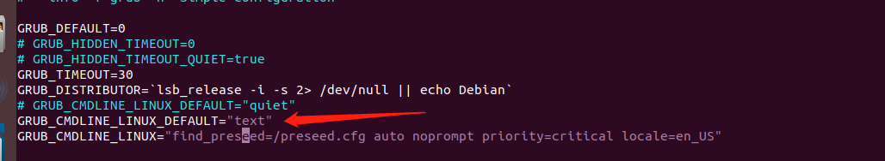
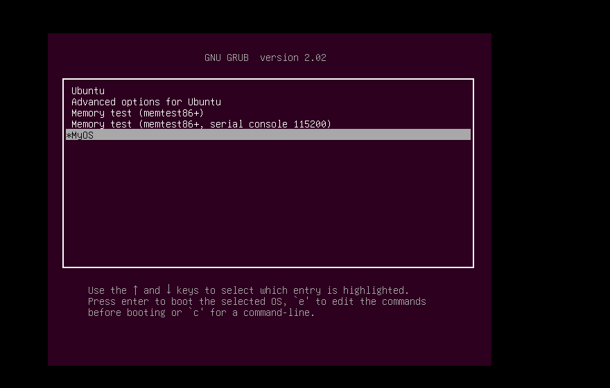
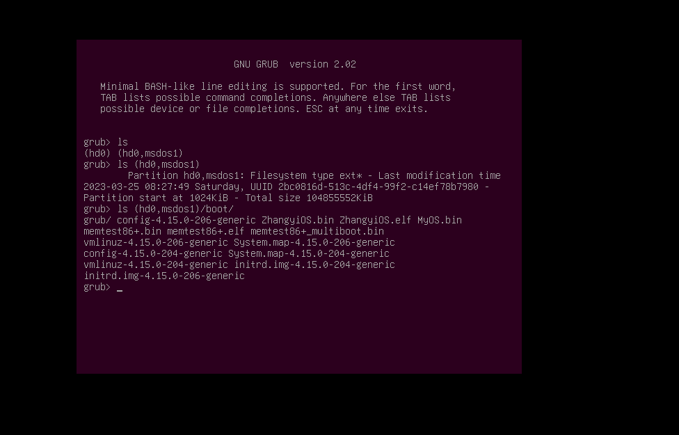

## 实现一个最简单的内核

我的环境，物理机是 Inter x86_86 机器，装的是 window 10 操作系统。使用软件 VMware 虚拟化出来一个 ubuntu 18.04 的虚拟机。然后在此虚拟机上进行实验。

### 一、理论

我们一个操作系统需要在硬件跑起来，也就是进行开机操作，需要进行如下的步骤：

PC 硬件主机加电 -->  PC 机 BIOS 固件 -->  加载可引导设备中的 GRUB  -->  GRUB 引导  -->  加载硬件分区中的 OS 文件  -->  OS

PC 机 BIOS 固件是固化在 PC 机主板上的 ROM 芯片中的，掉电也能保存，PC 机上电的第一条指令就是 BIOS 固件中的，他负责检测和初始化 CPU、内存以及主板平台，然后加载引导设备（大概率是硬件）中的第一个扇区数据，到 0x7c00 地址开始的内存空间，再跳转到 0x7c00 处执行指令，也就是 GRUB 引导程序。

GRUB 引导程序我们暂不深究，如果下载了 ubuntu linux 操作系统，GRUB 就已经存在了。我们先来直接使用。本次我们直接从 OS 这一步入手。

### 二、内核代码

#### 1. MyOS 引导汇编代码

这部分必须使用汇编代码，因为 C 不能直接操作特定的硬件，而且 C 语言的函数调用、函数传参，都需要用栈。栈是一块内存空间，其中数据满足后进先处的特性。所以我们要用汇编代码处理好这些 C 语言的工作环境。

如下是 entry.asm 的代码

```
;如下是定义的 GRUB 的多引导协议头，遵循 GRUB 的多引导协议标准
;其中定义了两个引导头，是为了兼容 GRUB1 和 GRUB2
MBT_HDR_FLAGS EQU 0x00010003
MBT_HDR_MAGIC EQU 0x1BADB002 ;多引导协议头魔数
MBT_HDR2_MAGIC EQU 0xe85250d6 ;第二版多引导协议头魔数
global _start ;导出_start符号
extern main ;导入外部的main函数符号
[section .start.text] ;定义.start.text代码节
[bits 32] ;汇编成32位代码
_start:
jmp _entry
ALIGN 8
mbt_hdr:
dd MBT_HDR_MAGIC
dd MBT_HDR_FLAGS
dd -(MBT_HDR_MAGIC+MBT_HDR_FLAGS)
dd mbt_hdr
dd _start
dd 0
dd 0
dd _entry
;以上是GRUB所需要的头
ALIGN 8
mbt2_hdr:
DD MBT_HDR2_MAGIC
DD 0
DD mbt2_hdr_end - mbt2_hdr
DD -(MBT_HDR2_MAGIC + 0 + (mbt2_hdr_end - mbt2_hdr))
DW 2, 0
DD 24
DD mbt2_hdr
DD _start
DD 0
DD 0
DW 3, 0
DD 12
DD _entry
DD 0
DW 0, 0
DD 8
mbt2_hdr_end:
;以上是GRUB2所需要的头
;包含两个头是为了同时兼容GRUB、GRUB2
ALIGN 8
_entry:
;关中断
cli
;关不可屏蔽中断
in al, 0x70
or al, 0x80
out 0x70,al
;重新加载GDT
lgdt [GDT_PTR]
jmp dword 0x8 :_32bits_mode
_32bits_mode:
;下面初始化C语言可能会用到的寄存器
mov ax, 0x10
mov ds, ax
mov ss, ax
mov es, ax
mov fs, ax
mov gs, ax
xor eax,eax
xor ebx,ebx
xor ecx,ecx
xor edx,edx
xor edi,edi
xor esi,esi
xor ebp,ebp
xor esp,esp
;初始化栈，C语言需要栈才能工作
mov esp,0x9000
;调用C语言函数main
call main
;让CPU停止执行指令
halt_step:
halt
jmp halt_step
GDT_START:
knull_dsc: dq 0
kcode_dsc: dq 0x00cf9e000000ffff
kdata_dsc: dq 0x00cf92000000ffff
k16cd_dsc: dq 0x00009e000000ffff
k16da_dsc: dq 0x000092000000ffff
GDT_END:
GDT_PTR:
GDTLEN dw GDT_END-GDT_START-1
GDTBASE dd GDT_START
```

写好 OS 的引导汇编代码之后，如上我们再第 7 行的汇编代码中调用了 main 函数，并且标明了这个函数是从外部引入的一个符号。于是我们再来实现 main 主函数

#### 2. OS 的主函数

```c
#include "vgastr.h"
void main() {
	printf("Hello OS!");
	return;
}
```

我们主函数比较简单，再屏幕上输出 “Hello OS!”。但是我们不可能去调用 C 库函数 printf ，得需要我们自己实现，可以看到头文件 vagstr.h 就是实现 printf 的

#### 3. 计算机屏幕

我们想要再屏幕上显示字符，就要操作显卡。显卡统一支持 VESA 标准，这个标准下有两种工作模式：字符模式和图形模式。我们来看下显卡的字符模式的工作细节

假如我们的屏幕有 `24*80` 个像素点，我们把屏幕分成 24 行，每行 80 个字符，把这 `24*80` 个位置映射到以 0xb8000 地址开始的内存中，每两个字节对应一个字符，其中一个字节是字符的 ASCII 码，另一个字节是字符的颜色值。这就是显卡的字符模式的工作细节。

在我们写 printf 函数前，补充一个细节，C 语言字符串是以 0 结尾的，其字符编码通常是 utf8，而 utf8 编码对 ASCII 字符是兼容的，即英文字符的 ASCII 编码和 utf8 编码是相等的。

```c
void _strwrite(char* string)
{
  char* p_strdst = (char*)(0xb8000);//指向显存的开始地址
  while (*string)
  {
    *p_strdst = *string++;
    p_strdst += 2;
  }
  return;
}

void printf(char* fmt, ...)
{
  _strwrite(fmt);
  return;
}
```

可以看到，我们依次将字符串的每个字符写入从 0x8000 地址开始的显存中，并且 p_strdst 每次加 2，也就是跳过字符的颜色信息的空间。

至此我们的所有代码写完了。要开始配置环境，并且编译我们的代码了。

所以的代码见：https://github.com/noahyzhang/operate-system/tree/master/MyOS

### 三、环境搭建

如上的代码中，Makefile 我已经在代码库中写好了。在动手编码代码之前，请检查必要的工具。

gcc 编译器，nasm 汇编器，可以使用 `sudo apt install nasm` 安装。

我们将代码 clone 下来，直接 make 即可，会生成 MyOS.bin。这个 MyOS.bin 就是我们的操作系统。

将 MyOS.bin 拷贝到 `/boot/` 目录下

#### 1. 设置 GRUB 引导

我们需要机器在启动的时候进入 GRUB 引导菜单，并选择启动 MyOS。因此我们做如下设置：

```
sudo vim /ets/default/grub
```



- 将 GRUB_CMDLINE_LINUX_DEFAULT 设置为 text
- GRUB_TIMEOUT 选项设定菜单等待时间，默认为 10 秒，设置为 -1 取消倒计时。

然后执行 `sudo update-grub` 来更新 grub 配置。他会生成新的一个 `/boot/grub/grub.cfg` 配置文件

#### 2. 增加 MyOS 启动选项

修改 `/boot/grub/grub.cfg` ，增加 MyOS 启动项

```
menuentry 'MyOS' {
        insmod part_msdos
        insmod ext2
        set root='hd0,msdos1'
        multiboot2 /boot/MyOS.bin
        boot
}
```

- insmod part_msdos：表示 GRUB 加载分区模块识别分区

- insmod ext2：表示 GRUB 加载 ext 文件系统模块识别 ext 文件系统

- 其中 `set root` 属性需要根据实际情况填写，应该填写 `/boot` 目录所在分区，使用 df、mount 命令查看。也可以参考 `/boot/grub/grub.cfg` 文件中其他操作系统的写法。

  如下使用 df 查看 /boot 目录所在分区，其中 sda1 就似乎硬盘的第一个分区，按照 GRUB 的命名方式，`hd0,msdos1` 表示第一块硬盘的第一个分区。

  ```
  /dev/sda1        98G   29G   65G  31% /
  ```

- multiboot2 /boot/MyOS.bin：表示 GRUB 以 multiboot2 协议加载 MyOS.bin

- boot：表示 GRUB 启动 MyOS.bin

此时我们的环境也就配置好啦

### 四、MyOS 运行

我们可以 reboot 重启机器。然后会出现 GRUB 的启动菜单。便可以看到 MyOS 启动项



回车选择 MyOS，看到运行了我们的操作系统


在上一步，GRUB 的启动菜单中，我们也可以执行 c 命令，进行 GRUB 的命令行模式，使用 ls 可以查看硬盘的分区情况。如下：



至此，我们做好了一个很简单的内核，也帮助我们熟悉了操作系统的运行过程。