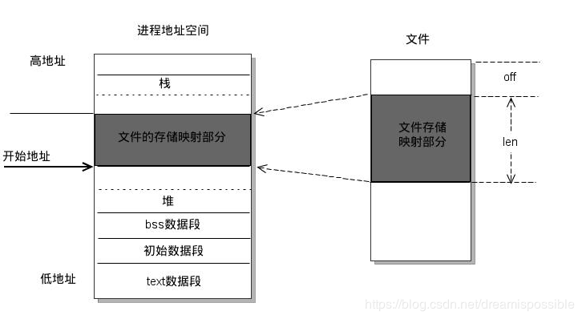
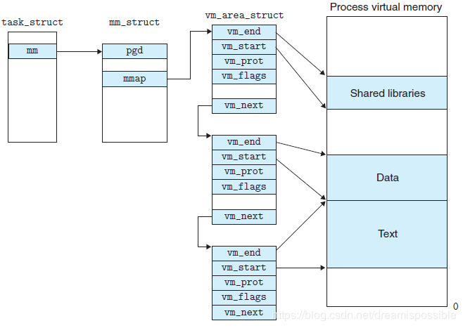
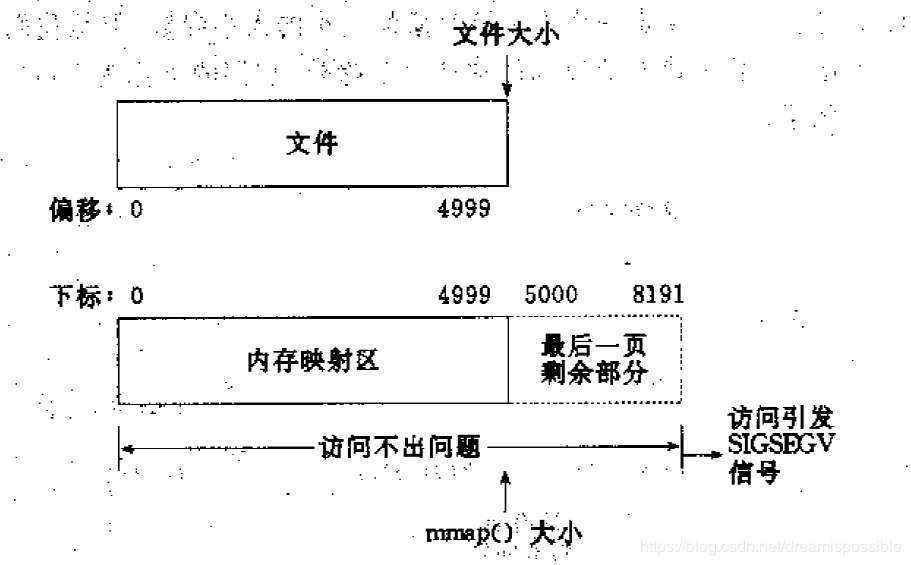
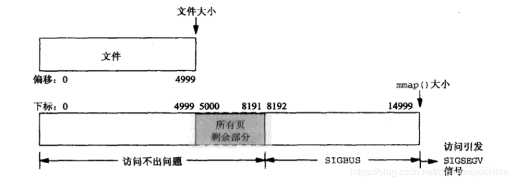

## 一、Linux 内存映射 mmap

 mmap是一种内存映射文件的方法，将一个文件或者其它对象映射到进程的虚拟地址空间，实现文件磁盘地址和进程虚拟地址空间中一段虚拟地址一一对应的关系。实现这样的映射关系后，进程就可以采用指针的方式读写操作这一段内存，而系统会自动回写脏页面到对应的文件磁盘上，即完成了对文件的操作而不必再调用read,write等系统调用函数。相反，内核空间对这段区域的修改也直接反映用户空间，从而可以实现不同进程间的文件共享



如上，进程的虚拟内存地址空间，由多个虚拟内存区域构成。比如 text数据段（代码段）、堆、栈 等都是一个独立的虚拟内存区域。Linux 内核使用 `vm_area_struct` 结构来表示一个独立的虚拟内存区域，各个 `vm_area_struct` 结构体使用链表或者树形结构链接



`vm_area_struct` 结构中包含区域起始和终止地址以及其他相关信息，同时也包含一个 `vm_ops` 指针，其内部可以引出所有针对这个区域可以使用的系统调用函数。进程对某一虚拟内存区域的任何操作需要用到的信息，都可以从 `vm_area_struct` 中获得。mmap 函数就是要创建一个新的 `vm_area_struct` 结构，并将其与文件的物理磁盘地址相连。

## 二、mmap 内存映射原理

#### 1. 进程启动映射过程，并在虚拟地址空间中为映射创建虚拟映射区域

- 进程在用户空间调用库函数 mmap

    ```
    void *mmap(void *start, size_t length, int prot, int flags, int fd, off_t offset);
    ```

- 在当前进程的虚拟地址空间中，寻找一段空闲的满足要求的连续的虚拟地址

- 为此虚拟区分配一个 `vm_area_struct` 结构，接着对这个结构的各个域进行了初始化

- 将新建的虚拟区结构 `vm_area_struct` 插入进程的虚拟地址区域链表或树中

#### 2. 调用内核空间的系统调用函数 mmap，实现文件物理地址和进程虚拟地址的一一映射关系

- 为映射分配了新的虚拟地址区域后，通过待映射的文件指针，在文件描述符表中找到对应的文件描述符，通过文件描述符，链接到内核“已打开文件集”中该文件的文件结构体（struct file），每个文件结构体维护着和这个已打开文件相关的各项信息
- 通过该文件的文件结构体，链接到 `file_operations` 模块，调用内核函数 mmap，其原型为：`int mmap(struct file *filp, struct vm_area_struct *vma)` ，不同于用户空间库函数
- 内核 mmap 函数通过虚拟文件系统 inode 模块定位到文件磁盘物理地址
- 建立页表，即实现了文件地址和虚拟地址区域的映射关系。此时，这片虚拟地址并没有任何数据关联到物理内存中

#### 3. 进程发起对这片映射空间的访问，引起缺页异常，实现文件内容到物理内存的拷贝

- 前两个阶段仅在创建虚拟区间并完成地址映射，但是并没有将任何文件数据拷贝到物理内存，真正的文件读取是当进程发起读或写操作时
- 进程的读或写操作访问虚拟地址空间这一段映射地址，通过查询页表，发现这一段地址并不在物理页面上。因为目前只建立了地址映射，真正的硬盘数据还没有拷贝到内存中，因此引发缺页异常
- 缺页异常进行一系列判断，确定无非法操作后，内核发起请求调页过程
- 调页过程先在交换缓存空间（swap cache）中寻找需要访问的内存页，如果没有则把所缺的页从磁盘装入物理内存中
- 之后进程即可对这片物理内存进行读或者写操作，如果写操作改变了其内容，一定时间后系统会自动回写脏页面到对应磁盘地址，也即完成了写入文件的过程（修改过的脏页面并不会立即更新回文件中，而是有一段时间的延迟，可以调用 msync 函数来强制同步）

## 三、mmap 和常规文件操作的区别和优缺点和场景

### 1. 常规文件操作

常规文件操作（调用 read/fread 等函数），函数调用过程：

- 进程发起读文件请求
- 内核通过查找进程文件描述符表，定位到内核已打开文件集上的文件信息，从而找到此文件的 inode
- inode 在地址空间上找到要请求的文件页是否已经缓存在页缓存中。如果存在，则直接返回这片文件页的内容；如果不存在，则通过 inode 定位到文件磁盘地址，将数据从磁盘复制到页缓存。之后再次发起读页面过程，进而将页缓存中的数据发给用户进程

总结来说，常规文件使用页缓存机制，读文件需要先将文件页从磁盘拷贝到页缓存中，由于页缓存处于内核空间，不能被用户进程直接寻址，所以还需要将页缓存中数据拷贝到内存对应的用户空间中。这样，通过了两次数据拷贝过程，才能完成进程对文件内容的获取任务。写操作也需要将用户空间的数据写入内核空间的 buffer cache 中，再写回磁盘中，也是需要两次数据拷贝

### 2. mmap 操作文件

创建新的虚拟内存区域、建立文件磁盘地址和虚拟内存区域映射 这两步，没有任何文件拷贝操作。而之后访问数据时发现内存中并无数据而发起的缺页异常过程，可以通过已经建立好的映射关系，只使用一次数据拷贝，就从磁盘中将数据传入内存的用户空间中，供进程使用。

mmap 的关键点就是建立了页到用户进程的虚拟地址空间的映射，以读取文件为例，避免了页从内核态拷贝到用户态。因此 mmap 效率高

### 3. mmap 的优点

- 对文件的读取操作跨过了页缓存，减少了数据的拷贝次数，提高了文件读取效率

- 实现了用户空间和内核空间的高效交互方式。两空间的各自修改操作可以直接反映在映射的区域内，从而被对方空间及时捕捉

- 提供进程间共享内存及相互通信的方式。不管是父子进程还是无亲缘关系的进程，都可以将自身用户空间映射到同一个文件或匿名映射到同一片区域。从而通过各自对映射区域的改动，达到进程间通信和进程间共享的目的

    同时，如果进程A和进程B都映射了区域C，当A第一次读取C时通过缺页从磁盘复制文件页到内存中；但当B再读C的相同页面时，虽然也会产生缺页异常，但是不再需要从磁盘中复制文件过来，而可直接使用已经保存在内存中的文件数据。(mmap操作系统管理的一块内存，所有进程地址空间中的mmap段都会映射到这个内存块上，他不是某个进程私有的。)

- 可用于实现高效的大规模数据传输。内存空间不足，是制约大数据操作的一个方面，解决方案往往是借助硬盘空间协助操作，补充内存的不足。但是进一步会造成大量的文件I/O操作，极大影响效率。这个问题可以通过mmap映射很好的解决。换句话说，但凡是需要用磁盘空间代替内存的时候，mmap都可以发挥其功效

- 用户空间和内核空间实际上共用同一份数据，因此在大文件场景下在实际物理内存占用上有优势

### 4. mmap 的缺点

- 由于 mmap 使用必须事先指定好内存映射的大小，因此 mmap 对变长文件不适合
- 如果更新文件的操作很多，mmap 最终还会产生大量的脏页回写，以及由此引发的随机 IO 上。在随机写很多的情况下，mmap 的方式在效率上不一定会比带缓冲区的一般写快
- 读/写小文件（例如 16K 以下的文件），mmap 与通过 read 系统调用相比有着更高的开销与延迟；同时 mmap 的刷盘由系统全权控制，但是在小数据量的情况下由应用本身手动控制更好
- mmap 受限于操作系统内存大小，例如在 32 位的操作系统上，虚拟内存总大小也就 2GB，但是由于 mmap 必须要在内存中找到一块连续的地址块，此时就无法对 4GB 大小的文件完全进行 mmap，在这种场景下可能需要分多块分别进行 mmap，但是此时地址内存已经不在连续，失去了使用 mmap 的意义，而且引入了额外的复杂性

### 5. mmap 的适用场景

- 多个线程以只读的方式同时访问一个文件，因为 mmap 机制下多线程共享了同一物理内存空间，因此节约了内存。案例：多个进程可能依赖于同一个动态链接库，利用 mmap 可以实现内存仅仅加载一份动态链接库，多个进程共享此动态链接库
- mmap 非常适合用于进程间通信，这是因为对同一文件对应的 mmap 分配的物理内存天然多线程共享，并可以依赖于操作系统的同步原语
- mmap 虽然比 sendfile 等机制多了一次 CPU 全程参与的内存拷贝，但是用户空间与内核空间并不需要数据拷贝，因此在正确使用情况下并不比 sendfile 效率差

## 四、mmap 的使用

#### 1. 函数相关

```
void *mmap(void *start, size_t length, int prot, int flags, int fd, off_t offset);
```

成功执行时，mmap 返回被映射区的指针，失败时返回 -1

- start：映射区的开始地址
- length：映射区的长度
- prot：期望的内存保护标志，不能与文件的打开模式冲突
- flags：指定映射对象的类型，映射选项和映射页是否可以共享
- fd：有效的文件描述符
- offset：被映射对象内容的起点

```
int munmap( void * addr, size_t len )
```

此调用在进程地址空间中解除一个映射关系。成功执行时，munmap 返回 0，失败时，返回 -1。当映射关系解除后，对原来映射地址的访问将导致段错误发生。

- addr：调用 munmap 时返回的地址，len 是映射区的大小

```
int msync( void *addr, size_t len, int flags )
```

  一般说来，进程在映射空间的对共享内容的改变并不直接写回到磁盘文件中，往往在调用 munmap（）后才执行该操作。
   可以通过调用msync()实现磁盘上文件内容与共享内存区的内容一致。

#### 2. 注意点

- 使用mmap需要注意的一个关键点是，mmap映射区域大小必须是物理页大小(page_size)的整倍数（32位系统中通常是4k字节）。原因是，内存的最小粒度是页，而进程虚拟地址空间和内存的映射也是以页为单位。为了匹配内存的操作，mmap从磁盘到虚拟地址空间的映射也必须是页
- 内核可以跟踪被内存映射的底层对象（文件）的大小，进程可以合法的访问在当前文件大小以内又在内存映射区以内的那些字节。也就是说，如果文件的大小一直在扩张，只要在映射区域范围内的数据，进程都可以合法得到，这和映射建立时文件的大小无关
- 映射建立之后，即使文件关闭，映射依然存在。因为映射的是磁盘的地址，不是文件本身，和文件描述符无关。同时可用于进程间通信的有效地址空间不完全受限于被映射文件的大小，因为是按页映射

不同的情形

- 一个文件的大小是 5000 字节，mmap 函数从一个文件的起始位置开始，映射 5000 字节到虚拟内存中。
    因为单位物理页面的大小是 4096 字节，虽然被映射的文件有 5000 字节，但是对应到进程虚拟地址区域的大小需要满足整页大小，因此 mmap 函数执行后，实际映射到虚拟内存区域有 8192 个字节（两个物理页），`5000 - 8091` 的字节部分用零填充。

    

    1. 读写前 5000 个字节（`0 - 4999`），会返回操作文件内容
    2. 读 `5000 - 8191` 字节的内容时，结果全为 0；写 `5000 - 8191` 字节时，进程不会报错，但是所写内容不会写入原文件
    3. 读写 8192 以外的磁盘部分，会返回一个 SIGSEGV 错误

- 一个文件的大小是 5000 字节，mmap 函数从一个文件的起始位置开始，映射 15000 字节到虚拟内存中，即映射大小超过了原始文件的大小

    由于文件大小是 5000 字节，则对应两个物理页。那么这两个物理页都是合法可以读写的，只是超过 5000 的部分不会体现在原文件中。由于程序要求映射 15000 字节，因此 `8192 - 15000` 字节都不能读写，操作时会返回异常

    

    1. 进程可以正常读写被映射的前 5000 字节（`0 - 4999`），写操作的改动会在一定时间后反映在原文件中
    2. 对于 `5000 - 8191` 字节，进程可以进行读写过程，不会报错。但是内容在写入前均为 0，另外，写入后不会反映在文件中
    3. 对于 `8192 - 14999` 字节，进程不能对其进行读写，会报 SIGBUS 错误
    4. 对于 15000 以外的字节，进程不能对其进行读写，会引起 SIGSEGV 错误

- 一个文件初始大小为 0，使用 mmap 操作映射了 `1000 * 4K` 字节大小，即 1000 个物理页（大约 4M）空间，mmap 返回指针 ptr 

    如果在映射建立之初，就对文件进行读写操作，由于文件大小为0，并没有合法的物理页对应，会返回 SIGBUS 错误。但是如果，每次操作 ptr 读写前，先增加文件的大小，那么 ptr 在文件大小内部的操作就是合法的。例如，文件扩充 4096 字节，ptr 就能操作 `[ptr, char(ptr) + 4095] ` 的空间。只要文件扩充的范围在 1000 个物理页（映射范围）内，ptr 都可以操作对应的相同的大小


