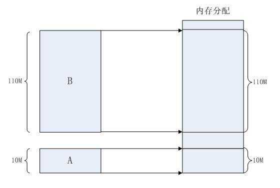
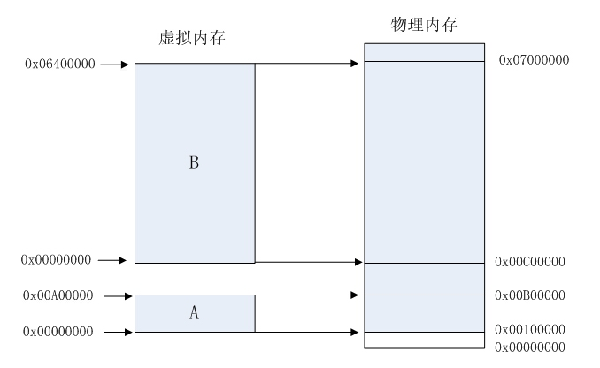

## 内存分配的分段和分页

### 一、早期的内存分配机制

要运行一个程序，会把这些程序全部装入内存，程序直接运行在内存上，也就是说程序中访问的内存地址是实际的物理地址。当计算机同时运行多个程序时，必须保证这些程序用到的内存总量要小于计算机实际物理内存的大小。

这种简单的内存分配策略存在很多问题：

- 问题一，进程地址空间不隔离，由于程序都是直接访问物理内存，所以恶意程序、有 bug 的程序有可能随意修改了别的进程的内存数据。我们希望使用计算机时，一个任务失败，至少不能影响其他的任务
- 问题二，内存使用效率低，比如系统有 100M 的物理空间，存在 A 和 B 程序占用了 90M，在来一个 C 程序需要 30M 的空间。此时系统物理空间不足，只能在已运行的程序中选择一个，并且将该程序的数据暂时拷贝到硬盘上，释放空间来将程序 C 的数据全部装入内存中运行。这个过程中，有大量的数据在装入装出，导致效率十分低下。
- 问题三，程序运行的地址不确定，系统会在物理空间中随机分配一段连续的空间给程序使用，因为是随机分配，所以程序运行的地址不确定

### 二、分段

引入了虚拟地址的概念，只要操作系统处理好虚拟地址到物理地址的映射，就可以保证不同的程序最终访问的内存地址位于不同的区域，彼此没有重叠，就可以达到内存地址空间隔离的效果。

这个映射机制，起初的时候使用 分段 的方法，它的思想是在虚拟地址空间和物理地址空间之间做一一映射。操作系统保证不同进程的地址空间被映射到物理地址空间中不同的区域上，这样每个进程最终访问到的物理地址空间都是彼此分开的。通过这种方式，就实现了进程间的地址隔离。

举个例子，假设有两个进程A和B，进程A所需内存大小为10M，其虚拟地址空间分布在0x00000000到0x00A00000，进程B所需内存为100M，其虚拟地址空间分布为0x00000000到0x06400000。那么按照分段的映射方法，进程A在物理内存上映射区域为0x00100000到0x00B00000，，进程B在物理内存上映射区域为0x00C00000到0x07000000。于是进程A和进程B分别被映射到了不同的内存区间，彼此互不重叠，实现了地址隔离。从应用程序的角度看来，进程A的地址空间就是分布在0x00000000到0x00A00000，在做开发时，开发人员只需访问这段区间上的地址即可。应用程序并不关心进程A究竟被映射到物理内存的那块区域上了，所以程序的运行地址也就是相当于说是确定的了

这种分段的映射方法虽然解决了上述的问题一（进程地址空间不隔离）和问题三（程序运行地址不确定），但是没有解决问题二（内存使用效率低）。在分段的映射方法中，每次换入换出内存的都是整个程序，这样会造成大量的磁盘访问操作，导致效率低下。所以这种映射方法还是稍显粗糙，粒度比较大。实际上，程序的运行有局部性特点，在某个时间段内，程序只是访问程序的一小部分数据，也就是说，程序的大部分数据在一个时间段内都不会被用到。基于这种情况，人们想到了粒度更小的内存分割和映射方法，这种方法就是分页(Paging)

### 三、分页

分页的基本方法是，将地址空间分成许多的页。每页的大小由CPU决定，然后由操作系统选择页的大小。目前Inter系列的CPU支持4KB或4MB的页大小，而PC上目前都选择使用4KB。按这种选择，4GB虚拟地址空间共可以分成1048576个页，512M的物理内存可以分为131072个页。显然虚拟空间的页数要比物理空间的页数多得多。

 在分段的方法中，每次程序运行时总是把程序全部装入内存；而分页的思想是程序运行时用到哪页就为哪页分配内存，没用到的页暂时保留在硬盘上。当用到这些页时再在物理地址空间中为这些页分配内存，然后建立虚拟地址空间中的页和刚分配的物理内存页间的映射

下面通过介绍一个可执行文件的装载过程来说明分页机制的实现方法。一个可执行文件(PE文件)其实就是一些编译链接好的数据和指令的集合，它也会被分成很多页，在PE文件执行的过程中，它往内存中装载的单位就是页。当一个PE文件被执行时，操作系统会先为该程序创建一个4GB的进程虚拟地址空间。前面介绍过，虚拟地址空间只是一个中间层而已，它的功能是利用一种映射机制将虚拟地址空间映射到物理地址空间，所以，创建4GB虚拟地址空间其实并不是要真的创建空间，只是要创建那种映射机制所需要的数据结构而已，这种数据结构就是页目录和页表。

当创建完虚拟地址空间所需要的数据结构后，进程开始读取PE文件的第一页。在PE文件的第一页包含了PE文件头和段表等信息，进程根据文件头和段表等信息，将PE文件中所有的段一一映射到虚拟地址空间中相应的页(PE文件中的段的长度都是页长的整数倍)。这时PE文件的真正指令和数据还没有被装入内存中，操作系统只是根据PE文件的头部等信息建立了PE文件和进程虚拟地址空间中页的映射关系而已。当CPU要访问程序中用到的某个虚拟地址时，当CPU发现该地址并没有相相关联的物理地址时，CPU认为该虚拟地址所在的页面是个空页面，CPU会认为这是个页错误(Page Fault)，CPU也就知道了操作系统还未给该PE页面分配内存，CPU会将控制权交还给操作系统。操作系统于是为该PE页面在物理空间中分配一个页面，然后再将这个物理页面与虚拟空间中的虚拟页面映射起来，然后将控制权再还给进程，进程从刚才发生页错误的位置重新开始执行。由于此时已为PE文件的那个页面分配了内存，所以就不会发生页错误了。随着程序的执行，页错误会不断地产生，操作系统也会为进程分配相应的物理页面来满足进程执行的需求。

分页方法的核心思想就是当可执行文件执行到第x页时，就为第x页分配一个内存页y，然后再将这个内存页添加到进程虚拟地址空间的映射表中,这个映射表就相当于一个y=f(x)函数。应用程序通过这个映射表就可以访问到x页关联的y页了

