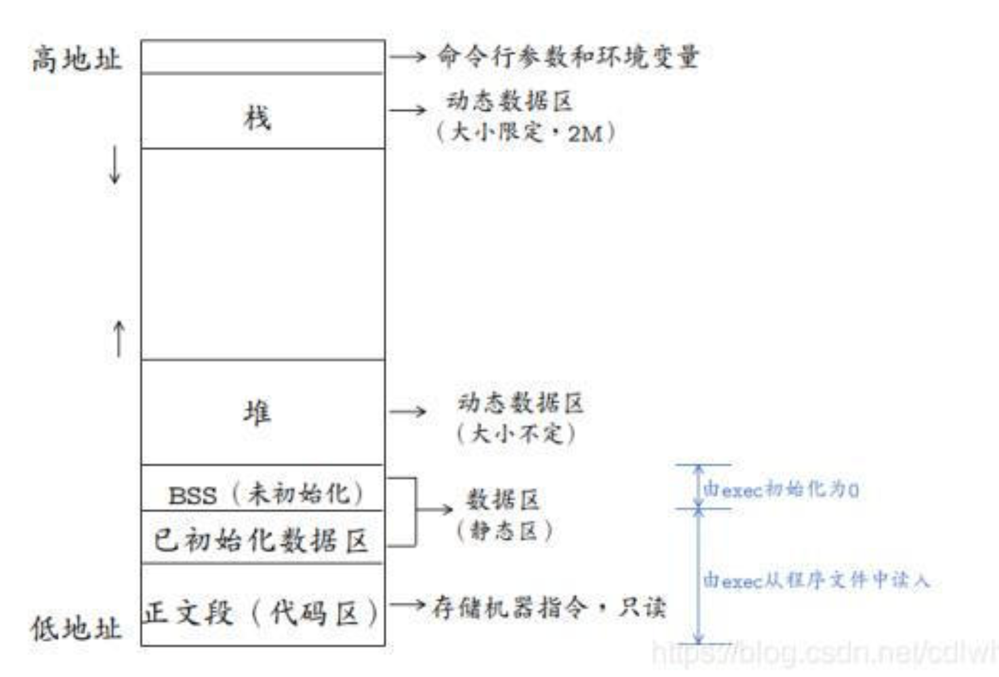
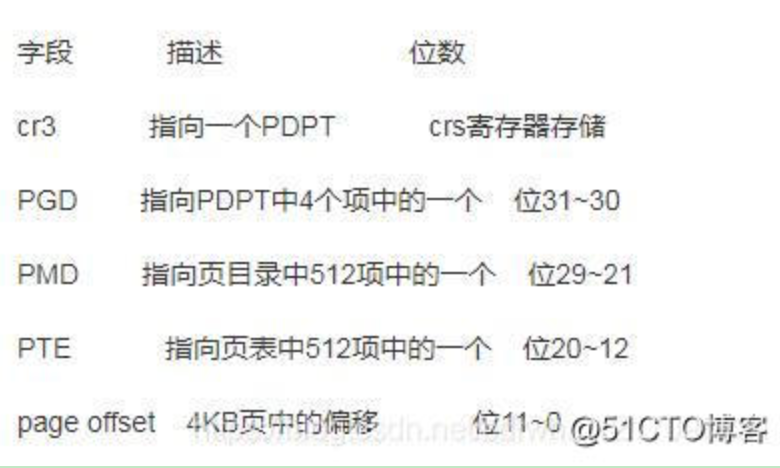
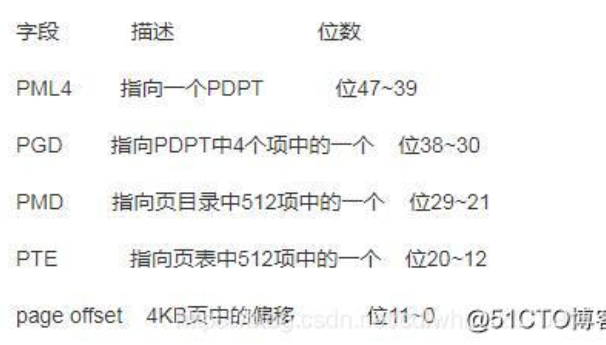

## 一.进程与线程，概念，区别，同步，通信
- 基本概念：
  - 进程是对运行时程序的封装，是系统进行资源调度和分配的的基本单位，实现了操作系统的并发；
  - 线程是进程的子任务，是CPU调度和分派的基本单位，用于保证程序的实时性，实现进程内部的并发；线程是操作系统可识别的最小执行和调度单位。每个线程都独自占用一个虚拟处理器：独自的寄存器组，指令计数器和处理器状态。每个线程完成不同的任务，但是共享同一地址空间（也就是同样的动态内存，映射文件，目标代码等等），打开的文件队列和其他内核资源。
  - 进程私有：地址空间、堆、全局变量、栈、寄存器。 进程共享：代码段，公共数据，进程目录，进程 ID
  - 线程私有：线程栈，寄存器，程序寄存器。线程共享：堆，地址空间，全局变量，静态变量
  
- 区别：
    1. 一个线程只能属于一个进程，而一个进程可以有多个线程，但至少有一个线程。线程依赖于进程而存在。
    2. 进程在执行过程中拥有独立的内存单元，而多个线程共享进程的内存。（资源分配给进程，同一进程的所有线程共享该进程的所有资源。同一进程中的多个线程共享代码段（代码和常量），数据段（全局变量和静态变量），扩展段（堆存储）。但是每个线程拥有自己的栈段，栈段又叫运行时段，用来存放所有局部变量和临时变量）;
    3. 进程是资源分配的最小单位，线程是CPU调度的最小单位；
    4. 系统开销： 由于在创建或撤消进程时，系统都要为之分配或回收资源，如内存空间、I／o设备等。因此，操作系统所付出的开销将显著地大于在创建或撤消线程时的开销。类似地，在进行进程切换时，涉及到整个当前进程CPU环境的保存以及新被调度运行的进程的CPU环境的设置。而线程切换只须保存和设置少量寄存器的内容，并不涉及存储器管理方面的操作。可见，进程切换的开销也远大于线程切换的开销;
    5. 通信：由于同一进程中的多个线程具有相同的地址空间，致使它们之间的同步和通信的实现，也变得比较容易。进程间通信IPC，线程间可以直接读写进程数据段（如全局变量）来进行通信——需要进程同步和互斥手段的辅助，以保证数据的一致性。在有的系统中，线程的切换、同步和通信都无须操作系统内核的干预;
    6. 进程编程调试简单可靠性高，但是创建销毁开销大；线程正相反，开销小，切换速度快，但是编程调试相对复杂。
    7. 进程间不会相互影响 ；线程间相互影响，一个线程挂掉将导致整个进程挂掉
    8. 进程适应于多核、多机分布；线程适用于多核
    9. 多进程模型的优势是CPU，适用于CPU密集型。同时，多进程模型也适用于多机分布式场景中，易于多机扩展
    10. 多线程模型主要优势为线程间切换代价较小，因此适用于I/O密集型的工作场景，因此I/O密集型的工作场景经常会由于I/O阻塞导致频繁的切换线程。同时，多线程模型也适用于单机多核分布式场景。

- 应用场景：
    
    - 多进程应用场景
    
        1. nginx主流的工作模式是多进程模式（也支持多线程模型） 
    
        1. 几乎所有的web server服务器服务都有多进程的，至少有一个守护进程配合一个worker进程，例如apached,httpd等等以d结尾的进程包括init.d本身就是0级总进程，所有你认知的进程都是它的子进程； 
    
        1. **chrome浏览器也是多进程方式**。 （原因：①可能存在一些网页不符合编程规范，容易崩溃，采用多进程一个网页崩溃不会影响其他网页；而采用多线程会。②网页之间互相隔离，保证安全，不必担心某个网页中的恶意代码会取得存放在其他网页中的敏感信息。）
    
        1. redis也可以归类到“多进程单线程”模型（平时工作是单个进程，涉及到耗时操作如持久化或aof重写时会用到多个进程）

    - 多线程应用场景
        - 线程间有数据共享，并且数据是需要修改的（不同任务间需要大量共享数据或频繁通信时）。
        - 提供非均质的服务（有优先级任务处理）事件响应有优先级。
        - 单任务并行计算，在非CPU Bound的场景下提高响应速度，降低时延。 
        - 与人有IO交互的应用，良好的用户体验（键盘鼠标的输入，立刻响应）
        - 案例：桌面软件，响应用户输入的是一个线程，后台程序处理是另外的线程
    - 如何选择
        - 需要频繁创建销毁的优先使用线程（进程的创建和销毁开销过大）
        - 多机分布用进程，多核分布用线程
    
- 进程间通信的方式：进程间通信主要包括管道、系统IPC（包括消息队列、信号量、信号、共享内存等）、以及套接字socket。
    1. 管道：管道主要包括无名管道和命名管道:管道可用于具有亲缘关系的父子进程间的通信，有名管道除了具有管道所具有的功能外，它还允许无亲缘关系进程间的通信
       - 1.1 普通管道PIPE：
        1)它是半双工的（即数据只能在一个方向上流动），具有固定的读端和写端
         2)它只能用于具有亲缘关系的进程之间的通信（也是父子进程或者兄弟进程之间）
         3)它可以看成是一种特殊的文件，对于它的读写也可以使用普通的read、write等函数。但是它不是普通的文件，并不属于其他任何文件系统，并且只存在于内存中。
       - 1.2 命名管道FIFO：
        1)FIFO可以在无关的进程之间交换数据
         2)FIFO有路径名与之相关联，它以一种特殊设备文件形式存在于文件系统中。
    2. 系统IPC（包括消息队列、信号量、信号、共享内存等）：
        - 2.1 消息队列：消息队列，是消息的链接表，存放在内核中。一个消息队列由一个标识符（即队列ID）来标记。 (消息队列克服了信号传递信息少，管道只能承载无格式字节流以及缓冲区大小受限等特点)具有写权限得进程可以按照一定得规则向消息队列中添加新信息；对消息队列有读权限得进程则可以从消息队列中读取信息；
        1)消息队列是面向记录的，其中的消息具有特定的格式以及特定的优先级。
        2)消息队列独立于发送与接收进程。进程终止时，消息队列及其内容并不会被删除。
        3)消息队列可以实现消息的随机查询,消息不一定要以先进先出的次序读取,也可以按消息的类型读取。
        - 2.2 信号量semaphore：信号量（semaphore）与已经介绍过的 IPC 结构不同，它是一个计数器，可以用来控制多个进程对共享资源的访问。信号量用于实现进程间的互斥与同步，而不是用于存储进程间通信数据。
        1)信号量用于进程间同步，若要在进程间传递数据需要结合共享内存。
        2)信号量基于操作系统的 PV 操作，程序对信号量的操作都是原子操作。
        3)每次对信号量的 PV 操作不仅限于对信号量值加 1 或减 1，而且可以加减任意正整数。
        4)支持信号量组。
        - 2.3 信号signal：信号是一种比较复杂的通信方式，用于通知接收进程某个事件已经发生。
        - 2.4 共享内存（Shared Memory）：它使得多个进程可以访问同一块内存空间，不同进程可以及时看到对方进程中对共享内存中数据得更新。这种方式需要依靠某种同步操作，如互斥锁和信号量等
        1)共享内存是最快的一种IPC，因为进程是直接对内存进行存取；
        2)因为多个进程可以同时操作，所以需要进行同步；
        3)信号量+共享内存通常结合在一起使用，信号量用来同步对共享内存的访问。
    3. 套接字SOCKET：socket也是一种进程间通信机制，与其他通信机制不同的是，它可用于不同主机之间的进程通信。

- 线程间通信的方式：
    1. 临界区：通过多线程的串行化来访问公共资源或一段代码，速度快，适合控制数据访问；
    2. 互斥量Synchronized/Lock：采用互斥对象机制，只有拥有互斥对象的线程才有访问公共资源的权限。因为互斥对象只有一个，所以可以保证公共资源不会被多个线程同时访问
    3. 信号量Semphare：为控制具有有限数量的用户资源而设计的，它允许多个线程在同一时刻去访问同一个资源，但一般需要限制同一时刻访问此资源的最大线程数目。
    4. 事件(信号)，Wait/Notify：通过通知操作的方式来保持多线程同步，还可以方便的实现多线程优先级的比较操作。
    5. 屏障：屏障允许每个线程等待，直到所有的合作线程都达到某一点，然后从该点继续执行。

- 有了进程，为什么还要有线程？
    - 线程产生的原因：进程可以使多个程序能并发执行，以提高资源的利用率和系统的吞吐量；但是其具有一些缺点：进程在同一时间只能干一件事、进程在执行的过程中如果阻塞，整个进程就会挂起，即使进程中有些工作不依赖于等待的资源，仍然不会执行。
    - 因此，操作系统引入了比进程粒度更小的线程，作为并发执行的基本单位，从而减少程序在并发执行时所付出的时空开销，提高并发性。和进程相比，线程的优势如下：
        1. 从资源上来讲，线程是一种非常"节俭"的多任务操作方式。在Linux系统下，启动一个新的进程必须分配给它独立的地址空间，建立众多的数据表来维护它的代码段、堆栈段和数据段，这是一种"昂贵"的多任务工作方式。
        2. 从切换效率上来讲，运行于一个进程中的多个线程，它们之间使用相同的地址空间，而且线程间彼此切换所需时间也远远小于进程间切换所需要的时间。据统计，一个进程的开销大约是一个线程开销的30倍左右。
        3. 从通信机制上来讲，线程间方便的通信机制。对不同进程来说，它们具有独立的数据空间，要进行数据的传递只能通过进程间通信的方式进行，这种方式不仅费时，而且很不方便。线程则不然，由于同一进城下的线程之间贡献数据空间，所以一个线程的数据可以直接为其他线程所用，这不仅快捷，而且方便。
        4. 使多CPU系统更加有效。操作系统会保证当线程数不大于CPU数目时，不同的线程运行于不同的CPU上。
        5. 改善程序结构。一个既长又复杂的进程可以考虑分为多个线程，成为几个独立或半独立的运行部分，这样的程序才会利于理解和修改。

## 二. Linux虚拟地址空间

- 虚拟地址空间出现的原因：为了防止不同进程同一时刻在物理内存中运行而对物理内存的争夺和践踏，采用了虚拟内存。
- 虚拟内存技术使得不同进程在运行过程中，它所看到的是自己独自占有了当前系统的4G内存。所有进程共享同一物理内存，每个进程只把自己目前需要的虚拟内存空间映射并存储到物理内存上。 事实上，在每个进程创建加载时，内核只是为进程“创建”了虚拟内存的布局，具体就是初始化进程控制表中内存相关的链表，实际上并不立即就把虚拟内存对应位置的程序数据和代码（比如.text .data段）拷贝到物理内存中，只是建立好虚拟内存和磁盘文件之间的映射就好（叫做存储器映射），等到运行到对应的程序时，才会通过缺页异常，来拷贝数据。还有进程运行过程中，要动态分配内存，比如malloc时，也只是分配了虚拟内存，即为这块虚拟内存对应的页表项做相应设置，当进程真正访问到此数据时，才引发缺页异常。请求分页系统、请求分段系统和请求段页式系统都是针对虚拟内存的，通过请求实现内存与外存的信息置换。
  
- 虚拟内存的好处：
    1. 扩大地址空间；
    2. 内存保护：每个进程运行在各自的虚拟内存地址空间，互相不能干扰对方。虚存还对特定的内存地址提供写保护，可以防止代码或数据被恶意篡改。
    3. 公平内存分配。采用了虚存之后，每个进程都相当于有同样大小的虚存空间。
    4. 当进程通信时，可采用虚存共享的方式实现。
    5. 当不同的进程使用同样的代码时，比如库文件中的代码，物理内存中可以只存储一份这样的代码，不同的进程只需要把自己的虚拟内存映射过去就可以了，节省内存
    6. 虚拟内存很适合在多道程序设计系统中使用，许多程序的片段同时保存在内存中。当一个程序等待它的一部分读入内存时，可以把CPU交给另一个进程使用。在内存中可以保留多个进程，系统并发度提高
    7. 在程序需要分配连续的内存空间的时候，只需要在虚拟内存空间分配连续空间，而不需要实际物理内存的连续空间，可以利用碎片
- 虚拟内存的代价：
    1. 虚存的管理需要建立很多数据结构，这些数据结构要占用额外的内存
    2. 虚拟地址到物理地址的转换，增加了指令的执行时间。
    3. 页面的换入换出需要磁盘I/O，这是很耗时的
    4. 如果一页中只有一部分数据，会浪费内存。

## 三.程序的内存结构

一个程序本质上都是由BSS段、data段、text段三个组成的。可以看到一个可执行程序在存储（没有调入内存）时分为代码段、数据区和未初始化数据区三部分。
- BSS段（未初始化数据区）：通常用来存放程序中未初始化的全局变量和静态变量的一块内存区域。BSS段属于静态分配，程序结束后静态变量资源由系统自动释放。
- 数据段：存放程序中已初始化的全局变量的一块内存区域。数据段也属于静态内存分配
- 代码段：存放程序执行代码的一块内存区域。这部分区域的大小在程序运行前就已经确定，并且内存区域属于只读。在代码段中，也有可能包含一些只读的常数变量
- text段和data段在编译时已经分配了空间，而BSS段并不占用可执行文件的大小，它是由链接器来获取内存的。
- BSS段（未进行初始化的数据）的内容并不存放在磁盘上的程序文件中。其原因是内核在程序开始运行前将它们设置为0。需要存放在程序文件中的只有正文段和初始化数据段。
- data段（已经初始化的数据）则为数据分配空间，数据保存到目标文件中。
- 数据段包含经过初始化的全局变量以及它们的值。BSS段的大小从可执行文件中得到，然后链接器得到这个大小的内存块，紧跟在数据段的后面。当这个内存进入程序的地址空间后全部清零。包含数据段和BSS段的整个区段此时通常称为数据区。
- 可执行程序在运行时又多出两个区域：栈区和堆区
    - 栈区：由编译器自动释放，存放函数的参数值、局部变量等。每当一个函数被调用时，该函数的返回类型和一些调用的信息被存放到栈中。然后这个被调用的函数再为他的自动变量和临时变量在栈上分配空间。每调用一个函数一个新的栈就会被使用。栈区是从高地址位向低地址位增长的，是一块连续的内存区域，最大容量是由系统预先定义好的，申请的栈空间超过这个界限时会提示溢出，用户能从栈中获取的空间较小。
    - 堆区：用于动态分配内存，位于BSS和栈中间的地址区域。由程序员申请分配和释放。堆是从低地址位向高地址位增长，采用链式存储结构。频繁的malloc/free造成内存空间的不连续，产生碎片。当申请堆空间时库函数是按照一定的算法搜索可用的足够大的空间。因此堆的效率比栈要低的多。

## 四.缺页中断、缺页置换算法
- malloc()和mmap()等内存分配函数，在分配时只是建立了进程虚拟地址空间，并没有分配虚拟内存对应的物理内存。当进程访问这些没有建立映射关系的虚拟内存时，处理器自动触发一个缺页异常。
- 缺页中断：在请求分页系统中，可以通过查询页表中的状态位来确定所要访问的页面是否存在于内存中。每当所要访问的页面不在内存时，会产生一次缺页中断，此时操作系统会根据页表中的外存地址在外存中找到所缺的一页，将其调入内存。
- 缺页本身是一种中断，与一般的中断一样，需要经过4个处理步骤：
    1. 保护CPU现场
    2. 分析中断原因
    3. 转入缺页中断处理程序进行处理
    4. 恢复CPU现场，继续执行
- 但是，如果缺页中断是由于所要访问的页面不存在于内存时，由硬件所产生的一种特殊的中断时。因此，与一般的中断存在区别：
    1. 在指令执行期间产生和处理缺页中断信号
    2. 一条指令在执行期间，可能产生多次缺页中断
    3. 缺页中断返回是，执行产生中断的一条指令，而一般的中断返回是，执行下一条指令。

- 常用缺页置换算法如下：
1. 先进先出(FIFO)算法：置换最先调入内存的页面，即置换在内存中驻留时间最久的页面。按照进入内存的先后次序排列成队列，从队尾进入，从队首删除。
2. 最近最少使用（LRU）算法: 置换最近一段时间以来最长时间未访问过的页面。根据程序局部性原理，刚被访问的页面，可能马上又要被访问；而较长时间内没有被访问的页面，可能最近不会被访问。当前最常采用的就是LRU算法。

## 五.fork和vfork的区别
1. fork的基础知识
   - fork:创建一个和当前进程映像一样的进程，可以通过fork( )系统调用
   - 成功调用fork( )会创建一个新的进程，它几乎与调用fork( )的进程一模一样，这两个进程都会继续运行。在子进程中，成功的fork( )调用会返回0。在父进程中fork( )返回子进程的pid。如果出现错误，fork( )返回一个负值。
   - 最常见的fork( )用法是创建一个新的进程，然后使用exec( )载入二进制映像，替换当前进程的映像。这种情况下，派生（fork）了新的进程，而这个子进程会执行一个新的二进制可执行文件的映像。这种“派生加执行”的方式是很常见的。
  
2. vfork的基础知识
- 在实现写时复制之前，Unix的设计者们就一直很关注在fork后立刻执行exec所造成的地址空间的浪费。BSD的开发者们在3.0的BSD系统中引入了vfork( )系统调用。
- 除了子进程必须要立刻执行一次对exec的系统调用，或者调用_exit( )退出，对vfork( )的成功调用所产生的结果和fork( )是一样的。vfork( )会挂起父进程直到子进程终止或者运行了一个新的可执行文件的映像。通过这样的方式，vfork( )避免了地址空间的按页复制。在这个过程中，父进程和子进程共享相同的地址空间和页表项。实际上vfork( )只完成了一件事：复制内部的内核数据结构。因此，子进程也就不能修改地址空间中的任何内存。
- vfork( )是一个历史遗留产物，Linux本不应该实现它。需要注意的是，即使增加了写时复制，vfork( )也要比fork( )快，因为它没有进行页表项的复制。然而，写时复制的出现减少了对于替换fork( )争论。实际上，直到2.2.0内核，vfork( )只是一个封装过的fork( )。因为对vfork( )的需求要小于fork( )，所以vfork( )的这种实现方式是可行的。
- 写时复制：是一种采取了惰性优化方法来避免复制时的系统开销。Linux采用了写时复制的方法，以减少fork时对父进程空间进程整体复制带来的开销。它的前提很简单：如果有多个进程要读取它们自己的那部门资源的副本，那么复制是不必要的。每个进程只要保存一个指向这个资源的指针就可以了。只要没有进程要去修改自己的“副本”，就存在着这样的幻觉：每个进程好像独占那个资源。从而就避免了复制带来的负担。如果一个进程要修改自己的那份资源“副本”，那么就会复制那份资源，并把复制的那份提供给进程。不过其中的复制对进程来说是透明的。这个进程就可以修改复制后的资源了，同时其他的进程仍然共享那份没有修改过的资源。所以这就是名称的由来：在写入时进行复制。
- fork和vfork的区别
    1. fork( )的子进程拷贝父进程的数据段和代码段；vfork( )的子进程与父进程共享数据段
    2. fork( )的父子进程的执行次序不确定；vfork( )保证子进程先运行，在调用exec或exit之前与父进程数据是共享的，在它调用exec或exit之后父进程才可能被调度运行。
    3. vfork( )保证子进程先运行，在它调用exec或exit之后父进程才可能被调度运行。如果在调用这两个函数之前子进程依赖于父进程的进一步动作，则会导致死锁。
    4. 当需要改变共享数据段中变量的值，则拷贝父进程。

## 六. 并发和并行
并发(concurrency)和并行(parallelism)的区别？
- 并发（concurrency）：指宏观上看起来两个程序在同时运行，比如说在单核cpu上的多任务。但是从微观上看两个程序的指令是交织着运行的，你的指令之间穿插着我的指令，我的指令之间穿插着你的，在单个周期内只运行了一个指令。这种并发并不能提高计算机的性能，只能提高效率。
- 并行（parallelism）：指严格物理意义上的同时运行，比如多核cpu，两个程序分别运行在两个核上，两者之间互不影响，单个周期内每个程序都运行了自己的指令，也就是运行了两条指令。这样说来并行的确提高了计算机的效率。所以现在的cpu都是往多核方面发展。

## 七.页表寻址
- 页式内存管理，内存分成固定长度的一个个页片。操作系统为每一个进程维护了一个从虚拟地址到物理地址的映射关系的数据结构，叫页表。页表的内容就是该进程的虚拟地址到物理地址的一个映射。页表中的每一项都记录了这个页的基地址。通过页表，由逻辑地址的高位部分先找到逻辑地址对应的页基地址，再由页基地址偏移一定长度就得到最后的物理地址，偏移的长度由逻辑地址的低位部分决定。一般情况下，这个过程都可以由硬件完成，所以效率还是比较高的。页式内存管理的优点就是比较灵活，内存管理以较小的页为单位，方便内存换入换出和扩充地址空间。
- Linux最初的两级页表机制：两级分页机制将32位的虚拟空间分成三段，低十二位表示页内偏移，高20分成两段分别表示两级页表的偏移。
PGD(Page Global Directory): 最高10位，全局页目录表索引
PTE(Page Table Entry)：中间10位，页表入口索引
- 当在进行地址转换时，结合在CR3寄存器中存放的页目录(page directory, PGD)的这一页的物理地址，再加上从虚拟地址中抽出高10位叫做页目录表项(内核也称这为pgd)的部分作为偏移, 即定位到可以描述该地址的pgd；从该pgd中可以获取可以描述该地址的页表的物理地址，再加上从虚拟地址中抽取中间10位作为偏移, 即定位到可以描述该地址的pte；在这个pte中即可获取该地址对应的页的物理地址, 加上从虚拟地址中抽取的最后12位，即形成该页的页内偏移, 即可最终完成从虚拟地址到物理地址的转换。从上述过程中，可以看出，对虚拟地址的分级解析过程，实际上就是不断深入页表层次，逐渐定位到最终地址的过程，所以这一过程被叫做page talbe walk。
- Linux的三级页表机制：当X86引入物理地址扩展(Pisycal Addrress Extension, PAE)后，可以支持大于4G的物理内存(36位），但虚拟地址依然是32位，原先的页表项不适用，它实际多4 bytes被扩充到8 bytes，这意味着，每一页现在能存放的pte数目从1024变成512了(4k/8)。相应地，页表层级发生了变化，Linus新增加了一个层级，叫做页中间目录(page middle directory, PMD), 变成：

- 现在就同时存在2级页表和3级页表，在代码管理上肯定不方便。巧妙的是，Linux采取了一种抽象方法：所有架构全部使用3级页表: 即PGD -> PMD -> PTE。那只使用2级页表(如非PAE的X86)怎么办？办法是针对使用2级页表的架构，把PMD抽象掉，即虚设一个PMD表项。这样在page table walk过程中，PGD本直接指向PTE的，现在不了，指向一个虚拟的PMD，然后再由PMD指向PTE。这种抽象保持了代码结构的统一。
- Linux的四级页表机制：硬件在发展，3级页表很快又捉襟见肘了，原因是64位CPU出现了, 比如X86_64， 它的硬件是实实在在支持4级页表的。它支持48位的虚拟地址空间1。如下：

- Linux内核针为使用原来的3级列表(PGD->PMD->PTE)，做了折衷。即采用一个唯一的，共享的顶级层次，叫PML4。这个PML4没有编码在地址中，这样就能套用原来的3级列表方案了。不过代价就是，由于只有唯一的PML4, 寻址空间被局限在(239=)512G, 而本来PML4段有9位, 可以支持512个PML4表项的。现在为了使用3级列表方案，只能限制使用一个， 512G的空间很快就又不够用了，解决方案呼之欲出。

## 八. 各种锁、死锁发生的条件以及如何解决死锁
1. 概念：
- 互斥锁：mutex，用于保证在任何时刻，都只能有一个线程访问该对象。当获取锁操作失败时，线程会进入睡眠，等待锁释放时被唤醒
- 读写锁：rwlock，分为读锁和写锁。处于读操作时，可以允许多个线程同时获得读操作。但是同一时刻只能有一个线程可以获得写锁。其它获取写锁失败的线程都会进入睡眠状态，直到写锁释放时被唤醒。 注意：写锁会阻塞其它读写锁。当有一个线程获得写锁在写时，读锁也不能被其它线程获取；写者优先于读者（一旦有写者，则后续读者必须等待，唤醒时优先考虑写者）。适用于读取数据的频率远远大于写数据的频率的场合。
- 自旋锁：spinlock，在任何时刻同样只能有一个线程访问对象。但是当获取锁操作失败时，不会进入睡眠，而是会在原地自旋，直到锁被释放。这样节省了线程从睡眠状态到被唤醒期间的消耗，在加锁时间短暂的环境下会极大的提高效率。但如果加锁时间过长，则会非常浪费CPU资源。
- RCU：即read-copy-update，在修改数据时，首先需要读取数据，然后生成一个副本，对副本进行修改。修改完成后，再将老数据update成新的数据。使用RCU时，读者几乎不需要同步开销，既不需要获得锁，也不使用原子指令，不会导致锁竞争，因此就不用考虑死锁问题了。而对于写者的同步开销较大，它需要复制被修改的数据，还必须使用锁机制同步并行其它写者的修改操作。在有大量读操作，少量写操作的情况下效率非常高。
2. 互斥锁和读写锁区别：
    - 读写锁区分读者和写者，而互斥锁不区分
    - 互斥锁同一时间只允许一个线程访问该对象，无论读写；读写锁同一时间内只允许一个写者，但是允许多个读者同时读对象。

- 死锁：是指两个或两个以上进程在执行过程中，因争夺资源而造成的下相互等待的现象。
- 发生条件：
    1. 互斥条件：进程对所分配到的资源不允许其他进程访问，若其他进程访问该资源，只能等待，直至占有该资源的进程使用完成后释放该资源；
    2. 请求和保持条件：进程获得一定的资源后，又对其他资源发出请求，但是该资源可能被其他进程占有，此时请求阻塞，但该进程不会释放自己已经占有的资源
    3. 不可剥夺条件：进程已获得的资源，在未完成使用之前，不可被剥夺，只能在使用后自己释放
    4. 环路等待条件：进程发生死锁后，必然存在一个进程-资源之间的环形链
- 解决方法：
    1. 资源一次性分配，从而剥夺请求和保持条件
    2. 可剥夺资源：即当进程新的资源未得到满足时，释放已占有的资源，从而破坏不可剥夺的条件
    3. 资源有序分配法：系统给每类资源赋予一个序号，每个进程按编号递增的请求资源，释放则相反，从而破坏环路等待的条件

## 九. 用户态到内核态的转化原理
1. 用户态切换到内核态的3种方式：
   - 系统调用
   - 异常
   - 外围设备的中断
2. 用户态切换到内核态的步骤主要包括：
   - 从当前进程的描述符中提取其内核栈的ss0及esp0信息
   - 使用ss0和esp0指向的内核栈将当前进程的cs,eip，eflags，ss,esp信息保存起来，这个过程也完成了由用户栈找到内核栈的切换过程，同时保存了被暂停执行的程序的下一条指令
   - 将先前由中断向量检索得到的中断处理程序的cs，eip信息装入相应的寄存器，开始执行中断处理程序，这时就转到了内核态的程序执行了

## 十. 微内核与宏内核
1. 宏内核：除了最基本的进程、线程管理、内存管理外，将文件系统，驱动，网络协议等等都集成在内核里面，例如Linux内核。
    - 优点：效率高
    - 缺点：稳定性差，开发过程中的bug经常会导致整个系统挂掉
2. 微内核：内核中只有最基本的调度、内存管理。驱动、文件系统等都是用户态的守护进程去实现的。
    - 优点：稳定，驱动等的错误只会导致相应进程死掉，不会导致整个系统都崩溃
    - 缺点：效率低。典型代表QNX，QNX的文件系统是跑在用户态的进程，称为resmgr的东西，是订阅发布机制，文件系统的错误只会导致这个守护进程挂掉。不过数据吞吐量就比较不乐观了。

## 十一. 正常进程、孤儿进程、僵尸进程
1. 正常进程：正常情况下，子进程是通过父进程创建的，子进程再创建新的进程。子进程的结束和父进程的运行是一个异步过程，即父进程永远无法预测子进程到底什么时候结束。 当一个进程完成它的工作终止之后，它的父进程需要调用wait()或者waitpid()系统调用取得子进程的终止状态。unix提供了一种机制可以保证只要父进程想知道子进程结束时的状态信息， 就可以得到：在每个进程退出的时候，内核释放该进程所有的资源，包括打开的文件，占用的内存等。 但是仍然为其保留一定的信息，直到父进程通过wait / waitpid来取时才释放。保存信息包括：
    - 进程号the process ID
    - 退出状态the termination status of the process
    - 运行时间the amount of CPU time taken by the process等
2. 孤儿进程：一个父进程退出，而它的一个或多个子进程还在运行，那么那些子进程将成为孤儿进程。孤儿进程将被init进程(进程号为1)所收养，并由init进程对它们完成状态收集工作。
3. 僵尸进程：一个进程使用fork创建子进程，如果子进程退出，而父进程并没有调用wait或waitpid获取子进程的状态信息，那么子进程的进程描述符仍然保存在系统中。这种进程称之为僵尸进程。僵尸进程是一个进程必然会经过的过程：这是每个子进程在结束时都要经过的阶段。如果子进程在exit()之后，父进程没有来得及处理，这时用ps命令就能看到子进程的状态是“Z”。如果父进程能及时 处理，可能用ps命令就来不及看到子进程的僵尸状态，但这并不等于子进程不经过僵尸状态。如果父进程在子进程结束之前退出，则子进程将由init接管。init将会以父进程的身份对僵尸状态的子进程进行处理。
    - 危害： 如果进程不调用wait / waitpid的话， 那么保留的那段信息就不会释放，其进程号就会一直被占用，但是系统所能使用的进程号是有限的，如果大量的产生僵死进程，将因为没有可用的进程号而导致系统不能产生新的进程。
    - 解决方法：
    1) 外部消灭：通过kill发送SIGTERM或者SIGKILL信号消灭产生僵尸进程的进程，它产生的僵死进程就变成了孤儿进程，这些孤儿进程会被init进程接管，init进程会wait()这些孤儿进程，释放它们占用的系统进程表中的资源。
    2) 内部解决：子进程退出时向父进程发送SIGCHILD信号，父进程处理SIGCHILD信号。在信号处理函数中调用wait进行处理僵尸进程；fork两次，原理是将子进程成为孤儿进程，从而其的父进程变为init进程，通过init进程可以处理僵尸进程。

## 十二. Linux下怎么得到一个文件的100到200行
sed -n '100,200p' inputfile
awk 'NR>=100&&NR<=200{print}' inputfile
head -200 inputfile|tail -100

