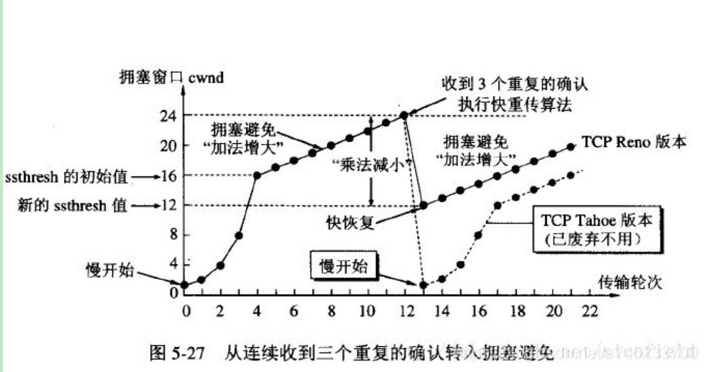

## 计算机网络模型：
TCP/IP 与 OSI 都是为了使网络中的两台计算机能够互相连接并实现通信与回应，但他们最大的不同在于，OSI 是一个理论上的网络通信模型，而 TCP/IP 则是实际上的网络通信标准。

### 一、OSI七层模型：
1. 物理层：实现计算机节点之间比特流的透明传输，规定传输媒体接口的标准，屏蔽掉具体传输介质和物理设备的差异，使数据链路层不必关心网络的具体传输介质，按照物理层规定的标准传输数据就行

2. 数据链路层：通过差错控制、流量控制等方法，使有差错的物理线路变为无差错的数据链路。
    - 数据链路层的几个基本方法：数据封装成桢、透明传输、差错控制、流量控制。
    封装成桢：把网络层数据报加头和尾，封装成帧，帧头中包括源MAC地址和目的MAC地址。
    透明传输：零比特填充、转义字符。
    差错控制：接收者检测错误,如果发现差错，丢弃该帧，差错控制方法有 CRC 循环冗余码
    流量控制：控制发送的传输速度，使得接收方来得及接收。传输层TCP也有流量控制功能，但TCP是端到端的流量控制，链路层是点到点（比如一个路由器到下一个路由器）

3. 网络层：实现网络地址与物理地址的转换，并通过路由选择算法为分组通过通信子网选择最适当的路径
    - 网络层最重要的一个功能就是：路由选择。路由一般包括路由表和路由算法两个方面。每个路由器都必须建立和维护自身的路由表，一种是静态维护，也就是人工设置，适用于小型网络；另一种就是动态维护，是在运行过程中根据网络情况自动地动态维护路由表。

4. 传输层：提供源端与目的端之间提供可靠的透明数据传输，传输层协议为不同主机上运行的进程提供逻辑通信。
    - 网络层协议负责的是提供主机间的逻辑通信；
    - 传输层协议负责的是提供进程间的逻辑通信。

5. 会话层：是用户应用程序和网络之间的接口，负责在网络中的两节点之间建立、维持、终止通信。
6. 表示层：处理用户数据的表示问题，如数据的编码、格式转换、加密和解密、压缩和解压缩。
7. 应用层：为用户的应用进程提供网络通信服务，完成和实现用户请求的各种服务。

### 二、TCP/IP模型
TCP/IP协议模型（Transmission Control Protocol/Internet Protocol），包含了一系列构成互联网基础的网络协议，是Internet的核心协议。TCP/IP协议族按照层次由上到下，层层包装。

上图表示了TCP/IP协议中每个层的作用，而TCP/IP协议通信的过程其实就对应着数据入栈与出栈的过程。入栈的过程，数据发送方每层不断地封装首部与尾部，添加一些传输的信息，确保能传输到目的地。出栈的过程，数据接收方每层不断地拆除首部与尾部，得到最终传输的数据。

## 网络层
实现网络地址与物理地址的转换，并通过路由选择算法为分组通过通信子网选择最适当的路径

1. IP地址与物理地址：
物理地址是数据链路层和物理层使用的地址，IP地址是网络层和以上各层使用的地址，是一种逻辑地址，其中ARP协议将IP地址转换成物理地址。

2. ARP地址解析协议的工作原理：
ARP 是根据 IP 地址获取 MAC 地址的一种协议，核心原理就是广播发送ARP请求，单播发送ARP响应
    （1）每个主机都在自己的ARP缓冲区中建立一个ARP列表，以表示 IP 地址和 MAC 地址之间的对应关系。
    （2）当源主机要发送数据时，先检查ARP列表中是否有该 IP 地址对应的 MAC 地址，如果有，则直接发送数据；如果没有，就向本网段的所有主机发送ARP数据包，用于查询目的主机的MAC地址，该数据包包括的内容有：源主机IP地址，源主机MAC地址，目的主机的IP。
    （3）当本网络的所有主机收到该ARP数据包时，首先检查数据包中的IP地址是否是自己的IP地址，如果不是，则忽略该数据包，如果是，则首先从数据包中取出源主机的IP和MAC地址写入到ARP列表中，如果已经存在，则覆盖，然后将自己的MAC地址写入ARP响应包中，告诉源主机自己是它想要找的MAC地址。
    （4）源主机收到 ARP 响应包后，将目的主机的 IP 和 MAC 地址写入ARP列表，并利用此信息发送数据。如果源主机一直没有收到ARP响应数据包，表示ARP查询失败
3. RARP逆地址解析协议：
RARP是逆地址解析协议，作用是完成硬件地址到IP地址的映射，主要用于无盘工作站，因为给无盘工作站配置的IP地址不能保存。工作流程：在网络中配置一台RARP服务器，里面保存着 MAC 地址和 IP 地址的映射关系，当无盘工作站启动后，就封装一个RARP数据包，里面有其MAC地址，然后广播到网络上去，当服务器收到请求包后，就查找对应的MAC地址的IP地址装入响应报文中发回给请求者。因为需要广播请求报文，因此RARP只能用于具有广播能力的网络。

4. DHCP协议：
动态主机配置协议，对 IP地址进行集中管理和分配，提升地址的使用率，通过DHCP协议，可以使客户机自动获得服务器分配的lP地址和子网掩码

5. ICMP协议：
因特网控制报文协议，用于在IP主机、路由器之间传递控制消息（控制消息是指网络通不通、主机是否可达、路由器是否可用等网络本身的消息），确认 IP 包是否成功到达目标地址。因为 IP 协议并不是一个可靠的协议，它不保证数据被送达，当传送IP数据包发生错误，比如主机不可达、路由不可达等等，ICMP协议将会把错误信息封包，然后传送回给主机，给主机一个处理错误的机会。

ICMP报文有两种：差错报告报文和询问报文。以下是4种常见的ICMP差错报告报文

6. 交换机与路由器的区别：
（1）工作所处的OSI层次不一样，交换机工作在OSI第二层数据链路层，路由器工作在OSI第三层网络层；
（2）寻址方式不同：交换机根据MAC地址寻址，路由器根据IP地址寻址；
（3）转发速不同：交换机的转发速度快，路由器转发速度相对较慢。

7. 路由选择协议：
（1）内部网关协议IGP：
    - RIP(Routing Information Protocol）：是一种动态路由选择协议，基于距离矢量算法，使用“跳数”来衡量到达目标地址的路由距离，并且只与自己相邻的路由器交换信息，范围限制在15跳之内。
    - OSPF：开放最短路径优先协议，使用Dijskra算法计算出到达每一网络的最短路径，并在检测到 链路的情况发生变化时（如链路失效），就执行该算法快速收敛到新的无环路拓扑。
（2）外部网关协议：
    - BGP：边界网关协议，BGP 是力求寻找一条能够到达目的网络 且 较好的路由，而并非要寻找一条最佳路由。BGP采用路径向量路由选择协议。

## 传输层
传输层主要提供不同主机上进程间 逻辑通信 + 可靠传输 或者 不可靠传输的功能。

### 一、TCP 和 UDP：
1. 传输控制协议TCP 和 用户数据报协议UDP的区别？
（1）TCP是面向字节流的，基本传输单位是TCP报文段；UDP是面向报文的，基本传输单位是是用户数据报；
    - 面向字节流：应用程序和TCP的交互是一次一个数据块（大小不等），但TCP把应用程序看成是一连串的无结构的字节流。TCP有一个缓冲，当应用程序传送的数据块太长，TCP就可以把它划分短一些再传送。
    - 面向报文：面向报文的传输方式是应用层交给UDP多长的报文，UDP就照样发送。因此，应用程序必须选择合适大小的报文。
（2）TCP 注重安全可靠性，连接双方在进行通信前，需进行三次握手建立连接。UDP 是无连接的，使用最大努力交付，即不保证可靠交付。
（3）UDP 不需要连接等待，所以数据传输快，而 TCP 传输效率相对较低
（4）TCP首部开销是20个字节；UDP的首部开销是8个字节，这也是减少网络传输开销的一方面
（5）TCP有拥塞控制和流量控制，而UDP没有拥塞控制和流量控制
（6）TCP支持点对点通信，提供全双工通信，不提供广播或多播服务；UDP支持一对一、一对多、多对一、多对多的通信模式。

2. TCP 和 UDP 的适用场景：
（1）当对网络通讯质量要求不高时，并且要求网络通讯速度能尽量的快，这时就可以使用UDP。比如即使通信： 语音、 视频 、直播等
（2）当对网络通讯质量有要求时，要求整个数据准确无误可靠的传递给对方，这时就适用使用 TCP 协议，一般用于文件传输、发送和接收邮件等场景。比如HTTP、HTTPS、FTP等传输文件的协议，POP、SMTP等邮件传输的协议都是使用 TCP 协议

3. TCP对应的协议：
    FTP：文件传输协议，使用21端口
    Telnet：远程终端接入，使用23端口，用户可以以自己的身份远程连接到计算机上，可提供基于DOS模式下的通信服务。
    SMTP：邮件传送协议，用于发送邮件，使用25端口
    POP3：邮件传送协议，P用于接收邮件。使用110端口
    HTTP：万维网超文本传输协议，是从Web服务器传输超文本到本地浏览器的传送协议
4. UDP对应的协议：
    DNS：域名解析服务，将域名地址转换为IP地址，使用53号端口；
    SNMP：网络管理协议，用来管理网络设备，使用161号端口；
    TFTP：简单文件传输协议，提供不复杂、开销不大的文件传输服务，使用 69 端口；
    NFS：远程文件服务器
    RIP：路由信息协议
    DHCP：动态主机配置协议
    IGMP：网际组管理协议

5. TCP的首部字段

（1）源端口和目的端口：分别占16位，指发送方应用程序的端口和目的方应用程序的端口号，通过 IP 地址 + 端口号就可以确定一个进程地址
（2）序号（Sequense Number，SN）：在一个TCP连接中传送的字节流中的每一个字节都按顺序编号，该字段表示本报文段所发送数据的第一个字节的序号。（初始序号称为 Init Sequense Number, ISN）
    例如，一报文段的序号是 101，共有 100 字节的数据。这就表明：本报文段的数据的第一个字节的序号是 101，最后一个字节的序号是 200。显然，下一个报文段的数据序号应当从 201 开始，即下一个报文段的序号字段值应为 201。
（3）确认号 ack：期望收到对方下一个报文段的第一个数据字节的序号。若确认号为 N，则表明：到序号 N-1 为止的所有数据都已正确收到。
（4）头部长度：指出 TCP报文段的数据起始处 距离 TCP报文段的起始处有多远。这个字段实际上是指出TCP报文段的首部长度。
（5）保留位：占6位，应置为 0，保留为今后使用。
（6）6个控制位：用于说明该报文段的性质：
    - 紧急位URG：当 URG = 1 时，表明此报文段中有紧急数据，是高优先级的数据，应尽快发送，不用在缓存中排队。
    确认ACK：仅当 ACK = 1 时确认号字段才有效，当 ACK = 0 时确认号无效。TCP 规定，在连接建立后所有传送的报文段都必须把 ACK 置为 1。
    推送PSH：接收方收到 PSH = 1 的报文段时，就直接发送给应用进程，而不用等到整个缓冲区都填满了后再向上传送。
    复位RST：当 RST = 1 时，表明 TCP 连接中出现了严重错误（如由于主机崩溃或其他原因），必须释放连接，然后再重新建立传输连接。
    同步SYN：SYN = 1 表示这是一个连接请求或连接接受报文。当 SYN = 1 而 ACK = 0 时，表明这是一个连接请求报文段。对方若同意建立连接，则应在响应的报文段中使 SYN = 1 且 ACK = 1。
    终止FIN：用来释放一个连接。当 FIN = 1时，表明此报文段的发送发的数据已发送完毕，并要求释放运输连接。
（7）窗口大小：16位，用于控制发送端的滑动窗口大小
（8）校检和：16位，校验数据段是否未被修改
（9）紧急指针：16位。

6. UDP报头

### 二、TCP连接的建立与断开：
1. 建立连接的三次握手

（1）第一次握手：客户端向服务端发送一个 SYN 报文（SYN = 1），并指明客户端初始化序列号 ISN，即seq = x，表示本报文所发送的第一个字节的序号。此时客户端处于 SYN_Sent 状态，等待服务端确认。
    三次握手的一个重要功能是客户端和服务端交换 ISN，以便让对方知道接下来接收数据时如何按序列号组装数据。
    ISN 是动态生成的，并非固定，因此每个连接都将具有不同的 ISN。如果 ISN 是固定的，攻击者很容易猜出后续的确认号。

（2）第二次握手：服务端收到数据包后，由 SYN = 1 知道客户端请求建立连接，那么就会对这个TCP 连接分配缓存和变量（缓存指的是一个字节流队列），接着返回一个确认报文：设置 SYN = 1，ACK = 1，同时指定自己的初始化序列号 ISN，即图中的 seq = y，并把客户端的 ISN + 1 作为确认号 ack 的值，表示已经收到了客户端发来的的 SYN 报文，希望收到的下一个数据的第一个字节的序号是 x + 1，此时服务端进入SYN_REVD状态。

（3）第三次握手：客户端收到确认后，检查ACK是否为1，ack是否为 x +1，如果正确，则给服务端发送一个 ACK 报文：设置 ACK = 1，把服务端的 ISN + 1 作为 ack 的值，表示已经收到了服务端发来的 SYN 报文，希望收到的下一个数据的第一个字节的序号是 y + 1，并指明此时客户端的序列号 seq = x + 1，此时客户端和服务器端都进入 ESTABLISHED 状态。完成三次握手，随后Client与Server之间可以开始传输数据了。
此时 SYN 控制位变为 0，表示这不是建立连接的请求了，要正式发数据了。

2. 为什么不能用两次握手进行建立连接？ 
（1）三次握手目的是确认双方的接收与发送能力是否正常，同步连接双方的初始化序列号 ISN，为后面的可靠性传输做准备。而两次握手只有服务端对客户端的起始序列号做了确认，但客户端却没有对服务端的初始序列号做确认，不能保证传输的可靠性。
（2）三次握手可以防止已失效的连接请求报文段突然又传送到了服务端，导致服务器错误地建立连接，浪费服务端的连接资源。
    客户端发出的第一个连接请求报文段并没有丢失，而是在某个网络结点长时间的滞留了，以致延误到连接释放以后的某个时间才到达Server。本来这是一个早已失效的报文段，但Server收到此失效的连接请求报文段后：
    - 假设不采用“三次握手”，那么只要Sever发出确认，新的连接就建立了。但由于现在Client并没有发出建立连接的请求，因此不会理睬Server的确认，也不会向Server发送数据。而Server却以为新的连接已经建立，并一直等待Client发来数据，这样，Server的很多资源就白白浪费掉了
    - 而采用“三次握手”协议，只要Server收不到来自Client的确认，就知道Client并没有要求建立请求，就不会建立连接了。

3. 断开连接的四次挥手：

（1）第一次挥手：客户端发送一个 FIN 报文，设置 FIN  = 1 并指定序列号 seq = u（u 是之前传送过来的最后一个字节的序号 + 1），主动关闭 TCP 连接，此时客户端进入FIN_WAIT_1状态；

（2）第二次挥手：服务端收到 FIN 报文后，由FIN=1 知道客户端请求关闭连接，则返回确认报文：设置ACK = 1，ack = u + 1，seq = v（v 的值取决于服务器发送给客户端之前的一个包确认号是多少）
    - 服务端进入CLOSE_WAIT状态，此时TCP连接处于半关闭状态，即客户端不能向服务端发送报文，只能接收，但服务端仍然可以向客户端发送数据。
    - 客户端收到服务端的确认后，进入 FIN_WAIT2 状态，等待服务端发出的连接释放报文段。
（3）第三次挥手：当服务端没有要向客户端发送的数据时，就向客户端发送一个 FIN 报文，设置 FIN = 1 并指定序列号 seq = w（w 的值取决于服务器发送给客户端之前的一个包确认号是多少），用于关闭服务端到客户端的数据传送。此时服务器处于 LAST_ACK 状态

（4）第四次挥手：客户端收到 FIN 报文后，发送给服务端一个 ACK 报文作为应答：设置 ACK=1 和 ack = w +1。发送之后，客户端处于 TIME_WAIT状态，如果服务端接收到这个数据包，则进入CLOSED状态，完成四次挥手。

4. 为什么需要 TIME_WAIT 状态： 
TIME_WAIT 状态持续 2MSL（最大报文存活时间），约4分钟才转换成CLOSE状态。由于TIME_WAIT 的时间会非常长，因此服务端应尽量减少主动关闭连接，TIME_WAIT 的主要作用有：

（1）重发丢失的 ACK 报文，保证连接可靠的关闭：
    由于网络等原因，无法保证最后一次挥手的 ACK 报文一定能传送给对方，如果 ACK 丢失，对方会超时重传 FIN，主动关闭端会再次响应ACK过去；如果没有 TIME_WAIT 状态，直接关闭，对方重传的FIN报文则被响应一个RST报文，此RST会被动关闭端被解析成错误。同时，服务器就因为接收不到客户端的信息而无法正常关闭。

（2）保证本次连接的重复数据段从网络中消失：
    如果存在两个连接，第一个连接正常关闭，第二个相同的连接紧接着建立；如果第一个连接的某些数据仍然滞留在网络中，这些延迟数据在建立新连接之后才到达，则会干扰第二连接，等待 2MSL 可以让上次连接的报文数据消逝在网络中。

5. 为什么需要四次挥手：
TCP 是全双工模式，并且支持半关闭特性，提供了连接的一端在结束发送后还能接收来自另一端数据的能力。任何一方都可以在数据传送结束后发出连接释放的通知，待对方确认后进入半关闭状态。当另一方也没有数据再发送的时候，则发出连接释放通知，对方确认后就完全关闭了 TCP 连接。
通俗的来说，两次握手就可以释放一端到另一端的 TCP 连接，完全释放连接一共需要四次握手。

6. 什么是SYN洪泛：
    SYN 洪泛是指利用 TCP 需要三次握手的特性，攻击者伪造 SYN 报文向服务器发起连接，服务器在收到报文后用 ACK 应答，但之后攻击者不再对该响应进行应答，造成一个半连接。假设攻击者发送大量这样的报文，那么被攻击主机就会造成大量的半连接，耗尽其资源，导致正常的 SYN 请求因为队列满而被丢弃，使得正常用户无法访问。

    半连接队列：服务器第一次收到客户端的 SYN 之后，就会处于 SYN_RCVD 状态，此时双方还没有完全建立其连接，服务器会把这种状态下的请求连接放在一个队列里，我们把这种队列称之为半连接队列。当然还有一个全连接队列，完成三次握手后建立起的连接就会放在全连接队列中。

7. 三次握手过程中是否可以携带数据：
第三次握手时是可以携带数据的，但第一二次握手时不可以携带数据。
（1）假如第一次握手可以携带数据的话，那么会放大 SYN 洪泛。如果有人要恶意攻击服务器，每次都在第一次握手中的 SYN 报文中放入大量的数据，然后疯狂重复发送 SYN 报文的话，就会让服务器开辟大量的缓存来接收这些报文，内存会很容易耗尽，从而拒绝服务。
（2） 第三次握手时客户端已经处于 ESTABLISHED 状态，对于客户端来说，他已经建立起连接了，并且已经知道服务器的接收和发送能力是正常的，所以也就可以携带数据了。

8. TCP的粘包和拆包：
8.1、什么是拆包粘包：
    拆包粘包在数据链路层、网络层以及传输层都可能存在。而在传输层中，由于UDP有消息保护边界，不会发生粘包拆包问题，因此粘包拆包问题只发生在TCP协议中。TCP是个“流”协议，所谓流，就是没有界限的一串数据。TCP底层并不了解上层业务数据的具体含义，它会根据TCP缓冲区的实际情况进行包的划分，所以在业务上认为，一个完整的包可能会被TCP拆分成多个包进行发送，也有可能把多个小的包封装成一个大的数据包发送，这就是所谓的TCP粘包和拆包问题。

8.2、什么情况先会发生拆包粘包：
（1）应用程序 write 写入的数据字节大于套接口发送缓冲区大小，将会发生拆包现象；
（2）应用程序 write 写入的数据字节小于套接字缓冲区大小，网卡将应用多次写入的数据发送到网络上，这将会发生粘包。
（3）进行MSS大小的TCP分段：程序需要发送的数据大小和TCP报文段能发送MSS（Maximum Segment Size，最大报文长度）是不一样的。大于MSS时，就需要把程序数据拆分为多个TCP报文段，称之为拆包；小于时，则要考虑合并多个程序数据为一个TCP报文段，则是粘包；其中 MSS = TCP报文段长度-TCP首部长度。
（4）接收方法不及时读取套接字缓冲区数据，这将发生粘包。

8.3、拆包粘包问题的解决策略：
（1）在数据尾部增加一个特殊字符进行分割，例如 FTP 协议；
（2）将数据大小设置为固定的，如果数据长度不够，则使用空位补全；
（3）将数据分为两部分，消息头和消息体；其中消息头大小固定，且包含一个字段声明内容体的大小

8.4、网络层 - IP数据报分片：
    MTU 是数据链路层中的网络对数据帧的一个限制（以太网中 MTU 为1500个字节），一个 IP 数据报在以太网中传输，如果它的长度大于 MTU 值，就要进行分片传输，使得每片数据报的长度小于 MTU。而分片传输的 IP 数据报不一定按序到达，但 IP 首部中的信息能让这些数据报片按序组装，IP数据报的分片与重组是在网络层进完成的。

    前面提到，MSS 是 TCP 数据包每次能够传输的最大数据分段，TCP 报文段的长度大于 MSS 时，要进行分段传输。TCP 在建立连接时通常会协商双方的 MSS 值（MSS 选项只出现在 SYN 报文段中，即 TCP 三次握手的前两次）。MSS 的值一般为 MTU 值减去两个首部大小（IP 数据包包头的大小 20 Bytes 和 TCP 数据段的包头 20 Bytes），TCP报文段的分段与重组是在传输层完成的。

    如果用链路层以太网，MSS的值往往为1460。而 Internet 上标准的 MTU（最小的 MTU，链路层网络为x2.5时）为576，那么如果不设置，则MSS的默认值就为536个字节。很多时候，MSS的值最好取512的倍数。
    到这里我们就能看出，TCP 分段的原因是 MSS，IP 分片的原因是 MTU，由于一直有 MSS <= MTU，分段后的每一段TCP报文段再加上IP首部后的长度不可能超过MTU，因此也就不需要在网络层进行IP分片了，因此TCP报文段很少会发生IP分片的情况。
    而由于 UDP 数据报不会自己进行分段，因此当长度超过了 MTU 时，会在网络层进行 IP 分片。同样，ICMP（在网络层中）同样会出现IP分片情况。
    所以，总的来说，UDP 不会分段，就由 IP 来分，TCP会分段，当然就不用 IP 来分了！

### 三、TCP可靠性传输：
1. TCP 如何保证可靠性传输：
（1）三次握手
（2）应答机制与超时重传：TCP接收端收到发送端的数据时，它将发送一个确认。当TCP发送端发出一个报文段后，它会启动一个定时器，等待接收端的确认报文段，如果不能及时收到一个确认，将重发这个报文段。
（3）数据包校验与丢弃重复数据：TCP会检测数据在传输过程中的任何变化，若校验出包有错，则丢弃报文段并且不给出响应，这时TCP会超时重发数据；对于重复数据，则进行丢弃；
（4）对失序数据包进行重排序：既然TCP报文段作为IP数据报来传输，而IP数据报的到达可能会失序，因此TCP报文段的到达也可能会失序。TCP将对失序数据进行重新排序，然后才交给应用层；
（5）流量控制：TCP 连接的每一方都有固定大小的缓冲空间。TCP 的接收端只允许另一端发送接收端缓冲区所能接纳的数据，防止较快主机致使较慢主机的缓冲区溢出。TCP使用的流量控制协议是可变大小的滑动窗口协议。
（6）拥塞控制：网络拥塞时，减少数据的发送。

2. TCP的流量控制：
所谓流量控制就是让发送方的发送速率不要太快，让接收方来得及接收。因为如果发送方把数据发送得过快，接收方可能会来不及接收，这就会造成数据的丢失。TCP的流量控制是通过大小可变的滑动窗口来实现的。接收端将自己可以接收的缓冲区大小放入TCP首部中的“窗口大小”字段，通过ACK报文来通知发送端，滑动窗口是接收端用来控制发送端发送数据的大小，从而达到流量控制

其实发送方的窗口上限，是取值拥塞窗口和滑动窗口两者的最小值。当滑动窗口为 0 时，发送方一般不能再发送数据包，但有两种情况除外，一种情况是可以发送紧急数据，例如，允许用户终止在远端机上的运行进程。另一种情况是发送方可以发送一个 1 字节的数据报来通知接收方重新声明它希望接收的下一字节及发送方的滑动窗口大小。

3. TCP的拥塞控制：
拥塞控制就是防止过多的数据注入网络中，使网络中的路由器或链路不致过载。发送方维持一个拥塞窗口cwnd 的状态变量。拥塞窗口的大小动态变化，取决于网络的拥塞程度，发送方让自己的发送窗口等于拥塞窗口。只要网络没有出现拥塞，拥塞窗口就再增大一些，以便把更多的分组发送出去。但只要网络出现拥塞，拥塞窗口就减小一些，以减少注入到网络中的分组数。 拥塞控制的方法主要有以下几种：慢启动、拥塞避免、快重传和快恢复。

（1）慢开始算法：当发送主机开始发送数据时，不要一开始就发送大量的数据，因为不清楚网络的拥塞情况，而是试探一下网络的拥塞情况，由小到大逐渐增大发送窗口。在开始发送报文段时先设置cwnd=1，使得发送方在开始时只发送一个报文段，然后每经过一个传输轮次RTT，拥塞窗口 cwnd 就加倍。另外，为了防止拥塞窗口cwnd增长过大引起网络拥塞，还需要设置一个慢开始门限 ssthresh 状态变量。
    当 cwnd < ssthresh 时，使用上述的慢开始算法。
    当 cwnd = ssthresh 时，既可使用慢开始算法，也可使用拥塞控制避免算法。
    当 cwnd > ssthresh 时，停止使用慢开始算法而改用拥塞避免算法。

（2）拥塞避免算法：让拥塞窗口cwnd缓慢地增大，即每经过一个往返时间RTT就把发送方的拥塞窗口cwnd加1。这样拥塞窗口cwnd按线性规律缓慢增长，比慢开始算法的拥塞窗口增长速率缓慢得多。
    无论在慢开始阶段还是在拥塞避免阶段，只要网络出现拥塞（其根据就是没有收到确认），就要把慢开始门限ssthresh设置为出现拥塞时的拥塞窗口值的一半（但不能小于2）。然后把拥塞窗口cwnd 设置为1，执行慢开始算法。这样做的目的就是要迅速减少主机发送到网络中的数据量，使得发生拥塞的路由器有足够时间把队列中积压的数据处理完毕。过程图如下：

（3）快重传：快重传要求接收方在收到一个失序的报文段后就立即发出重复确认（使发送方及早知道有报文段没有到达对方）而不必等到自己发送数据时捎带确认。发送方只要一连收到三个重复确认就应当立即重传对方尚未收到的报文段，而不必继续等待设置的重传计时器时间到期。

接收方收到了M1和M2后都分别发出了确认。现在假定接收方没有收到M3但接着收到了M4。显然，接收方不能确认M4，因为M4是收到的失序报文段。根据可靠传输原理，接收方可以什么都不做，也可以在适当时机发送一次对M2的确认。但按照快重传算法的规定，接收方应及时发送对M2的重复确认，这样做可以让 发送方及早知道报文段M3没有到达接收方。发送方接着发送了M5和M6。接收方收到这两个报文后，也还要再次发出对M2的重复确认。这样，发送方共收到了 接收方的四个对M2的确认，其中后三个都是重复确认。

（4）快恢复：与快重传配合使用的还有快恢复算法，当发送方连续收到三个重复确认时，就执行“乘法减少”算法，把ssthresh门限设置为拥塞窗口cwnd的一半，但是接下去并不执行慢开始算法，而是将cwnd设置为ssthresh的大小，然后执行拥塞避免算法：因为如果网络出现拥塞的话，就不会收到好几个重复的确认，所以发送方现在认为网络可能没有出现拥塞，所以此时并不执行慢开始算法，而是执行拥塞避免算法。

4. 拥塞控制和流量控制的差别：
（1）相同点：拥塞控制和流量控制的相同点都是控制丢包现象，实现机制都是让发送方发得慢一点。
（2）不同点：
    - 拥塞控制是一个全局性的过程，防止过多的数据注入到网络中，造成网络拥塞
    - 流量控制指点对点通信量的控制，要做的就是控制发送端发送数据的速率，以便使接收端来得及接受。

## 应用层
应用层主要提供应用进程间的网络通信服务，完成用户请求的各种服务。

### 一、http协议：
http协议即超文本传输协议，基于TCP协议，用于从Web服务器传输超文本到本地浏览器的传送协议。http协议是无状态协议，自身不对请求和响应直接的通信状态进行保存，但有些场景下我们需要保存用户的登陆信息，所以引入了cookie 和 session 来管理状态。

1. cookie 和 session 的区别：
（1）保存位置与安全性：cookie保存在客户端，session保存在服务端，所以在安全性上面，cookie存在安全隐患，可以通过拦截或本地文件找到cookie后进行攻击，而session相对更加安全。因此，可以将登陆信息等重要信息存放为session中；其他信息如果需要保留，可以放在cookie中。
（2）存储容量：单个cookie最大只允许4KB，一个站点最多保存20个Cookie；session没有大小限制，个数只跟服务器的内存大小有关。
（3）有效期与实现机制：cookie可长期有效存在；session依赖于cookie，过期时间默认为-1，只需关闭窗口该 session 就会失效。每个客户端对应一个session ，客户端之间的 session  相互独立；

    - cookie：cookie是一小段的文本信息，当客户端请求服务器时，如果服务器需要记录该用户状态，就在响应头中向客户端浏览器颁发一个Cookie，而客户端浏览器会把cookie保存起来。当再次请求该网站时，浏览器把请求的网站连同该cookie一起提交给服务器，服务器会检查该cookie，以此来辨认用户状态。
    - session：当客户端请求服务器时，都会带上cookie，cookie里面一般都会有一个JSESSIONID，服务器就按照 JSESSIONID 来找到对应的 session；如果客户端请求不包含 JSESSIONID，则为此客户端创建session并生成相关联的JSESSIONID，并将这个JSESSIONID在本次响应中返回给客户端保存。客户端保存这个 JSESSIONID 的方式可以使用cookie机制。若浏览器禁用Cookie的话，可以通过 URL重写机制 将JSESSIONID传回服务器。

2. 一个完整的http请求是怎么样？即从输入网址到获得页面的过程：
（1）解析url，获取 url 中包含的域名；
（2）通过DNS系统查询域名对应的IP；
    - DNS服务器大致分为三种类型：根DNS服务器、顶级域DNS服务器 和 权威DNS服务器，其中： 顶级域DNS服务器主要负责诸如com、org、net、edu、gov 等顶级域名。
    - 根DNS服务器存储了所有 顶级域DNS服务器的 IP 地址，可以通过根服务器找到顶级域服务器（例如：www.baidu.com，根服务器会返回所有维护 com 这个顶级域服务器的 IP 地址）。然后你任选其中一个顶级域服务器发送请求，该顶级域服务器拿到域名后能够给出负责当前域的权威服务器地址（以 baidu为例的话，顶级域服务器将返回所有负责 baidu 这个域的权威服务器地址）。接着任选其中一个权威服务器地址查询 「www.baidu.com」 的具体 IP 地址，最终权威服务器会返回给你具体的 IP 地址。此外，本地 DNS 服务器是具有缓存功能的，通常两天内的记录都会被缓存。
    - 所以，通过DNS系统查询域名对应的 IP 的具体步骤可以总结为：
        ① 操作系统先查本地 hosts文件 中是否有记录，如果有，则直接返回相对应映射的IP地址。
        ② 如果本地hosts文件中没有配置，则主机向自己的本地 DNS 服务器 发送查询报文，如果本地DNS服务器缓存中有，将直接返回结果
        ③ 如果本地服务器缓存中没有，则从内置在内部的根服务器列表（全球13台，固定的IP地址）中选一个发送查询报文
        ④ 根服务器解析域名中的后缀名，告诉本地服务器负责该后缀名的所有顶级服务器列表
        ⑤ 本地服务器选择其中一个顶级域服务器发送查询请求，顶级域服务器拿到域名后继续解析，返回对应域的所有权威服务器列表
        ⑥ 本地服务器再向返回的权威服务器发送查询报文，最终会从某一个权威服务器上得到具体的 IP 地址
        ⑦ 主机返回结果IP
（3）浏览器得到域名对应的IP地址之后，向服务器发起三次握手请求建立TCP链接；
（4）TCP链接链接建立起来后，浏览器向服务器发送http请求，如果 html文件在缓存里，浏览器则直接返回， 如果没有，则去后台拿；
    ① 浏览器首次加载资源成功时，服务器返回200，此时浏览器不仅将资源下载下来，而且把response的header(里面的date属性非常重要，用来计算第二次相同资源时当前时间和date的时间差)一并缓存;
    ② 下一次加载资源时，首先要经过强缓存的处理，cache-control的优先级最高，比如cache-control：no-cache,就直接进入到协商缓存的步骤了，如果cache-control：max-age=xxx,就会先比较当前时间和上一次返回200时的时间差，如果没有超过max-age，命中强缓存，不发请求直接从本地缓存读取该文件（这里需要注意，如果没有cache-control，会取expires的值，来对比是否过期），过期的话会进入下一个阶段，协商缓存
    ③ 协商缓存阶段，则向服务器发送header带有If-None-Match和If-Modified-Since的请求，服务器会比较Etag，如果相同，命中协商缓存，返回304；如果不一致则有改动，直接返回新的资源文件带上新的Etag值并返回200;
    ④ 协商缓存第二个重要的字段是，If-Modified-Since，如果客户端发送的If-Modified-Since的值跟服务器端获取的文件最近改动的时间，一致则命中协商缓存，返回304；不一致则返回新的last-modified和文件并返回200;
（5）服务器接收到请求后，根据路径参数映射到特定的处理器进行处理，并将处理结果以及相应的视图返回给浏览器。
（6）浏览器解析视图，并根据请求到的资源、数据进行渲染页面，最终向用户呈现一个完整的页面。
    构建DOM树(DOM tree)：从上到下解析HTML文档生成DOM节点树（DOM tree），也叫内容树（content tree）；
    构建CSSOM(CSS Object Model)树：加载解析样式生成CSSOM树；
    执行JavaScript：加载并执行JavaScript代码（包括内联代码或外联JavaScript文件）；
    构建渲染树(render tree)：根据DOM树和CSSOM树,生成渲染树(render tree)；
    渲染树：按顺序展示在屏幕上的一系列矩形，这些矩形带有字体，颜色和尺寸等视觉属性。
    布局（layout）：根据渲染树将节点树的每一个节点布局在屏幕上的正确位置；
    绘制（painting）：遍历渲染树绘制所有节点，为每一个节点适用对应的样式，这一过程是通过UI后端模块完成；

3. http的长连接和短连接？
http的长连接和短连接本质上是TCP长连接和短连接。从http1.1开始就默认使用长连接。

短链接是指客户端与服务端每进行一次请求操作，就建立一次TCP连接，收到服务器响应后，就断开连接。

长连接是指客户端和服务建立TCP连接后，它们之间的连接会持续存在，不会因为一次HTTP请求后关闭，后续的请求也是用这个连接进行通信，使用长连接的HTTP协议，会在响应头有加入：Connection:keep-alive。长连接可以省去每次TCP建立和关闭的握手和挥手操作，节约时间提高效率。但在长连接下，客户端一般不会主动关闭连接，如果客户端和服务端之间的连接一直不关闭的话，随着连接数越来越多，会对服务端造成压力。

所以长连接多用于频繁请求资源，而且连接数不能太多的情况，例如数据库的连接用长连接。而像Web网站这种并发量大，但是每个用户无需频繁操作的场景，一般都使用短连接，因为长连接对服务端来说会耗费一定的资源。

4. http的断点续传是如何实现的？
HTTP请求头有个Range字段；我们下载文件的时候如果遇到网络中断，如果重头开始下载会浪费时间，所以我们可以从上一次中断处继续开始下载；具体的操作：
Range: bytes=5001-10000
或者指定5001以后的所有数据
Range: bytes=5001-

5. http存在的问题：
    - 通信使用明文不加密，通信内容可能被窃听；
    - 无法验证报文的完整性，数据内容可能被篡改
    - 不验证通信方身份、可能遭到伪装，无法保证数据发送到正确的机器上；

### 二、https协议

- https 是基于tcp协议，在http的基础上加入了SSL/TLS，可看成是添加了加密和认证机制的http，使用对称加密、非对称加密、证书等技术进行进行客户端与服务端的数据加密传输，最终达到保证整个通信的安全性。
- 对称加密指加密和解密都使用同一个密钥的方式，这种方式存在如何安全地将密钥发送对方的问题；非对称加密使用两个密钥，公钥加密则需要私钥解密，私钥加密则需要公钥解密。不能私钥加密，私钥解密。非对称加密不需要发送用来解密的私钥，所以可以保证安全性，但是和对称加密比起来，速度非常的慢，所以我们还是要用对称加密来传送消息，但对称加密所使用的密钥我们可以通过非对称加密的方式发送出去。

1. https的认证加密过程？如何保证内容不会被篡改的？
（1）https是基于tcp协议的，首先客户端会和服务端发起链接建立
（2）服务端返回它的证书给客户端，证书中包含了服务端公钥S.pub、颁发机构和有效期等信息
（3）客户端通过浏览器内置的根证书（内部包含CA机构的公钥C.pub）验证证书的合法性
（4）客户端生成随机的对称加密密钥Z，然后通过服务端的公钥S.pub加密发送给服务端
（5）客户端和服务端之后就通过对称加密密钥Z加密数据来进行http通信

2. 根证书如何保证签发的证书是安全有效的？
（1）服务器会预先生成非对称加密密钥，私钥S.pri自己保留，而公钥S.pub则发送给CA进行签名认证
（2）CA机构也会预先生成非对称加密密钥，其私钥C.pri用来对服务器的公钥S.pub进行签名，生成CA证书
（3）CA机构将签名生成的CA证书返回给服务器，也就是前面服务端给客户端那个证书
（4）因为CA机构比较权威，所以很多浏览器会内置包含它公钥C.pub的证书，称之为根证书，然后可以使用根证书来验证其颁发证书的合法性了

在整个过程中，一共涉及2对公私密钥对，一对由服务器产生，主要用于加密，一对由CA产生，主要用于签名。

3. 为什么需要CA证书认证机构呢？
CA证书是为了确保服务端的公钥是准确无误、没有被修改过的。虽然https是加密的，但是请求还是可以被拦截的，假设没有CA证书，如果服务器返回的包含公钥的包被攻击者截取，然后攻击者也生成一对公私钥，他将自己的公钥发给客户端。攻击者得到客户端数据后进行解密，然后再通过服务器的公钥加密发给服务器，这样数据就被攻击者获取到了。

有了CA证书后，客户端根据内置的CA根证书，很容易识别出攻击者的公钥不合法，或者说攻击者的证书不合法。

证书通常包含这些内容：(1) 服务端的公钥；(2) 证书发行者(CA)对证书的数字签名；(3) 证书所用的签名算法；(4) 证书发布机构、有效期、所有者的信息等其他信息

### 三、http 的请求与响应：
1. http的常见请求方式：
（1）get：向服务端获取资源，所以查询操作一般用get
（2）post：向服务端提交请求字段，创建操作使用 post，该操作不是幂等的，多次执行会导致多条数据被创建
（3）put：修改指定URL的资源，如果资源不存在，则进行创建，修改操作一般使用 put，在http中，put 被定义成幂等的，多次操作会导致前面的数据被覆盖
（4）patch：局部修改URL所在资源的数据，是对put的补充
（5）delete：删除指定URL的资源。
（6）head：获取响应报文的首部，即获得URL资源的头部
（7）options：询问服务器支持哪些方法，响应头中返回 Allow: GET、POST、HEAD
（8）trace：追踪路径，主要用于测试或诊断；在请求头中在Max-Forwards字段设置数字，每经过一个服务器该数字就减一，当到0的时候就直接返回，一般通过该方法检查请求发送出去是否被篡改
2. get和 post 请求的区别：
（1）功能：get一般用来从服务器上面获取资源，post一般用来更新服务器上面的资源。
（2）幂等性：get 是幂等的，post 为非幂等的
（3）安全性：get 请求的参数会明文附加在URL之后，而 post 请求提交的数据则被封装到请求体中，相对更安全。
（4）传输数据量的大小：get请求允许发送的数据量比较小，大多数浏览器都会限制请求的url长度在2048个字节，而大多数服务器最多处理64K大小的url；而post请求提交的数据量则是没有大小限制的。
（5）参数的数据类型：GET只接受ASCII字符，而POST没有限制。
（6）GET在浏览器回退时是无害的，而POST会再次提交请求。
（7）get请求可以被缓存，可以被保留在浏览器的历史记录中；post请求不会被缓存，不会被保留在浏览器的历史记录中。
3. http报文头分析：
（1）报文类型：报文类型分为请求报文和响应报文
    ① 请求报文包含三部分：
    请求行：包含请求方法、URI、HTTP版本信息
    请求首部字段
    请求内容实体
    ② 响应报文包含三部分：
    状态行：包含HTTP版本、状态码、状态码的原因短语
    响应首部字段
    响应内容实体

（2）报文中各部分的简要描述：
    方法(method)：客户端希望服务器对资源执行的动作，是一个单独的词，比如：get 或者 post
    请求URL(request-URL)：请求URL是资源的绝对路径，服务器可以假定自己是URL的主机/端口
    版本(version)：报文所使用的Http版本，其格式：HTTP/<主要版本号>.<次要版本号>
    状态码(status-code)：标识请求过程中所发生的情况
    原因短语(reason-phrase)：数字状态码的可读版本，包含行终止序列之前的所有文本。
    请求头部(header)：可以有零个或多个头部，每个首部都包含一个名字，后面跟着一个冒号(:)，然后是一个可选的空格，接着是一个值，最后是一个CRLF首部是由一个空行(CRLF)结束的，表示了头部列表的结束和实体主体部分的开始
    实体的主体部分(entity-body)：实体的主体部分包含一个由任意数据组成的数据块，并不是所有的报文都包含实体的主体部分，有时，报文只是以一个CRLF结束。

（3）通用头部：既可以出现在请求报文中，也可以出现在响应报文中，它提供了与报文相关的最基本的信息：
    Connection：允许客户端和服务器指定与请求/响应连接有关的选项，http1.1之后默认是 keep-alive
    Date：日期和时间标志，说明报文是什么时间创建的
    Transfer-Encoding：告知接收端为了保证报文的可靠传输，对报文采用了什么编码方式
    Cache-Control：用于随报文传送缓存指示

（4）请求头部：请求头部是只在请求报文中有意义的头部。用于说明是谁或什么在发送请求、请求源自何处，或者客户端的喜好及能力
    Host：给出了接收请求的服务器的主机名和端口号
    Referer：提供了包含当前请求URI的文档的URL
    User-Agent：将发起请求的应用程序名称告知服务器
    Accept：告诉服务器能够发送哪些媒体类型
    Accept-Encoding：告诉服务器能够发送哪些编码方式
    Accept-Language：告诉服务器能够发送哪些语言
    Range：如果服务器支持范围请求，就请求资源的指定范围
    If-Range：允许对文档的某个范围进行条件请求
    Authorization：包含了客户端提供给服务器，以便对其自身进行认证的数据
    Cookie：客户端用它向服务器传送数据

（5）响应头部：响应头部为客户端提供了一些额外信息，比如谁在发送响应、响应者的功能，甚至与响应相关的一些特殊指令
    Age：(从最初创建开始)响应持续时间
    Server：服务器应用程序软件的名称和版本
    Accept-Ranges：对此资源来说，服务器可接受的范围类型
    Set-Cookie：在客户端设置数据，以便服务器对客户端进行标识

（6）实体首部：描述主体的长度和内容，或者资源自身
    Allow：列出了可以对此实体执行的请求方法
    Location：告知客户端实体实际上位于何处，用于将接收端定向到资源的位置(URL)上去
    Content-Base：解析主体中的相对URL时使用的基础URL
    Content-Encoding：对主体执行的任意编码方式
    Content-Language：理解主体时最适宜使用的自然语言
    Content-Length：主体的长度
    Content-Type：这个主体的对象类型
    ETag：与此实体相关的实体标记
    Last-Modified：这个实体最后一次被修改的日期和时间

（7）实体的主体部分：该部分其实就是HTTP要传输的内容，是可选的。HTTP报文可以承载很多类型的数字数据，比如，图片、视频、HTML文档电子邮件、软件应用程序等等。

4. Http 常见的状态码：
（1）1xx：请求处理中，请求已被接受，正在处理。
（2）2xx：请求成功，请求被成功处理。
    200 ：OK，客户端请求成功；
    204（请求处理成功，但是没有资源返回）
（3）3xx：重定向，要完成请求必须进一步处理。
    301：永久性转移，请求的资源已经被分配到了新的地址
    302：暂时重定向
    304：已缓存。
（4）4xx：客户端错误，请求不合法。
    400：客户端请求报文出现错误，通常是参数错误
    401：客户端未认证授权
    403：没有权限访问该资源
    404：未找到请求的资源
    405：不支持该请求方法，如果服务器支持GET，客户端用POST请求就会出现这个错误码
（5）5xx：服务端错误，服务端不能处理合法请求。
    500：服务器内部错误。
    503：服务不可用，一段时间后可能恢复正常。

5. http/1.1和http/2.0的区别：
（1）多路复用，做到同一个连接并发处理多个请求：HTTP2.0 使用了多路复用的技术，做到同一个连接并发处理多个请求，并发请求的数量比HTTP1.1大了好几个数量级。
（2）支持首部压缩：HTTP2.0使用HPACK算法对header的数据进行压缩，这样数据体积小了，在网络上传输就会更快。
（3）服务器推送：当向支持HTTP2.0的web服务器请求时，服务器会顺便把客户端需要的资源一起推送到客户端，避免客户端再次创建连接发送请求到服务器端获取，这种方式非常合适加载静态资源。
（4）http2.0采用二进制而不是文本格式

6. http 和 https 的区别：
（1）http 和 https 都是基于 TCP 协议，但是 http 是使用明文传输，通讯内容可能被窃听和篡改，客户端也无法验证通讯方的身份，无法保证数据发送到正确的机器上；https 是在 http 的基础上加入了 SSL/TLS，可看成是添加了加密和认证机制的http，使用对称加密、非对称加密、证书等技术进行进行客户端与服务端的数据加密传输，最终达到保证整个通信的安全性。
（2）端口不同：http 使用的是80端口，https 使用的443端口
（3）资源消耗：和 http 通信相比，https通信会由于加解密处理消耗更多的CPU和内存资源

### 四、应用层其他相关的协议： 
（1）DNS域名系统：用于域名解析服务，将域名地址转换为IP地址，基于UDP服务，使用53端口。
    DNS底层既使用TCP又使用UDP协议：
    ① 域名解析时使用UDP协议：客户端向DNS服务器查询域名，一般返回的内容都不超过512字节，用UDP传输即可，不用经过TCP三次握手，这样DNS服务器负载更低，响应更快。
    ② 区域传送时使用TCP，主要有一下两点考虑：
    - 辅域名服务器会定时（一般时3小时）向主域名服务器进行查询以便了解数据是否有变动。如有变动，则会执行一次区域传送，进行数据同步。区域传送将使用TCP而不是UDP，因为数据同步传送的数据量比一个请求和应答的数据量要多得多。
    - TCP是一种可靠的连接，保证了数据的准确性。
（2）FTP：定义了文件传输协议，使用21端口。上传下载文件，都要用到FTP服务。
（3）Telnet：远程终端协议，它是一种用于远程登陆的端口，用户可以以自己的身份远程连接到计算机上，提供一种基于DOS模式下的通信服务。
（4）SMTP：定义了简单邮件传送协议，用于发送邮件，使用25号端口。
（5）POP3：与SMTP对应，POP3用于接收邮件。使用110端口。
（6）SNMP：简单网络管理协议，使用161号端口，是用来管理网络设备的。
（7）TFTP(Trival File Transfer Protocal)：简单文件传输协议，该协议在69端口上使用UDP服务。

