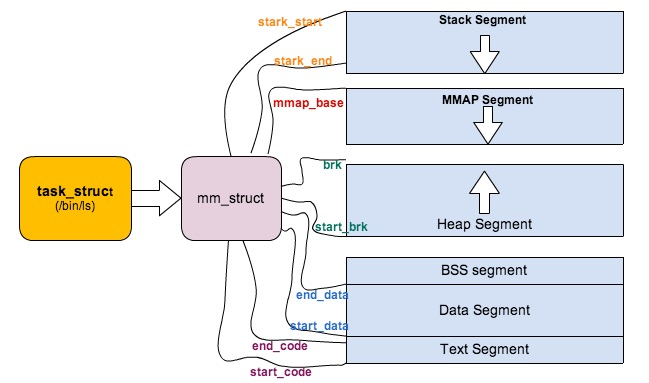

## Linux 中的各种栈：进程栈、线程栈、内核栈、中断栈

### 一、概述

栈是一种 后入先出 的数据结构，栈的作用主要体现在：函数调用和多任务支持

#### 1. 栈的作用 -- 函数调用

函数调用有三个基本过程：调用参数的传入、局部变量的空间管理、函数返回

函数的调用要保证高效，因此数据可以放在 **CPU通用寄存器**或者 **RAM 内存**中。以传递调用参数为例，可以选择使用 CPU 通用寄存器来存放参数，但是通用寄存器的数目都是有限的，当出现函数嵌套调用时，子函数再次使用原有的通用寄存器必然会导致冲突。因此如果想用它来传递参数，那在调用子函数前，就必须先 **保存原有寄存器的值**，然后当子函数退出的时候再 **恢复原有寄存器的值** 。

函数的调用参数数目一般都相对少，因此通用寄存器是可以满足一定需求的。但是局部变量的数目和占用空间都是比较大的，依赖有限的通用寄存器是不行的，因此我们可以采用某些 RAM 内存区域来存储局部变量。需要在函数嵌套调用时不能发生冲突，又要注意效率。那么栈无疑是很好的解决办法，如下原因：

- 对于通用寄存器传参的冲突，我们可以再调用子函数前，将通用寄存器临时压入栈中；在子函数调用完毕后，在将已保存的寄存器再弹出恢复回来
- 而局部变量的空间申请，也只需要向下移动下栈顶指针；将栈顶指针向回移动，即可就可完成局部变量的空间释放
- 对于函数的返回，也只需要在调用子函数前，将返回地址压入栈中，待子函数调用结束后，将函数返回地址弹出给 PC 指针（程序计数器/指令寄存器），即完成了函数调用的返回

#### 2. 栈的作用 -- 多任务支持

在多任务模式下，当调度程序认为有必要进行任务切换时，只需要保持任务在栈上的信息等。恢复另一个任务的状态，然后跳转到上次运行的位置，就可以恢复运行。

那么每个任务（线程）都有自己的栈空间

### 二、Linux 中的栈？各种栈的内存位置

#### 1. 进程栈

进程栈属于用户态栈，进程的虚拟地址空间中的 栈 区就是进程栈。进程栈的初始化大小是由编译器和链接器计算出来的，但是栈的实时大小并不是固定的，Linux 内核会根据入栈情况对栈区进行动态增长（其实也就是添加新的页表）。但是并不是说栈区可以无限增长，它也有最大限制 RLIMIT_STACK (一般为 8M)，我们可以通过 ulimit 来查看或更改 RLIMIT_STACK 的值。

进程在运行过程中，通过不断向栈区压入数据，当超过栈区容量时，就会耗尽栈所对应的内存区域，这将出发一个缺页异常（Page Fault）。通过异常陷入内核态后，异常会被内核的 `expand_stack()` 函数处理，进而调用 `acct_stack_growth()` 来检查是否还可以继续增长。如果小于 `RLIMIT_STACK`（通常是 8M），那么可以继续增长；如果达到了栈空间的最大值，就会发生 栈溢出（`Stack overflow`），进程将会收到内核发出的 段错误（`segmentation fault`）信号。

#### 2. 线程栈

Linux 中把线程和进程不加区分的统一到 `task_struct` 中，线程仅仅被视为一个与其他进程共享某些资源的进程，而是否共享地址空间几乎是 Linux 中进程与线程的唯一区别了。线程创建的时候，加上了 `CLONE_VM` 标记。

对于 Linux 进程或者主线程，它的栈是在 fork 的时候生成，实际上就是复制父进程的栈空间地址，然后写时拷贝（COW）以及动态增长。然后对于线程来说，当主线程生成子线程时，它的栈是事先固定下来的，使用 mmap 系统调用。也就是说，线程栈不能动态增长，会存储在进程虚拟内存地址空间的 共享区（mmap 出来的一块区域），原则上是线程私有的，但是同一个进程的所有线程生成的时候会浅拷贝 `task_struct` 的很多字段，其中就包括所有线程的部分信息，如果愿意，其他线程也还是可以访问到的。

#### 3. 进程内核栈

在每一个进程的生命周期中，必然会通过到系统调用陷入内核。在执行系统调用陷入内核之后，这些内核代码所使用的栈并不是原先进程用户空间中的栈，而是一个单独内核空间的栈，这个称作进程内核栈。进程内核栈在进程创建的时候，通过 slab 分配器从 `thread_info_cache` 缓存池中分配出来，其大小为 `THREAD_SIZE`，一般来说是一个页大小 4K

由于内核经常要访问 `task_struct`，高效获取当前进程的描述符是一件非常重要的事情。因此内核将进程内核栈的头部一段空间，用于存放 `thread_info` 结构体，而此结构体中则记录了对应进程的描述符。

#### 4. 中断栈

当系统收到中断事件后，进行中断处理的时候，也需要中断栈来支持函数调用。由于系统中断的时候，系统当然是处于内核态的，所以中断栈是可以和内核栈共享的。但是具体是否共享，这和具体处理器架构密切相关。

X86 上中断栈就是独立于内核栈的，如果是多处理器系统，那么每个处理器都会有一个独立的中断栈。一般来说会分配 2 个物理页面，也就是 8KB 大小的空间。而且还会区分软中断和硬中断，也就是说，软硬中断有各自不同的中断栈。

ARM 上中断栈和内核栈则是共享的，中断栈和内核栈共享有一个负面因素，如果中断发生嵌套，可能会造成栈溢出，从而可能会破坏到内核栈的一些重要数据，所以栈空间有时候难免会捉襟见肘

### 三、Linux 为什么要区分这些栈

1. 为什么需要单独的进程内核栈

所有进程运行的时候，都可能通过系统调用陷入内核态继续执行。假设第一个进程 A 陷入内核态执行的时候，需要等待读取网卡的数据，主动让出 CPU；此时调度器唤醒了另一个进程 B，碰巧进程 B 也需要系统调用进入内核态。那问题就来了，如果内核栈只有一个，那进程 B 进入内核态的时候产生的压栈操作，必然会破坏掉进程 A 已有的内核栈数据；一但进程 A 的内核栈数据被破坏，很可能导致进程 A 的内核态无法正确返回到对应的用户态了

2. 为什么需要单独的线程栈

线程是内核调度的基本单元。如果同一进程下的多个线程共享进程栈的话，必然会出现不同线程之间的栈数据破坏

3. 进程和线程是否共享一个内核栈

不共享，线程和进程创建的时候，都会调用 `dup_task_struct` 来创建 task 相关结构体，而内核栈也是在此函数中创建出来的。因此虽然线程和进程共享一个地址空间，但是并不共享一个内核栈

4. 为什么需要单独中断栈

问题不对，ARM 架构就没有独立的中断栈

