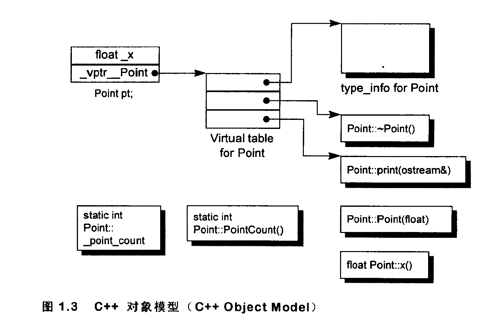

## 关于对象

C++ 在布局以及存取时间上主要的额外负担是有 virtual 引起的。包括：

- virtual function 机制，用以支持一个有效率的“执行期绑定”
- virtual base class 机制，用以实现“多次出现在继承体系中的 base class，有一个单一而被共享的实例”

C++ 的对象模型，我们主要讨论如下成员：

- 数据成员：静态数据成员、非静态数据成员
- 成员函数：静态成员函数、非静态成员函数、虚函数

#### c++对象模型

- 非静态数据成员被配置于每一个类对象中
- 静态数据成员放置在类对象之外
- 静态成员函数、非静态成员函数被放置在类对象之外
- 虚函数有如下实现：
  - 一个类有一个或多个指向虚函数的指针，放在虚表中（virtual table），也称为 vtbl
  - 一个类对象中会有一个指向虚表的指针（vptr）。虚表指针的设置由类的构造函数、析构函数、拷贝函数自动完成
  - 一个类所关联的 `type_info` 对象（用来支持 runtime type identrification，RTTI，运行时类型识别）通常在虚表的第一个位置

如下例子：

```
class Point {
public:
		Point(float val);
		virtual ~Point();
		
		float x() const;
		static int PointCount();
protected:
		virtual ostream& print(ostream& os) const;
		
		float x_;
		static int point_count_;
}
```

所对应的对象模型如下：



#### C++ 以下列方法支持多态：

- 通过一组隐式的转化操作。例如把一个 derived class 指针转化为一个指向其 public base type 的指针：

  ```
  shape* ps = new circle();
  ```

- 通过 virtual function 机制：

  ```
  ps->rotate();
  ```

- 通过 dynamic_case 和 typeid 运算符：

  ```
  if (circle* pc = dynamic_case<circle*>(ps)) ...
  ```

#### 类对象的内存占用

- 非静态数据成员的总和大小
- 任何由于对齐的需求而填补上去的空间（可能存在于成员之间，也可能存在于集合体边界）
- 为了支持 virtual 而由内部产生的任何额外占用

一个指针或者引用之所以可以支持多态，是因为他们并不引发内存中任何“与类型有关的内存委托操作”；受到改变的只有他们所指向的内存的“大小和内容解释方式”而已。

当一个基类对象被直接初始化为（或是被指定为）一个子类对象时，子类对象就会被切割以塞入较小的基类类型内存中。因此也不会产生多态。