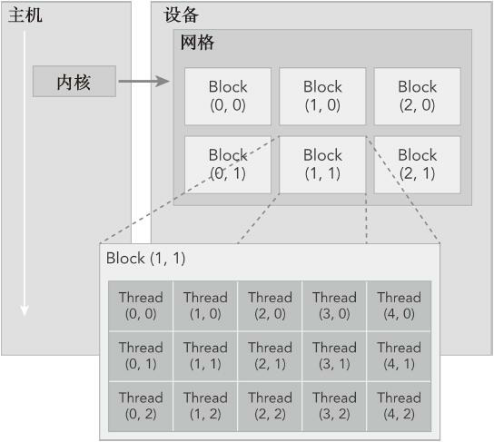

核函数必须被 `__global__` 修饰，并且核函数的返回类型必须是 void。

```c++
#include <stdio.h>

__global__ void hello_from_gpu() {
    printf("Hello World from GPU\n");
}

int main() {
    hello_from_gpu<<<1, 1>>>();
    cudaDeviceSynchronize();
    return 0;
}
```

解释下 `hello_from_gpu<<<1, 1>>>();` 的这种调用格式。因为一块 GPU 中有很多计算核心，从而可以支持很多线程。主机在调用一个核函数时，必须指明需要在设备中指派多少个线程。三括号中的数就是用来指明核函数中线程数目以及排列情况。第一个数字可以看作是线程块的个数，第二个数字可以看作是每个线程块中的线程数。

一个核函数的全部线程块构成一个网格（grid），而线程块的个数就记为网格大小。每个线程块中含有同样数目的线程，该数目称为线程块大小。所以核函数中总的线程数就等于网格大小乘以线程块大小。

而三括号中的两个数字分别就是网格大小和线程块大小。即 `<<<网格大小，线程块大小>>>`。所以上述程序中，主机只指派了设备的一个线程，网格大小和线程块大小都是 1，即 `1 * 1 = 1`。

解释下 `cudaDeviceSynchronize()` 函数。调用输出函数时，输出流是先存放在缓冲区的，而缓冲区不会自动刷新。函数 `cudaDeviceSynchronize()` 的作用就是同步主机和设备，所以能够促使缓冲区刷新。

### 一、cuda 中的线程组织

一个 GPU 往往有几千个计算核心。实际上，总的线程数大于计算核心数时才能更充分的利用 GPU 中的计算资源，因为这会让计算和内存访问之间及不同的计算之间合理的重叠，从而减少计算核心空闲的时间。

每个线程在核函数中都有一个唯一的身份标识。由于我们用两个参数指定了线程数目，所以每个线程的身份可由两个参数确定。`<<<grid_size, block_size>>>` 程序是知道执行配置参数 grid_size 和 block_size 的值的。

- `gridDim.x`：该变量的数值等于执行配置中变量 grid_size 的数值。表示网格大小，即线程块的数量
- `blockDim.x`：该变量的数值等于执行配置中变量 block_size 的数值。表示线程块大小，即线程的数量

类似的，在核函数中预定义了如下标识线程的内建变量：

- `blockIdx.x`：该变量指定了一个线程在一个网格中的线程块指标，其取值范围是从 0 到 `gridDim.x - 1`
- `threadIdx.x`：该变量指定了一个线程在一个线程块中的线程指标，其取值范围是从 0 到 `blockDim.x - 1`

假如某个核函数的执行配置是 `<<<10000, 256>>>`，那么网格大小 `gridDim.x` 的值为 10000，线程块大小 `blockDim.x` 的值为 256。线程块指标 `blockIdx.x` 可以取 `[0, 9999]` 的值，而每一个线程块中的线程指标 `threadIdx.x` 可以取 `[0, 255]` 的值。

当 `blockIdx.x` 等于 0 时，所有 256 个 `threadIdx.x` 的值对应第 0 个线程块；当 `blockIdx.x` 等于 1 时，所有 256 个 `threadIdx.x` 的值对应于第 1 个线程块。



### 二、核函数的要求

- 核函数的返回类型必须是 void，在核函数中可以使用 return 关键字，但不可返回任何值
- 必须使用 `__global__` 限定词，也可以加上一些其他 C++ 中的限定词，比如 static 等
- 不支持可变数量的参数列表，即参数的个数必须确定
- 可以向核函数传递非指针变量，其内容对每个线程可见
- 除非使用统一的内存编排机制，否则传给核函数的数组（指针）必须指向设备内存
- 核函数不可成为一个类的成员。通常做法是用一个包装函数调用核函数，而将包装函数定义为类的成员
- 无论是从主机调用，还是从设备调用，核函数都是在设备中执行。调用核函数时必须指定执行配置，即三括号和他里面的参数。

### 三、统计 cuda 事件耗时

```
    cudaEvent_t start, stop;
    cudaEventCreate(&start);
    cudaEventCreate(&stop);
    cudaEventRecord(start);
    cudaEventQuery(start);

    // 需要被计时的业务逻辑
    hello_from_gpu<<<10,10>>>();
    cudaDeviceSynchronize();

    cudaEventRecord(stop);
    cudaEventSynchronize(stop);
    float elapsed_time;
    cudaEventElapsedTime(&elapsed_time, start, stop);
    printf("elapsed_time: %6.2f\n", elapsed_time);
```