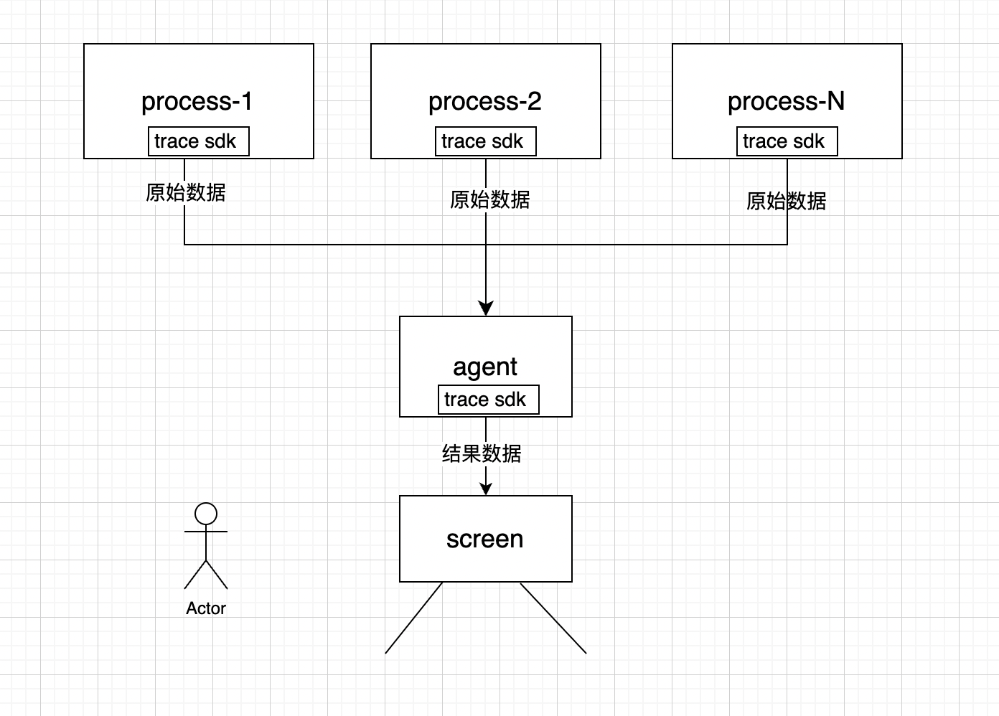
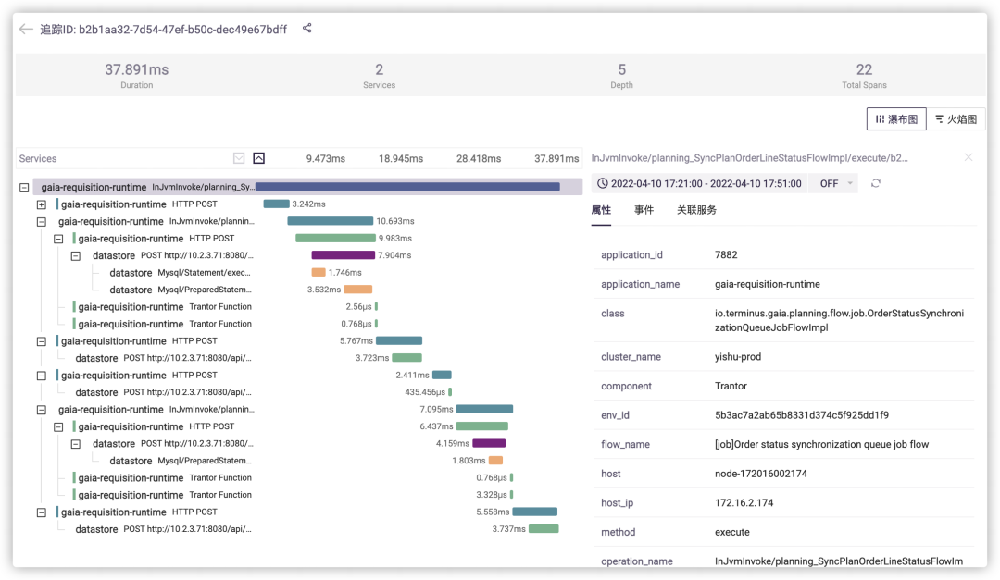

## 嵌入式链路监控方案

### 一、当前背景

我们当前的项目对于产出启动、功能闭环、服务之间的互相调用、服务协同工作 等等，这些场景可能来自于不同的开发人员、不同的开发语言，不同的模块等等因素。某个模块、或某个功能闭环，如果新增、修改、删除代码，可能造成的总体耗时增加，此时我们需要知道耗时的位置。

在产出启动到功能可用，这个启动耗时，影响用户的使用体验，因此我们定位初始化过程中的耗时点，进行针对性优化很有必要。

对于多进程，像 gaia 进程、多 pavaro 进程等等的场景，以及多线程的场景，我们统计执行流的耗时，是非常有必要的。

我们目前的耗时统计很原始，只是通过手工看日志的方式，效率极低，而且很费眼睛，统计也不一定做到精准。

因此我们的链路监控是非常有必要的。

### 二、关键诉求 

因为产出功能多、依赖多，也使链路变的更长，这也代表中服务与服务、模块与模块、线程与线程等之间的依赖、调用关系变得越来越复杂，为了提升系统在复杂链路下的健壮性、稳定性、高性能。我们有如下三个关键诉求去解决：

1. 如何梳理整套系统的依赖调用关系（系统的整体、或系统的局部），并评判上下游之间依赖的合理性？
2. 如何了解每一个模块、服务、执行流的性能指标，并对系统整体的资源占用进行合理的规划？
3. 当系统出现故障异常，资源占用异常的时候，如何快速直观的发现问题，定位解决、解决问题？

### 三、调研

Google 公司在链路监控领域做的很出色，目前业界主流的链路监控，基本都源于 Google 的产品概念。尤其是《Dapper, a Large-Scale Distributed Systems Tracing Infrastructure》这篇著名论文阐述了如何在超大规模系统上建设低损耗（low overhead）、应用级透明（application-level transparency）、大范围部署（ubiquitous deployment）的链路追踪服务。

Dapper阐述了对分布式系统进行链路追踪的技术细节，包括数据表示、埋点、传递、收集、存储与展示等方面，并提出了跟踪树、Span、Trace、Annotation等重要概念，为全链路监控提供了理论指导。

在Dapper的启发下，业界诞生了很多用于分布式链路追踪的开源组件，为了保持对链路中每一个环节的记录与匹配，不仅需要在应用内部对跟踪信息进行传递，还需要让跟踪信息跨越不同的应用以及不同的分布式组件。这需要制定一套统一的标准，让微服务体系中的所有应用遵循这套标准来实现跟踪信息的描述和传递，这套标准就是OpenTracing。OpenTracing抽象出一套与编程语言以及业务逻辑无关的接口，对链路追踪领域各类元素的统一管理，从而实现完整的全链路监控。

可以阅读这篇论文（Google Dapper）：http://bigbully.github.io/Dapper-translation/

业界都是清一色的类似实现，并且 CNCF 正在对链路监控做统一，因此参考如上论文就够了

### 四、可选方案

业界大部分都是关于分布式的链路监控。与我们当前的嵌入式的链路监控的场景是非常相似的。

- SDK 方式，通过引入链路追踪 SDK 自动生成链路数据，自动上报数据。监控逻辑的注入比较复杂，有可能需要开发者针对具体的底层代码框架预先做好适配工作
- 探针方式：不需要在代码编译前引入 SDK，而是通过一个 Agent 动态拦截底层框架的行为，从而自动注入监控逻辑。像Java这样的编程语言可以通过字节码增强技术实现探针方式的链路信息采集。这是一种最开发者最友好的方式，不需要任何代码层面的改动，但并不是每一种编程语言都能提供探针机制。自己开发探针机制难度较高。

因此SDK方式也被很多全链路监控组件采用。针对我们的场景，我们也选择 SDK 方式。

有了全链路监控工具，我们能够达到：

- 链路追踪，故障快速定位：可以通过调用链结合业务日志快速定位错误信息。
- 可视化： 各个阶段耗时，进行性能分析。
- 依赖优化：各个调用环节的可用性、梳理服务依赖关系以及优化。
- 数据分析，优化链路：可以得到用户的行为路径，汇总分析应用在很多业务场景。

好了，有了以上的基础，我们已经可以开始设计方案了

### 五、基本概念介绍

在正式介绍方案之前，我们先来看几个方案中基本概念。

#### 1. trace

trace 就是一个树结构的 span 集合，也表示一次完整的跟踪。一个 trace 中只有一个 root span。

#### 2. span

span 是我们的基本工作单元， 一个 span 过程是一次链路调用。这个链路调用过程由用户控制，可以短、也可以长，短的话比如求了一次 md5；长的话比如进行了一次服务响应。

span 是一段时间，或者说他有生命周期。就像是一个树形结构中，span 是一个节点。他只有一个父节点，但是可以有多个孩子节点。这样我们就可以利用这些信息来重建一次 trace 追踪过程中不同 span 之间的关系。如果一个 span 没有父 span，那他就是根 span。所有的 span 都挂在一个特定的 trace 追踪上，也共用同一个 trace_id。


span 的类型定义：

```c
struct SpanContext {
		uint64_t trace_id;
		uint64_t span_id;
};

struct Attributes {
		Key key;
		Value value;
};

struct Status {
		Code code;
		std::string description;
};

struct Tracer {
  	std::string tracer_name;
};

struct Span {
		std::string name;
		uint64_t start_time;
  	uint64_t start_steady_time;
		uint64_t end_time;
  	uint64_t end_steady_time;
		SpanContext context;
		SpanContext parent_context;
		Status status;
		std::vector<Attributes> attributes;
		int child_span_count;
  	Tracer tracer;
};
```

- name：当前 span 的名字、标识。
- start_time：当前 span 开始的时间
- end_time：当前 span 结束的时间
- start_steady_time、end_steady_time：稳定时间，解决时间跳变问题
- context：当前 span 的上下文，包含一个 `trace_id` 和 `span_id`
- parent_context：当前 span 的 父 span 的上下文。如果没有父 span，则当前 span 为根 span，此时此字段为特殊值，比如 0
- status：当前 span 的状态，就是当前 span 的生命周期，是否有错误的逻辑 case 出现，可填写错误码、描述信息。此字段可为空
- attributes：当前 span 的属性信息，支持一些属性用于标识，以更好的确定当前链路、以及业务逻辑
- child_span_count：当前 span 的子 span 的个数，当前 span 也可以作为父 span
- tracer：当前 span 属于哪个 tracer，这个 tracer 的一些信息。

### 六、接口设计

我们只展示关键性的接口设计，目前只是一个设想，具体实现可能有小的变动。我写了如下的伪代码，来展示如何使用。

```c++
std::string tracer_name = "test_tracer";

void func_01() {
		Tracer tracer = get_tracer(tracer_name);
  	Span span = tracer.start(nullptr, "span_name_01");
  	span.set_attributes("attribute_key", "attribute_val");
  	SpanContext ctx = span.get_context();
  
  	int err = func_02(ctx);
  	if (err != 0) {
      	span.set_status(-1, "err reason");
      	span.end();
      	return err;
    }
		// 正常逻辑
  	span.set_status(0, "sucess");
  	span.end();
}

int func_02(SpanContext& ctx) {
  	Span span = get_tracer(tracer_name).start(ctx, "span_name_02");
  	span.set_attributes("attribute_key", "attribute_val");
  
  	// 业务逻辑
  	xxxx
    
    // 发生了错误
    if (xxx) {
  			span.set_status(-1, "err reason");
      	return -1;
    }
  	// 正常逻辑
  	span.set_status(0, "sucess!!!");
  	span.set_attributes("business_key", 1000);
  	span.end();
  	return 0;
}
```

如上的例子，相信是比较清晰的逻辑，关键的 API 的功能说明如下

#### 1. tracer 的 API

```
Tracer tracer = get_tracer(tracer_name);
```

获取到一个 Tracer，参数暂时为 `tracer_name`。标识一个链路。如果已经创建，则直接返回，没有这个 tracer，则创建。

这里解释一个小问题，我们在标识 tracer 的时候，使用 tracer_id 和 tracer_name 这两个字段，为什么不直接使用 tracer_name 呢？回答一下，请注意，我们的 sdk 用于多个进程，tracer_name 有可能一样，而 tracer_id 可以采用 uuid，作为区分，但也不能用 tracer_id 来标识，用户哪知道这个 tracer_id 是什么。

#### 2. span 的 API （开始、结束）

这个 tracer 就是 span 的集合。接下来我们创建 span，并设置 span 的开始。注意是创建。

```
Span span = tracer.start(nullptr, "span_name_01");
Span span = tracer.start(ctx, "span_name_02");
span.end();
```

接口的第一个参数为 parent_context，类型为 SpanContext。这个 SpanContext 中就是存储着父 span 的 trace_id、span_id 等上下文。

- 当 parent_context 为 nullptr 时，表明创建的 span 是根 span
- 当 parent_context 不为空，表明这个参数为此 span 的父亲 span 的上下文，会设置当前 span 的内部信息

end 接口表明此 span 的生命周期结束。

#### 3. span 的功能性 API

```
span.set_status(0, "sucess");
span.set_status(-1, "err reason");
span.set_attributes("business_key", 1000);
```

设置此 span 的一些信息，比如状态、属性。帮忙业务更好的展示信息

### 七、整体部署架构

下图，我们列出了整体的框架，包括 SDK 所处的位置。



我们会提供一个 trace sdk，这个 sdk 会提供可用性极高的 API 接口，包括客户端发送数据的接口；以及服务端处理数据的接口。有几个点在这里说明下：

- 这里的 process-N 不仅仅是进程、线程，甚至一个脚本、一个执行流都可以接入
- 并且这里的 process-N 可以在一台机器上，也可以分布在多台机器上。当然我们的场景是在一台机器，所以我们会针对单机做优化
- 这里的 agent 作为一个旁路进程出现在机器上，负责处理、聚合收集到的数据。然后将结果数据转发到前端，前端进行展示

此时，人类就可以查看链路监控数据咯。

#### 1. 如何通信

上图中，我们可以看到妥妥的 C-S（客户端-服务端）模型，此时，对于多进程之间的通信，首选 socket 呀。而且针对单机的情况，我们知道

- UDS 传输不需要经过网络协议栈，不需要打包拆包等操作，只是数据的拷贝过程
- UDS 分为 SOCK_STREAM（流套接字）和 SOCK_DGRAM（数据包套接字），由于是在本机通过内核通信，不会丢包也不会出现发送包的次序和接收包的次序不一致的问题

这种场景，UDS 的优势体现的淋漓尽致。因此我们选择 unix domain socket（UDS）保证通信的高效率。

Agent 这个进程作为服务端，其他进程作为客户端。我们现在统一了数据的传输协议，剥离了服务端和客户端，使他们之间可以低耦合。但是可能会有这个问题，客户端之前说了可能是一个 C++/Go/Java/Python 等代码写的程序、甚至是一段 shell 脚本。此时太过底层的 UDS 可能就需要提供给用户一些封装，哇唔，难搞，那不得很多个不同语言的 sdk。还不如使用 HTTP 呢？

针对这个问题，我们想要在性能、和开发投入成本、以及难易程度之间做一个平衡。而且我们是嵌入式链路监控，对于性能的要求特别高，心里有了一个顺序优先级之后，我们马上得出如下的结论。

为了保证性能，UDS 必须使用，而且针对其他的非主流客户端（shell 脚本）我们增加 HTTP 进行通信。这个二期在做，不着急。先满足主体功能。

好，到这里我们基本理清楚了我们的核心设计，以及部署架构

### 八、数据展示

最终的期望展示图，如下图（图片来自于 google），期望前端同学大展身手，数据都有了。



### 九、问题与展望

doing
