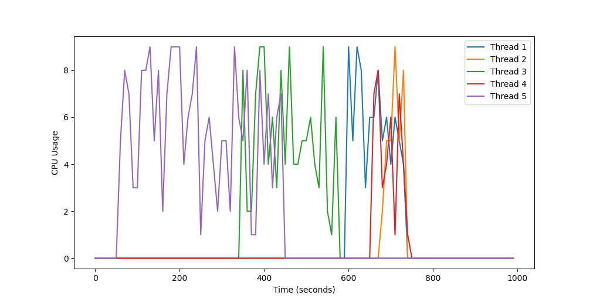
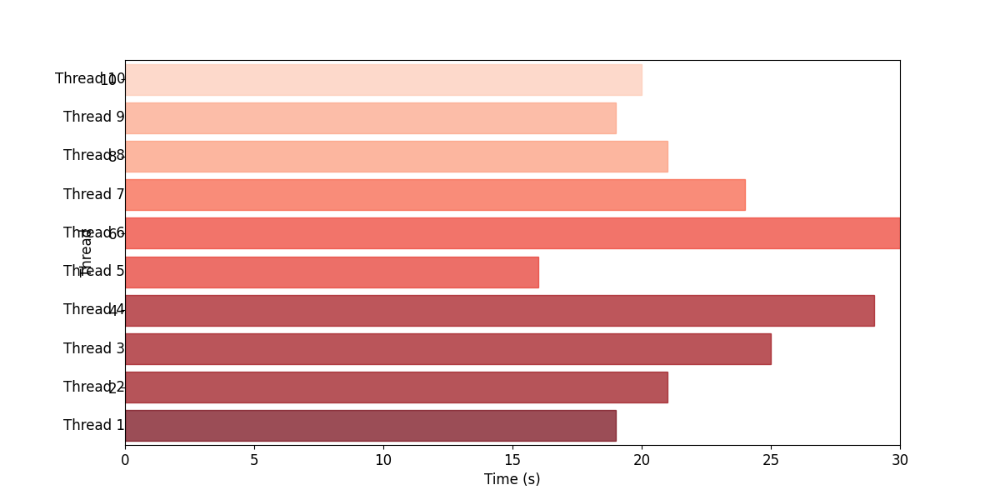
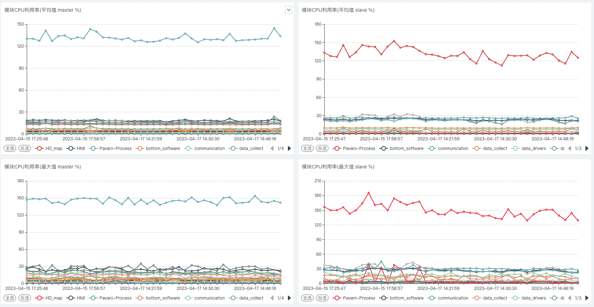

## 线程状态分析方案

### 一、背景

我们当前的 ANP2.0 项目，在运行之后，会创建大约快 300 个线程。但是我们对于这些线程的情况并没有完全的掌握，也就是说，

- 我们对于某个线程用来干什么事情了解的并不是很清晰
- 以及这个线程的生命周期
- 这个线程消耗的计算机资源
- 线程在运行过程中不同时间的运行状态
- 线程池中的线程是否过多
- 是否线程的调度所带来的消耗要大于线程本身执行任务的消耗

等等这些问题，我们虽然有一些切入点，可以得知线程在运行过程中的一些情况，但是无法全面的、整体性对其有深入的理解。因此我们打算有一个循序渐进的方案，一步一步的完善这里的监控盲区。

### 二、问题

一个进程中拥有过多的线程，有什么问题呢？如下我列举一些

1. 资源竞争：每个线程都需要一些内存和CPU时间来运行，如果线程太多，会使得系统资源不足，导致竞争和延迟。
2. 上下文切换开销增大：线程数量过多会导致操作系统频繁进行线程上下文切换，这个开销会增加，导致系统性能降低。
3. 调度延迟：操作系统在调度线程时，需要遍历线程列表来选择下一个要执行的线程，如果线程数量过多，这个遍历操作会变得更加复杂，导致调度延迟。
4. 内存占用过大：每个线程都需要一些内存来保存其状态和堆栈信息，如果线程数量太多，会占用大量的内存资源，导致系统资源不足。
5. 错误难以追踪：如果一个进程中有大量的线程，那么出现问题时，调试和排查错误会变得更加困难，因为每个线程都有自己的执行状态和上下文。

pavaro 框架会针对不同的模块，为每一个模块指定一个线程池。因此线程池中个数、不同线程之间的优先级等等都是一个较为重要的问题。

### 三、设想

前文提到，我们希望有一个循序渐进的方案来完善线程的状态分析。因此我们当前第一阶段的目标是：

1. 获取线程的生命周期
2. 以及这个线程的信息（tid、线程名字）
3. 线程在其整个生命周期中的 CPU 使用情况。按照整体的 CPU 使用率进行排序
4. 不同闭环场景下，不同线程的 CPU 使用情况

最终的设想输出如下，横坐标是时间，图中的每一条线条代表一个线程，每条线条按照颜色来区分。纵坐标代表 CPU 使用率。线条的长度代表线程的生命周期。

或者如下图，横坐标是时间，图中每一个矩形条代表一个线程，其中矩形的长短代表线程生命周期的长度。颜色表示线程在某段时间占用 CPU 的程度，颜色越深代表 CPU 使用量越高，相对的，颜色越浅代表 CPU 使用量越低。

### 四、方案

如果需要如上的展示的话，那就是 pavaro 进程中线程的 CPU 监控了，只需要按照一定的方式展示出来即可。**我们也可以在图中加上线程的一些信息，比如线程所属的模块，以及当前时间段处于那个闭环（AVP-ANP 处于那个功能选项，比如 apa、havp 等）**

展示的话，统一由 sugur 平台展示，由于线程的 CPU 信息，可以由旁路进程获取到，因此由两种方式来实现。

#### 1. 第一种实现方式

- 直接由旁路进程来获取 pavaro 进程中所有线程的 CPU 信息
- 而由 AVP-ANP 项目中的 resmon 模块提取当前状态机的状态，也就是当前处于那个闭环。将这个状态以某种进程间通信的方式传递给旁路进程。
- 旁路进程根据每一秒获取到的状态机的状态，以及 pavaro 进程中所有线程的 CPU 占用情况。以一定的时间粒度进行绘图
- 结果中，横坐标除了时间，还包含当前正在进行那个闭环，以及闭环的开始与结束。图中会展示每个线程的 CPU 占用情况以及这些线程的生命周期。

#### 2. 第二种实现方式

- 与“线程内存监控方案”进行耦合。内存监控方案见：https://ku.baidu-int.com/knowledge/HFVrC7hq1Q/pKzJfZczuc/WRJGZXv7Ts/fFBxAizrgjzowc
- 在共享内存中存储每一秒线程的信息，包括：线程 tid、name、CPU 使用量、内存使用情况。以及当前的时间、当前的状态机状态。
- 由旁路进程进行解析数据，展示数据。
- 结果中，横坐标除了时间，还包含当前正在进行那个闭环，以及闭环的开始与结束。图中会展示每个线程的 CPU 占用情况以及这些线程的生命周期。

### 五、其他情况

我们的 sugur 平台目前有模块的 CPU 平均使用率、MAX 使用率。

- 模块的 CPU 平均使用率，表示的是闭环状态下，模块下的所有线程每秒进行聚合后的 CPU 平均值。
- 也就是说，一个闭环有 N 秒，将每一秒的模块下所有线程的 CPU 占用值累加，作为这一秒这个模块的 CPU 占用。然后将这个闭环的 N 秒进行聚合成 1 秒，并且提取出模块的平均值、最大值。

