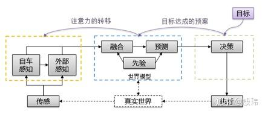

自动驾驶最浅显的理解是：感知、决策、执行。

- 感知回答周围有什么的问题，类似人的眼睛，耳朵。通过摄像头、雷达、地图等手段获得周围障碍物和道路的信息
- 决策回答我要如何做的问题，类似大脑。通过分析感知得到的信息，生成路径和车速
- 执行则类似于手脚，将决策获得的信息转换为刹车、油门和转向信号，控制车辆按照预期行驶。

我们人类每时每刻会根据当下眼睛看到信息决定我下一步的决策，但是从眼睛到脑袋再到手脚总是存在一个时间的延迟。自动驾驶也是如此。但我们不曾感受到影响是因为大脑会自动处理“预测”这件事情。哪怕只有几毫秒，我们的决策也是根据对所见之物的预测来指导手脚运作的。因此我们会在自动驾驶决策之前增加预测这个模块。

感知过程其实也分为两个阶段：“传感”和“感知”。传感获得的是传感器的原始数据，比如图片。感知则是从图片里处理出有用信息，比如图片中有几个人。并且感知的有用信息又可以继续分为“内部感知”和“外部感知”。

- 内部感知：由摄像头、雷达、GPS 每时每刻获得的信息
- 外部感知：由定位、地图等这种外部智能体或过往记忆，收集处理后转告的信息

各种传感器经由算法处理后，对于障碍物、车道等信息往往存在矛盾。比如雷达看到了前方有一个障碍物，而摄像头说没有。这时候就需要增加 “融合” 模块，对不一致的信息做进一步的关联和判断。

这里我们也常常把 “融合和预测” 称为 模型。对于我们人类来说，通过对我们出生后的所见所闻，加以处理，在脑海中逐步构建对世界的理解。模型的核心职责就是通过 “融合” 来理解当下环境要素的属性和关系，并配合 “已经验证的规律” 做出 预测，为决策执行提供更从容的判断。

如上，我们站在宏观的角度，阐述了整个智能驾驶中所有模块。

