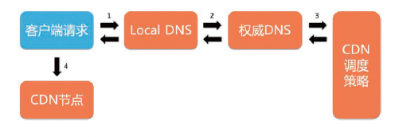
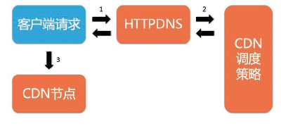
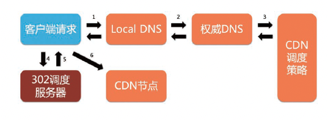

CDN 由节点系统、调度系统、运维支撑系统、用户控制台等子系统组成。

#### 1. 调度系统

通过实时科学决策将底层资源合理地调配给上层业务（弹性伸缩），并通过多租户海量业务编排来精确控制资源水位（负载均衡），以达到业务按需进行质量控制和平台成本控制的目标。

CDN 提供的核心价值是网站访问加速和业务弹性支撑。其通过建设广域覆盖的边缘节点基础设施，将业务网站的内容缓存到网民身边（“最后一公里”），调度系统将用户访问请求通过调度策略（就近覆盖、过载分离等）引导到最合理的边缘节点，进而达到用户访问站点加速和业务弹性支撑的目的。

CDN 平台具有海量边缘节点，这些节点分布在不同运营商、不同地域中，具有不同的价格、不同的计费方式，也具有不同的网络品质、集群硬件配置。CDN 的主要成本集中在带宽成本上，**成本规划模块**是以离线方式在给定业务构成和资源构成的情况下求解各个节点的最优成本线的。

**资源调度模块**在成本规划模块的基础上，结合业务画像和资源画像进行业务与资源的匹配，将各个业务编排到相应的 CDN 节点上，输出各个业务的节点集合池。资源调度需要解决在多客户和多业务混跑场景下各个业务都有突发可能的问题；也就是说，一个比较好的资源调度方案应该具备比较好的弹性伸缩机制。

**全局负载均衡模块**在成本规划模块给定节点成本线，和资源调度模块划定业务节点集合的结束下，生成全局调度策略，以确保水位的均衡性，以及根据业务分级需要进行就近覆盖（网络往返时延 RTT 满足业务场景要求）。由于 CDN 广域分布海量节点的特点，各节点必然会存在异常或出现故障的概率，全局负载均衡还需要将发生故障节点的业务快速迁移到其他健康的节点中。

**调度执行器**是执行全局负载均衡调度策略的调度服务器组件，包含 DNS 执行器、HTTPDNS 执行器、302 执行器等。这三种组件对应三种不同的用户请求调度牵引方式，即 LDNS（Local DNS，本地域名服务器）牵引、App 端绕过 DNS 自行解析牵引、302 跳转牵引。调度牵引方式的选择对调度策略的执行精确度、实时性、可调度颗粒度都有直接的影响。

此外，调度系统还需要很多重要的支撑组件：

- IP 地址库组件：调度执行器给予 IP 地址库来判断执行那个用户归属区域（如联通北京、电信广东等）的调度策略
- 全局感知组件：通过主动探测和被动检测等方式感知资源的可用性状态，并实时触发全局负载均衡模块进行故障迁移
- 画像组件：含业务画像、资源画像、LDNS 画像，画像数据的精确度对调度策略的科学生成至关重要

## 二、全局负载均衡

CDN 调度要解决的核心问题是，将用户请求产生的带宽/算力消耗，分配到边缘 CDN 节点。在这个分配过程中，要解决的问题是，资源在就近服务业务的同时，保证资源尽量可承载更多的业务，这就要求寻求全局的负载均衡。需要根据不同的调度方式特性，进行最优“组合搭配”，以达到我们的期望目标。

### 1. 典型的调度形式

#### (1). DNS 调度

目前最主要的调度方式，也是常规情况下一个域名接入 CDN 以后的默认调度方式。域名接入 CDN 的时候，会自动给域名生成一个 CNAME（接入域），然后用户把域名配置到该 CNAME 上，这样最终的域名解析就由权威 DNS 服务器来负载，该权威 DNS 服务器会根据我们的调度策略将域名解析出 CDN 节点的 IP 地址。

- DNS：域名系统，用于域名与 IP 地址的相互转换。
- EDNS：是 DNS 协议的扩展，EDNS 支持 DNSSEC（Domain Name System Security Extensions，DNS 安全扩展）、edns-client-subnet，可以识别原始请求用户的 IP 地址。
- LDNS：Local DNS 即本地域名服务器，由本地运营商提供。用户的解析请求，是由 LDNS 执行的
- ClientIP：终端用户的 IP 地址，每个终端设备上都会配置 LDNS 的地址。在 DNS 调度中，只能识别 LDNS，识别不了用户的 IP 地址，所以用户流量是被 LDNS 所牵引的

#### (2). 302 调度

基于 7 层 HTTP 的请求，在响应时进行牵引以达到调度的目的。其原理如下：请求的 URL 首先通过域名解析，解析到 302 调度服务器。调度策略根据请求分配合理的 CDN 节点，然后，302 调度服务器以 302 重定向形式，将调度策略携带于重定向 Location 响应包中返回给客户端。客户端通过 “follow” 302 响应中的 Location 地址来完成对客户端请求的调度牵引。

#### (3). HTTPDNS 调度

域名接入 CDN 后，需要客户端调用 CDN 调度提供的 HTTPDNS 接口完成 HTTPDNS 调度的接入。其工作原理如下：客户端调用 HTTPDNS 提供的接口（HTTP/HTTPS），接口携带请求域名和请求客户端的 IP 地址等关键信息，然后调度策略根据详细的请求信息分配合理的 CDN 节点，并通过 HTTPDNS 服务器提供的请求接口来返回节点的 IP 地址和需要缓存的 TTL（Time To Live，生存时间）值等，完成对请求的调度牵引。

#### (4). 调度方式的对比

DNS 调度最为通用，所有的 CDN 加速业务均可通过 DNS 调度方式进行调度。不过，因为 DNS 调度的调度策略生效依赖于运营商的  Local DNS 缓存策略设置（如 TTL 不允许低于 180 秒），所以对一些需要快速更新调度策略的场景，可以采用其他调度方式

HTTPDNS 调度流与 DNS 调度流相似，不过其核心的调度策略生效逻辑，不经过运营商的 Local DNS。DNS 调度是基于运营商的 Local DNS 进行调度的，而 HTTPDNS 调度是基于客户端的 IP 地址进行调度的。对于调度策略生效实效性要求高的，或者对调度策略精准度要求高的，可以采用 HTTPDNS 调度方式（如直播业务等），不过 HTTPDNS 调度一般需要客户端进行配合改造（调用 CDN 厂商提供的 API 逻辑）

302 调度是基于 HTTP 的重定向（302 状态码）对请求进行调度的。302 调度服务器“预先”加载 CDN 调度策略，然后通过客户端进行重定向，进行请求的调度。改种调度方式的调度时效性和精确度最高（从时效性方面来说，其基本是实时调度，可精确到客户端 IP 地址和 URL 颗粒度的调度控制）。但是与上述两种调度方式相比，这种调度方式多了一次 HTTP 连接的性能开销。所以一般的 App 下载、大文件传输等场景，链接频率低，但需要做精准实时调度的业务，会采用 302 调度方式。

### 2. 调度分层

在调度系统内部，分为三层：

- 接入层：表示网民到 CDN 的边缘节点这一层
- 中间层：表示请求在 CDN 节点内部（包括边缘节点和中间层节点）流转这一层
- 回源层：表示 CDN 节点到用户的源站这一层

#### (1). 接入层

在这一层，主要有 DNS 调度、302 调度和 HTTPDNS 调度。主要考虑的是服务网民的质量和成本。我们要在保证网民访问网站的质量的前提下，降低 CDN 的成本。从质量角度来说，尽量使用离网民网络距离最近的节点服务，CDN 系统会有全球网络感知系统来做实时的检测，总是用实时网络最好的节点来服务网民。

#### (2). 中间层

在中间层，请求在 CDN 节点内部流转，这个层主要考虑提高资源的命中率，减少用户源站的带宽。在 CDN 系统中，有类似 L1（一级缓存节点）、L2（二级缓存节点）等，由于业务需求的多样性，智能调度程序根据业务情况，自动配置 N 级的中间层。不同业务的 N 不同。以 L1 到 L2 为例，一般有两种模式：一致性 Hash 模式、质量优先模式。

- 一致性 Hash 模式：同样 URL 的请求，对该请求做 Hash 后，无论来自那个 L1 节点，最终都会落到相同的 L2 节点上。优点是资源的命中率高，回源量小；缺点是其质量会有一些损失。这是因为同一个 URL，无论 L1 节点来自哪里（东北还是海南），都会落到相同的 L2 上，这个 L2 可能在广东，而对于东北的 L1 来说这个距离太远了，网络质量不够好。
- 质量优先模式：指的是一个 L1 节点上的请求，无论请求的 URL 是什么，都会回到离这个 L1 最近的 L2，这样来保证 L1 到 L2 的质量最好。这种方式的优点是质量好；缺点是资源的命中率低，回源量大。

#### (3). 回源层

回源可以是 L1（一级缓存节点）直接回源，也可以是 L1 经过 L2 甚至 Ln 以后再回源。只有极少数业务配置了 L1 直接回源。在节点回源的时候，支持该节点回到多个源站，并且多个源站之间还可以配置主备或者权重关系；多个源站之间除可以设置主备或者权重关系外，还可以直接设置成按质量回源，这样 CDN 回源层的节点，回选择离自己网络质量最好的源站来回源。

### 3. 调度策略与典型算法

CDN 的调度系统一般具有资源规划（调度）、调度策略规划、调度策略执行服务几个阶段。

- 资源规划（调度）的核心功能是对业务使用哪些资源节点的服务进行分配。
- 调度策略规划，是根据资源规划（调度）完成后的节点，即业务指定可服务的资源池来进行调度策略规划的
- 调度策略执行服务：规划后的策略由调度策略执行服务器（DNS 服务器、HTTPDNS 服务器、302 服务器）进行加载和执行

