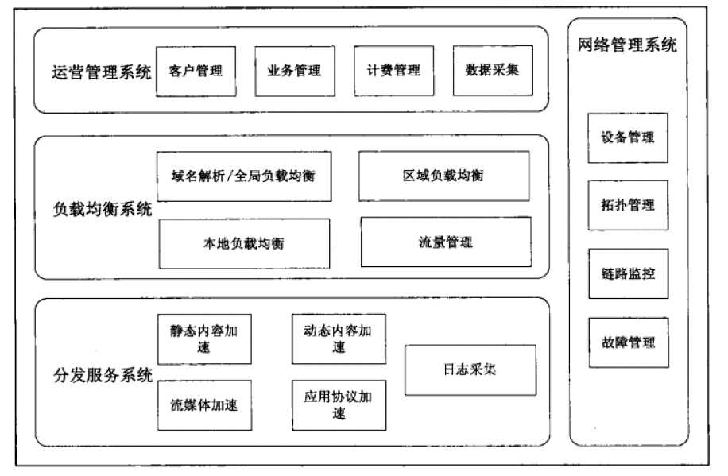
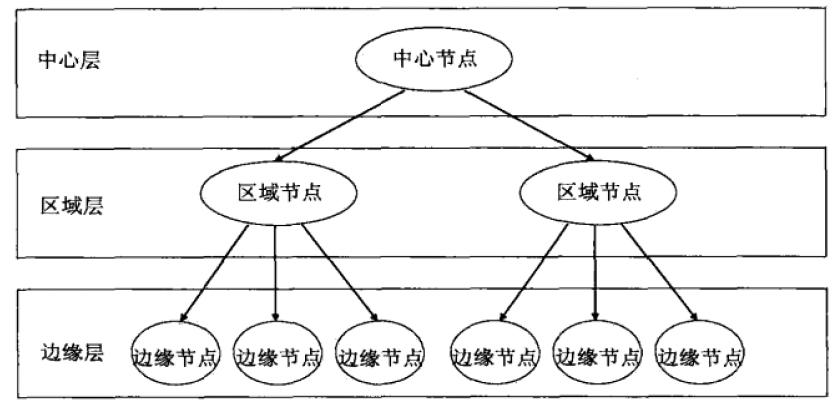

CDN，Content Distribute Network。内容分发网络。CDN 完成的是将内容从源站传递给用户端的任务。

### 一、互联网中造成拥堵的地方

#### 1. “第一公里”

万维网流量向用户传送的第一个出口，是网站服务器接入互联网的链路所能提供的带宽。这个带宽决定了一个网站能为用户提供的访问速度和并发访问量。

一个网站，其服务的用户越多，对其出口带宽的要求就越大，当用户请求的数据量超过网站的出口带宽，就会在出口处形成拥塞。

#### 2. “最后一公里”

万维网流量向用户传送的最后一段接入链路，即用户接入带宽。用户的平均接入带宽，是影响互联网上层应用发展的决定性因素之一。

随着带宽的不断提升和接入手段的丰富（光纤入户、Wifi 等），“最后一公里”的瓶颈问题基本得到解决。

#### 3. 对等互联关口

“对等互联” 是指不同基础运营商之间的互联互通，一般的两个运营商之间只有两三个互联互通点。

比如某个网站服务器部署在运营商 A 的 IDC 机房里，运营商 B 的用户要访问该网站，就必须经过 A、B 之间的互联互通点进行跨网访问。

#### 4. 长途骨干传输

首先是长距离传输时延问题，从网站服务器到用户之间要经过网站所在 IDC、骨干网、用户所在的城域网、用户所在接入网等，距离非常遥远，因此不可避免的带来较长的传输时延，影响用户体验，这一问题也是互联网本身无法解决的问题。

其次是骨干网拥塞问题，由于互联网上的绝大部分流量都要通过骨干网络进行传输，这就要求骨干网络的承载能力必须与互联网的应用同步发展，但实际上两者并不是同步的，当骨干网络的升级和扩容滞后于互联网之上的应用的发展时，就会阶段性的使得大型骨干网的承载能力称为影响互联网性能的瓶颈。

### 二、CDN 架构

CDN 基于这样的原理：1. 挑选最优设备为用户提供服务；2. 如果某个内容被很多用户所需要，他就被缓存到距离用户最近的节点中。

CDN 服务器通常在运营商的 IDC 中，尽量靠近接入网络和用户。CDN 在 Cache 中复制内容，当内容的提供者更新内容时，CDN 向 Cache 重新分发这些被刷新的内容。CDN 提供一种机制，当用户请求内容时，该内容能够由以最快速度交付的 Cache 来向用户提供，这个挑选“最优” 的过程叫做负载均衡。被选中的最优 Cache 可能最靠近用户，或者有一条与用户之间条件最好的路径。

#### 1. 功能架构

从功能上划分，典型的 CDN 系统架构由 “分发服务系统”、“负载均衡系统” 和 “运营管理系统” 三大部分组成。

**分发服务系统**。主要作用是实现将内容从内容源中心向边缘的推送和存储，承担实际的内容数据流的全网分发工作和面向最终用户的数据请求服务。分发服务系统最基本的工作单元就是许许多多的 Cache 设备（缓存服务器），Cache 负责直接响应最终用户的访问请求，把缓存在本地的内容快速提供给用户。同时 Cache 还负责与源站点进行内容同步，把更新的内容以及本地没有的内容从源站点获取并保存在本地。

一般来说，根据承载内容类型和服务种类的不同，分发服务系统会分为多个子服务系统，如网页加速子系统、流媒体加速子系统、应用加速子系统等。每个子服务系统都是一个分布式服务集群，由一群功能近似的、在地理位置上分布部署的 Cache 或 Cache 集群组成，彼此间互相独立。

对于分发服务系统，在承担内容的更新、同步和响应用户需求的同时，还需要向上层的调度控制系统提供每个 Cache 设备的健康状况信息、响应情况，有时还需要提供内容分布信息，以便调度控制系统根据设定的策略决定由那个 Cache（组）来响应用户的请求最优。

**负载均衡系统**。主要功能是负责对所有发起服务请求的用户进行访问调度，确定提供给用户的最终实际访问地址。大多数 CDN 系统的负载均衡是分级实现的，以最基本的两级调度体系进行说明。一般来说，两级调度体系分为全局负载均衡（GSLB）和本地负载均衡（SLB）。

全局负载均衡（GSLB） 主要根据用户就近性原则，通过对每个服务节点进行 “最优” 判断，确定向用户提供服务的 Cache 的物理位置。通用的 GSLB 实现方法是基于 DNS 解析的方式实现，也有一些系统采用了应用层重定向等方式来解决。

本地负载均衡（SLB） 主要负责节点内部的设备负载均衡，当用户请求从 GSLB 调度到 SLB 时，SLB 会根据节点内各 Cache 设备的实际能力或内容分布等因素对用户进行重定向。常见的本地负载均衡方法有基于 4 层调度、基于 7 层调度、链路负载调度等。

**运营管理系统**。分为运营管理和网络管理两个子系统。

运营管理子系统是 CDN 系统的业务管理功能实体，负责处理业务层面的与外界系统交互所必需的一些收集、整理、交付工作，包含客户管理、产品管理、计费管理、统计分析等功能。

网络管理子系统实现对 CDN 系统的网络设备管理、拓扑管理、链路监控和故障管理，为管理员提供对全网资源进行集中化管理操作的界面，通常是基于 Web 方式实现的。

#### 2. 部署架构

CDN 系统设计的首要目标是尽量减少用户的访问响应时间，因此负责为用户提供内容服务的 Cache 设备应部署在物理上的网络边缘位置。我们称这一层为 CDN 边缘层。CDN 系统中负责全局性管理和控制的设备组成中心层，中心层同时保存着最多的内容副本，当边缘层设备未命中时，会向中心层请求，如果在中心层仍未命中，则需要中心层向源站回源。

如果 CDN 网络规模较大，边缘层设备直接向中心层请求内容或服务会造成中心层设备压力过大，就要考虑在边缘层和中心层之间部署一个区域层，负责一个区域的管理和控制，也保存部分内容副本供边缘层访问。

如下是一个三级的 CDN 部署图。

节点是 CDN 系统中最基本的部署单元，一个 CDN 系统由大量的、地理位置上分散的 POP 节点组成，为用户提供就近的内容访问服务。CDN 节点网络主要包含 CDN 骨干点和 POP 点。

- CDN 骨干点，中心和区域节点一般称为 骨干点，主要作为内容分发和边缘未命中时的服务点
- POP 节点，边缘节点。主要作为直接向用户提供服务的节点

从节点构成上来看，无论是 CDN 骨干点还是 CDN POP 点，都由 Cache 设备和本地负载均衡设备构成。

### 三、CDN 系统分类

可以从两个角度来对 CDN 基本服务进行分类，一是基于不同内容承载类型视角，而是基于不同内容生成机制视角。

#### 1. 基于不同内容承载类型的分类

从 CDN 承载的内容类型来看，主要有静态网页内容、动态网页内容、流媒体、下载型文件和应用协议。因此我们将 CDN 服务分为网页加速、流媒体加速和应用协议加速。

- 网页加速。CDN 服务商通过将网页内容缓存到各个 CDN 节点上，并将用户请求调度到最优节点上来获得所需的内容，从而加速页面响应速度，减轻源站点的访问负担。这种网页加速服务主要面向各种门户网站，随着 Web 2.0 的兴起和互联网应用的丰富，网页加速也逐渐从静态内容加速向动态内容加速扩展，支持股票行情、电子商务、在线游戏等网站的动态内容加速。
- 流媒体加速。通过将流媒体内容推送到离用户最近的 POP 点，使得用户能够从网络边缘获取内容，从而提高视频传输质量，缩短访问时间，节省骨干网络流量，避免单一中心的服务器瓶颈问题。流媒体加速服务又可以分为：流媒体直播加速、流媒体点播加速。直播与点播方式的最大区别在于，用户不受电视台播放节目时间和内容的限制，在自己合适的时间观看自己想看的内容。
- 文件传输加速。通过使用 CDN 的分布式 POP 点提供下载服务，网站可以将大量文件下载的性能压力和带宽压力交给 CDN 来分担，提高用户的下载速度。
- 应用协议加速。通过对 TCP/IP 等传输协议的优化，改善和加速用户在广域网上的内容传输速度，或者对一些特定协议，如 SSL 协议进行加速，解决安全传输时的性能和响应速度问题。

#### 2. 基于内容生成机制的分类和分层加速服务

CDN 实现网页内容加速主要依赖于内容边缘缓存和功能复制两类机制，本质就是将 Web 源站各个层次上的功能转移到 CDN 边缘 Cache 上完成。根据 CDN 完成的不同层面的 Web 功能转移，将 CDN 分为表示层复制和全站复制两大类。

对于 Web 网站提供的各种类型的静态内容，其加速都可以通过在边缘 Cache 上复制 Web 系统的表示层来完成。在实现中，CDN 的 Cache 设备将以反向代理的角色接受用户发来的连接请求，然后在本地复制的数据表示层的静态数据中寻找满足用户需求的数据，直接反馈给用户。