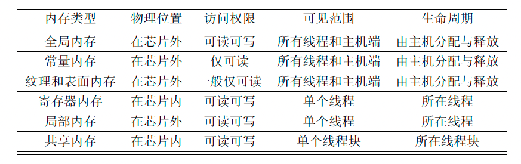
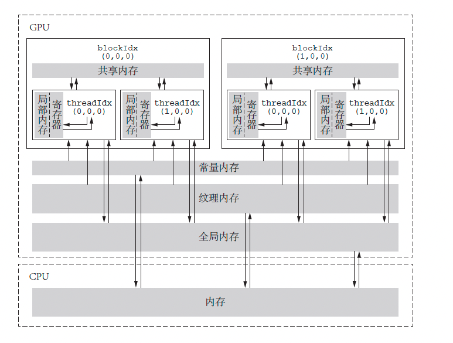

如下是 CUDA 内存的分级组织：

如下是 CUDA 中的内存组织图：

### 一、全局内存

全局内存由于没有存放在 GPU 的芯片上，因此具有较高的延迟和较低的访问速度。但是他的容量比较大，其容量基本上就是显存容量。

全局内存的主要角色是为核函数提供数据，并在主机与设备、设备与设备之间传递数据。

全局内存对整个网格的所有线程可见。也就是说，一个网格的所有线程都可以访问传入核函数的设备指针所指向的全局内存中的全部数据。

### 二、常量内存

常量内存是有常量缓存的全局内存，数量有限，一共仅有 64KB。他的可见范围和生命周期与全局内存一致。

不同的是，常量内存仅可读、不可写。由于有缓存，访问速度比全局内存高。

