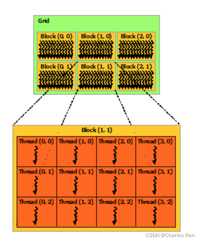
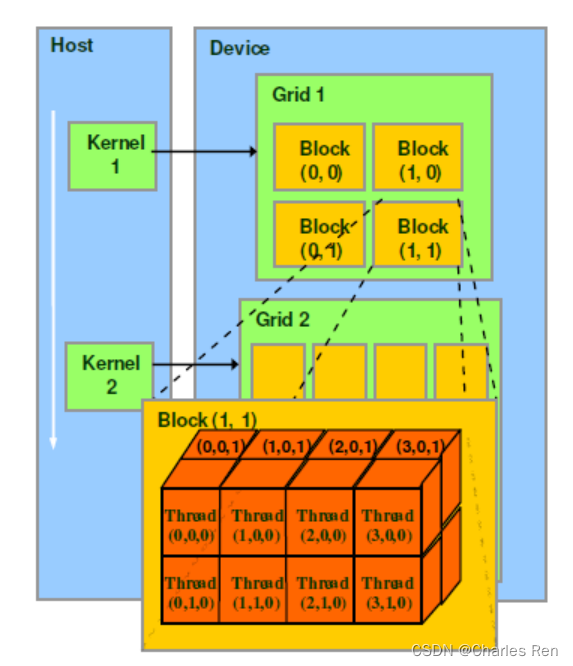
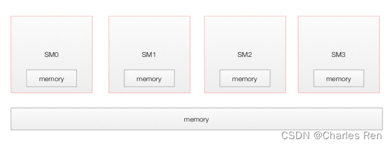
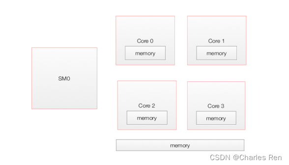
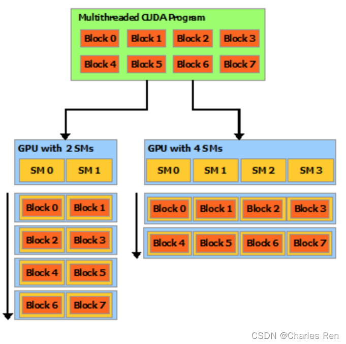

CUDA编程模型是一个异构模型，需要CPU和GPU协同工作。

kernel 函数其实就是运行在 gpu 上的函数。

#### 名词解析

```
SP(streaming Process), SM(streaming multiprocess) 是硬件的概念
线程、block、grid、warp 是软件上（cuda）的概念

SP：最基本的处理单元，streaming processor，也称为 CUDA core。最后具体的指令和任务都是在SP上处理的。GPU进行并行计算，也就是很多个SP同时做处理。

SM：多个SP加上其他的一些资源组成一个streaming multiprocessor。也叫GPU大核，其他资源如：warp scheduler，register，shared memory等。SM可以看做GPU的心脏（对比CPU核心），register和shared memory是SM的稀缺资源。CUDA将这些资源分配给所有驻留在SM中的threads。因此，这些有限的资源就使每个SM中active warps有非常严格的限制，也就限制了并行能力。
每个SM包含的SP数量依据GPU架构而不同，Fermi架构GF100是32个，GF10X是48个，Kepler架构都是192个，Maxwell都是128个。
一个GPU可以有多个SM（比如16个），最终一个GPU可能包含有上千个SP。
这么多核心“同时运行”，速度可想而知，这个引号只是想表明实际上，软件逻辑上是所有SP是并行的，但是物理上并不是所有SP都能同时执行计算，因为有些会处于挂起，就绪等其他状态。

thread：一个CUDA的并行程序会被以许多个threads来执行。
block：数个threads会被群组成一个block，同一个block中的threads可以同步，也可以通过shared memory通信。
grid：多个blocks则会再构成grid。
warp：GPU执行程序时的调度单位，目前cuda的warp的大小为32，同在一个warp的线程，以不同数据资源执行相同的指令,这就是所谓 SIMT。

软硬件对应关系：
thread —— sp
block —— SM流处理器（这个对应其实并不确切，上面我们看到一个SM里可以有很多block）
grid —— GPU device
```

由于 GPU 实际上是异构模型，所以需要区分 host 和 device 上的代码，在CUDA中是通过函数类型限定词开区别host和device上的函数，主要的三个函数类型限定词如下：

- `__global__`：在device上执行，从host中调用（一些特定的GPU也可以从device上调用），返回类型必须是`void`，不支持可变参数，不能成为类成员函数。注意用`__global__`定义的kernel是异步的，这意味着host不会等待kernel执行完就执行下一步。
- `__device__`：在device上执行，单仅可以从device中调用，不可以和`__global__`同时用。
- `__host__`：在host上执行，仅可以从host上调用，一般省略不写，不可以和`__global__`同时用，但可和`__device__`，此时函数会在device和host都编译。

#### CUDA 逻辑模型

一个 grid，每个 grid 下有很多个 block，每个 block 中有很多个线程。如下：





#### GPU物理模型

一个GPU包含多个流处理器 Streaming Multiprocessors (SMs)。他们公用一个 global memory。每个SM有自己的 local memory。
每个SM有很多个核心（core），他们公用一个shared memory，并且每个core有自己local memory。一个SM有很多个core，比如Pascal GP100里有2048个core，表示可以分配线程。





#### 运行模型

当一个kernel启动后，thread会被分配到这些SM中执行。大量的thread可能会被分配到不同的SM，同一个block中的threads必然在同一个SM中并行执行。
每个thread拥有它自己的程序计数器和状态寄存器，并且用该线程自己的数据执行指令，这就是所谓的Single Instruction Multiple Thread（SIMT）。
当一个CUDA程序调用一个kernel的grid时。GPU会找到可用的SM，然后block被分配到SM上执行，多个block可以被分配到一个SM上，一个thread在SM中的一个core上运行。

block是软件概念，一个block只会由一个sm调度，程序员在开发时，通过设定block的属性，告诉GPU硬件，我有多少个线程，线程怎么组织，比如下图，是两种线程的组织方式，仅仅是软件对应硬件组织方式而已，具体运行调度并不是按这个模型来调度的。但是组织方式影响了执行顺序。但是SM下有几个block的种组织方式也不是软件层面可以定义的，而是由硬件调度策略分配的，所以软件层面无需关心。
而具体运行时调度由sm的**warps scheduler**负责，这个我们下面说，block一旦被分配好SM，该block就会一直驻留在该SM中，直到执行结束。**一个SM可以同时拥有多个blocks，但需要序列执行。**

比如举个例子：
有一个CUDA进程有8个block，在运行一个程序时。如果GPU有两个空闲SM，则每个SM会被分配4个block。也可能这时GPU有4个空闲SM，这时，每个SM就可以被分配2个block了。



一个SM可以同时拥有多个blocks，但需要序列执行。不同SM是独立执行的。那么使用了4个SM的并行性是要更好的，所以他的执行效率应该更高。但是这个分配是硬件来决定的。

#### warp 概念

这个概念不属于CUDA的规范但是却有助于理解和优化在特定CUDA设备上运行的程序的性能
一个SM中物理层面实际上并不是所有的thread能够在同一时刻执行，而在软件层面我们可以理解为线程都并行 运行。。

warp是调度和运行的基本单元。warp中所有threads并行的执行相同的指令。一个SM中的32个线程被聚合为一个warp（一般是32个：具体数量硬件调度实现，程序员不用管）。这个参数也可以在不同的显卡的属性信息中得知，在SM中，warp才是线程调度的单位，而不是单个的线程。一个block被分成很多个warps。比如一个block中有320个线程，那么他被分成10个warps。一个block中的线程一定在一个wrap中。一个warp需要占用一个SM运行，多个warps需要轮流进入SM。由SM的硬件warp scheduler负责调度。

一个warp中的32个线程是并行执行的。一个block中不同warp是并发执行的。比如说一个block中分成10个warps，warp0执行了两步，这时可能会切换warp1去执行两步。再切换回warp0执行两步。也就是一个block中的warp不能并行执行。而是并发执行

无论如何，每次必调度32线程执行，即使只执行16线程，另外的16线程也会占用硬件。

#### 分支发散

warp有一个问题就是分支发散，叫做thread divergence
由于每次我们的的warp中的所有线程都是SIMT，单数据多线程同时执行。也就是一个warp中所有线程执行代码相同的，并且同时运行。但是如果他们的代码不同，也就是kernel函数中存在if else类似语句，导致一个warp中的线程不能同时运行一条语句。那么其中的其他分支就会强制进入等待状态，从而影响效率。

#### 软件层面的建议

软件层面，我们可以不用关心warp是如何调度执行的，那是硬件的策略。我们只关心如何设计block数量和thread的数量。

建议程序设计：每一个块内线程数应该首先是32的倍数，因为这样的话可以适应每一个warp包含32个线程的要求，每一个warp中串行执行，这就要求每一个线程中不可以有过多的循环或者需要的资源过多。但是每一个块中如果线程数过多，可能由于线程中参数过多带来存储器要求过大，从而使SM处理的效率更低。**所以，在函数不是很复杂的情况下，可以适当的增加线程数目，线程中不要加入循环。在函数比较复杂的情况下，每一个块中分配32或是64个线程比较合适。**这样才能最大化GPU使用率。

## 二、通信机制（同步函数）

1. 数据传输：比如 host 和 device 内存之间的拷贝函数，直接将数据拷贝过去
2. 通过共享内存，比如 shared_memory 在块内线程共享，unified memory 在 host 和 device 间共享内存

同步：

- 因为核函数异常执行，所以内存拷贝函数是默认同步的
- 当使用共享内存时，要考虑同步，否则会出现竞争问题

## 三、Stream

#### overlap data

支持重叠功能的设备的这一特性很重要，可以在一定程度上提升GPU程序的执行效率。一般情况下，CPU内存远大于GPU内存，对于数据量比较大的情况，不可能把CPU缓冲区中的数据一次性传输给GPU，需要分块传输，如果能够在分块传输的同时，GPU也在执行核函数运算，这样的异步操作，就用到设备的重叠功能，能够提高运算性能。

能够在执行一个CUDA核函数运算的同时，还能在主机和设备之间执行复制数据操作。也就是GPU在计算的时候，同时还可以进行host和device之间的数据传输。

使用CUDA流，首先要选择一个支持设备重叠功能的设备，支持设备重叠功能的GPU。

#### 为什么使用 stream

如果我们开启多个核函数，操作都是串行执行的。但是如果我们想并发执行，就可以开启多个stream。多个stream是并发执行的。每个stream中是串行执行。

用到CUDA的程序一般需要处理海量的数据，内存带宽经常会成为主要的瓶颈。

默认情况我们只使用一个stream。这个stream是串行执行的，
由于GPU和CPU不能直接读取对方的内存，CUDA程序一般会有一下三个步骤：
1）将数据从CPU内存转移到GPU内存，
2）GPU进行运算并将结果保存在GPU内存，
3）将结果从GPU内存拷贝到CPU内存。

如果不做特别处理，那么CUDA会默认只使用一个Stream（Default Stream）。在这种情况下，刚刚提到的三个步骤，必须串行处理。

**如果一个API需要stream对象，传入参数0，则这个他使用的就是默认stream**。默认 stream 是一个同步的 stream。