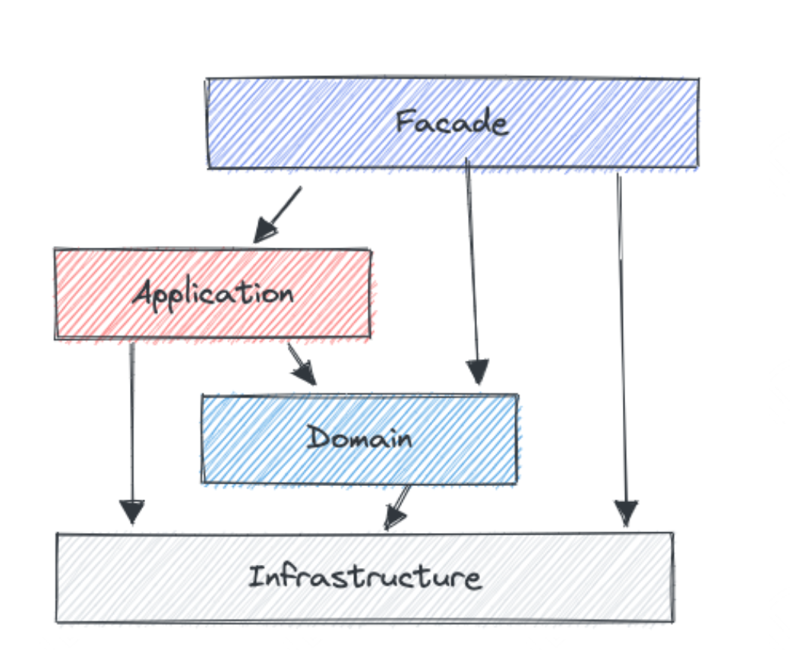
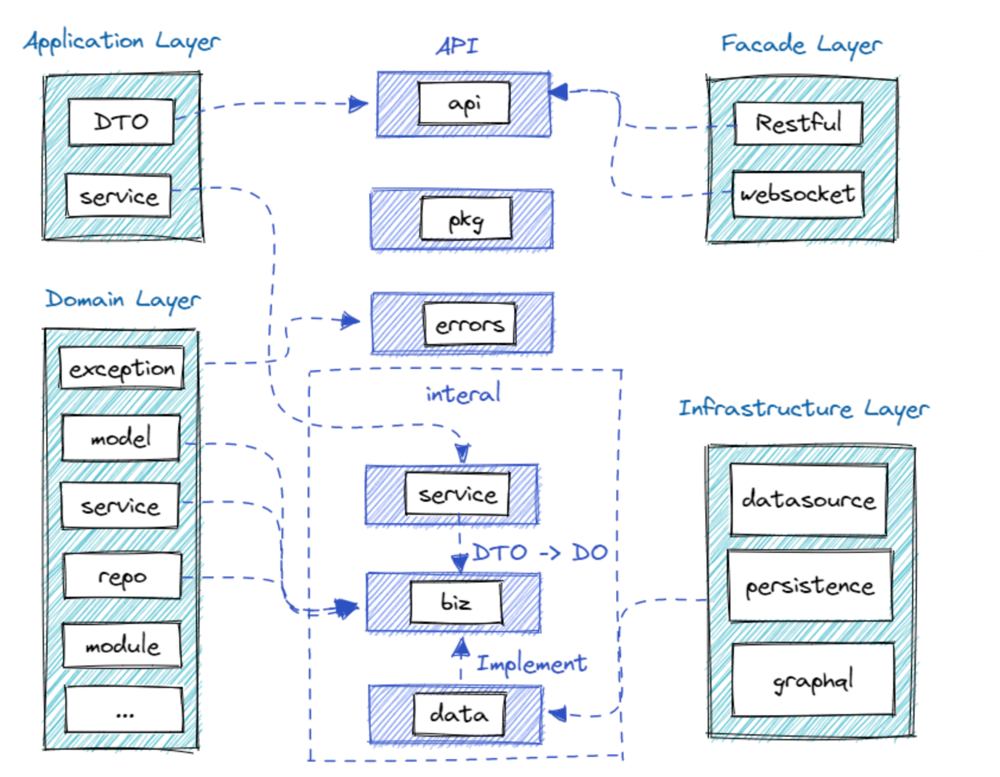
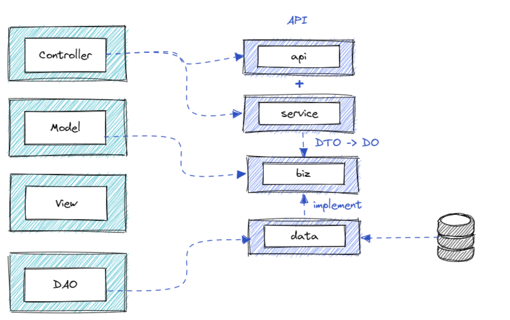

## App 监控


### 一、工作经历

单独负责设计、开发、运维App监控系统的后端，并且已经推动公有云上线。

在 MVC 三层架构的基础上，融入了 DDD 设计的思想，设计了较为适合业务的 Go 语言项目框架。解决了实践中 MVC 三层架构的职责不清、缺乏领域对象概念；DDD 过于复杂，上手和落地困难的问题。

Web 后端模块设计和开发：设计了新的项目框架融合了DDD的四层设计与MVC三层项目结构，避免了DDD过于复杂的概念与目录层级，同时也避免了MVC三层架构的 Service 代码堆积问题。快速实现了查询各种监控数据、客户鉴权、白名单控制、配置管理等等功能

接入层模块的设计和开发：流量控制、配置下发、异步上报、数据缓存

App监控系统的整体架构设计，采用微服务的架构思想，基于业务逻辑拆分系统中业务模块， 按照职责范围进行识别划分，同时明确模块的职责范围；服务划分粒度适中，每个模块各司其职，服务间不互相依赖；服务数量适中，调用链路短，保证高性能和简单快速的问题定位，规避了故障扩散现象。


由于三层架构（MVC）在实践中可能会出现职责不清、接口处理层（Controller 层）和业务逻辑层（Service层）出现越界逻辑；缺乏定义领域对象的概念，导致业务维护起来成本较大。因此我们参考 Kratos 的项目工程化理念，融合 DDD 的设计思想，加入了领域边界概念，将 MVC 的 Model 层抽象成应用逻辑层（biz，就是 Business）（也叫领域层），而描述应用逻辑层的对象，就是我们应用程序中的一些核心对象，会将 model、service、dao 相关的接口 interface 设计放在这里，并实现业务逻辑，类似于 DDD 的 domain 层。我们会在 service 层实现 DDD 的 application 的功能，处理用户的请求，并且实现 DTO 到 DO 的转换。我们的 data 层主要用于将领域对象从持久层取出来，也就是 DAO 里面的 interface 的实现，通过 data 层去掉了 DDD 基础层，主要是封装一些业务数据的访问，例如 kafka、redis、db等，同时在 data 层实现 biz 定义的 repo 接口。整体上保证了 MVC 三层架构的简单，引入 DDD 领域、边界的概念，改善了 MVC 三层架构可能会出现的问题，可维护性较高。

MVC 的 service 层和 DO 层，分别由 biz（business）层和 data 层取代。而且我们还基于 trpc-go 框架去搭建。参考结合了 Kratos 的设计
从 Kratos 设计看 Go 微服务工程实践：https://www.infoq.cn/article/mee5qutrtjvgwzpp57y6


### Project Layout 设计

https://km.woa.com/articles/show/536419?kmref=search&from_page=1&no=5

#### 1. 传统的三层架构

- Controller 负载处理用户的请求，面向用户暴露的接口逻辑写在这里
- Service 负责编写业务层的逻辑
- DAO 负责处理数据层的逻辑，针对数据的增、删、改、查
- View 一般是面向用户的界面，与后台无关

阿里对三层架构的划分：


Manager 层是对第三方平台封装的层，预处理返回结果及转化异常信息。对 Service 层通用能力的下沉，如缓存方案、中间件通用处理。与 DAO 层交互，对多个 DAO 的组合复用。

#### 2. 三层架构的问题

1. 实践中存在的问题：职责不清

传统的 Controller 层即接口处理层与 Service 业务逻辑层，会出现职责不清的问题，可能会写着写着出现一些越界逻辑

比如，我们要校验业务权限，如果这段代码放在 Controller，那每个 Controller 都容易堆积这样一堆代码（刚好这里不适应使用 middleware 校验）。如果放在 Service 层，那就违反规则（用户请求应该在 Controller 层做）越界了。

2. 缺乏定义领域对象的概念


很多领域中有重要防腐作用的概念，都没有在三层架构中体现，例如 VO（view object，把某个指定页面或组件的所有数据封装起来）、DTO（Data Transfer Object 数据传输对象）、DO（Domain object 领域对象，从现实世界抽象出来的业务实体）、PO（Persistent object 持久化对象）

没有这些概念对对象进行划分的时候，最常见的问题就是导致各个实体对象直接传输到各个层级。透传的问题就会导致客户端可能需要的数据字段，会污染整个业务对象。

比如我们定义了一个用户的对象，如果我们从 DAO 一直到接口到客户端都使用这样的结构定义，然后后面客户端更新，需要增加更多的字段（甚至一些接口是 DAO 层不需要的），那我们在修改数据库字段的时候还要考虑会不会影响展示层，这样就污染 DAO 层了，本来 DAO 层数据的修改不应该影响接口层的展现。还有用户对象若定义了用户密码的字段，这个字段肯定不能通过接口传递出去的，透传的话就需要有逻辑去过滤掉这个密码。因此，如果数据层和逻辑层的数据结构都用同一个，并且是透传，业务层的字段慢慢渗透到存储的持久层，导致不同的分层的这个结构最终是面向数据库表的。我们的业务逻辑很容易就演变成编写数据库逻辑。

总体来说，DAO 层被业务逻辑绑架了，业务和持久层混合，使得业务维护起来越来越困难，代码越来越腐败，慢慢的我们就会成了面向数据库写逻辑了

#### 3. DDD 领域驱动设计的难点

领域驱动开发，它是一套指导开发和设计复杂软件的方法论



- 接口层（Facade）一般包含用户界面、 web服务（restful、ws 等）可能还有其他服务。
- 应用层（ Application）一般包含应用的服务，包括 DTO（Data transfer object）、service 等。
- 领域层（Domain）实现领域的核心业务逻辑，例如 model 、service、repo、module 等。
- 基础层（Infrastructure）基础层是贯穿所有层的，它的作用就是为其它各层提供通用的技术和基础服务，包括第三方工具、驱动、消息中间件、网关、文件、缓存以及数据库等。比较常见的功能还是提供数据库持久化。

DDD 分层的职责非常明确，每一层都能做到各司其职，边界清晰。但是 DDD 规定了分层，告诉了我们怎么分层比较好，但是没有告诉我们怎么做。实现 DDD 项目分层非常复杂，无法根据概念分清楚自己的代码应该写在那里。再加上 DDD 的概念太多（CQRS命令和职责分离、事件驱动、六边形架构）等等。太难、太复杂，导致 DDD 在落地上存在非常大的困难。

#### 4. TAM Project Layout 工程化设计理念

1. 与 DDD 的映射关系



- 其中接口层（Facade layer）一般包含用户界面、 web服务（restful、ws 等）可能还有其他服务，他对应过来我们的 layout 就是 api 层文件夹，包含了提供web、rpc 等服务的 pb 文件以及 api 的定义
- 应用层（ Application layer）一般包含应用的服务，包括 DTO（Data transfer object）、service 等，对应我们 layout 的 internal/service 的服务应用层，是用来实现 api 的逻辑，主要任务是把 DTO 转换到 DO（ *DTO 就是 Data Transform Object，专门用于数据传输的，比如说 ProtoBuf 定义的数据就是 DTO* ）。
- 领域层（Domain layer）实现领域的核心业务逻辑，例如 model 、service、repo、module 等。对应我们的 biz 层，主要负责组装业务逻辑，定义 repo等
- 基础层（Infrastructure layer）基础层是贯穿所有层的，它的作用就是为其它各层提供通用的技术和基础服务，包括第三方工具、驱动、消息中间件、网关、文件、缓存以及数据库等。比较常见的功能还是提供数据库持久化。 对应我们的 layout 的 data 层，主要是封装一些业务数据的访问，例如 kafka、redis、db 等，他是对于 biz 定义的 repo 接口的实现。

2. 与三层架构的映射关系



- Controller 就对应 api + service 负责处理请求
- Mode 就是 biz 层，类似的作用是描述应用逻辑层（也叫领域层）的对象，这些对象是你开发的应用程序中的一些核心对象。
- View 无
- DAO ： DAO 就对应我们 layout 的 data 层，但是与之不同的是，DAO一般只描述和存取数据，而 data 更偏向于是将领域对象从持久层取出来。

#### 5. TAM Project Layout 实际设计

```
// project layout
├── api
│   └── tam_collect_svr
│       └── stub
│           └── git.code.oa.com
│               ├── trpc
│               │   └── common
│               │       └── validate.proto
│               └── trpcprotocol
│                   └── tam
│                       └── collect_tam_collect_svr
│                           ├── go.mod
│                           ├── go.sum
│                           ├── tam_collect_svr_mock.go
│                           ├── tam_collect_svr.pb.go
│                           ├── tam_collect_svr.pb.validate.go
│                           ├── tam_collect_svr.proto
│                           └── tam_collect_svr.trpc.go
├── cmd
│   └── interface
│       └── main.go
├── configs
│   ├── Development
│   │   ├── app.yaml
│   │   └── trpc_go.yaml
│   └── Production
├── docs
│   └── architecture.md
├── errors
│   ├── errors.go
│   └── errors_test.go
├── go.mod
├── go.sum
├── internal
│   ├── biz
│   │   ├── domain
│   │   │   ├── project.go
│   │   │   └── project_test.go
│   │   ├── repo
│   │   └── usecase
│   ├── data
│   │   ├── do
│   │   │   └── project.go
│   │   ├── project_repo.go
│   │   └── project_repo_test.go
│   ├── pkg
│   │   ├── chain
│   │   ├── datasource
│   │   ├── monitor
│   │   └── pipeline
│   ├── server
│   │   └── trpc.go
│   └── service
│       ├── collect.go
│       └── healthcheck.go
├── main.go
├── makefile
├── pkg
│   ├── filter
│   └── utils
├── scripts
│   ├── monitor.sh
│   ├── README.md
│   ├── start.sh
│   └── stop.sh
├── test
├── transport
│   └── rum
├── trpc_go.yaml
└── trpc.log
```

结合 go standard layout 设计公共的目录

- /cmd：cmd 目录主要是负责项目的初始化，包括读取配置等，以及控制项目的启动、关闭、配置初始化。每个应用程序的目录名应该与你想要的可执行文件的名称相匹配(例如， `/cmd/interface` )，但是这里存放的并不是整个 Golang 项目的启动文件（`main.go`），这样 `go build` 出来是一个名为 cmd 的二进制文件，没人知道是项目的启动文件
- /internal：那这个目录是由 go 编译器本身强制执行的一个规定，就是这里是放置一些你不希望别人在其他的应用里面去 `import` 你的代码的，也就是私有应用程序和库代码。关于 `/internal` 的更多细节可以查阅官方文档，那我们 `/internal` 底下还有 4 个重要的文件夹，包括 `biz`、`data`、`service`、`service`，我们在下文再展开细节。
- /pkg：放置一些可以被外部 import 的代码，我们在这里放了一些 trpc-go 的 filter 、logger 插件 和一些可以共享的 utils。 其他的项目会 import 这些库、所以再这里放入的包，不能依赖于本项目的一些配置，如果不希望你的库、代码被其他项目引用，建议还是放入 internal 底下

服务应用程序目录

- /api：约定 API 协议的目录，我们在这里放置了 trpc 的 proto 文件，以及 trpc-go 生成的文件也放在这里
- /transport：我们在这里放置了一些协议层的插件，得益于tRPC 以插件机制，我们将协议层抽象成一个个可插拔的插件，这样我们只需要配置就可以暴露各种不同的协议实现服务。例如我们这里有个 rum 的文件夹，里面是用于规整和转换各个 sdk 上报的数据的一个协议层插件，使到接口可以同时兼容 rpc、http 等方式调用
- /errors：服务自定义的错误定义在这里

通用应用目录

- /configs：配置文件文件夹，这里会放入一些项目启动时候会读取的一些配置，其他的配置我们会放到 rainbow 中。 configs 下面还会区分 Development 和 Production 的文件夹
- /scripts：各种执行操作的脚本会放在这里，例如启动、停止服务、构建、监控的脚本等。 这些脚本也会被跟目录的 `makefile` 所调用。

应用内部目录 /internal/*

- /internal/server：创建 trpc 、http 服务，并且注入配置、service
- /internal/service：类似于 DDD 的 application 层，处理用户的请求，并且实现 DTO 到 DO 的转换
- /internal/biz：领域定义模型层，将 model，service，dao 相关的 interface 设计放在这里，并实现业务逻辑。
    类似于 DDD 的 domain 层，其中 repo 的接口也定义在这里。
    同时我们也把 DDD 的 `usecase` 也放在这里，其中包含了应用特有的业务规则。它封装和实现了系统的所有用例，可以理解为能够复用的逻辑
- /internal/data：也就是 DAO 里面的 interface 的实现，我们通过 data 去掉了 DDD 基础层。主要是封装一些业务数据的访问，例如 kafka、redis、db 等，同时在 data 这里实现 biz 定义的 repo 接口
- /internal/pkg：项目内部共享，不希望被外部项目引用的可以复用的代码

其他目录

- /docs：项目的介绍、设计、开发文档。 除了根目录的 `README.md` 外关于项目需要记录的 text 内容可以放到这里
- /test：不是放置测试用例，测试用例直接写在被测试的代码隔壁即可。
    这里更多的放测试数据、方便测试的一些脚本或者程序。例如我们有 `/test/http/data` 
- makefile：我们会在这些放置一些相关相关的命令，例如 build tool cli、 stub、test 、golang lint 、docker compose 启动命令等

#### 6. 总结：

我们在三层架构的基础上引入了 DDD 的领域概念，实现代码职责分明、避免代码冗余，可维护性更强。适合我们当前的项目情况，软件工程设计没有银弹，每个项目的情况都不一样，适合自己的才是最好的。

参考： 从 Kratos 设计看 Go 微服务工程实践：https://www.infoq.cn/article/mee5qutrtjvgwzpp57y6
参考：Standard Go Project Layout： https://github.com/golang-standards/project-layout/blob/master/README_zh.md


