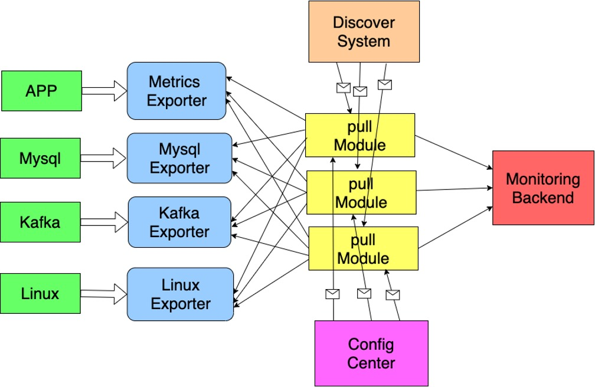
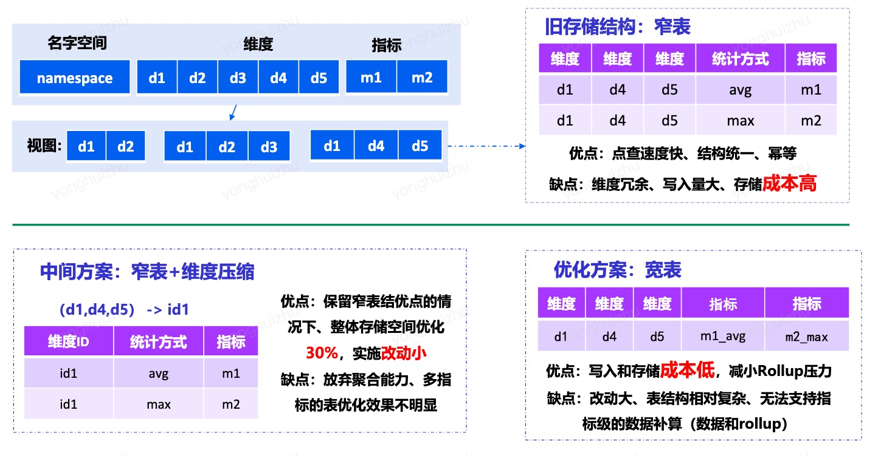

## 指标监控

### 一、架构组成

SDK -> TencentCloud_CloudMonitor_Agent -> 云监控接口机 -> kafka -> 指标计算 -> Kafka -> writer 存储/告警 

### 二、工作经历

数据量：云基础监控上报指标量8.3万亿/d，存储记录数8500亿/d
			  自定义监控上报记录数2200亿/d，存储记录数600亿/d

l 协议设计：窄表改造成宽表，业界著名监控系统prometheus、statsd等协议采用的是窄表（一张表一个指标）上报数据，通过在telegraf支持窄表转换宽表（一张表多个指标），大幅降低了数据的上报流量。例如：开源Flink自监控数据上报流量从10GB/m降至2GB/m

l Tccm-Agent设计&开发，分析了业界和公司内监控Agent实现，最终基于开源项目telegraf 进行改造，适配云监控中台的数据上报协议，使得原来采用prometheus、statsd、influx line protocol、kafka等协议上报数据的用户，可以方便的将数据转发上报到云监控中台；且为了降低维护成本，增加了一些必要的功能，例如：热更新配置、自监控、合并聚合监控数据等等

l Tccm-SDK设计&开发：分析了业界（prometheus、datadog、influxdb等）和公司内（007、monitor等）SDK的上报协议和实现；基于pb/文本两种传输协议；支持公司内部和业界所有的数据统计方式；性能上每秒上报指标量可以达到百万级别，而其他SDK都只是在十万级别；且支持多语言（go、c++、java、python、php等）

协议设计：窄表改造成宽表，业界著名监控系统prometheus、statsd等协议采用的是窄表（一张表一个指标）上报数据，通过在Tccm-SDK和Tccm-Agent支持窄表转换宽表（一张表多个指标），大幅降低了数据的上报流量。
性能：例如开源Flink自监控数据上报流量从10GB/m降至2GB/m

Tccm-Agent的设计与开发：调研分析了业界和公司内监控Agent的实现，最终采用微内核架构，面向功能进行拆分插件种类，分为输入、预处理、聚合、输出插件，以配置文件的方式实现插件注册机制进行插件管理，不同种类的插件之间通过线程安全队列进行连接通信，插件完全解藕，可扩展性强。且快速适配了prometheus、statsd、influx line protocol等开源协议上报数据的用户，可以方便的将不同的数据协议进行整理、统一格式且将数据聚合之后上报到云监控中台。
性能：Tccm-Agent可接收流量80M/s，占用资源CPU：2C，MEM：60M

Tccm-SDK的设计与开发：分析了开源界（prometheus、datadog、influxdb等）和公司内（007、monitor等）监控系统的SDK的上报协议和实现，采用宽表（一张表多个维度多个指标）作为数据流转或存储协议，以文本作为数据传输协议，实现线程安全的多写单读队列作为中介进行缓冲数据，定时读取数据进行聚合处理后上报到Tccm-Agent；功能上支持公司内部和开源界所有的数据统计方式；支持多语言（go、c++、java等）
性能：SDK在不丢数据的情况下，最高可传输100w指标数每秒，流量70M/s，占用资源CPU：1.1C，MEM：100M

### 三、pull or push

#### 1. pull 

依赖服务发现系统帮助我们发现 pod 。prometheus 采用这种方式。

| **核心组成** | **说明**                                                     |
| ------------ | ------------------------------------------------------------ |
| 服务发现系统 | 1.主机的服务发现(一般依赖公司内部CMDB系统)  2.应用服务发现(Consul)  3.PaaS服务发现(Kubernetes) |
| Pull核心模块 | 1.通用的协议  2.配置项(拉取间隔、超时间隔、指标过滤、指标合并等) |
| 应用侧SDK    | 1. 暴露端口                                                  |
| Exporter     | 1.拉取系统指标  2.提供标准Pull接口                           |

pull 的分布式解决方案：

- pull 模块与监控后端解耦，pull 模块单独部署
- pull 模块需要分布式协同，例如，从服务发现模块获取被监控的机器列表，对这些机器进行 hash 后取模来决定由那个 pull agent 来负责哪些节点
- 新增一个配置中心（可选）来管理各个 pull Agent 

缺点：

- 还是存在单点瓶颈，所有 Agent 都需要请求服务发现模块
- Agent 扩容之后，监控目标变化，容易产生数据重复或者缺失

#### 2. push

influxDB 的 TICK（ telegraf / influxDB / chronograf / kapacitor ）

| **核心组成**             | **说明**                                                     |
| ------------------------ | ------------------------------------------------------------ |
| Push Agent               | 1.拉取各类被监控对象的指标数据并推送服务端  2.可以和被监控系统耦合部署或单独部署 |
| Config Center     (可选) | 1.提供中心化动态配置能力(例如：监控目标、采集间隔、指标过滤、指标处理、远端目标) |
| 应用侧SDK                | 1.支持发送数据直接到监控后端  2.也可发送到本地Agent          |

#### 3. 对比

| 一级分类   | 二级分类                                     | pull                                                         | push                                                         |
| ---------- | -------------------------------------------- | ------------------------------------------------------------ | ------------------------------------------------------------ |
| 原理与部署 | 配置                                         | 原生中心化配置                                               | 端上配置，通过配置中心支持中心化                             |
| 原理与部署 | 监控对象分类                                 | 依赖服务发现机制，例如 zookeeper、etcd、consul 等注册中心    | 由应用、agent自主上报，无需服务发现模块                      |
| 原理与部署 | 部署方式                                     | 1. 应用程序暴露端口，接入服务发现，支持 pull 协议 2. 其他系统如MySQL、nginx 等中间件依赖适配器（Exporter）抓取指标再提供 pull 端口 3. 部署方式太过复杂，维护代价较高 | 1. Agent 可以作为统一代理，抓取主机、MySQL 等中间件数据推送到监控系统；Agent 也可以作为转发器接收应用推送 2. 应用主动推送到监控系统 3. 部署方式较为方便 |
| 可扩展性   | 可扩展性                                     | 1. 依赖客户端实现扩展 2. 有服务发现的单点瓶颈问题 3. 扩容后，数据容易出现重复或者缺失 | 简单，Agent 本身可横向扩展                                   |
| 能力对比   | 监控对象存活性                               | 简单                                                         | 无法区分对象未存活的原因                                     |
|               |                               |                                                              |                                                              |
| 能力对比   | 短生命周期（Job、Serverless） | 难以适用                                                     | 适用                                                         |
| 能力对比   | 指标获取灵活性                               | 可以按需获取                                           | 被动接受，需要配置过滤器额外支持                           |
| 能力对比   | 应用耦合性                                   | 应用与监控系统解耦，应用无需关心后端地址 | 耦合性相比 pull 较高，比如可能需要处理 Push 错误如何处理等              |
| 机器/人力代价 | 资源消耗 | 1. 应用暴露端口方式资源消耗低 2. Exporter 方式资源消耗较高 | 1. 应用推送方式资源消耗低 2. Agent 方式资源消耗较低（可同时采集多套系统） |
| 机器/人力代价 | 安全性保证 | 需要保证应用暴露端口的安全性以及 Exporter 端口的安全性，容易被 DDos 攻击或者出现数据泄露 | 较为安全，Agent 与服务端可以进行带有加密、鉴权的数据传输 |
| 机器/人力代价 | 核心运维消耗 | 1. Pull Agent稳定性与扩容 2. 服务端稳定性与扩容 3. 服务发现系统稳定性 4. Exporter 稳定性与扩容 5. 网络连通性保障（反向连通性、跨集群） | 1. Push Agent 稳定性 2. 服务端稳定性与扩容 3. 配置中心稳定性与扩容（可选） 4. 网络连通性保障（正向连通性） |

### 四、宽表和窄表

旧的存储方式使用窄表，一张表只有一个指标，维度冗余特别严重，写入量大，存储成本高。但是也有点查速度快、结构统一、读写具有幂等性 等优点。我经过调研，很多场景业务在同一维度下会有多个指标的监控，因此采用宽表作为存储方式，是我们的写入和存储成本大幅降低，并且减小了 Rollup 压力；指标计算模块 Flink 自监控数据上报流量从10GB/m降至2GB/m

### 五、SDK 设计与对比

| SDK            | 功能                                                         | 性能                                                         |
| -------------- | ------------------------------------------------------------ | ------------------------------------------------------------ |
| prometheus SDK | 1. 统计方式支持不足，例如：set、first、last 2. counter 统计方式为进程启动后一直递增，重启会出现负值，引发误告警 3. 数据以窄表传输，占用存储空间大。且窄表和宽表之间的转换配置较困难 | 1. 会在内存中存储所有指标，占用内存非常大 2. 指标比较多的情况下，每次传输数据量特别大，超过阈值会被丢掉  |
| Statsd SDK     | 1. 使用文本传输数据（使用特殊符号分割），造成业务数据对特殊符号敏感 2. 数据以窄表传输，占用存储空间大。且窄表和宽表之间的转换配置较困难 3. 官方各语言 SDK 不齐全，生态不完善 | 数据未做聚合，冗余数据量特别大，占用带宽资源多               |
| influxdb SDK   | 1. 数据没有统计方式，k-v 形式数据，存储的是原始数据，占用存储空间大 2. 使用文本传输数据，对敏感字符过敏 | 数据无法做聚合，冗余数据量大，占用带宽资源多                 |
| Tccm SDK       | 1. 统计方式齐全，支持 sum、max、min、first、last、counter、gauge、histogram、summary、set 等 2. 数据以宽表形式组织，存储空间低 3. 数据聚合，相同维度的指标经过聚合后数据量特别小，传输数据少，带宽占用小 4. 使用文本进行传输，对敏感字符进行过滤，且没有数据序列化，CPU 占用少 | 上报数据量每秒可以达到百万级别                               |

Tccm SDK 采用宽表（一张表多个维度多个指标）作为数据流转或存储协议，以文本作为数据传输协议，实现线程安全的多写单读队列作为中介进行缓冲数据，定时读取数据进行聚合处理后上报到Tccm-Agent；功能上支持公司内部和开源界所有的数据统计方式。线程安全队列以 内存池 规避需要申请内存块的耗时，以链表链接这些内存块，读和写线程的临界区只是链表的头指针；写线程之间的临时区只是链表的尾指针；锁粒度特别低，而且锁范围内只有简单的赋值和++操作，不会发生异常情况。在有锁和无锁中， 我选择有锁，因为无锁的实现并不能给我带来性能上大的提升；而且代码实现起来较为简单，收益和付出成正比。 后面读线程拿到数据进行聚合后可选 tcp/udp 上报。

【SDK 的内存池，业务调用接口在初始化一个指标的时候，会从 SDK 的内存池拿到一块内存来使用（拿内存块的过程要加锁）。线程安全队列是有长度的，20w 的长度，每个内存块大小 512 字节，因此最大的情况会占用 97M 的空间。内存池不会一下子申请 20w 个内存块，而是先初始化时申请 5w 个，然后后续发现内存池里面拿不到内存块，则进行申请内存，到达 20w 封顶。读线程读完之后还给内存池。】

### 六、Agent 的设计

调研分析了业界和公司内监控Agent的实现，最终采用微内核架构，面向功能进行拆分插件种类，分为输入、预处理、聚合、输出插件，以配置文件的方式实现插件注册机制进行插件管理，不同种类的插件之间通过线程安全队列进行连接通信，插件完全解藕，可扩展性强。且快速适配了prometheus、statsd、influx line protocol等开源协议上报数据的用户，可以方便的将不同的数据协议进行整理、统一格式且将数据聚合之后上报到云监控中台。

采用微内核架构，可扩展性特别高，确认了“变”和“不变”的边界。即内核是永远不变的，而提供 interface 接口 API 用来实现插件。通过公司内部平台七彩石进行配置管理。较为灵活。使用 go 语言开发，充分利用了 go 语言协程、支持高并发的特性。而且采用 push 的方式可以简单高效的支持分布式，方便扩容。

Agent 的缺点：
如何保证数据不会丢失？agent 一般会保存 10 秒的数据做聚合，聚合后发送，那这 10 秒内 agent 挂了，数据丢失如何处理？agent 的定位是在客户端，相当于客户端的一个组件，和业务服务同机部署。我们面向的场景是对于数据的准确度和性能上，优先选择性能的场景，不会处理对数据准确度要求特别高的场景，对数据准确度较高的场景，agent 数据应该直接落磁盘。我们监控的目的是帮助业务快速发现问题，而不是传输业务数据，对数据做业务相关的用途。也就是用户的数据是允许丢的，但丢了之后一定要告警出来。基于这个大方向，我会将数据放在内存中处理，同时为了弥补这方面的缺失，在 agent 上会有进程监控和自动监测重启功能，可以及时告警。做架构需要取舍，不能既要性能又要数据安全，只能选择其中，尽最大可能保证另外一个。
还有一点，Agent 存在的主要意义是做数据预处理、预聚合，减少数据量，保护接入层。如果像 kafka 一样，选择数据存储磁盘，就丧失了Agent 存在的意义；而且虽然保证了数据的安全，但也是以性能为代价，不符合我们的场景。

