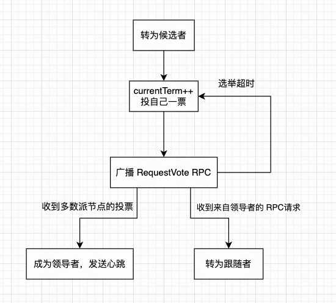

raft 算法所运行的系统模型是：

- 服务器可能宕机、停止运行，过段时间再恢复，但不存在非拜占庭故障，即节点的行为是非恶意的，不会篡改数据。
- 消息可能丢失、延迟、乱序或重复；可能有网络分区，并在一段时间之后恢复

raft 算法和 multi-paxos 算法一样是基于领导者的共识算法。raft 算法中的服务器在任意时间只能处于以下三种状态之一：

- 领导者：领导者负责处理所有客户端请求和日志复制。同一时刻最多只能有一个正常工作的领导者
- 跟随者：跟随者完全被动的处理请求，即跟随者不主动发送 RPC 请求，只响应收到的 RPC 请求，服务器在大多数情况下处于此状态
- 候选者：候选者用来选举出新的领导者，候选者是处于领导者和跟随者之间的暂时状态

raft 算法将分布式系统中的时间划分成一个个不同的任期。每个任期都由一个数字来表示任期号，任期号在算法启动时的初始值为0，单调递增并且永远不会重复。

一个正常的任期至少有一个领导者，任期通常分为两部分：任期开始时的选举过程和任期正常运行的部分。任期如果没有选出领导者，这时会立即进入下一个任期，再次尝试选出一个领导者。

每台服务器需要维护一个 currentTerm 变量，表示服务器当前已知的最新任期号。并且必须持久化存储，以便在服务器宕机重启时能够知道最新任期。

### 一、领导者选举

领导者为了保持权威，必须向集群中其他节点周期性发送心跳包，即空的 AppendEntries 消息。如果一个跟随者节点在选举超时时间内没有收到任何任期更大的 RPC 请求，则该节点认为集群中没有领导者，于是开始新的一轮选举。

选举流程如下：

- 节点转为候选者状态，其目标是获取超过半数节点的选票，让自己成为新一任期的领导者
- 增加自己的当前任期变量 currentTerm，表示进入一个新的任期
- 先给自己投一票
- 并行的向系统中的其他节点发送 RequestVote 消息索要选票，如果没有收到指定节点的响应，则节点会反复尝试，直到发生以下三种情况之一才更新自己的状态。
  - 获取超过半数的选票。该节点成为领导者，然后每隔一段时间向其他节点发送 AppendEntries 消息作为心跳，以维持自己的领导者身份
  - 收到来自领导者的 AppendEntries 心跳，说明系统中已经存在一个领导者了，节点选为跟随者
  - 经过选举超时时间后，其他两种情况都没发生，也没有节点能够获胜，节点开始新一轮选举

在选举过程中，需要保证安全性和活性。安全性是指一个任期内只会有一个领导者被选举出来。需要保证：

- 没个节点在同一任期内只能投一次票，它将投给第一个满足条件的 RequestVote 请求，然后拒绝其他候选者的请求。每个节点有一个投票信息变量 votedFor，表示当前任期内选票投给了那个候选者，如果没有投票，则 votedFor 为空。投票信息 votedFor 需要持久化存储，以便节点宕机重启后恢复投票信息，否则节点重启后 votedFor 信息丢失，会导致一个节点投票给不同的候选者。
- 只有获得超过半数节点的选票才能成为领导者。也即两个不同的候选者无法在同一任期内都获得超过半数节点的投票。

活性意味着确保系统最终能选出一个领导者。

### 二、日志复制

每个节点存储自己的日志副本，日志中的每个日志条目包括以下内容：

- 索引：表示该日志条目在整个日志中的位置
- 任期号：日志条目首次被领导者创建时的任期
- 命令：应用于壮态机的命令

raft 算法通过 索引和任期号 唯一标识一条日志记录。

日志必须持久化存储。一个节点必须先将日志条目安全写到磁盘中，才能向系统中其他节点发送请求或回复请求。

如果一条日志条目被存储在超过半数的节点上，则认为该记录已提交。如果记录已提交，则意味着壮态机可以安全的执行该记录，这条记录就不能再改变了。

raft 算法正常运行时，日志复制的流程为：

- 客户端向领导者发送命令，希望该命令被所有状态机执行
- 领导者先将该命令追加到自己的日志中，确保日志持久化存储
- 领导者并行的向其他节点发送 AppendEntries 消息，等待响应
- 如果收到超过半数节点的响应，则认为新的日志记录已提交。接着领导者将命令应用到自己的状态机，然后向客户端返回响应。此外，一旦领导者提交了一个日志记录，将在后续的 AppendEntries 消息中通过 LeaderCommit 参数通知跟随者，该参数代表领导者已提交的最大的日志索引，跟随者也将提交日志索引小于 LeaderCommit 的日志，并将日志中的命令应用到自己的状态机。
- 如果跟随者宕机或者请求超时，日志没有成功复制，那么领导者将反复尝试发送 AppendEntries 消息。

为了保持安全性，raft 算法维持了以下两种特性：

- 如果两个节点的日志在相同的索引位置上的任期号相同，则认为他们具有一样的命令，并且从日志开头到这个索引位置之间的日志也完全相同
- 如果给定的记录已提交，那么所有前面的记录也已提交。注意：paxos 算法允许日志不连续的提交，但 raft 算法的日志必须连续的提交，不允许出现日志空洞

