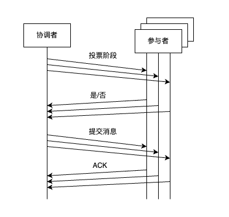

两阶段提交（`Two-Phase Commit`，2PC）由两个阶段组成。

基本思想：先检查每个节点上的状态是否能够满足事务正确性，再进行事务操作。

### 一、算法流程

包含两个角色：协调者（`Coordinator`）和参与者（`Participants`）。

协调者负责协调算法的各个阶段。参与者负责执行事务操作。如下两个阶段。

1. 第一阶段：投票阶段

   - 首先协调者向所有参与者并行发送准备消息，询问参与者是否可以提交事务，并等待参与者响应。
   - 参与者检查执行事务所需条件和资源（如权限验证、上锁等），一切都准备好后参与者执行事务的所有操作，并记录操作日志。
   - 参与者响应协调者发起的请求。如果参与者发现事务的所有操作都执行成功，则返回一条“是”消息；如果参与者发现 “所需条件和资源” 检查失败，或者事务操作执行失败，则返回一条 “否” 消息。

2. 第二阶段：提交阶段。
   协调者收到所有参与者上一阶段的响应，如果所有参与者都回复 “是”，那么：

   - 协调者向所有参与者发送 “提交” 消息，指示参与者提交本次事务，等待参与者响应。
   - 参与者收到提交消息后，正式提交事务。完成事务提交操作后，清理占用的资源，比如释放锁等。并记录操作日志。
   - 参与者中止事务后响应协调者，协调者收到所有参与者消息后，确认事务完成。

   只要有一个参与者回复了 “否”，那么：

   - 协调者向所有参与者发送中止消息，指示参与者中止本次事务，等待参与者响应
   - 参与者收到中止消息后，利用其第一阶段记录的日志回滚所执行的事务操作，并清理占用的资源
   - 中止后参与者响应协调者，协调者收到所有参与者消息后，确认事务中止

   也就是说，每个参与者都有一票否决权。只有全票通过，事务才能提交。

需要注意的是，协调者和参与者都需要将事务相关的信息写入持久化存储设备，以便能在重启后恢复事务的状态。

### 二、异常分析

每个阶段都有可能出现故障，两阶段提交协议需要一定的容错机制。

**第一种情况**：

问题：在第一阶段，参与者在回复协调者之前发生了故障，那么协调者只能一直等待故障的参与者回复。

解决：协调者可以设置一个超时等待时间，某个参与者超时就认为投了反对票。

**第二种情况**：

问题：在第一阶段，协调者在向参与者发送 “准备请求” 后立即发生故障。那么此时参与者将一直阻塞，直到协调者恢复正常后才能知道本次事务是要提交还是要中止。

协调者存在单点故障问题，再加上协议的阻塞性。如果此时数据库还锁定了事务相关的数据和资源，后续的事务也无法访问这些数据，可能会导致整个系统停顿。需要人工干预才能解决。

因此，可以看出两阶段提交只满足弱终止条件。也即：如果协调者发生故障，其他没有发生故障的参与者无法决定事务走向。

**第三种情况**：

问题：在第二阶段，协调者只发送了一部分提交消息，此时发生了网络分区。导致剩下的那部分参与者没有收到提交消息。也即：只有部分参与者提交了事务。如果此时别的事务能够读取到中间结果，那么整个系统会出现数据不一致的情况。

极端情况下，在第二阶段，协调者只将消息发送给一个参与者后就宕机了，而收到这条消息的参与者也宕机了。那么此时即便选举出新的协调者，新协调者也无法做决策。因此事务要中止还是要提交，只有宕机的协调者和参与者知道。

- 新协调者不能直接中止事务，如果宕机的参与者已经提交了，但在其他参与者上中止了，那么一旦宕机的参与者恢复，整个系统的数据将会彻底不一致。
- 新协调者不能强制提交事务，因此最初的消息可能是中止消息，强制提交后，宕机的参与者一旦恢复，整个系统的数据会不一致

因此，两阶段提交算法存在：同步阻塞问题、单点故障问题、数据不一致问题、提交阶段不确定问题。

