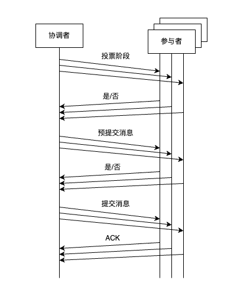

两阶段提交的一个瓶颈是：协调者一旦发生故障，会使整改系统进入阻塞状态。因此也称 “两阶段提交算法” 为 “阻塞提交算法”。

解决思路是：在协调者失效后，能选出某个参与者来充当协调者。则需要让参与者拿到更多的信息。

三阶段提交的思路：既然参与者不知道第一阶段的投票结果，那么就在两阶段提交的第一阶段和第二阶段之间插入一个预提交阶段。在预提交阶段，协调者将第一阶段的投票结果发送给所有参与者。这样，如果在提交阶段协调者和收到消息的参与者发生了故障，则可以从剩下的参与者中选出一个来充当协调者。新的协调者可以根据预提交阶段的信息，判断是应该执行提交还是中止事务，从而继续安全的推进事务。

### 一、算法流程

1. 第一阶段：投票阶段

   - 协调者向所有参与者并发发送准备消息，询问参与者是否准备好执行事务，并等待参与者响应。
   - 参与者判断是否具备执行事务的条件。具体的业务场景有不同的计算方式。但注意：此步骤只是确认是否具备基本的执行条件，并不会实际执行事务操作。
   - 参与者响应协调者发起的请求。如果参与者确认事务能够执行且提交，则返回一条 “是”；否则返回“否”。

2. 第二阶段：预提交阶段

   2.1 如果协调者收到的响应都为 “是”。

   - 协调者向所有参与者发送预提交消息，询问参与者是否可以执行并提交事务，并等待参与者响应
   - 参与者收到预提交消息后，检查执行事务的必要条件和资源，条件满足后执行事务的所有操作，并记录操作日志。
   - 参与者响应协调者发起的请求。如果执行成功，则返回 “是”，否则返回 “否”

   2.2 如果协调者有收到 “否” 的响应（或者超时）

   - 协调者会向所有参与者发送中止消息，等待所有参与者中止事务并回复后，直接中止这次事务

3. 第三阶段：提交阶段

   3.1 如果协调者收到所有参与者预提交阶段的响应，都为“是”

   - 协调者向所有参与者发送提交消息，指示参与者提交本次事务，等待参与者响应
   - 参与者收到提交消息后，正式提交事务。完成事务提交操作后，清理占用的资源，例如释放锁等，并记录操作日志
   - 完成后，参与者响应协调者，协调者收到所有参与者的消息后，确认事务完成

   3.2 如果协调者有收到 “否” 的响应（或者超时）

   - 协调者向所有参与者发送中止消息，指示参与者中止本次事务，等待参与者响应
   - 参与者收到中止消息后，利用其预提交阶段记录的日志回滚事务操作，并清理占用的资源
   - 参与者中止事务后响应协调者，协调者收到所有参与者消息后，确认事务中止

### 二、问题总结

三阶段提交是非阻塞协议，即使协调者发生了故障，参与者仍然会选举出新的协调者来推进事务的执行。因此三阶段提交算法避免了单点故障，增加了可用性。

但同时，三阶段提交算法容易受到网络分区的影响，导致可能丧失正确性。

案例：预提交阶段发生了网络分区，恰好将受到预提交消息的节点和没有收到预提交消息的节点一分为二，同时协调者发生了故障。这种情况下，两边各自会选出一个新的协调者。收到预提交消息的一边会继续提交事务；没有收到预提交消息的一边并不会执行事务提交，甚至有可能超时后，单方面中止事务。结果就会导致整改系统的数据出现不一致。

同时，一次事务至少需要三轮消息往返才能完成，增加了事务的完成时间，可能会导致较长的延迟。

因此，总结来说：三阶段提交协议满足了强终止性，但是受网络分区影响并且通信代价较高。出于这种原因，两阶段提交仍然是实现事务原子性的第一选择。
