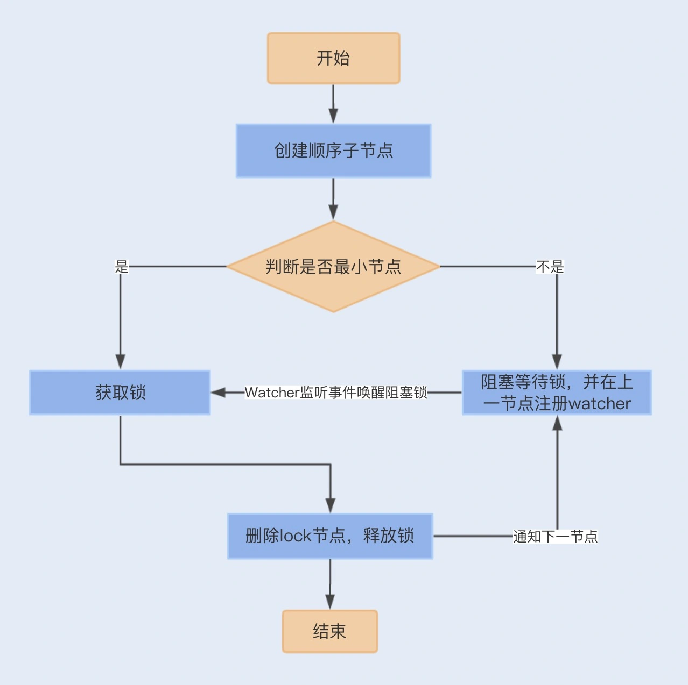
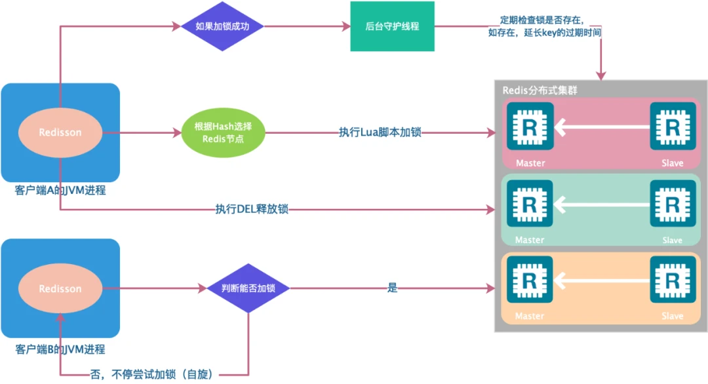
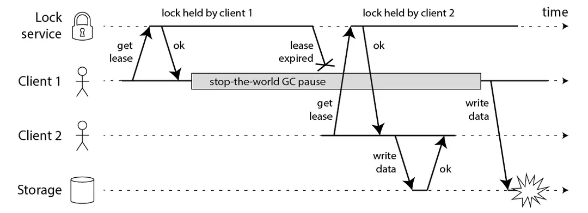

## 一、背景

锁是操作系统的原语，是为了确保在多个 CPU、多个线程的环境中，在某一个时间点，只有一个线程可以进入临界区，从而保证在临界区操作数据的一致性。

对于分布式场景，我们希望多个实例在某个时间点可以同步，只能有一个实例运行。

可以看出来，锁的定义本质上没有任何的改变。只不过锁控制的对象从一个进程内部的多个线程，变成了分布式场景下的多个进程；同时，临界区的资源也从进程内多个线程共享的资源，变成了分布式系统内部共享的中心存储上的资源。

实际上，不管什么锁，都是借助一种资源，而锁控制的对象都可以访问这种资源。从而使并发的各种对象在某个时间点可以同步起来。

### 1. 简述操作系统的锁

#### (1). 进程内部的锁

操作系统中用于让同一进程中多个线程同步的锁。这种锁，一般在计算机中本质上就是一块内存空间。比如当这个空间被赋值为 1 的时候表示加锁了，被赋值为 0 的时候表示解锁了。仅此而已，多个线程抢一个锁，就是抢着要把这块内存赋值为 1。在一个多核环境里，内存空间是共享的。每个核上各跑一个线程，如何保证一次只有一个线程成功抢到锁呢？这就需要硬件的支持。

比如 x86 的 XCHG 或 CMPXCHG，就能完成 CAS 操作（compare-and-swap），此时用这样的硬件指令就能实现 spin lock（自旋锁）。还有多核遵守的缓存一致性协议，比如 MSEI。一旦一个核执行某个指令，在结束这个指令之前，其他核都不能动。也即让多个核同步起来了。

#### (2). 跨进程的锁

也即同一台机器上，多个进程之间的锁。比如信号量。本质上也是内存中一个整数，使用不同的数值表示不同的状态，比如用 0 表示空闲状态。加锁时，判断锁是否空闲，如果空闲，修改加锁状态为 1，并且返回成功，如果已经是加锁状态，则返回失败。在解锁时，则将解锁状态修改为空闲状态 0。整个加锁和解锁的过程，操作系统保证他的原子性。

这里的内存就可以选择操作系统的共享内存。多个进程都可以访问到共享内存，以此来进行加锁和解锁。

## 二、分布式锁的设计

如上的赘述，简而言之，就是多个并发运行的实体在同一个中心资源的控制下，在某个时间点，实现了同步的操作。

那么对于分布式锁，面对的是跨进程、跨机器的这种场景。也是同样的思路，通过一个状态来表示枷锁和解锁，只不过要让所有需要锁的服务，都能访问到状态存放的位置。在分布式系统中，一个非常自然的方案就是，将锁的状态信息存放在一个存储服务中，也称为锁服务。需要锁的服务在通过网络来访问他，来修改状态信息，最后进行加锁和解锁。

### 1. 分布式锁的特性

因此我们实现一个完备的分布式锁，需要满足以下几个特性。

#### (1). 互斥

第一个特性就是**互斥**，即保证不同线程、不同进程、不同节点的互斥访问。

#### (2). 超时机制

第二个特性就是**超时机制**，超时机制是为了防止死锁。在分布式系统中，因为锁服务和请求锁的服务分散在不同的机器上，他们之间是通过网络来通信的，所以我们需要用超时机制，来避免获得锁的节点故障或者网络异常，导致他持有的锁不能归坏、死锁的问题。

还有一种情况是，持有锁的节点需要处理的临界区代码非常耗时。一般情况下，可以通过另一个线程不断延长超时时间，避免出现锁操作还没有处理完，锁就被超时释放，之后其他节点获得锁，导致锁的互斥失败这种情况。

对于超时机制，我们可以在每一次成功获得锁的时候，为锁设置一个超时时间，获得锁的节点与锁服务保持心跳，锁服务每一次收到心跳，就延长锁的超时时间。这样就可以解决锁不能归还和死锁的问题了。

#### (3). 完备的锁接口

即存在阻塞接口 Lock 和非阻塞接口 tryLock。

#### (4). 可重入性

当前持有锁的节点可以再次成功获取到锁。

我们只需要在锁服务处理加锁请求的时候，记录好唯一标识。后续的加锁请求，如果是相同的节点，就直接返回成功；否则按照正常加锁流程处理。

#### (5). 公平性

在竞争锁的时候，保证各个节点的公平性。比如按照先来后到的顺序，将锁颁发给等待时间最长的一个加锁节点。

实现的时候，对于被阻塞的加锁请求，我们只要先记录好他们的顺序，在锁被释放后，按照顺序颁发即可。

### 2. 分布式锁的挑战

对于分布式服务，我们经常会面临正确性、高可用、高性能这三点的权衡问题。

其中正确性是比较重要的，因为分布式服务会存在**部分失败**和**异步网络**存在的情况。

>部分失败：当一条消息在网络中两个节点之间传送时，如果出现网络错误，发送者无法知道接收者是否已经收到这条消息。接收者可能在出现网络错误之前就已经收到这条消息，也有可能没有收到，又或者接收者的进程已经死掉。发送者能够获得真实情况的唯一途径就是重新连接接收者，并向它发出询问。这种情况就时部分失败，即我们甚至不知道一个操作是否已经失败。

#### (1). 对于线程锁

对于线程锁，即一个进程中用于同步所有线程的锁。这种场景中，不会出现部分失败的情况。因为他崩溃的时候，虽然没有去做解锁操作，但是整个进程都会崩溃，不会出现死锁的情况。

我们在设计锁的时候，对于死锁的考虑，不包括业务逻辑层面出现的死锁。因为这个与锁本身的正确性没有关系。因为锁自身的设计导致的死锁需要我们来解决。

同样的，对于线程锁，解锁操作是进程内部的函数调用，这个过程是同步的。不论是硬件或者其他方面的原因，只要发起解锁操作就一定会成功，如果出现失败的情况，程序会 core，整个进程或者机器都会挂掉。

所以，我们看到对于线程锁，因为整体失败和同步通信，所以线程锁有绝对的正确性。

#### (2). 对于进程锁

对于同一台机器上多进程之间的锁。一般这种锁是存放在共享内存中。所以进程和锁之间的通信，依然是同步的函数调用。不会出现解锁后信息丢失，导致死锁的问题。

但是，进程获取锁后崩溃，导致死锁的情况，在进程锁中也存在。这个就是部分失败导致的。不过操作系统提供了一些机制，可以让我们判断一个进程是否存活，比如，父进程在获得进程挂掉的信号后，可以去查看当前挂掉的进程是否持有锁，如果持有就进行释放，这可以当作是进程崩溃后清理工作的一部分。

所以，我们看到对于进程锁，虽然有部分失败，但也有有效的解决方案；同时也是同步通信的。因此进程锁也有绝对的正确性。

#### (3). 对于分布式锁

对于分布式锁，部分失败和异步网络这两个问题是同时存在的。

如果一个进程获得了锁，但是这个进程与锁服务之间的网络出现了问题，导致无法通信。导致这个进程一直持有锁，就会导致死锁的发生。

#### (4). 分布式锁的问题探究

**设置超时时间**：

如上的这个问题，一般情况下，锁服务在进程加锁成功后，会设置一个超时时间，超时后锁会自动释放。这样即使这个进程占有锁并且挂掉了，也不会导致死锁。

但是又出现一个新的问题，如果临界区的加锁时长大于锁的超时时间。进程持有锁超时后，将锁再颁发给其他进程，就会导致一把锁被两个进程同时持有的情况。使锁的互斥语义遭到破坏。

同时，临界区的加锁时长，不仅仅包括执行临界区代码的时间，还有通过网络获取锁的时延，以及进程的暂停（比如GC）等。其中“通过网络获取锁的时延” 在一个异步网络环境中是不确定的，他的时间可以非常小，也可以非常大，甚至因为网络隔离变得无穷大都有可能。

那么，想要仅仅通过设置一个锁的超时时间，来解决可能出现的死锁问题，是远远不够的。

**探讨分布式锁的准确性**

对于获取锁而产生的时延，我们加上心跳和网络超时机制。这样，我们就可以将获取锁的时间控制住，让其小于锁本身的超时时间。但是，也会产生新的问题，比如，锁服务给客户端颁发了锁，但是因为响应超时，客户端没有及时收到响应，以为自己没有获取到锁。

详尽一点的例子，客户端发送网络请求到锁服务。锁服务收到请求后，更改其内部状态，然后发送网络响应给客户端，由于网络是异步的，write 方法返回成功，只代表成功写入了缓冲区，而不代表这些数据真正到达了对端。而写入缓存区后，此时网络中端，这个响应可能客户端无法收到。但锁服务此时却意识不到这个问题。

这就在一定程度上，影响了锁的互斥语义的正确性，并且在某些场景下，影响系统的可用性。互斥语义是一定能保证同一时刻有一个客户端能获取锁的，但是现在的情况是所有的客户端都不能获取到锁。

如果我们获取锁之后，是为了写一个共享存储，那么我们可以在获取锁的时候，锁服务生成一个全局递增的版本号，在写数据的时候，需要带上版本号。共享存储在写入数据的时候，会检查版本号，如果版本号回退了，就说明当前锁的互斥语义出现了问题，那么就拒绝当前请求的写入；如果版本号相同或者增加了，就写入数据和当前操作的版本号。

这种方式，我们只能说，出现这种错误时，我们可以保证不发生错误，保证分布式锁正确的语义。但是就是不能解决这个问题，比如出现如上的问题之后，我们只能等待锁服务自身超时后，锁自动释放后，才能继续服务。

我们再来思考，这个方案其实是将问题转移了，如果一个存储系统能通过版本号，来检测写入冲突，那么他已经支持多版本并发控制（MVCC）了，这本身就是乐观锁的实现原理了。那么我们相当于是用共享存储自身的乐观锁，来解决分布式锁在异常情况下，互斥语义失败的问题。

因此，对于在共享存储中写入数据，如果不能容忍分布式锁互斥语义失败的情况，那么就不应该借助分布式锁从外部来实现，而是应该在共享存储内部来解决。

**分布式锁的权衡**

如上的探讨，分布式锁因为有部分失败和异步网络的问题，没有办法保证 100% 的正确性。所以对于需要 100% 正确性的场景，尽量避免使用分布式锁。我们可以将分布式锁定位于：可以容忍非常小概率互斥语义失效场景下的锁服务。

通常，一个分布式锁服务，他的正确性要求越高，性能可能就会越低。并且，可用性是设计分布式锁的非常关键的目标。

因此，对于锁服务的高可用性、高性能、正确性，我们需要针对具体的场景，选择均衡的方式。

## 三、分布式锁的实现

常见的分布式锁的方案如下：

- 基于数据库实现分布式锁，指关系型数据库
- 基于 Zookeeper 实现的分布式锁
- 基于缓存实现的分布式锁，如 redis、etcd 等

### 1. 基于数据库的分布式锁

基于数据库的分布式锁实现，也有两种方式。一种是基于数据库表，另一种是基于数据库的排他锁

#### (1). 基于数据库表的增删

首先创建一张表，包括这些字段：方法名、时间戳、主机+线程信息等。其中方法名是唯一性约束。

**加锁**：当需要锁住某个方法时，往该表中插入一条相关的记录。因为方法名是唯一性约束，如果有多个请求同时希望锁住这个方法，提交到数据库时，数据库会保证只有一个操作可以成功。那么我们就认为操作成功的那个对象获得了该方法的锁。

**解锁**：删除对应方法的那一行。

这种实现方式会产生多个问题？

- 单点故障问题，这个分布式锁依赖数据库的可用性，如果这个单点数据库挂掉，会导致分布式锁也不可用？

  解决：为了高可用，可以应用主从数据库，从数据库作为备机，一旦主库挂掉，可以快速将应用服务切换到从库上。但应用主从数据库，又会出现主库加锁成功，锁还没有同步到从库，而此时主库宕机了，这个加锁成功的状态就消失了，分布式锁基本的互斥性质都无法满足了

- 死锁问题，这个分布式锁没有失效时间，如果已获取共享资源访问权限的进程突然挂掉、或者解锁操作失败，就会导致这把分布式锁一直在数据库中，其他线程无法再获得到锁？

  解决：可以使用一个定时任务，每隔一定时间把数据库中的超时锁清理一遍。这只是一个死锁补救措施，并不能解决问题。因为我们无法准确知道那个锁超时了，那个锁没有超时。

- 这个分布式锁是非阻塞的，因为往数据库插入一行时，如果失败会直接返回报错。没有获得锁的线程并不会进入排队队列，也就是这把锁没有公平性？

  解决：如果需要满足业务层面的阻塞，可以循环插入，直到插入成功。但是公平性这里貌似没有想到比较好的办法

- 这把锁是非可重入的，同一个线程在没有释放锁之前无法再次获得锁

  解决：为了实现分布式锁的可重入，可以将主机+线程信息作为标识，作为数据库表的一个字段，就可以在下次获取锁的时候先查询数据库，如果标识是存在的，则直接把锁分配给该线程，实现可重入。

- 这把锁没有完备的锁接口，比如 Lock 和 tryLock

  解决：只能在业务层面实现，阻塞式的 Lock 原语可以通过循环插入数据库实现；非阻塞式的 tryLock 原语直接插入数据库实现。

总体来看，这种方式实现的分布式锁，实现非常简单，但是问题很多，其中：单点故障问题、死锁问题没有比较好的解决方案。

#### (2). 基于数据库的排他锁

Mysql 的 InnoDB 引擎中的排他锁也可以实现分布式锁。如下伪代码

```
void lock() {
	connection.setAutoCommit(false);
	for (int i = 0;i < 3; i++) {
		try {
			select * from lock_table where lock_name = xxx for update;
			if (result != null) {
				// 此时获取到排他锁
				return;
			}
		} catch(Exception e) {
			// 出现异常，代表没有获取到锁
		}
		// 返回值为 null 或者出现异常都代表没有获取到锁
		sleep(1000);
	}
	// 重试结束，加锁失败
	throw new LockException();
}

void unlock() {
	connection.commit();
}
```

在查询语句的后面加上 "for update"，数据库会在查询过程中给数据库表增加排他锁，当某条记录被加上排他锁之后，其他线程就无法在该行记录上增加排他锁。这就是妥妥的悲观锁。

"for update" 语句会在执行成功后立即返回，在执行失败时一直处于阻塞状态，直到成功。当锁定之后，服务如果宕机，数据库会将锁释放，这种情况不会造成死锁。

要想满足分布式锁的完备性，实现 tryLock，目前没有比较好的做法。并且由于阻塞式的，只能依赖数据库来解决公平性。

**值得注意的问题如下**：

- 需要注意的是，InnoDB 引擎在加锁的时候，只有通过索引进行检索的时候才会使用行级锁，否则会使用表级锁。这里我们希望使用行级锁，就要给对应字段添加索引，而且一定需要是唯一索引。
- 还有问题就是，mysql 可能会对查询语句做优化，即使在条件中使用了索引，但是是否使用索引来检索数据则是由 Mysql 通过判断不同的执行代价来决定的，如果 Mysql 认为全表扫描效率更高，比如对一些很小的表，他就不会使用索引，这种情况下 InnoDB 引擎将使用表锁，而不是行锁。如果使用表锁，那么这把锁可能影响的范围会更大。
- 还有关于数据库连接的问题，使用排他锁实现的分布式锁，如果这个排他锁长时间不提交，就会占用数据库连接。如果数据库连接过多，数据库连接池的压力就会很大，会影响到数据库的正常运行。

#### (3). 基于 “数据库版本标识” 实现乐观锁

数据库实现乐观锁的方式就是记录数据版本。当读取数据时，将版本标识的值一同读出来，数据每更新一次，同时对版本标识进行更新。当我们提交更新的时候，判断数据库表对应记录的当前版本信息与第一次取出来的版本标识进行比对。如果数据库表当前版本号与第一次取出来的版本标识值相等，则予以更新，否则认为是过期数据。

实现数据版本可以用版本号；也可以用时间戳。

这就是基于数据库实现的乐观锁。

#### (4). 小总结

数据库实现分布式锁，主要是借助 Mysql 的 InnoDB 引擎。

- 一般来说，操作数据库比较容易理解
- 但同时，也是借助数据库的特性来达到目的，会有各种各样的问题，在解决问题的过程中会使整个方案变得越来越复杂
- 同时使用数据库的行级锁，不一定靠谱，尤其是表比较小的时候
- 操作数据库有一定的开销，性能问题需要考虑，数据库实现的分布式锁只适用于并发量低、对性能要求低的场景

### 2. 基于 zookeeper 的分布式锁

zookeeper 是一种提供 “分布式服务协调” 的中心化服务。他有如下几个特性。

- **节点**：Zookeeper 提供一个多层级的节点命名空间（节点称为 Znode），每个节点都用一个以斜杠(`/`) 分隔的路径来表示，而且每个节点都有父节点（根节点除外），类似于文件系统。

  节点类型可以分为持久节点（PERSISTENT）、临时节点（EPHEMERAL），每个节点还能被标记为有序性（SEQUENTIAL），一旦节点被标记为有序性，那么整个节点就具有顺序自增的特点。一般我们可以组合这几类节点来创建我们所需要的节点，例如，创建一个持久节点作为父节点，在父节点下面创建临时节点，并标记该临时节点为有序性。

  - 持久节点（PERSISTENT）：这是默认的节点类型，一直存在于 Zookeeper 中
  - 持久顺序节点（PERSISTEN、SEQUENTIAL）：在创建节点时，Zookeeper 根据节点创建的时间顺序对节点进行编号命名
  - 临时节点（EPHEMERAL）：当客户端与 Zookeeper 连接时临时创建的节点。与持久节点不同，当客户端与 Zookeeper 断开链接后，该进程创建的临时节点就会被删除
  - 临时顺序节点（EPHEMERAL、SEQUENTIAL）：就是按照时间顺序编号的临时节点

- **Watch 机制**：Zookeeper 还提供了另外一个重要的特性，Watcher（事件监听器）。Zookeeper 允许用户在指定节点上注册一些 Watcher，并且在一些特定事件触发的时候，Zookeeper 服务端会将事件通知给用户。

##### (1). 实现方式

我们就可以利用这些特性来实现分布式锁。

1. 首先，我们需要建立一个父节点，节点类型为持久节点，每当需要访问共享资源时，就会在父节点下建立相应的顺序子节点，节点类型为临时节点，且标记为有序性，并且以 “临时节点名称+父节点名称+顺序号” 组成特定的名字
2. 在建立子节点后，对父节点下面的所有以临时节点名称开头的子节点进行排序，判断刚刚建立的子节点顺序号是否是最小的节点，如果是最小节点，则获得锁。如果不是最小节点，则阻塞等待锁，并且获得该节点的上一顺序节点，为其注册监听事件，等待节点对应的操作获得锁。
3. 当调用完共享资源后，删除该节点，关闭 zookeeper，进而可以触发监听事件，释放该锁。



也就是说，每个线程抢占锁之前，先尝试创建自己的 ZNode。同样的，释放锁的时候，就需要删除创建的 ZNode。创建成功后，如果不是排好最小的节点，就处于等待通知的状态。等谁的通知呢？不需要其他人，只需要等前一个 ZNode 的通知就好了。前一个 ZNode 删除的时候，会触发 ZNode 事件，当前节点能监听到删除事件，就是轮到自己占有锁的时候。第一个通知第二个、第二个通知第三个，依次向后通知。

Zookeeper 的节点监听机制，实现了这种信息传递。具体的方法是，每一个等通知的 ZNode 节点，只需要监听排号在自己前面的那个，而且是紧挨在自己前面的那个节点，就能收到其删除事件了。只要上一个节点被删除了，就进行再一次判断，看看自己是不是序号最小的那个节点，如果是，则就可以获取锁。

Zookeeper 能保证由于网络异常或者其他原因，集群中占有锁的客户端失联时，锁能够被有效释放。一旦占有 ZNode 锁的客户端与 Zookeeper 集群服务器失去联系，这个临时 ZNode 也将自动删除。排在他后面的那个节点，也能收到删除事件，从而获取锁。因此在创建取号节点时，一定要创建临时 ZNode 节点。

##### (2). 羊群效应

羊群效应，Zookeeper 的这种首尾相接，后面监听前面的方式，可以避免羊群效应。所谓羊群效应就是一个节点挂掉，所有节点都去监听，然后作出反应，这样就会给服务器带来巨大压力，所以有了临时顺序节点，当一个节点挂掉，只有他后面的那一个节点才做出反应。

如上的实现是严格按照顺序访问的并发锁。一般我们还可以直接引用 Curator 框架来实现 Zookeeper 分布式锁。

##### (3). 问题剖析

到这里，我们感觉使用 Zookeeper 实现的分布式很完美？其实不然。

思考这样的一个问题，客户端在 Zookeeper 上创建临时节点后，Zookeeper 是如何保证让这个客户端一直持有锁呢？

原因在于，Zookeeper 和客户端之间维护了一个 Session，这个 Session 会依赖客户端的 “定时心跳” 来维持连接。如果 Zookeeper 长时间收不到客户端的心跳，就认为这个 Session 过期了，也会把这个临时节点删除。那么问题来了？我们来讨论一下 GC 问题、网络延迟异常场景下对 Zookeeper 的锁有什么影响：

- 客户端 A 创建临时节点，加锁成功
- 客户端 A 发生长时间 GC，或者网络发生异常延迟；导致无法给 Zookeeper 发送心跳，Zookeeper 把临时节点删除了
- 客户端 B 创建临时节点，加锁成功了
- 客户端 A 长时间的 GC 结束了，或者网络恢复正常了；他仍然会认为自己持有锁（产生冲突了）

可见，即使是 Zookeeper，也无法保证进程 GC、网络延迟异常场景下的安全性。

当然，Zookeeper 实现的分布式锁，对比数据库的实现，有很多优点，也有一些问题。

- Zookeeper 是集群实现，可以避免单点问题，且能保证每次操作都可以有效的释放锁。因为一旦应用服务挂掉了，临时节点会因为 session 连接断开而自动删除掉。
- 公平性，因为每个实例在 zookeeper 中都会按照先后顺序注册临时顺序节点，节点最小的才能获取锁。因此保证了公平性。
- 也可以避免死锁问题，因为如果连接中断，Zookeeper 上的临时顺序节点就会被自动释放掉。
- 但是由于频繁的创建和删除节点，加上大量的 Watch 事件，对 Zookeeper 集群来说，压力非常大。且从性能上来说，与缓存实现的分布式锁还是有一定差距。

### 3. 基于缓存的分布式锁

缓存可以是 redis、memcache 等等。这里主要以 redis 来说明。基于 redis 实现的分布式锁是最复杂的，但性能也是最好的。

基于 redis 实现分布式锁主要有两大类，一类是基于单机，另一类是基于 redis 多机。

#### (1). 基于 redis 单机实现的分布式锁

前提条件是 redis 是单机，也就是存在单点问题。

##### (a). 使用 setnx+expire 指令

```
SETNX lock_resource_id lock_value   # 加锁
EXPIRE lock_resource_id 10
// 业务逻辑
DEL lock_resource_id                # 解锁
```

setnx 指令，只有 key 不存在的情况下，才将 key 的值设置为 value；若 key 已经存在，则 setnx 命令不做任何操作。

expire 指令，给 key 设置一个过期时间，以保证 key 即使没有被显式释放，在获取锁达到一定时间后也要自动释放，防止资源被长时间独占。

这种实现中，由于 setnx 和 expire 这两个操作是非原子的，如果一个线程在执行 setnx 成功后，发生异常，expire 没有执行。就会导致这把锁一直被独占，可能无法释放。

这种方式实现的分布式锁是有问题的。

##### (b). 使用 set 扩展指令

```
SET lock_resource_id lock_value NX EX 10    # 加锁
// 业务逻辑
DEL lock_resource_id                        # 解锁
```

在这个 set 指令中：

- NX 表示只有当 lock_resource_id 对应的 key 值不存在的时候才能 set 成功。保证了互斥的效果
- `EX 10` 表示锁的过期时间为 10 秒

存在问题：

- 如果 “业务逻辑执行时间+网络请求时间+GC时间” 过长，导致锁被提前释放。这样不能保证锁的互斥性质
- 并且如果出现了上面的场景，线程 A 加锁之后，由于业务逻辑执行时间较长，导致锁过期被释放；线程 B 此时获取到了锁，然后线程 A 执行完业务逻辑后通过 DEL 释放了锁。相当于释放了不属于自己的锁。

##### (c). Redisson 的分布式锁

针对锁被提前释放的问题，开源框架 Redisson 有解决方案。 

link：https://github.com/redisson/redisson/wiki/8.-distributed-locks-and-synchronizers

利用锁的可重入特性，让获得锁的线程开启一个定时器的守护线程，每隔 `expireTime/3` 时间去执行一次，去检查该线程的锁是否存在，如果存在则对锁的过期时间重新设置为 expireTime，也就是利用守护线程对锁进行续期，防止锁由于过期而被提前释放。



到这里，关于 redis 的分布式锁存在的问题，貌似都有解决。

- 死锁：给锁设置过期时间
- 临界区执行时间大于锁的过期时间，导致锁提前过期：增加守护线程，定时给锁续期
- 锁被别人释放：在锁中写入唯一标识，释放锁时先检查标识，再释放

#### (2). redis 的主从同步对分布式锁的影响

以上关于 redis 分布式锁的分析都是局限在一个 redis 节点上。而我们在使用 redis 时，一般会采用 "主从集群+哨兵" 的模式部署，当主机宕机时，哨兵可以实现 "故障自动切换"，把从库提升为主库，继续提供服务，保证可用性。

redis 中的主从复制是异步的，主机获取到锁后，在没有完成数据同步的情况下发生故障转移，从机被提升为主机，而此时并没有持有锁。那么其他客户端上的线程可能获取到锁，因此会丧失锁的安全性。整个过程如下：

- 客户端 A 在主机上获取锁，并且成功了
- 主机出现故障，并且由于异步的主从复制，这把锁对应的 key 没有同步到从机
- 从机被哨兵提升为主机，此时这个 redis 节点上没有这把锁对应的 key
- 客户端 B 请求新的主机，于是获取到了对应同一个 key 的锁
- 出现多个客户端同时持有同一个 key 的锁，不满足锁的互斥性

于是，在 redis 的分布式环境中，redis 的作者 antirez 提供了 Redlock 的算法来实现一个分布式锁。

#### (3). 基于 redis 多机实现的分布锁 Redlock

link：https://redis.io/docs/manual/patterns/distributed-locks/

Redlock 的方案基于两个前提：

- 不再需要部署 从库 和 哨兵 实例，只部署 主库
- 主库需要部署多个，官方推荐至少 5 个实例

也就是说，有 N（`N >= 5`）个 redis 节点，这些节点完全互相独立，不存在主从复制或者其他集群协调机制，他们之间没有任何关系，都是一个个孤立的实例。

获取锁的过程，客户端应执行如下操作：

- 获取当前时间，单位为毫秒，记为 T1
- 客户端依次向这 5 个 redis 实例发起加锁请求，并且每个请求应该设置超时时间（网络请求和响应），超时时间要远小于锁的有效时间。如果某一个实例加锁失败（包括网络超时、锁被其他客户端持有等各种异常情况），就立即向下一个 redis 实例申请加锁。
- 如果客户端从大于 3 个（`N/2+1`）以上的 redis 实例加锁成功，则再次获取时间，记为 T2。如果 `T2 - T1 < 锁的过期时间`，此时认为客户端加锁成功，否则认为加锁失败。
- 如果加锁成功，则去操作共享资源实现业务逻辑；如果加锁失败，则向全部 redis 节点发起释放锁请求（使用 redis lua 脚本，保证原子性）。

获取锁的过程中，有三个重点：

- 客户端在多个 redis 实例上申请加锁
- 大多数 redis 节点加锁成功，并且大多数 redis 节点加锁的总耗时小于锁的过期时间，才算客户端获取锁成功
- 如果加锁失败，要向全部的 redis 节点发起释放锁请求

释放锁的过程中，客户端应执行如下操作：

- 客户端向所有 redis 节点发起释放锁的操作，包括加锁失败的 redis 节点。

除此之外，为了避免 redis 节点发生崩溃重启后造成锁丢失，从而影响锁的安全性，redis 的作者 antirez 还提出了延时重启的概念，即一个节点崩溃后不要立即重启，而是等待一段时间后再进行重启，这段时间应该大于锁的有效时间。

接下来，我们来解释下这个流程中的一些问题。

1. 在多个实例上加锁？并且大多数实例加锁成功，才算成功？

   多个 redis 实例一起组成了一个分布式系统，在多个实例上加锁，本质上是为了“容错”，允许出现部分实例宕机或不可用，剩余足够的实例加锁成功，整体锁服务依旧可用。

   因为在分布式系统中，总会出现“异常节点”，所以需要考虑异常节点达到多少个，也不会影响整个系统的正确性。也就是说，允许存在故障节点，只要大多数节点正常，那么整个系统依旧是可以提供正确服务的。

   这也是 “拜占庭将军” 问题。

2. 加锁成功后，还要计算加锁的耗时？

   因为操作 redis 的多个节点，并且异步网络的情况比较复杂，存在延迟、丢包、超时等情况，网络请求越多，异常发生的概率就越大。所以即使大多数节点加锁成功，但如果加锁的累计耗时已经超过了锁的过期时间。那么有些节点上的锁可能已经失效了，这个锁本身就没有意义了。

3. 为什么释放锁的时候，要操作所有节点，包括加锁失败的节点？

   可能存在某个节点加锁成功后，但是返回客户端的响应包丢失了。因为异步网络是有可能出现：客户端向服务器通信是成功的，但反方向却是有问题的。这种情况，对于客户端来说，加锁是失败的；但对于 redis 节点来说，加锁是成功的。因此释放锁的时候，客户端也应该对当时获取锁失败的那些 redis 节点同样发起请求

#### (4). 关于 Redlock 的争论

Redis 作者 Antirez 提出的 Redlock 方案后，马上受到英国剑桥大学、业界著名的分布式系统专家 Martin 的质疑。于是两人关于分布式锁做了一些争论。我们来学习一下。

##### (a). 分布式专家 martin 对于 Redlock 的质疑

在他的文章中，主要阐述了 4 个论点。

**第一个论点：分布式锁的偏好**

Martin 表示使用分布式锁有两种偏好

1. 效率：使用分布式锁的互斥能力，避免多次做重复的工作（例如一些“昂贵”的计算任务）。这种情况要求即使锁失效，也不会带来「恶性」的后果。例如多发了 1 次邮件等无伤大雅的场景。
2. 正确性：使用锁用来防止并发进程互相干扰。如果锁失效，会造成多个进程同时操作同一条数据，产生的后果是数据严重错误、永久性不一致、数据丢失等恶性问题。

Martin 认为，如果你是为了效率，那么使用单机版 Redis 就可以了，即使偶尔发生锁失效（宕机、主从切换），都不会产生严重的后果。而使用 Redlock 太重了，没必要。

而如果你是为了正确性，Martin 认为 Redlock 根本达不到安全性的要求，也依旧存在锁失效的问题！

**第二个论点：锁在分布式系统中会遇到问题**

Martin 表示，一个分布式系统，存在着各种异常情况，这些异常场景主要包括三大块，这也是分布式系统会遇到的三座大山：**NPC**。

- N：Network Delay，网络延迟
- P：Process Pause，进程暂停
- C：Clock Drift，时钟漂移

Martin 用一个进程暂停的例子，指出了 Redlock 安全性问题：

1. 客户端 1 请求锁定节点 A、B、C、D、E
2. 客户端 1 拿到锁后，进入进程暂停（时间比较久）
3. 所有 Redis 节点上的锁都过期了
4. 客户端 2 获取到了 A、B、C、D、E 上的锁
5. 客户端 1 GC 结束，认为成功获取锁
6. 客户端 2 也认为获取到了锁，发生「冲突」



Martin 认为，进程暂停可能发生在程序的任意时刻，而且执行时间是不可控的。

> 注：当然，即使没有进程暂停，在发生网络延迟、时钟漂移时，也都有可能导致 Redlock 出现此类问题，这里 Martin 只是拿进程暂停举例

**第三个论点：假设时钟正确是不合理的**

Relock 有一个隐含条件是所有的主机时间都是正确的，如果时间不正确就会出问题，例如

1. 客户端 1 获取到节点 A、B、C 上的锁
2. 节点 C 上的时钟「向前跳跃」，导致锁到期
3. 客户端 2 获取节点 C、D、E 上的锁
4. 客户端 1 和 2 现在都相信它们持有了锁（冲突）

Martin 认为 Redlock 必须「强依赖」多个节点的时钟是保持同步的，一旦有节点时钟发生错误，那这个算法模型就失效了。而机器的时钟发生错误，是很有可能发生的，比如：

- 系统管理员「手动修改」了机器时钟
- 机器时钟在同步 NTP 时间时，发生了大的「跳跃」

总之，Martin 认为，Redlock 的算法是建立在「同步模型」基础上的，有大量资料研究表明，同步模型的假设，在分布式系统中是有问题的。在混乱的分布式系统的中，你不能假设系统时钟就是对的，所以，你必须非常小心你的假设。

**第四个论点：提出 fencing token 的方案，保证正确性**

相对应的，**Martin** 提出一种被叫作 **fencing token** 的方案，保证分布式锁的正确性。

这个模型流程如下：

1. 客户端在获取锁时，锁服务可以提供一个「递增」的 token
2. 客户端拿着这个 token 去操作共享资源
3. 共享资源可以根据 token 拒绝「后来者」的请求


这样一来，无论 **NPC** 哪种异常情况发生，都可以保证分布式锁的安全性，因为它是建立在「异步模型」上的。

而 Redlock 无法提供类似 **fencing token** 的方案，所以它无法保证安全性。

> 他还表示，一个好的分布式锁，无论 **NPC** 怎么发生，可以不在规定时间内给出结果，但并不会给出一个错误的结果。也就是只会影响到锁的「性能」（或称之为活性），而不会影响它的「正确性」。

**Martin 的结论**

1. Redlock 不伦不类：对于偏好效率来讲，Redlock 比较重，没必要这么做，而对于偏好正确性来说，Redlock 是不够安全的。
2. 时钟假设不合理：该算法对系统时钟做出了危险的假设（假设多个节点机器时钟都是一致的），如果不满足这些假设，锁就会失效。
3. 无法保证正确性：Redlock 不能提供类似 **fencing token** 的方案，所以解决不了正确性的问题。为了正确性，请使用有「共识系统」的软件，例如 Zookeeper。

以上就是 Martin 反对使用 Redlock 的观点，有理有据。接下来我们来看 Redis 作者 Antirez 是如何反驳的。

##### (b). Redis 作者 Antirez 的反驳

在 Antirez 的反驳文章中，有三个重点

**第一个重点：时钟问题**

首先，Redis 作者一眼就看穿了对方提出的最为核心的问题：时钟问题。

> 为什么 Redis 作者优先解释时钟问题？因为在后面的反驳过程中，需要依赖这个基础做进一步解释。

Redis 作者表示，Redlock 并不需要完全一致的时钟，只需要大体一致就可以了，允许有「误差」，只要误差不要超过锁的租期即可，这种对于时钟的精度要求并不是很高，而且这也符合现实环境。

对于对方提到的「时钟修改」问题，Redis 作者反驳到：

- 手动修改时钟：不要这么做就好了，否则你直接修改 Raft 日志，那 Raft 也会无法工作...
- 时钟跳跃：通过「恰当的运维」，保证机器时钟不会大幅度跳跃（每次通过微小的调整来完成），实际上这是可以做到的

**第二个重点：解释网络延迟、进程暂停问题**

Redis 作者对于对方提出的，网络延迟、进程暂停可能导致 Redlock 失效的问题，也做了反驳。

我们重新回顾一下，**Martin** 提出的问题假设：

1. 客户端 1 请求锁定节点 A、B、C、D、E
2. 客户端 1 的拿到锁后，进入进程暂停（时间比较久）
3. 所有 Redis 节点上的锁都过期了
4. 客户端 2 获取到了 A、B、C、D、E 上的锁
5. 客户端 1 GC 结束，认为成功获取锁
6. 客户端 2 也认为获取到了锁，发生「冲突」


Redis 作者反驳到，这个假设其实是有问题的，Redlock 是可以保证锁安全的。还记得前面介绍 Redlock 流程的那 5 步吗？让我们来复习一下。

1. 客户端先获取「当前时间戳 T1」
2. 客户端依次向这 5 个 Redis 实例发起加锁请求（用前面讲到的 SET 命令），并设置超时时间（毫秒级），如果某一个实例加锁失败（包括网络超时、锁被其它人持有等各种异常情况），就立即向下一个 Redis 实例申请加锁
3. 如果客户端从 >=3 个（大多数）以上 Redis 实例加锁成功，则再次获取「当前时间戳 T2」，如果锁的租期 > T2 - T1  ，此时，认为客户端加锁成功，否则认为加锁失败
4. 加锁成功，去操作共享资源
5. 加锁失败或操作结束，向「全部节点」发起释放锁请求（使用 Lua 脚本释放锁）

注意，重点是 1-3，在步骤 3，加锁成功后为什么要重新获取「当前时间戳 T2」？还用 T2 - T1 的时间，与锁的过期时间做比较？

Redis 作者强调：如果在 1-3 发生了网络延迟、进程暂停等耗时长的异常情况，那在第 3 步 T2 - T1，是可以检测出来的，如果超出了锁设置的过期时间，那这时就认为加锁会失败，之后释放所有节点的锁就好了！

Redis 作者继续论述，如果对方认为，发生网络延迟、进程暂停是在步骤 3 之后，也就是客户端确认拿到了锁，去操作共享资源的途中发生了问题，导致锁失效，那这不止是 Redlock 的问题，任何其它锁服务例如 Zookeeper，都有类似的问题，这不在讨论范畴内。

所以 Redis 作者的结论是：

- 客户端在拿到锁之前，无论经历什么耗时长问题，Redlock 都能够在第 3 步检测出来
- 客户端在拿到锁之后，发生 **NPC**，那 Redlock、Zookeeper 都无能为力

所以，Redis 作者认为 Redlock 在保证时钟正确的基础上，是可以保证正确性的。

**第三个重点：质疑 fencing token 机制**

Redis 作者对于对方提出的 **fecing token** 机制，也提出了质疑，主要分为 2 个问题

第一，这个方案必须要求要操作的「共享资源服务器」有拒绝「旧 token」的能力。

假设共享资源服务器是 MySQL，我们要操作 MySQL，从锁服务拿到一个递增数字的 token，然后客户端要带着这个 token 去改 MySQL 的某一行，这就需要利用 MySQL 的「事物隔离性」来做。

> // 两个客户端必须利用事物和隔离性达到目的
> // 注意 token 的判断条件
> UPDATE  table T SET val = $new_val WHERE id = $id AND current_token < $token

但如果操作的不是 MySQL 而是向磁盘上写一个文件，或发起一个 HTTP 请求，那这个方案就无能为力了，这对要操作的资源服务器，提出了更高的要求。

再者，既然资源服务器都有了「互斥」能力，那还要分布式锁干什么？

所以，Redis 作者认为这个方案是站不住脚的。

第二，退一步讲，即使 Redlock 没有提供 **fecing token** 的能力，但 Redlock 已经提供了随机值（UUID），利用这个随机值，也可以达到与 **fecing token** 同样的效果。

1. 客户端使用 Redlock 拿到锁
2. 客户端在操作共享资源之前，先把这个锁的 VALUE，在要操作的共享资源上做标记
3. 客户端处理业务逻辑，最后，在修改共享资源时，判断这个标记是否与之前一样，一样才修改（类似 CAS 的思路）

还是以 MySQL 为例,这个实现如下

1. 客户端使用 Redlock 拿到锁
2. 客户端要修改 MySQL 表中的某一行数据之前，先把锁的 VALUE 更新到这一行的某个字段中（这里假设为 current_token 字段)
3. 客户端处理业务逻辑
4. 客户端修改 MySQL 的这一行数据，把 VALUE 当做 WHERE 条件，再修改

>UPDATE table T SET val = $new_val WHERE id = $id AND current_token = $redlock_value

可见，这种方案通过依赖 MySQL 的事物机制，也达到对方提到的 fecing token 一样的效果。

对于上述通过 Redlock “实现” fecing token 的设计，网友提出了一个问题：两个客户端通过这种方案，先「标记」再「检查 + 修改」共享资源，那这两个客户端的操作顺序无法保证啊？而用 Martin 提到的 **fecing token**，因为这个 token 是单调递增的数字，资源服务器可以拒绝小的 token 请求，保证了操作的「顺序性」！

Redis 作者对这问题做了不同的解释，比较有意思，他认为：分布式锁的本质，是为了「互斥」，只要能保证两个客户端在并发时，一个成功，一个失败就好了，不需要关心「顺序性」**。

> 前面 Martin 的质疑中，一直很关心这个顺序性问题，但 Redis 的作者的看法却不同。

综上，Redis 作者的结论：

1. 作者同意对方关于「时钟跳跃」对 Redlock 的影响，但认为时钟跳跃是可以避免的，取决于基础设施和运维。
2. Redlock 在设计时，充分考虑了 **NPC** 问题，在 Redlock 步骤 3 之前出现 **NPC**，可以保证锁的正确性，但在步骤 3 之后发生 **NPC**，不止是 Redlock 有问题，其它分布式锁服务同样也有问题，所以不在讨论范畴内。

#### (5). 要不要用 Redlock？

Redlock 只有建立在「时钟正确」的前提下，才能正常工作，如果你可以保证这个前提，那么可以拿来使用。

但保证时钟正确，并不是简单

- 第一，从硬件角度来说，时钟发生偏移是时有发生，无法避免。例如，CPU 温度、机器负载、芯片材料都是有可能导致时钟发生偏移的。
- 第二，人为错误也是很难完全避免，运维暴力修改时钟，进而影响了系统的正确性

所以，对于 Redlock，个人看法，尽量不用它，而且他的性能不如单机版 Redis，部署成本也高。

### 4. 性能优化

分布锁能够做的优化不多。

一个思路是优化 redis 本身的性能，比如说启用单独的 redis 集群，这可以有效防止别的业务操作 redis，影响加锁和释放锁的性能。

另外一个思路是减少分布式锁的竞争。在高并发环境中，可以考虑使用 **Singleflight 模式**来优化分布式锁。

>  SingleFlight 最初是 Go 开发组提供的一个扩展并发原语。它的作用是，在处理多个 goroutine 同时调用同一个函数的时候，只让一个 goroutine 去调用这个函数，等到这个 goroutine 返回结果的时候，再把结果返回给这几个同时调用的 goroutine，这样可以减少并发调用的数量。
>
> 区分一下 Go 语言中 sync.Once 的用法。Sync.Once 会保证永远只执行一次，而 SingleFlight 是每次调用都重新执行，并且在多个请求同时调用的时候只有一个执行。它们两个面对的场景是不同的，sync.Once 主要是用在单次初始化场景中，而 SingleFlight 主要用在合并并发请求的场景中，尤其是缓存场景。

在分布式锁中应用 Singleflight 模式是为了确保对同一个锁一个实例只有一个线程去获取分布式锁。也就是说，针对同一把锁，如果一个实例中有多个线程也去参与获取这个分布式锁了，那么每个实例内部先选出一个线程去获取锁。

假设有 2 个实例，每个实例上各有 10 个线程要去获得 key1 上的分布式锁。在不使用 Singleflight 模式的情况下，总共有 20 个线程会去竞争分布式锁。但是在使用 Singleflight 模式之后，最终只有 2 个线程去竞争分布式锁。竞争越激烈，这种方案的效果越好。如果没什么并发的话，那么就基本没什么效果。

还有一种更加激进的优化方案。

在实例拿到分布式锁之后，释放锁之前先看看本地有没有别的线程也需要同一把分布式锁。如果有，就直接转交给本地的线程，进一步减少加锁和释放锁的开销。这种优化手段同样是在竞争越激烈的场景，效果越好。

### 5. 去分布式锁

分布式锁不论如何优化，都有性能损耗。所以不用分布式锁是最好的优化手段。

比如在一些场景中，是可以考虑去掉分布式锁的。

一个思路是用数据库乐观锁来取代分布式锁。比如说一些场景是加了分布式锁之后执行一些计算，最后更新数据库。在这种场景下，完全可以抛弃分布式锁，直接计算，最后计算完成之后，利用乐观锁来更新数据库。缺点就是没有分布式锁的话，可能会有多个线程在计算。但是问题不大，因为只要最终更新数据库控制住了并发，就没关系。

另一个思路是利用一致性哈希负载均衡算法。在使用这种算法的时候，同一个业务的请求肯定发到同一个节点上。这时候就没必要使用分布式锁了，本地直接加锁，或者用 Singleflight 模式就可以

## 四、总结

我们从不同的维度来比较选择不同的组件


| 维度 |  |
| -------------------------- | ------------------------- |
| 理解的容易程序（从易到难） | 数据库 > 缓存 > Zookeeper |
| 实现的复杂性（从低到高）   | Zookeeper < 缓存 < 数据库 |
| 性能（从高到低）           | 缓存 > Zookeeper > 数据库 |
| 可靠性（从高到低）         | Zookeeper > 缓存 > 数据库 |

首先，我们说，一个分布式锁，无论是基于 redis 还是 zookeeper，或者 etcd 等等，在极端情况下，都无法保证 100% 安全，都存在失效的可能。如果我们的业务数据是非常敏感的，在使用分布式锁时，一定要注意这个问题，不能假设分布式锁 100% 安全。这是前提条件。

不得已，必须要使用分布式锁，那我们需要根据自己的业务场景，来选择对应的存储组件来实现分布式锁。

- 基于数据库实现的分布式锁存在单点故障和死锁问题，仅仅利用数据库技术去解决单点故障和死锁问题，是非常复杂的。
- ZooKeeper 已定义相关的功能组件，并且 ZooKeeper 分布式锁的可靠性最高，有封装好的框架，很容易实现分布式锁的功能，但是性能相对来说比较低。
- 如果要处于性能考虑，使用 redis 实现分布式锁性能较高。而且 Redlock 确实能够提供更安全的分布式锁，但也是有代价的，需要更多的 redis 节点。在实际业务中，一般使用基于单点的 redis 实现分布式锁就可以满足绝大部分的需求，偶尔出现数据不一样的情况，也可以人工介入解决。

最后，分布式系统设计是实现复杂性和收益的平衡，既要尽可能的安全可靠，也要避免过度设计。我们知道，任何分布式锁都无法完全保证正确性，因此使用分布式锁时建议：

- 在上层使用分布式锁完成「互斥」目的，虽然极端情况下锁会失效，但它可以最大程度把并发请求阻挡在最上层，减轻操作资源层的压力。
- 但对于要求数据绝对正确的业务，在资源层一定要做好「兜底」，可以借鉴 fencing token 的方案来做，即在资源层通过版本号的方式来更新数据，避免并发冲突。这样，发生极端情况时，也不会对系统造成影响

关于分布式锁的讨论在这里就结束了，我想以 Martin 在对于 Redlock 争论过后，写下的感悟来结尾：

“**前人已经为我们创造出了许多伟大的成果：站在巨人的肩膀上，我们可以才得以构建更好的软件。无论如何，通过争论和检查它们是否经得起别人的详细审查，这是学习过程的一部分。但目标应该是获取知识，而不是为了说服别人，让别人相信你是对的。有时候，那只是意味着停下来，好好地想一想。**”

共勉。
