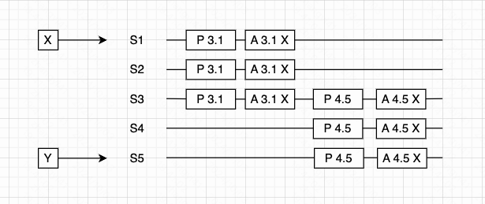
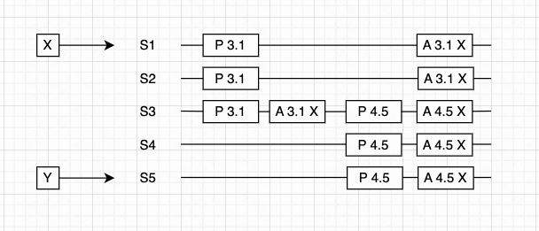
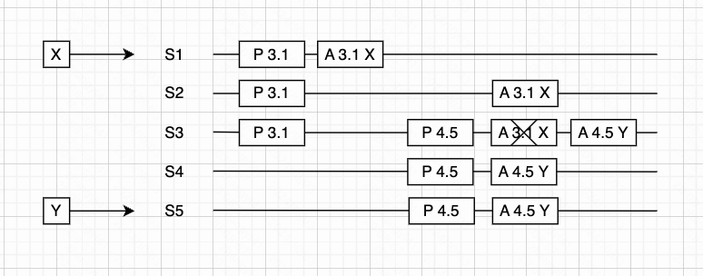
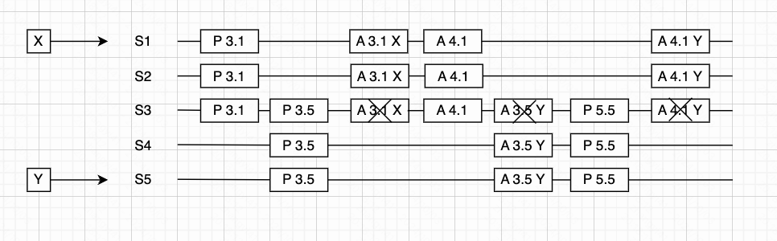

### 一、算法流程

paxos 算法将分布式系统中的节点分为几种角色：

- 客户端：向分布式系统发送请求，并等待响应
- 提议者：提议者收到客户端的请求，提出相关的提案，试图让接受者接受该提案，并在发生冲突时进行协调，推动算法运行
- 接受者：也叫投票者，即投票接受或拒绝提议者的提案，若超过半数的接受者接受提案，则该提案被批准
- 学习者：学习者只能学习被批准的提案，不参与决议提案。一旦客户端的请求得到接受者的同意，学习者就可以学习到提案值，执行其中的请求操作并向客户端发送响应。增加多个学习者可以提高系统的可用性。

#### 1. 第一阶段

phase 1a（Prepare阶段）：客户端请求，提议者收到客户端的请求后，选择一个最新的提案编号 n，向超过半数的接受者广播 perpare 消息，请求接受者对提案编号进行投票。注意：这里只发送提案编号。

phase 1b（Promise阶段）：接受者收到 Prepare 请求消息后进行判断：

- 如果 prepare 消息中的提案编号 n 大于之前接受的所有提案编号，则返回 promise 消息进行响应，并承诺不会再接受任何编号小于 n 的提案。特别的，如果接受者之前接受了某个提案，那么 promise 响应还应将前一次提案的编号和对应的值一起发送给提议者。
- 否则，即提案编号 n 小于等于接受者之前接受的最大编号，就忽略该请求，但常常会回复一个拒绝响应。

为了实现故障恢复，接受者需要持久化存储已接受的最大提案编号（记为`max_n`）、已接受的提案编号（`accepted_N`）和已接受的提案值（`accepted_VALUE`）。

#### 2. 第二阶段

phase 2a（Accept阶段）：当提议者收到超过半数的接受者的 promise 响应后，提议者向多数派的接受者发起 `accept(n, value)` 请求，这次要带上提案编号和提案值。

- 注意：如果之前接受者的 promise 响应有返回已接受的提案值 accept_VALUE，那么使用提案编号最大的已接受值作为提案值。如果没有返回任何 accept_value，那么提议者可以自由决定提案值。
- 第一阶段和第二阶段中，多数派接受者不一定相同。因为两个多数派接受者之间必然存在交集，所以不会影响算法的正确性。
- 接受者在处理 accept 请求时，也要更新承诺的提案编号 max_n 的值，否则会导致集群接受不同的提案

phase 2b（Accepted阶段）：接受者收到 Accept 请求后，在这期间如果接受者没有另外承诺提案编号比 n 更大的提案，则接受该提案，更新承诺的提案编号，保存已接受的提案。

注意：接受提案和批准提案是不同的，接受提案是接受者单独决定的，而批准提案需要满足超过半数接受者接受提案。

### 二、案例剖析

#### 1. 提案已被批准

如下图，其中 S1 和 S5 是提议者，每个节点都扮演接受者。图中提案编号使用 `n.server_id` 的格式来表示，比如提案编号 3.1 表示 S1 发起的轮次 n 等于 3 的提案，具体比较时使用轮次 n 的值。

图中所示流程如下：

- S1 收到客户端值为 X 的写请求，于是 S1 向 S1、S2、S3 发起 `prepare(3.1)` 请求，请求接受者对提案编号为 3.1 的提案进行投票处理。接受者接受该提案，回复 promise 响应。由于暂时没有接受其他提案，所以不回复任何其他提案信息。
- 由于 S1、S2 和 S3 没有接受过任何提案，S1 继续向 S1、S2、S3 发送 `accept(3.1, X)` 请求，三个节点都接受该提案，满足超过半数节点接受提案的条件，提案被成功批准。
- 之后，S5 收到客户端值 Y 的写请求，并向 S3、S4、S5 发送 `prepare(4.5)`请求，由于提案编号 4 大于 3，并且提案已经被批准了，接受者 S3 会回复包含提案值 X 的 promise 响应。
- S5 会根据 S3 的响应，将提案值 Y 替换成 X，继续向 S3、S4、S5 发送 `accept(4.5, X)`请求，之后提案再次被批准，但提案值依旧是 X。

#### 2. 提案被接受，提议者可见

和情况1类似，区别在于此时提案 3.1 还未被批准，只是被 S3 接受，但 S3 仍然会回复包含已经接受的提案值 X 的 promise 响应，所以 S5 仍然会将提案值替换成 X，最终所有接受者对 X 达成共识，虽然提案编号有所不同。

注意：只要有一个接受者在 promise 响应中返回了提案值，就要用他来替换提案值。

#### 3. 提案被接受，提议者不可见

和情况2稍有不同，此处变成 S1 接受了提案，但是 S3 还未接受提案，因此在 S3、S4、S5 的 promise 响应中没有任何提案消息。所以 S5 没有收到任何上一阶段的提案值，于是自行决定提案值为 Y，并在第二阶段发送 `accept(4.5,Y)`请求。

由于此时 S3 承诺的提案编号 n 变为了 4，且 4 大于 3，所以 S3 不再接受 S1 后续的 `accept(3.1, X)` 请求。虽然有两个节点接受了提案值为 X 的提案，但并不满足多数派的要求。最终提案值为 Y 的提案被批准。

### 三、活锁

如果提议者在 phase 1a 发出 prepare 请求消息，还没来得及发送 phase 2a 的 accept 请求消息，紧接着第二个提议者在 phase 1a 又发出提案编号更大的 prepare 请求。如果这样运行，接受者会始终停留在决定提案编号的大小这一过程中，都无法成功。

解决活锁问题最简单的方式就是引入随机超时，某个提议者发现提案没有被成功接受，则等待一个随机超时时间，让出机会，减少一直互相抢占的可能性。