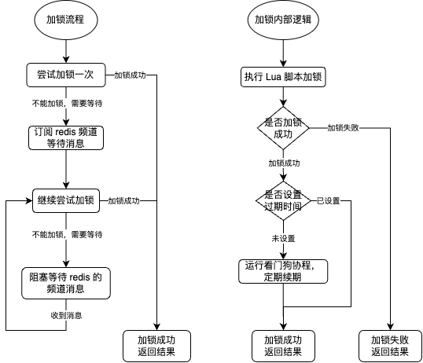
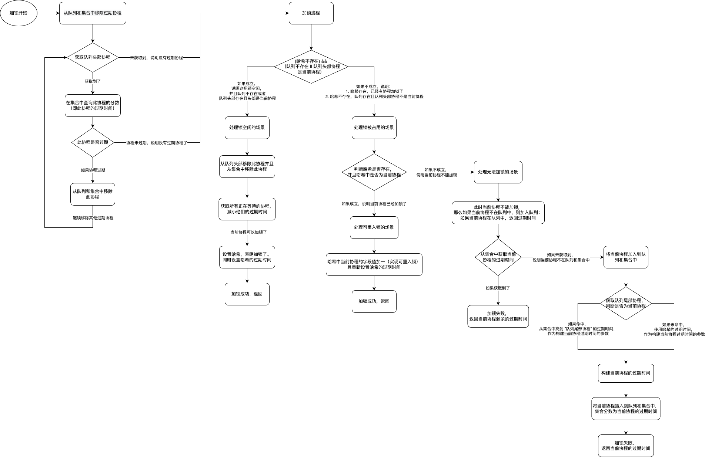
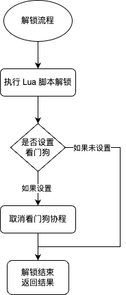
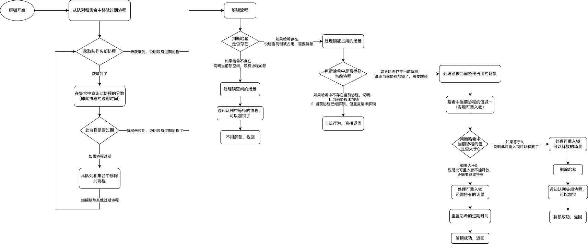

## 一、简述

分布式锁是什么？https://zhuanlan.zhihu.com/p/684454817

我们之前谈到分布式服务需要在 “正确性”、“高可用”、“高性能” 这三点之间做权衡。其中正确性是最为重要的。因为分布式服务会存在 “部分失败” 和 “异步网络” 问题，所以没有办法保证 100% 的正确性。所以对于需要 100% 正确性的场景，应该避免使用分布式锁。分布式锁的定位是：可以容忍非常小概率互斥语义失效场景下的锁服务。

通常，一个分布式锁服务，他的正确性要求越高，性能可能就会越低。之前我们探讨过，不同的组件实现分布式锁的小结论：

| 维度                       |                           |
| -------------------------- | ------------------------- |
| 理解的容易程序（从易到难） | 数据库 > 缓存 > Zookeeper |
| 实现的复杂性（从低到高）   | Zookeeper < 缓存 < 数据库 |
| 性能（从高到低）           | 缓存 > Zookeeper > 数据库 |
| 可靠性（从高到低）         | Zookeeper > 缓存 > 数据库 |

而一个分布式锁需要满足如下的特性：

- 互斥
- 超时机制
- 完备的锁接口。具有非阻塞型 tryLock 接口 和阻塞型的 lock 接口
- 可重入性
- 公平性

本文简述使用 Go 语言，基于 redis 实现的分布式锁。

## 二、分析

我们开宗明义，直接来说明为了满足分布式锁的这些特性，我是如何利用 redis 的性质做到这些的。

#### 1. redis 中执行 Lua 脚本

第一，我们操作 redis 使用的是 Lua 脚本，在 redis 中 Lua 脚本能够保证原子性。因为 redis 采用了单线程执行模型。也就是说，当 redis 执行 Lua 脚本时，redis 会把 Lua 脚本作为一个整体并把它当作一个任务加入到一个队列中，然后单线程按照队列的顺序依次执行这些任务，在执行过程中 Lua 脚本是不会被其他命令或请求打断，因此可以保证每个任务的执行都是原子性的。

#### 2. 协程标识

由于 Go 语言在编程语言层面实现了执行流的调度，因此最小的执行单元是协程。而且 Go 语言开发者认为不应该暴露 goid（https://github.com/golang/go/issues/22770），主要有这么几点理由：

- goroutine 设计的理念是轻量，鼓励开发者使用多 goroutine 进行开发，不希望开发者通过 goid 做 TLS（thread local storage）的事情。
- 如果有非要在某一个执行单元去做特定任务（比如图形库中某些任务必须在主线程上执行）。可以使用 syscall 去获取 thread id。因此也不需要暴露 goid。
- 还有一点原因是，TLS 在 C/C++ 实践中问题多多，比如一些使用 TLS 的库，线程的状态很容易被修改，导致程序崩溃。
- Go 编程的思想：“Share Memory By Communicating”，通过通信共享内存。使用 goid 违反了这一思想。 

但是我们的分布式锁需要对于不同的执行单元进行互斥，因此获取 goroutine id 很重要。那如何解决这个问题呢？

其实我们想要的是一个协程标识，是不是 goroutine id 不重要，能够把这个协程标识起来就可以了。不过抱歉，我当前还并未实现标识一个协程的工作。

目前使用了此库来获取 goroutine id：https://github.com/v2pro/plz/tree/master/gls

>同时，获取 goroutine id 是一条断头路，目前并没有完美获取他的方式。在我们当前的分布式锁服务中，使用它也是极不情愿的。后续会研究这块如何改造优化。

## 三、设计

我们现在来看是如何设计的。

#### 1. 使用 “哈希” 标识加锁状态和可重入性

我们使用 redis 中的 “哈希” 作为分布式锁的标识 key。哈希 如果存在，则分布式锁处于加锁状态；哈希 如果不存在，则分布式锁处于空闲状态。为什么使用 哈希 呢？主要是考虑到分布式锁 可重入 的问题。哈希中存储的是一个 K-V 形式的对象。此对象的 K 就是当前持有锁的协程标识，此对象的 V 就是当前协程加锁的次数。

因此，哈希中只会有一组 K-V 对象，也就是持有锁的协程。当解锁时，如果发现哈希中那一组 K-V 对象的加锁次数等于 0 了，就可以删除 哈希了。

这样就通过 哈希 是否存在，表明了分布式锁的状态（是否加锁）？也表明了分布式锁的互斥特性。以及哈希中那一组 K-V 对象，表明了当前锁的可重入性。

#### 2. 使用 “列表” 保存等待协程

多个协程加锁，某段时间，只会有一个协程加锁成功，其他协程就只能等待咯。我们需要保存这些协程。因此使用 redis 中的 “列表” 来存储等待协程的标识。

对于需要等待的协程，我们使用尾插的方式放入列表。当分布式锁空闲，需要从列表中取出等待协程时，我们从列表的头部获取等待协程。这样就可以保证分布式锁的公平性。

#### 3. 使用 “有序集合” 保存等待协程的过期时间

我们的分布式锁提供了完备的锁接口，有阻塞型和非阻塞型的。加锁接口也提供了超时时间的参数选项。因此有必要记录处于等待状态的协程的过期时间。

同时针对同一把锁，不同的协程加锁时，可能设置不同的超时时间。使用有序集合中成员的分数存储等待协程的过期时间的参数，可以享受有序集合中成员的分数是有序的这一特性。

#### 4. 过期时间的使用

锁的过期时间。给锁设置一个过期时间。我们说过，可以用 “哈希” 来标识这把锁。也就是给“哈希” 一个过期时间，可以有效防止死锁。当加锁的协程不论什么原因异常退出之后，过期时间到了之后自动解锁。

还有一个场景，锁的临界区执行时间大于锁的过期时间这种情况，会导致临界区代码还未执行完，锁就提前过期了。我们会增加一个守护协程，定时给锁续期。也就是我们常说的 “看门狗”。

## 四、实现

现在来看具体的实现。其中先定义一些名词，如上文提到的：

- 哈希：redis 中的 “哈希”
- 队列：redis 中的 “列表”，为了凸显出从尾部插入、从头部取出的性质
- 集合：redis 中的 “有序集合”

我们的实现，可以分两个步骤，第一是 Go 语言对外提供的接口中，会做一些事情；第二是接口内部核心的加锁流程是用 Lua 脚本实现。我们先来看使用 Lua 脚本实现的部分。

#### 1. 加锁流程

我们从提供的 Go 语言接口的逻辑看起。如下流程图

<div align=center></div>


其中，有一个关键点说明一下。

判断是否设置过期时间？

- 如果未设置，才会去让看门狗协程，定期给锁续期。这是为了解决这种场景可能造成的问题：临界区代码执行时间大于锁的默认过期时间。
- 如果用户设置了过期时间，那么我们有理由相信用户确保了锁的过期时间远远大于临界区代码执行时间。此时不会启动看门狗协程。

接着，是 “执行 Lua 脚本加锁” 的过程，如下流程图：

<div align=center></div>

我简述一下其中的关键点。

- 每次在加锁前，先清理一下过期协程。通过集合中成员（协程）的分数（过期时间）来判断是否过期
- 进入到加锁流程中后，如果当前协程可以加锁，则给此协程加锁。分为两种情况：1. 当前锁是空闲的，并且当前协程在加锁排序中最优先；2. 当前协程已经加锁，则处理可重入锁的场景
- 如果当前协程不可以加锁，则按情况将其加入到队列或集合中。

#### 2. 解锁流程

解锁的流程相对简单一点

<div align=center></div>

在解锁完成之后，需要去取消看门狗协程。

如下是 “执行 Lua 脚本解锁” 的流程。

<div align=center></div>

简述一些其中的关键点。

- 每次在解锁前，同样先清理一下过期协程。通过集合中成员（协程）的分数（过期时间）来判断是否过期
- 解锁过程中，先处理非预期的情况。比如：锁空闲不用解锁、不是当前协程加的锁等场景
- 如果当前协程可以解锁，注意需要处理可重入锁的性质

#### 3. 代码实现

贴一下代码实现，我做了比较详细的注释

加锁的逻辑：

```lua
-- 分布式锁的 key
-- 存在这个 key，说明分布式锁已经加锁
-- 不存在这个 key，说明分布式锁未加锁
-- 这个 key 是一个哈希。哈希的字段表示协程，字段对应的 value 表示加锁次数（用于实现可重入锁）
local KEY_HASH_NAME = KEYS[1]
-- 协程等待队列，协程无法加锁时，先尾插加入到等待队列中
local GOROUTINE_QUEUE_NAME = KEYS[2]
-- 协程超时集合(有序集合)，每个等待的协程都有他等待的时间，用 score 来表示
local TIMEOUT_SET_NAME = KEYS[3]

-- 协程的名字，会做特殊处理，保证全局唯一
local GOROUTINE_NAME = ARGV[1]
-- 分布式锁 key:KEY_HASH_NAME 的过期时间
local EXPIRE_TIME_MS = ARGV[2]
-- 协程等待的时间
local GOROUTINE_WAIT_TIME_MS = ARGV[3]
-- 当前时间戳
local CURRENT_TIME_MS = ARGV[4]


-- 从队列和集合中移除所有过期的协程
while true do
    -- 从队列中获取到最头部的协程
    local head_goroutine_name = redis.call('lindex', GOROUTINE_QUEUE_NAME, 0);
    if head_goroutine_name == false then
        break ;
    end
    -- 在集合中查询这个协程的过期时间
    local expired_ms = tonumber(redis.call('zscore', TIMEOUT_SET_NAME, head_goroutine_name));
    -- 如果这个协程过期，则从队列和集合中移除这个协程
    -- 否则退出循环，因为队列是依次尾插的，此协程没有过期，表明后插入到队列的协程都没有过期
    if expired_ms <= tonumber(CURRENT_TIME_MS) then
        redis.call('zrem', TIMEOUT_SET_NAME, head_goroutine_name);
        redis.call('lpop', GOROUTINE_QUEUE_NAME);
    else
        break ;
    end ;
end ;


-- 分布式锁的 key 未加锁的情况下，如果协程等待队列不存在，或者等待队列中头部协程是当前协程
-- 那么当前协程此时可以加锁了
if (redis.call('exists', KEY_HASH_NAME) == 0) and (
        (redis.call('exists', GOROUTINE_QUEUE_NAME) == 0)
                or (redis.call('lindex', GOROUTINE_QUEUE_NAME, 0) == GOROUTINE_NAME)) then

    -- 如果协程等待队列中头部是当前协程，则从队列和集合中移除当前协程
    redis.call('lpop', GOROUTINE_QUEUE_NAME);
    redis.call('zrem', TIMEOUT_SET_NAME, GOROUTINE_NAME);

    -- 获取到目前所有正在等待的协程，减小他们的过期时间
    local all_goroutine = redis.call('zrange', TIMEOUT_SET_NAME, 0, -1);
    for i = 1, #all_goroutine, 1 do
        redis.call('zincrby', TIMEOUT_SET_NAME, -tonumber(GOROUTINE_WAIT_TIME_MS), all_goroutine[i]);
    end ;

    -- 当前协程可以加锁了，设置分布式锁的 key(KEY_HASH_NAME)，表明此时加锁了
    -- 使用当前协程标识作为哈希的字段，此字段对应的 value 为 1，表示是当前协程加锁了，并且第一次加锁，为可重入锁做准备
    redis.call('hset', KEY_HASH_NAME, GOROUTINE_NAME, 1);
    -- 设置分布式锁 key 的过期时间
    redis.call('pexpire', KEY_HASH_NAME, EXPIRE_TIME_MS);
    return nil;
end ;


-- 走到这里，有两种情况
-- 1. 要么分布式锁 KEY_HASH_NAME 已经存在了，说明已经有协程加锁了。协程等待队列的情况此时未判断
-- 2. 要么分布式锁 KEY_HASH_NAME 不存在， 协程等待队列不为空，并且协程等待队列中头部协程不是当前协程


-- 如果分布式锁 KEY_HASH_NAME 已经存在了，说明已经有协程加锁了，此时要判断是否为当前协程加锁了
-- 如果哈希中存在当前协程的字段，说明是当前协程加锁了，此时当前协程还要加锁，那么这里实现可重入锁
if redis.call('hexists', KEY_HASH_NAME, GOROUTINE_NAME) == 1 then
    -- 哈希表中以当前协程为 key，所对应的 value 增加 1，实现了可重入锁
    redis.call('hincrby', KEY_HASH_NAME, GOROUTINE_NAME, 1);
    -- 重新设置分布式锁 key 的过期时间
    redis.call('pexpire', KEY_HASH_NAME, EXPIRE_TIME_MS);
    return nil;
end ;

-- 走到这里
-- 要么已经有其他协程加锁了，当前协程无法加锁
-- 要么是没有协程加锁，但是协程等待队列中的头部协程不是当前协程，因此当前协程也无法加锁

-- 接下来，对于当前线程来说，既然当前协程不能加锁了
-- 那么如果当前协程不在队列中，给他加进去；如果在队列中，返回过期时间即可

-- 如果当前协程在集合中，属于已经在等待的协程了。那么此时获取当前协程的过期时间，然后返回
local expired_ms = redis.call('zscore', TIMEOUT_SET_NAME, GOROUTINE_NAME);
if expired_ms ~= false then
    -- 返回当前协程剩余的时间
    return expired_ms - tonumber(GOROUTINE_WAIT_TIME_MS) - tonumber(CURRENT_TIME_MS);
end ;

-- 走到这里，当前协程不在集合中，说明当前协程需要加入到等待队列中

-- 获取到协程等待队列中尾部的协程
local last_goroutine_name = redis.call('lindex', GOROUTINE_QUEUE_NAME, -1);
local ttl_ms;
-- 如果协程等待队列尾部的协程存在，并且不是当前协程
if last_goroutine_name ~= false and last_goroutine_name ~= GOROUTINE_NAME then
    -- 队列尾部的协程是最晚插入到队列的，他的分数(过期的时间点)也一定是当前队列中最大的。
    -- 队列尾部协程的分数减去当前时间，表示在当前时间的基础上，队列中最晚协程还剩多长时间过期
    ttl_ms = tonumber(redis.call('zscore', TIMEOUT_SET_NAME, last_goroutine_name)) - tonumber(CURRENT_TIME_MS);
else
    -- 如果协程等待队列为空，或者队列的尾部协程是当前协程
    -- 哈希 key 的剩余时间
    ttl_ms = redis.call('pttl', KEY_HASH_NAME);
end ;

-- 构造出当前协程的超时时间
-- 当前时间，加上协程等待时间，再加上当前队列尾部协程的超时时间（如果队列为空，则为哈希 key 的时间）
local curr_goroutine_timeout_ms = ttl_ms + tonumber(GOROUTINE_WAIT_TIME_MS) + tonumber(CURRENT_TIME_MS);
-- 把当前协程加入到队列末尾和集合中
-- 这里我们可以看到有两种情况。集合中有当前协程时，队列不一定有；集合中没有当前协程时，队列一定没有
if redis.call('zadd', TIMEOUT_SET_NAME, curr_goroutine_timeout_ms, GOROUTINE_NAME) == 1 then
    redis.call('rpush', GOROUTINE_QUEUE_NAME, GOROUTINE_NAME);
end ;

return ttl_ms;


-- 对返回值做说明
-- 返回 nil，表示当前协程可以加锁，并且加锁成功了
-- 返回数字，表示当前协程不能加锁，以及当前协程或者这把锁的过期剩余时间
```

解锁的逻辑：

```lua
-- 分布式锁的 key
-- 存在这个 key，说明分布式锁已经加锁
-- 不存在这个 key，说明分布式锁未加锁
-- 这个 key 是一个哈希。哈希的字段表示协程，字段对应的 value 表示加锁次数（用于实现可重入锁）
local KEY_HASH_NAME = KEYS[1]
-- 协程等待队列，协程无法加锁时，先尾插加入到等待队列中
local GOROUTINE_QUEUE_NAME = KEYS[2]
-- 协程超时集合(有序集合)，每个等待的协程都有他等待的时间，用 score 来表示
local TIMEOUT_SET_NAME = KEYS[3]
-- redis 的频道，用于发布订阅
local CHANNEL_PREFIX_NAME = KEYS[4]
-- 解锁的时候，
local UNLOCK_LATCH_NAME = KEYS[5]

-- 协程的名字，会做特殊处理，保证全局唯一
local GOROUTINE_NAME = ARGV[1]
--
local UNLOCK_LATCH_EXPIRE_TIME_MS = ARGV[2]
-- 看门狗的过期时间
local WATCHDOG_EXPIRE_TIME_MS = ARGV[3]
-- 当前时间戳
local CURRENT_TIME_MS = ARGV[4]
-- 频道发布的命令
local CHANNEL_PUBLISH_COMMAND = ARGV[5]
-- 频道中解锁的消息
local CHANNEL_UNLOCK_MESSAGE = ARGV[6]

-- 设置一个解锁栅栏，相同的请求限制频率
local res = redis.call('get', UNLOCK_LATCH_NAME);
if res ~= false then
    return tonumber(res);
end ;

-- 从队列和集合中移除所有过期的协程
while true do
    -- 从队列中获取到最头部的协程
    local head_goroutine_name = redis.call('lindex', GOROUTINE_QUEUE_NAME, 0);
    if head_goroutine_name == false then
        break ;
    end
    -- 在集合中查询这个协程的过期时间
    local expired_ms = tonumber(redis.call('zscore', TIMEOUT_SET_NAME, head_goroutine_name));
    -- 如果这个协程过期，则从队列和集合中移除这个协程
    -- 否则退出循环，因为队列是依次尾插的，此协程没有过期，表明后插入到队列的协程都没有过期
    if expired_ms <= tonumber(CURRENT_TIME_MS) then
        redis.call('zrem', TIMEOUT_SET_NAME, head_goroutine_name);
        redis.call('lpop', GOROUTINE_QUEUE_NAME);
    else
        break ;
    end ;
end ;

-- 如果分布式锁的 key(哈希表名字) 不存在，说明没有协程加锁
-- 我们就可以通知队列中等待的协程，过来加锁了
-- 然后给当前协程设置一个解锁阻塞时间，
if (redis.call('exists', KEY_HASH_NAME) == 0) then
    local next_goroutine = redis.call('lindex', GOROUTINE_QUEUE_NAME, 0);
    if next_goroutine ~= false then
        redis.call(CHANNEL_PUBLISH_COMMAND, CHANNEL_PREFIX_NAME .. '_' .. next_goroutine, CHANNEL_UNLOCK_MESSAGE);
    end;
    redis.call('set', UNLOCK_LATCH_NAME, 1, 'px', UNLOCK_LATCH_EXPIRE_TIME_MS);
    return 1;
end;

-- 走到这里，说明分布式锁 key(哈希表) 存在

-- 分布式锁 key 代表的哈希表中，当前协程字段并不存在
-- 也就是说当前协程未加锁，或者当前协程已经解锁但重复解锁。这两种情况直接返回
-- 这种情况不用通知等待的协程解锁，这种情况本来就是非法行为
if (redis.call('hexists', KEY_HASH_NAME, GOROUTINE_NAME) == 0) then
    return nil;
end;

-- 走到这里，说明是当前协程加锁了，我们需要解锁

-- 给分布式锁 key 中当前协程的字段，对应的值减去一。这里是可重入锁的逻辑
local counter = redis.call('hincrby', KEY_HASH_NAME, GOROUTINE_NAME, -1);
if (counter > 0) then
    -- 这里锁还是继续持有，同时设置
    redis.call('pexpire', KEY_HASH_NAME, WATCHDOG_EXPIRE_TIME_MS);
    redis.call('set', UNLOCK_LATCH_NAME, 0, 'px', UNLOCK_LATCH_EXPIRE_TIME_MS);
    return 0;
end;

-- 如果 counter 等于0，说明可以删除这个分布式锁的 key(哈希表)了
redis.call('del', KEY_HASH_NAME);
redis.call('set', UNLOCK_LATCH_NAME, 1, 'px', UNLOCK_LATCH_EXPIRE_TIME_MS);

-- 走到这里，代表解锁成功了，那么此时通知下队列头部等待的协程，可以让其来加锁
local next_goroutine = redis.call('lindex', GOROUTINE_QUEUE_NAME, 0);
if next_goroutine ~= false then
    redis.call(CHANNEL_PUBLISH_COMMAND, CHANNEL_PREFIX_NAME .. '_' .. next_goroutine, CHANNEL_UNLOCK_MESSAGE);
end;

return 1;


-- 返回值说明
-- 返回 nil，表示当前协程并没有加锁，不用解锁
-- 返回 0，表示当前协程解锁了，但是当前协程因为可重入，还没有删除锁
-- 返回 1，表示当前协程解锁了，并且可重入次数用完，锁释放了
-- 对于 unlock_latch 来说，结果也如上 0/1 的场景一样
```

#### 4. 分布式锁的其他场景

除了比较核心的加锁、解锁场景之外，还有比如：

- 尝试加锁，即只处理可以加锁的场景，不能加锁直接返回失败。不会将当前协程加入到队列和集合中
- 强制解锁，即可以释放任何协程加的锁

这两个场景比较简单，基本属于如上所述的范畴，本文不再详细展开。

## 五、总结

是时候把代码仓库贴出来了。github 仓库：https://github.com/noahyz/distributed_lock

当前的实现有这么几个痛点还未解决：

- 依赖 Go 语言的协程 id，使用协程 id 是 Go 语言编程思想不提倡的
- 当前实现只能处理 redis 单机的场景。对于 redis 的主从同步、redis 多机（集群）场景都存在逻辑缺陷（详见：https://zhuanlan.zhihu.com/p/684454817）
- 还未抽象出 redis 的使用，此库和 redis 库深度绑定，不便拓展


## 六、参考

- redisson 的实现：https://github.com/redisson/redisson
- 详解分布式锁：https://zhuanlan.zhihu.com/p/684454817
- Go 协程 id 的获取方式：https://github.com/huandu/go-tls?tab=readme-ov-file
- Go 协程 id 的获取方式：https://github.com/v2pro/plz

