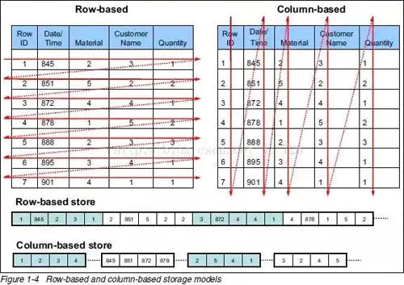

## 行式存储和列式存储

### 一、数据处理分类

数据处理大致分为两类：

- 联机事务处理 OLTP（On-Line Transaction Processing）是传统关系型数据库的主要应用，用来执行一些基本的、日常的事务处理。比如数据库记录的增、删、查、改 等
- 联机分析处理 OLAP （On-Line Analytical Processing）是分布式数据库的主要应用，他对实时性要求不高，但处理的数据量大。通常应用于复杂的动态报表系统上

| 数据处理类型   | OLTP                   | OLAP                       |
| -------------- | ---------------------- | -------------------------- |
| 主要的面向对象 | 业务开发人员           | 分析决策人员               |
| 功能实现       | 日常事务处理           | 面向分析决策               |
| 数据模型       | 关系模型               | 多维模型                   |
| 处理的数据量   | 通常为几条或几十条记录 | 通常要达到百万、千万条记录 |
| 操作类型       | 查询、插入、更新、删除 | 查询为主                   |

### 二、存储区分以及应用场景

- 行式存储：传统关系型数据库，如 Oracle、MySQL、SQL Server 等采用行式存储法，在基于行式存储的数据库中，数据是按照行数据为基础逻辑存储单元进行存储的，一行中的数据在存储介质中以连续存储形式存在。
- 列式存储：像 HBase、EMC Greenplum、HP Vertica 等分布式数据库均采用列式存储。数据是按照列为基础逻辑存储单元进行存储的，一列中的数据在存储介质中以连续存储形式存在

#### 1. 行式存储的适用场景

- 适合随机的增删改查操作
- 需要在行中选取所有属性的查询操作
- 需要频繁插入或更新的操作，其操作与索引和行的大小更为相关

缺陷以及解决方案：

- 行式数据库在读取数据的时候，比如，所查询的目标通常只涉及少数几项属性，但是这些目标数据埋藏在各行数据单元中，并且行单元往往又特别大，应用程序必须读取每一条完整的行记录；因此使得读效率大大降低。

    而行式数据库一般的优化是加 索引，简化查询操作步骤，并提升查询效率

但针对海量数据背景的 OLAP 应用（例如分布式数据库、数据仓库等），行式数据库建立索引、物化视图 需要花费大量时间和资源，无法从根本上解决查询性能和维护成本等问题，因此不适用于海量数据等应用场景，于是出现了基于列式存储的数据库

#### 2. 列式存储的适用场景

对于数据仓库或者分布式数据库来说，大部分情况它会从各个数据源汇总数据，然后进行分析和反馈。其操作大多是围绕同一列属性的数据进行的。而当查询某属性的数据记录时，列式数据库只需返回与列属性相关的值即可。

在大数据量查询场景中，列式数据库可在内存中高效组装各列的值，最终形成关系记录集。这样可以显著减少 IO 消耗，并降低查询响应时间

优点和适用场景：

- 查询过程中，对于各列的运算可以并发执行，最后在内存中聚合完整记录集，最大可能降低查询响应时间
- 可在数据列中高效查找数据，无需维护索引（任何列都能作为索引），查询过程中能够尽量减少无关 IO，避免全表扫描
- 因为各列独立存储，且数据类型已知，可以针对该列的数据类型、数据量大小等因素动态选择压缩算法，以提高物理存储利用率；如果某一行的某一列没有数据，那在列存储时，就可以不存储该列的值，这将比行式存储更节省空间

缺陷以及不适用的场景：

- 数据需要频繁更新的交易场景
- 不适合做含有删除、更新的实时操作

