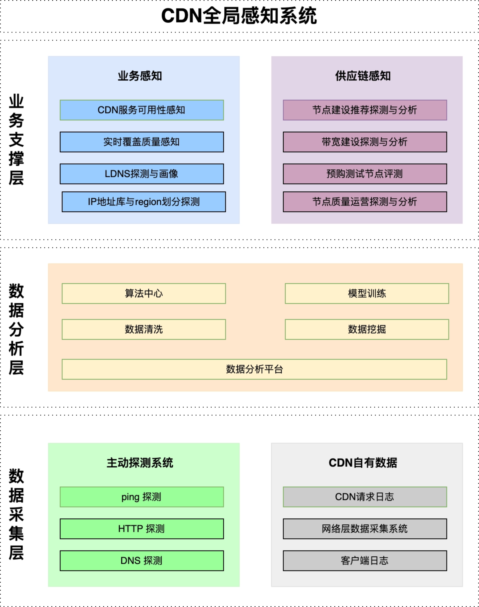

CDN系统的良好运行，依赖一个强大的全局感知体系。类似于人的感觉器官和神经系统，它能全面、快速、准确地感知系统各个层面的信息，并正确、及时地反馈相应的数据或直接做出决策。也即要建设“CDN全局感知系统”。

系统整体分为三层，数据采集层构成了基础底座。中间是整合了多种机器学习与算法的数据分析层。顶端是业务支撑层。

### 一、领域定位

故障调度是面向 CDN 供应链的实时控制能力：在“域名/厂商/区域/运营商/链路/回源”等维度出现不可用或质量劣化时，基于统一健康视图完成**快速发现、准确归因、稳健处置、自动化覆盖、可演练可追溯**的闭环，把止损动作从“经验操作”升级为“可验证工程系统”。能够在分钟级完成“故障发现、智能决策、故障切换”，提升CDN的稳定性。

故障调度的能力定义

- 故障发现需要足够快。
- 故障定义需要足够准。
- 故障处理需要足够稳：
- 故障自动处理覆盖需要足够全 ：主动探测+CDN自有日志。 存在无法自动故障切换的场景（前端/端外流量、DNS调度部分故障场景、solar部分老配置场景、写死域名、配置中无可切域名）

衡量指标：

- MTTD（故障发现）：5-8分钟 -> 2分钟；关键域名/链路逼近1分钟，长尾收敛到2分钟
- MTTR（故障恢复/止损）：总体做到5分钟。确认是故障后，并且做出操作动作。用户不再使用故障域名。
- 故障自动处理覆盖率：由72%提升到95%（大部分是写死域名、端外、内部逻辑(solar、DNS调度)、无法切换(配置中无可切域名)）

### 二、实现原理

#### 1. 故障发现（快）

能力：多信号、多视角，把故障发现做到可控且足够快。以多源信号构建“黑盒+白盒”的健康监控，保证从异常发生到触发处置决策的时延可控，并能够计算出影响的带宽和影响的业务。

我们采用“主动探测 + CDN自有日志”的组合：

- 主动探测：是我们的“快速路径但归因粒度较粗”。覆盖域名可用性。比如HTTP/S 探测（包括 DNS 解析结果、连接建立等）、CMTP等特殊协议。
- CDN自有日志(客户端日志)：作为“慢路径但归因粒度更细”。可以发现应用层错误，比如：图片解码失败率。
- 我们再根据业务的质量敏感等特性，将两者结合起来去发现故障。避免单一信号误判。

#### 2. 故障决策（准）

能力：建设统一的“全局健康视图”，并拆分可解释的故障分类。比如区分“域名封禁/域名质量/二级域封禁/运营商链路/厂商侧故障”等，做不同的预案处理。将故障的状态从“有故障”升级为“什么故障”。把“故障切换策略”产品化

我们一般把故障拆成两个维度：

- 可用性：能不能连上？能不能返回正确内容。
- 质量：成功但慢、卡顿、失败率升高、业务层指标异常等。

并且将常见的故障提前设定可执行的策略预案。例如 域名封禁、DNS 解析异常/污染、证书过期等，策略上遵循“先切同厂商备域名，再跨厂商切换”，保证快速的切换动作，又尽量不引发二次事故。

#### 3. 故障执行与生效（稳）

能力：故障处理策略不仅追求“把流量切走”，更要保证不引发二次事故/成本（带宽抖动、回源冲击、成本暴涨），并且需要具备“安全熔断”、视情况可控的分级、灰度、回滚能力。

执行面还要解决“切量切不动/切不干净”的问题。比如

- 业务侧的接入方式：调度SDK、DNS方式(单个业务域名+多个不同厂商的接量域名)、写死域名、甚至业务自己管理CDN域名的情况。
- 我们的后端针对不同资源（自建、三方、视频、静态），由于历史原因，也存在多个平台，且不同平台的能力不对齐（比如kconf限频导致无法大规模变更）

针对这些问题：

- 我们打通了调度与下载器链路，将“能力对齐的域名组配置”实时下发到下载器。提供了兜底手段，即使下发了故障域名，也能够通过重试请求到正常域名。这是为了稳定性而做的兜底方案，主要解决不受调度控制的场景。
- 把分散在不同平台/不同历史系统里的“最终生效路径”统一起来，确保一次操作能覆盖全链路。以及针对性的建设高并发的变更能力，支持大规模故障时，可以一键切量。
- 把回滚校验、巡检对账工程化，杜绝长期配置漂移。防止配置中域名出现无法切换的情况。

同时，为了应对非预期场景，我们还有熔断和演练两大手段。

- 熔断：对“故障调度引入的变更量/变更流量”等设置阈值，超过阈值立即停下并转人工确认，防止策略误判造成更大范围的二次伤害。
- 演练：周期性的演练作为稳定性的前置条件，逐步覆盖边界场景与异常组合。通过故障注入把“不可知的失败”变成“可验证的范畴”，我们在关键链路上采用同样的理念做持续演练与复盘固化。

#### 4. 调度能力

能力：从“能切”升级到“稳定可切、快速可切、切后可回”

- 大规模配置治理：对不合规配置进行“逐域名、逐配置”的收敛与风险标注，把“配置杂乱、极大风险”变成“可治理、可维护”。
- 切换成功率：规范域名在多轮演练与线上验证中实现稳定 100% 逃生
- 大规模止损时效：从 5 分钟级压到 1 分钟内，核心是统一执行面 + 高并发可控变更 + 可靠回滚链路。

