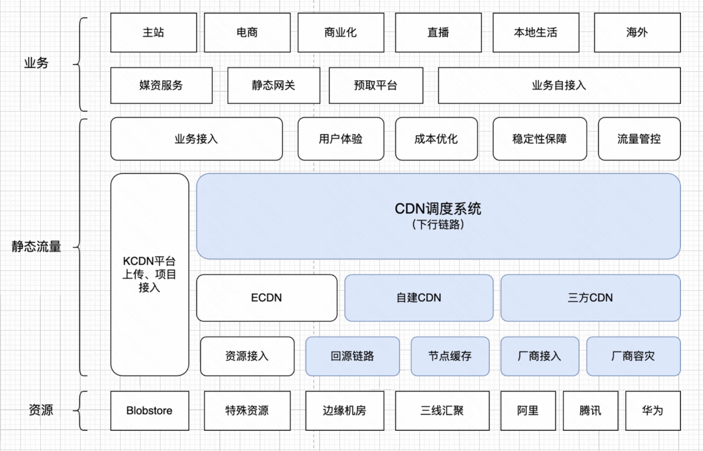
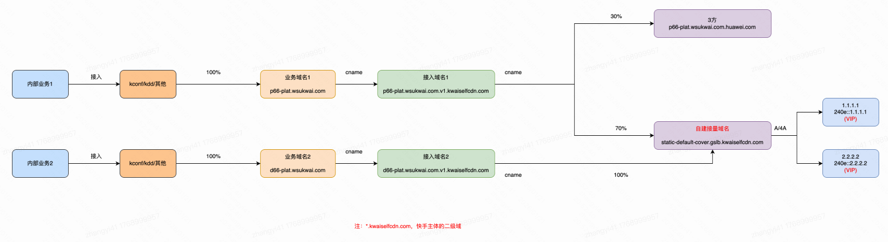
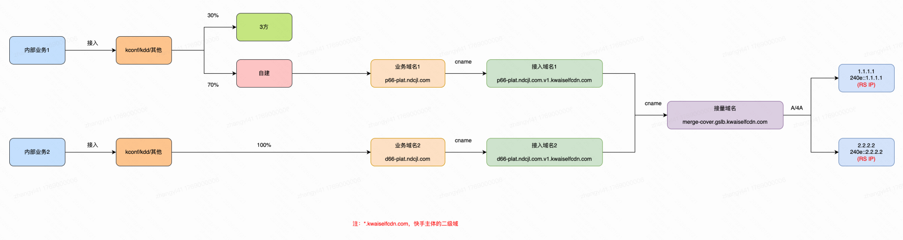
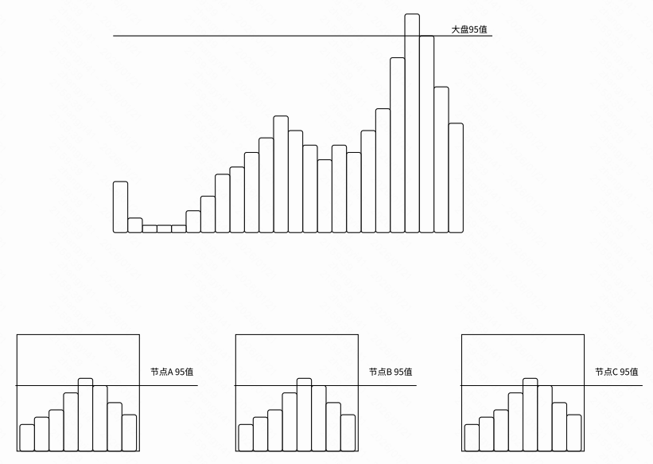
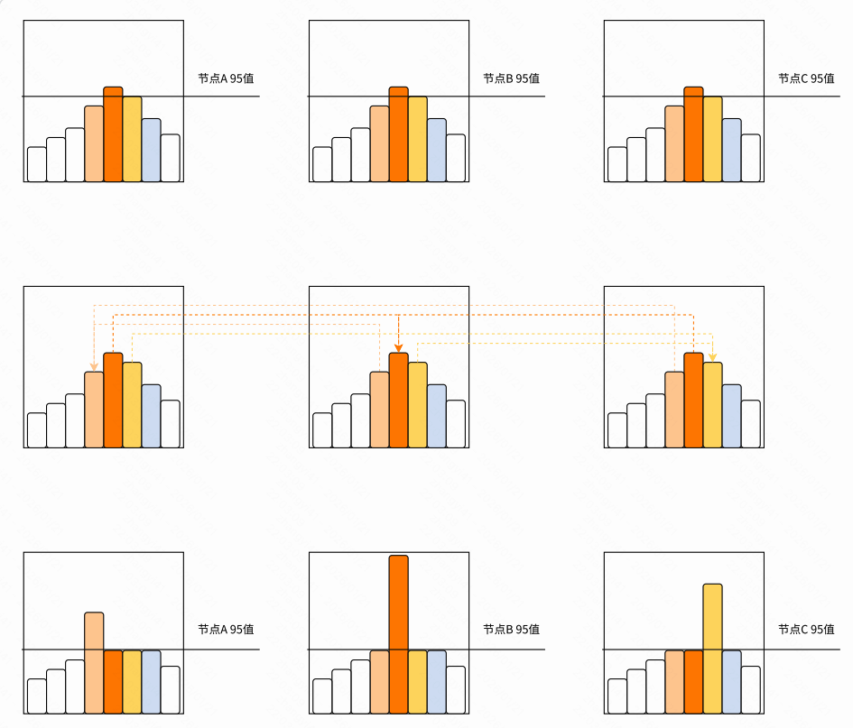

快手CDN的发展经过了多年的发展，在资源侧形成了PCDN+自建CDN+三方CDN的形态，依据资源价格阶梯以PCDN>自建CDN>三方CDN的顺序优先使用，业务侧主要以SDK接入为主，主要保障业务的质量及故障切换能力。

随着成本优化逐渐进入深水区，之前几年忽略标准化而快速上量低价资源的模式已经接近瓶颈，需要系统化的建设和精细化的运营来寻求进一步优化空间。在此背景下，需要做看清、打通、融合三件事，完成整体大CDN的融合，实现在更大范围内寻求更优解的目标。

对于规划打通这部分，将CDN调度内部各系统进行打通，从使CDN流量能够在CDN资源自由流动，达成资源与业务抽象的归一化，为融合提供基础底座。

## 一、领域定位

从功能上面来看，CDN调度系统

- 对下主要承担自建边缘机房的带宽成本、流量控制、回源链路等任务，以及三方厂商的接入、容灾能力
- 对上主要配合业务接入、用户体验、成本优化、稳定性保障，以及流量管控。

## 二、实现原理

### 1. 面向业务

基于业务的调度有以下几种方式：

- 端IP调度：对业务提供调度SDK，根据业务的场景控制下发域名或IP的比例权重。从而控制域名或IP的带宽。是主要的调度方式。
- DNS调度：业务域名 cname 到我们的接入域，我们再 cname 到调度域名（接量域名），通过调度域名的A/4A记录引导到L1节点。我们针对不同的机房机型，会解析到VIP或者机器IP。
- 302调度：客户Http/Https请求到达L1节点后，通过返回302的方式，引导客户请求到另一个位置的调度方式。
- HttpDNS调度：内部业务可以通过请求HttpDNS服务器的形式替代请求权威DNS，调度系统通过作用于HttpDNS的配置，让HttpDNS返回需要的解析来控制调度。

使用“端IP调度+DNS调度”双模式：

- 业界厂商过度追求架构一致性，统一使用DNS调度。我们则通过更为优雅的双模式控制来保留下了IP调度，拿到了更大的成本收益
- IP调度：粒度更细，调度可以根据每个资源ID进行一次调度，直接下发哈希后资源所在机器的IP。冷文件只在节点内部一台机器上，单机存储效率高。调度做好了IP打散，机器更为均衡。
- DNS调度：调度粒度粗，需要将调度的解析结果预先刷新到DNS服务，无法按照资源ID调度，请求被随机打散；冷文件存在节点内部的多台机器上，存储效率低。为了保证单一回源，需要哈希计算有资源的机器进行回源，内网带宽消耗大。DNS局限性导致IP不可能完全均匀，需要加入4层dpvs保证均衡度，额外机器成本。并且还多了DNS解析延时。
- 因此，在非必须DNS调度场景下，使用IP接入，硬件成本更低，快手点播类资源为例，有2000万的年化成本优势。并且质量更优。

核心诉求的指标：复用率、命中率、质量、突发

### 2. 面向容量

容量调度主要根据预估的请求数据、资源的承载数据和预估的调度执行情况，采用一系列算法使得预 期不会产生超出容量的调度结果，是调度的主体执行。

#### 2.1 端IP调度

以调度SDK的下发牵引调度。后端将业务的接入，统一抽象成业务单元；对资源的使用，统一抽象为资源单元。而调度的目标则是管理业务单元、资源单元的同时，对每个业务单元适配对应的资源单元。

- 业务单元：北京-移动-长短视频-冷流-是否免流。对应的带宽
- 资源单元：机房-VIP-机器，容量上限，成本线，95线。

由于我们已经抽象出来了业务单元、资源单元。因此我们可以继续将调度逻辑进行抽象化，分为两部分：一部分为抽象化的调度算法支撑，另外就是复杂的业务逻辑。而调度算法采用实时性的无状态流模型处理，通过费用流模型强大的拓扑图处理能力，达到最强细粒度的控制力。

这样，业务逻辑和算法实现解耦。算法可以做到很高的抽象化，且可以适配几乎所有的 “成本线分配” 场景。不同的业务场景适配只需要修改算法参数即可。

业务单元的带宽，我们通过自建的带宽和自建的QPS，算出对应的业务单元的文件大小。然后通过总QPS（自建+三方）算出业务单元的带宽。同时，我们使用基于决策树的机器学习算法对数据进行去躁点 + 预测。让业务单元带宽更加平滑、稳定。

通过费用流算出节点所承接的流量之后，我们还要关注节点的命中率。因为客户的每次文件请求，对于节点机器来说都有是否命中缓存的指标。如果未命中缓存，则需要回源，会造成额外的带宽、耗时、质量等成本。因此，我们自研并落地”离散型哈希槽位算法“，稳定节点文件分布，提高了命中率（10% -> 8%）。

- 对比其他一致性哈希算法，在负载均衡、单调性、稳定性(扰动量)、支持权重、是否有状态、时间复杂度、空间开销等比较维度，都做到了最优。
- 节点变动时，无需重映射，做到零扰动。并支持工程介入配置，人工可控。

调度中控实现了不同业务间、不同资源间、不同省份间的彻底打通。 无需SRE手动计算分配流量，使调度具备主动分配流量的能力，可以全局计算最优解。

至于精准调度，我们下面再探讨。

#### 2.2 DNS调度

DNS模型：

- 用户通过 LDNS 获取域名到 IP 的映射关系。
- 调度系统通过告诉权威DNS，对于那些LDNS/用户，每个请求的域名，应该给出那些IP
- 由于不是所有LDNS都支持EDNS。因此，对于请求权威DNS，但是没有携带用户IP段的，将LDNS的出口IP认为是用户IP

调度系统给权威DNS一个类似如下的表格

| LDNS/用户IP所属运营商省份 | 域名         | 解析类型 | 记录                                  |
| ------------------------- | ------------ | -------- | ------------------------------------- |
| 电信-北京                 | customer.com | A        | 1.2.3.4, 2.3.4.5                      |
| 电信-福建                 | customer.com | AAAA     | c4:::::::03, c5:::::::05, c4:::::::01 |

对调度而言，这个表格表示的含义是：某个域名在某个地区的所有请求，均分到那些ip。比如：电信吉林ipv4的a.com的请求大概总共有500qps，如果给了2个IP，则每个IP分到250qps。这些qps打到 IP所属的集群后，会给集群带来一定的网卡带宽和cpu消耗，以及对集群所在节点的交换机增加一定的带宽。

但是一个集群可能会被多个域名不同地区的用户调度使用，且会被动态加速混跑。一个节点上也存在其他业务方的集群，比如直播。由于无法直接控制直播和动态加速，其对集群CPU和带宽，以及交换机带宽的影响可以认为是不可调度的。直接从容量中减去，便可以得到DNS调度的模型。

于是，DNS调度通过一定算法调整权重，使得每个集群的CPU和带宽不超过限制，每个节点的带宽不超过限制。 这里对于各业务的带宽和qps的预估是通过最近一小段时间在所有节点上该业务的访问日志聚合得到。 对于业务的qps在集群上会消耗多少cpu，是通过一定算法基于历史数据和压测数据来计算。对于直播、动态加速、边缘计算的消耗量，是通过他们的日志上报，也有一定的延迟。

如下分别为标准DNS调度、混跑DNS调度。

| 调度类型     | 是否有业务域名        | 是否有接入域名      | 是否有接量域名      | 解析IP类型 | 后端机器类型 | 如何在3方和自建调量             |
| ------------ | --------------------- | ------------------- | ------------------- | ---------- | ------------ | ------------------------------- |
| 标准域名调度 | 是，域名为 快手主体   | 是，域名为 快手主体 | 是，域名为 快手主体 | VIP        | NC8          | 通过调整接入域名的cname解析权重 |
| 混跑调度     | 是，域名为 非快手主体 | 是，域名为 快手主体 | 是，域名为 快手主体 | 机器IP     | NC5          | 通过调整kconf或kdd 文件区间实现 |

另外，调度也存在一定程序的执行偏差等。输入的延迟+调度的执行偏差，促使我们去做调度的精准化。

#### 2.3 302调度

具备302的调度能力，可以使用执行更为精准，时效更高的302调度方式对集群、节点的容量进行控制。由于302调度会对质量产生较大影响，因此我们只对部分业务（点播）进行了302调度。我们的302调度是边缘302，即用户先请求到边缘节点，再根据中心计算的实际需要，决定是否跳转。

#### 2.4 精准调度

**业务资源混跑**：调度系统对于每个业务一般会有一定的资源消耗评估，比如：直播、静态、点播，他们对于CPU、内存、磁盘IO、带宽、磁盘缓存量都有差异。因此，业务在同机器混跑可以达到更佳利用率。

**提高调度生效时间**：另外，一般DNS生效时间要在3-5分钟，部分区域甚至更长。对于接入我们客户端的业务，采用HttpDNS技术，不需要经过 LDNS，调度指令的生效可以达到妙级。并且可以采用302进行实时重定向。

**优化调度算法**：除了调度生效更快之外，调度的计算也需要更快。费用流算法可以求得全局最优解，同时算法覆盖的范围越大，粒度越细，能够求得的解更优，但往往也需要更多的时间。如果算法执行的时间很久，也会影响妙级调度能力。

- 常见的费用流是类 dinic 算法的 `O(V * E * F)` 时间复杂度（V 是节点数，E是边数，F是总流量）。CDN的带宽往往是 Tbps 级别，导致次算法的时间消耗非常就。
- 基于此特点，我们采用基于“容量缩放”的弱多项式费用流算法，可以实现 `O(E^2 * logU * logV)` 时间复杂度（U是最大边容量）。将数据量级最大的 U 做到对数复杂度，使得请求粒度的最优解可以在秒级完成求解。
- 另外，根据业务场景进行缩边、缩点等算法优化，最终使得在秒级可以做到全国范围内请求粒度最优求解。

**偏差补偿**：上面我们提到了调度的时效性和最优性，同时兼顾这两个方面，才能最终使得调度结果精确。但事实上即使我们采用各种措施，仍然不可避免会存在实际结果和预期的偏差，及时针对偏差进行控制并补偿才能确保最终结果收敛到预期水平。采用以 PID 为主的偏差控制算法，在实际结果和预期出现偏差后自适应纠正。

## 三、成本优化

### 3.1 边缘带宽计费值

为了利用95计费的原理做成本调度，CDN调度采用类似冲锋的行为降低边缘结算带宽。

假设业务计费按照95计费进行计费，一天的总业务带宽大体如图所示，每个柱子代表一个小时的流量，粗略估计，95时刻会在第二流量高的小时。如果我们均匀调度，每个节点都会与大盘类似。可以看出节点的95值之和和大盘95值是相等的。（实际上受地域时差等影响，不会对等）

但如果通过合理的调度，可以达到更优的效果，比如下图，将峰值3个小时每个小时的带宽集中于某一个节点，三个节点的总95都会有显著下降。但是实际生产中由于调度的生效不准，预测不准，节点大小不一致，业务覆盖限制，兼容其他目标等因素影响，策略会非常复杂。

由于边缘资源上不仅是由CDN调度系统直接作用的业务，我们节点是多个业务方共用的，每个节点的边缘带宽都是由直播、动态加速、边缘计算和点播等多方使用。多方的调度如果没有协同，则容易出现其他业务方抬升计费的情况。因此构建一套多业务的统一实时调度分配系统，合并规划调度，在不同的免费空间的榨取下，能够取得更低的计费值。规划的越好，收益越大。

### 3.2 低价资源使用

比如：常规IDC资源中的免费和包端口节点，依赖精准的调度能力，让实际的带宽线和控制线平齐。

还有类似阿里反向带宽资源，运营商的单网自融资源。

### 3.3 回源带宽计费

回源带宽是指边缘节点命中失败后，回源的带宽，降低回源带宽的调度手段通常是两个方面。这两个点的关键都在于整体的规划。

- 降低调度切换，需要为不稳定的业务量提供一定的冗余，使得调度切换频次降低。比如上述的离散型槽位哈希算法。
- 多级缓存，同机房NC机器可以先通过哈希回源NS，NS在回源L2。以提升整体命中率。并在此基础上收敛调度覆盖

