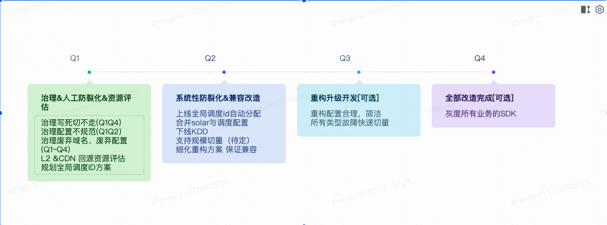

# **CDN 域名&调度 综合治理规划-2024**

## **背景**

​	**1 域名配置乱，管理维护成本高，归属不清晰**

​	**2 配置多，业务写死等情况；导致故障，调量切不走，变更影响难控制**

​	**3 配置不统一，逻辑复杂，变更风险大**

​	**4 流程过渡依赖人工维护，多次因变更配置差错出现稳定性问题**

​	**我们域名治理的最终状态应该是什么样子的？**[**域名&调度管理的终态应该是什么样子的？**](https://docs.corp.kuaishou.com/d/home/fcAAqcVA5PcBBE5pq6EvNKBIZ)

## **治理节奏&关键内容**

## **各阶段关键内容**

### **1 第一阶段：治理+ 人工防裂化+资源评估**

 	最终目标：

1 所有配置都是规范的，所有能够进行切量操作，配置基本不再增加，

2 回源带宽方案确定并准备好相关资源

3 以KCDN平台改造，调度SDK兼容的方式，实现全局的系统化的配置/域名收敛方案

#### **1.1 治理写死切不走 （中期 预计 Q1～Q2都在治理）**

原因：

发现手段：

1. 经验 
2. 代码扫描
3. 剩余流量 CDN 日志排查

[切不走TX域名统计](https://docs.corp.kuaishou.com/s/home/fcABd0Q74wpRaSdy58uFiG1tP?section=1093102019)

治理域名节奏：

带宽从上到下，最终目标80%的写死带宽

治理手段：

1 与业务沟通 + 给业务提供方便的代替方案（1 走调度（kfx，调度SDK），2 更换域名）

2 与业务沟通 + 切cname （不建议）

#### **1.2 治理配置不规范（中期 预计 Q1～Q2都在治理）**

发现手段：大规模切量平台扫描验证，参考[待规范的三方配置](https://docs.corp.kuaishou.com/s/home/fcAARoWeP4h49TDx7lnh4RJo7)

治理节奏：带宽从上到下，最终目标全部改为规范配置

治理手段：

1 创建每个业务的兜底标准域名

2 与业务沟通 + 将不规范配置改为兜底标准域名

配合补充：商业化域名收敛方案在国内推广，参考 [商业化域名收敛+治理](https://docs.corp.kuaishou.com/k/home/VD--UY0eSUOQ/fcABkBr1es3cOmNoa6ICNEMrX)、[【非直播】CDN域名规范化治理](https://docs.corp.kuaishou.com/k/home/VU_D5pQbQ-IA/fcAAh9uUvpJ4M018kdzjr79CQ)

#### **1.3 治理不用的域名和不用的配置（长期 Q1~Q4）**

**发现手段：**

无用配置：条件检测，例如 半年内无下发量，半年内无带宽等

无用域名：

1 条件检测，没有项目依赖 + 半年内无访问 + 代码扫描，没有以没有写死的该域名

**治理节奏：**

1 先治理配置（KCDN项目），

2 后治理域名。

**治理手段：**发现有，找业务相关人确定（KCDN项目），Q1 手动扫描治理，后续KCDN在Q2上线**项目生命周期管理**功能。

#### **1.4 L2 &CDN 回源资源评估**

​	参考：[cdn厂商故障大规模切量](https://docs.corp.kuaishou.com/d/home/fcABwVVNhdjiAT4nqeUu7XYkD#section=h.m9yk34pf6209)

​	1 完成防规模切量对CDN回源产生过大冲击的方案评估。

​	2 完成规模切量，对CDN回源产生冲击数据评估。

​	3 完成规模切量，对CDN回源产生冲击的资源筹备工作。

#### **1.5 规划全局调度ID方案**

​	全局使用调度ID：类似商业化的方案，新的项目不再分配新的域名和调度配置，二是尽量使用老的配置，且基本做到业务隔离，每个业务有一套调度id。

​	完成全局使用调度ID分配的方案设计，底表设计。

### **2 第二阶段：系统性防裂化 & 兼容改造**

#### **2.1 KCDN上线全局调度id自动分配**

​	参考 [域名管理方案（草稿）](https://docs.corp.kuaishou.com/d/home/fcAD8JhRaF_EEeIA_Qxm-TmEA#section=h.819gp97dkho5)

​	1 完成对所有业务的的基础调度id的创建和适配

​	2 完成项目分配的自动选择和适配

​	3 配合推进 标题1.1，1.2 中的治理工作

#### **2.2 合并solar与调度配置**

​	1 solar 的配置与通用调度配置合并

​	2 业务接入solar 不用再单独一份配置

#### **2.3 下线KDD**

1 改造并灰度迁移kdd的配置，使用与kcdn一致的调度配置

#### **2.4 支持规模切量**

​	1 完成防规模切量对CDN回源产生过大冲击的方案落地

2  L2&CDN的资源上线，能够支持规模切量的冲击

#### **2.5 细化重构方案 保证兼容**

​	1 在统一配置的基础上考虑和设计 重构方案

​	2 方案保证完美兼容，且业务迁移无感知

### **3 第三阶段：重构升级开发[可选]**  

参考 [三方融合CDN配置交互、故障切换优化方案](https://docs.corp.kuaishou.com/d/home/fcACYDqq6E5-l63WSKn-_-y8C)

#### **3.1 重构配置合理，简洁**

​	具体开发目标：

​	1 项目静态配置与具体厂商分量比例分离

​	2 配合KCDN很好的产品化，业务创建项目，可以自动分配域名，完全由KCDN管理。仅需同步静态配置给调度。

​	3 星移、定期调量、定制化需求的灵活支持能力。

​	4 业务透明，可以业务无感知的升级和迁移。

#### **3.2 所有类型故障快速切量**

​	1 域名故障切量，简单易理解，易操作，任何维度的切量都能一键或者修改一份配置操作。

​	2 常态化保持可以任意切走任意最大一家厂商的能力

​		a.设计更优的厂商切量能力防回源突增方案

b.建立厂商常态的、准确的水位管理能力

**4 第死阶段：全部改造完成[可选]**

1 逐步灰度放量新的重构方案。