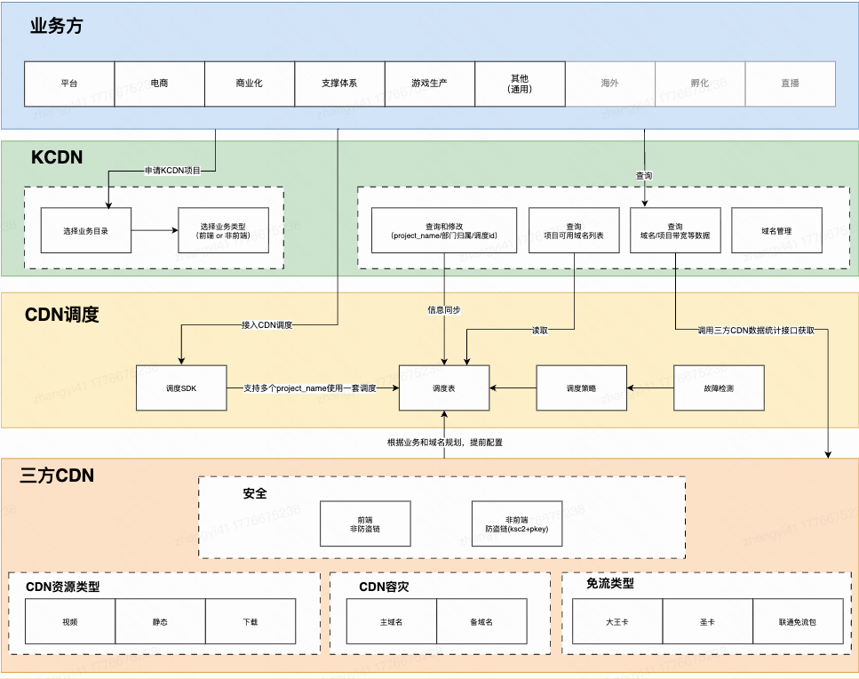
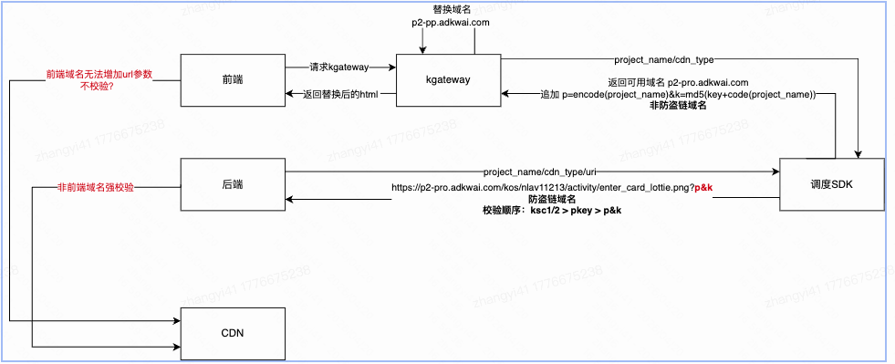
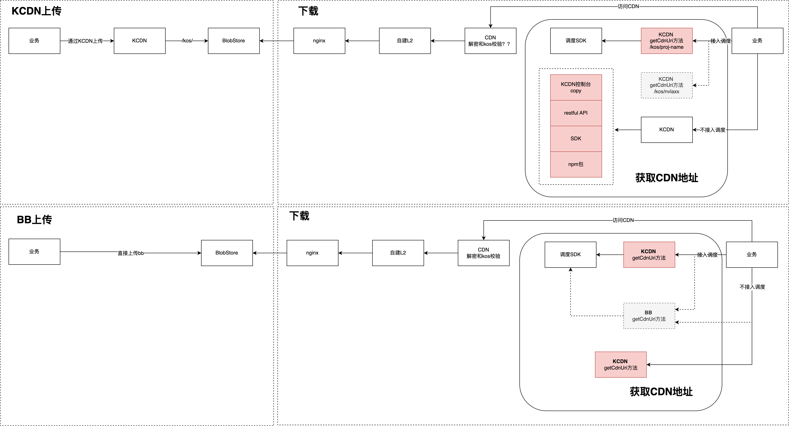
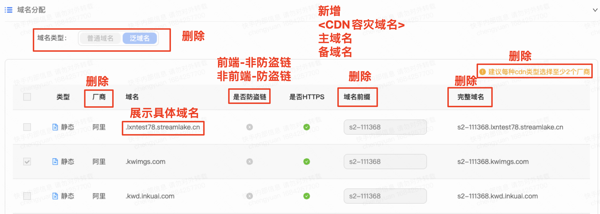
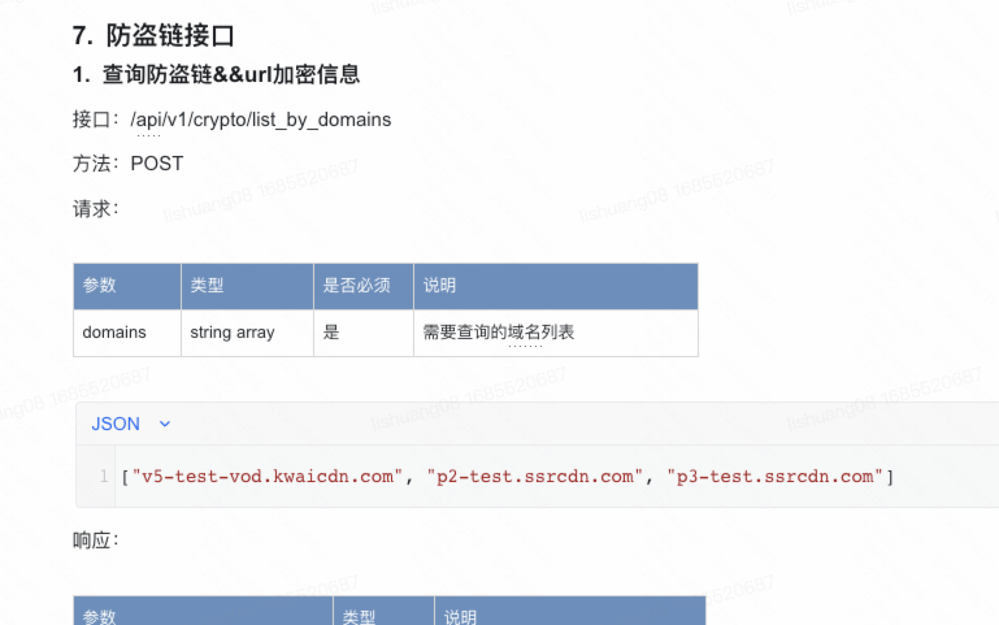
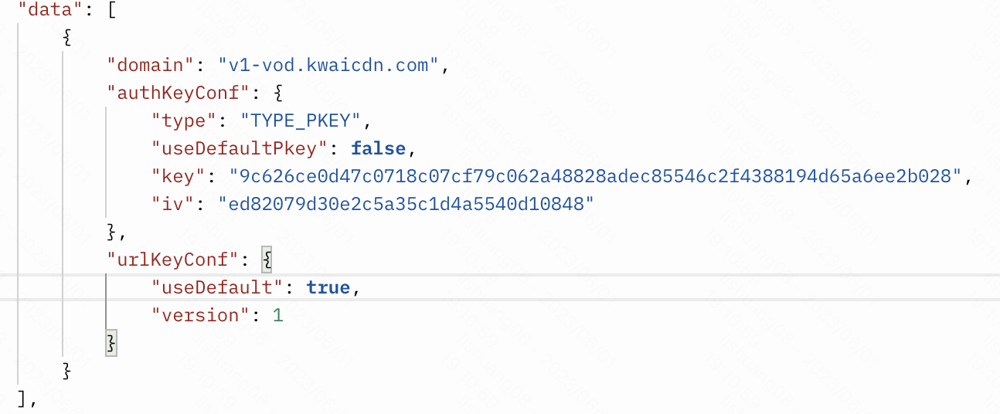
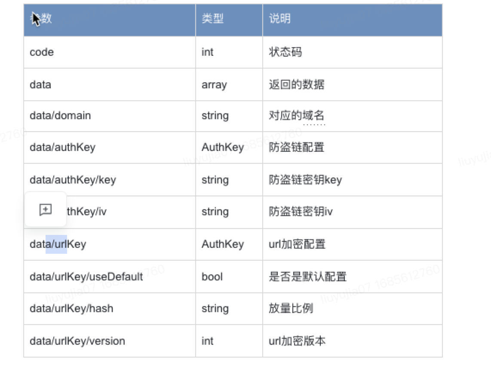
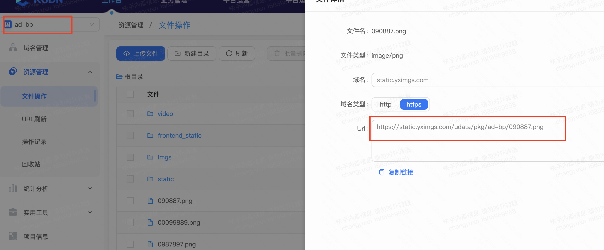
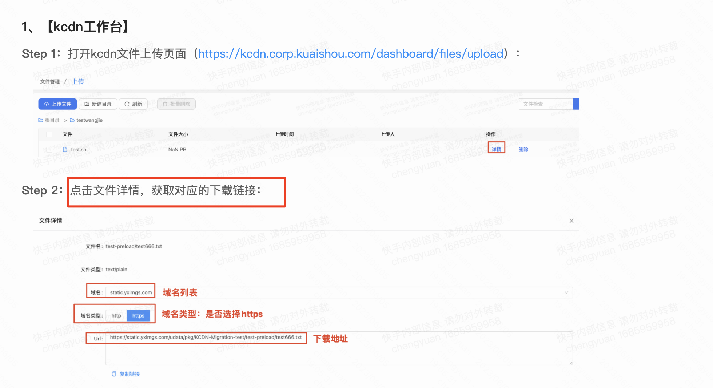
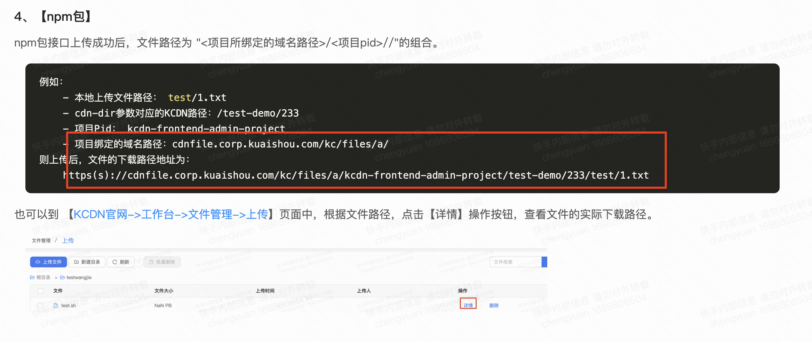

**【非直播】CDN域名规范化治理**

# **一、项目信息**

## **1.1 项目成员**

KCDN：@欧阳亮@黄鹏程

CDN调度：@施中一@李爽

三方CDN：@程媛 @刘瑜佳

## **1.2 项目背景/业务痛点**

当前业务通过KCDN平台申请业务(project_name)和新域名，申请门槛低，导致CDN的域名和调度配置爆炸（非直播域名 1500+个；调度配置1200份）；直观的影响是

- 4月非直播流量调整5.4T：需要切12份调度配置，30个域名；切量准备耗时20个工作日，每份配置多少带宽无法统计，切量基本靠算命和不断修正（切量耗时长且切不准）
- 域名故障调度，需要切换 10-90份配置；影响故障切换效率，拉长CDN故障止损时间
- 电商业务1T带宽，分散在94个域名上；因单域名数据量过小无法触发报警，导致电商故障可能无法发现
- 接到播放器/DA同学反馈，域名使用规则不明确，影响带宽数据的统计和带宽治理（[非直播资源带宽梳理专项/04-06月OKR](https://docs.corp.kuaishou.com/k/home/Va1T_ch0Irmg/fcAAe39Sf57ie90pQ-H58SXqc#section=vodka.lxsbbgdn7anx)）
- 域名硬编码问题；商业化和电商都提出期望可以识别未接入调度的比例，商业化也建议调度接入增加校验

## **1.3 项目预期/目标**

- 新增域名规范化（Q2）
  - 规范化域名申请方案上线：域名由现在的 [申请制] 改为 [分配制]，下线业务申请域名入口
  - 方案上线后，非必要新增域名数量为0；必须新增的业务做好控制和管理（设定审批门槛）
- 存量域名治理（Q3）
  - 存量域名规范化使用，使用规则明确
  - 存量域名使用收敛X个，存量调度配置减少 Y份

# **二、实现方案**

## **2.1 新增域名方案**

- 新增域名由 [申请制] 变更为 [分配制]
- 分配逻辑：**每个0级业务目录**使用一套域名；三方CDN需提前规划域名

- > 前端 - 非防盗链：视频/静态/下载 + 主备 + 免流（按需）

- > 非前端 - 防盗链：视频/静态/下载 + 主备 + 免流（按需）

- CDN调度支持多个project_name使用一套调度配置

- > 一个0级业务使用一套域名和一套调度配置

- KCDN维护project_name/业务目录/调度id关系（增删改）；信息变更需同步调度

## **2.2 问题讨论**

- 业务侧问题如何快速找到业务使用方？举例 【0424 /udata/pkg/livePlutusProduct/null资源访问404】，project_name = livePlutusProduct ，可以找到管理员，但管理员本身对谁在使用这个桶源并不清楚

- > 需可以快速获取资源是哪个项目上传的

- > 明确规则：谁创建谁负责 或者明确负责人，后续项目出问题直接找项目负责人

- 域名写死问题；举例，后端申请了项目获取了域名，直接把域名拿给前端使用（不接入调度）

> CDN访问强校验必须接入调度，不接入调度不允许访问【没找到合适方法，尤其是前端场景】

## **2.3 防止域名硬编码方案**

### **2.3.1 方案： url 增加调度标识并强校验 (评估方案不可行)**

存在无法覆盖场景：前端域名通过kgateway接入调度，只替换域名无法增加参数；考虑前端改造量和稳定性，kgateway需要解析出所有url并追加，性能消耗大，且侵入性强

- > 应对方案：前端域名使用非防盗链域名，前端域名不强校验调度参数

- > **存在问题：前端是最容易域名写死的场景，不强校验调度参数，效果会大打折扣（硬编码入口封不住）**

### **2.3.2 成本拆分方案**

- CDN提供接口，支持domain+项目id维度统计；https://p2.adkwai.com/kos/**nlav11213**/activity/enter_card_lottie.png

- > 实时5min粒度

- > 计费

- > 离线明细日志

- 强依赖url路径包含 /kos/proj-name；KCDN和BB上传，都需要调用KCDN的接口获取uri；**且方法需要统一 // 这么做时间可能会拉长**
  - 不要： KCDN上传 用/kos/nvla11175/；BB上传用 /kos/proj-ad-pp 【还是先使用这个方案】
  - 要： KCDN上传 用/kos/proj-xx/；BB上传用 /kos/proj-xx 【这么做时间会拉长，延后】
  - 举例：前端业务域名 [p1.adkwai.com](http://p1.adkwai.com)  既会使用KCDN上传的资源，又会使用BB上传的资源？

## **2.4 关键执行**

> [【域名规范化治理】需求开发排期表](https://docs.corp.kuaishou.com/t/home/VT0Do2jgDPY8/fcAACMl9f2nyorUINslOZ2jxD)

| **关键执行**                                                 | **执行人**          | **完成进度** | **预计完成时间**                                             | **实际完成时间** |
| ------------------------------------------------------------ | ------------------- | ------------ | ------------------------------------------------------------ | ---------------- |
| **KCDN —— 项目和域名申请入口** **【流程中心/新业务申请】页面：**新增<业务场景>：单选，前端 or 非前端新增<项目创建人>：默认填充，不支持修改新增<项目负责人>：用户填写，至少两个强提示：项目相关问题的负责人和第一联系人；不同业务建议申请不同的项目，项目不要混用新增<负责人所属部门>：默认填充，支持用户手动修改新增<cdn加速类型>：默认填充，静态/视频/下载强提示：非前端：KCDN默认提供视频/静态/下载三种加速类型域名（含CDN容灾主备域名）前端：KCDN默认提供静态域名（含CDN容灾主备域名）下线【流程中心/申请新域名】页面进入审批流程；流转审批业务线leader审批：平台审批人：欧阳亮 黄鹏程 CDN审批人：程媛 刘瑜佳  完成项目申请part1 <基本信息> **项目token在哪里？**[**https://kcdn.corp.kuaishou.com/flow/detail/?processInstanceId=1792&jobId=2251799828139078&processId=kcdn_apply_project**](https://kcdn.corp.kuaishou.com/flow/detail/?processInstanceId=1792&jobId=2251799828139078&processId=kcdn_apply_project)part2 <域名分配> ：读取调度表需要维护 【业务目录与调度ID配置】（人工维护）前端：分配非防盗链域名非前端：分配防盗链域名part3 ：您还需要以下步骤接入CDN服务**🌟 step1 上传cdn文件**KCDN上传；接入文档 [xx]BB上传；接入文档 [xx]**🌟 step2 访问cdn文件**前端业务请通过KFX+Kgateway方案接入CDN调度；接入文档[xx]非前端业务请通过SDK接入CDN调度；接入文档[xx]**🌟 step3 重点说明**请务必接入CDN调度；不接入CDN调度的业务，可能无法访问CDN文件，CDN异常或域名封禁也无法容灾，服务异常需业务自己负责请在接入调度时根据实际业务场景传入正确的cdn资源类型静态(STATIC)：适用于网站或应用中小文件的加速分发，例如图片、CSS、JS小文件等下载(DOWNLOAD)：适用于各类大文件的下载和分发加速，例如游戏安装包、应用更新、手机ROM升级、应用程序包下载等视频(VIDEO)：适用于音视频内容的文件分发和访问加速下线【申请新域名】页面 | KCDN@欧阳亮@黄鹏程  | 0%           |                                                              |                  |
| **三方CDN —— CDN功能开发** 新增域名6(0级目录) x 2([是/否]防盗链) x 3(加速类型) x 2(主备) x 2(供应商) + n(免流)=144+ncdn功能需求新增域名强校验 */kos/* ，非 */kos/*不允许访问；cdn供应商可配置；cdn数据统计需求https://p2.adkwai.com/kos/nlav11213/activity/enter_card_lottie.png支持domain+(id)带宽统计：5min实时/5min对账/明细日志支持domain+(id)状态码统计：5min提前创建12个调度配置kconf（6个业务*2个(防盗链/非防盗链)） 6：平台、商业化、电商、游戏生产、支撑体系、其他2：防盗链/非防盗链 内容：根据product、cdn_type、provider维度，定义好nodename，预配置好全部新增域名，及dispatch模版 | 三方CDN@刘瑜佳@程媛 |              | xx.xx 完成新增域名xx.xx 输出CDN需求文档xx.xx CDN需求文档评审xx.xx 提交CDN开发测试验收上线 |                  |
| **CDN调度 —— 调度功能和接口开发**与KCDN的交互接口支持多个project_name使用一套调度配置，新增调度id？人工录入维护？举例，商业化/非防盗链/ad1；商业化/防盗链/ad2新增download/KOS/路径检查 | CDN调度@李爽@侯禺凡 |              |                                                              |                  |
| **KCDN —— 运维管理**新增【项目与调度管理】页面 新增【调度ID配置表】：维护 [业务目录/是否防盗链/调度ID]**需要人工录入和维护** ；举例，商业化 - 防盗链 - ad2新增【项目与调度ID管理】：新增项目，通过查询【调度ID配置表】自动匹配调度id；支持修改操作，需要review把proj写入kconf配置，同时读取调度id对应调度表的域名内容：project_name/业务目录/业务场景/调度id新增【项目管理】页面 https://kcdn.corp.kuaishou.com/ops-bu/project-新增 <项目创建人>、<创建人所属部门>-支持导出和修改-可以查询项目使用了哪些域名【域名管理】页面https://kcdn.corp.kuaishou.com/ops-bu/domain域名/类型/厂商/区域/防盗链/业务目录新增域名，查询域名所在调度id，反查业务目录/ or 人工录入？支持人工录入老域名 一次性录入？现在的防盗链/图片/https/http2.0怎么获取的，不准确就下掉？还有域名详情 是不是也可以下掉？新增厂商也无法快速上线，各家能力也不同？支持查询域名存在 在哪些项目里（一个域名只存在于一个调度配置中（新增部分）） | KCDN@欧阳亮@黄鹏程  |              |                                                              |                  |
| **KCDN - 数据统计**依赖项：CDN接口支持带宽统计（省份运营商/5min实时/5min对账/ 明细日志）状态码统计 | KCDN@欧阳亮@黄鹏程  |              |                                                              |                  |

## **2.5 技术方案**

| **模块**                                                     | **技术功能项**                                               | **负责人**                                                   | **文档链接**                                                 | **接口地址** |
| ------------------------------------------------------------ | ------------------------------------------------------------ | ------------------------------------------------------------ | ------------------------------------------------------------ | ------------ |
| **三方cdn**                                                  | 域名规划列表                                                 | **刘瑜佳**                                                   | @刘瑜佳                                                      | **-**        |
| **按project_id维度统计**-5min粒度实时带宽-5min粒度对账带宽-5min粒度状态码 | 需求文档：[【定制API】pid维度数据统计需求](https://docs.corp.kuaishou.com/k/home/VV1Ntj01DIgo/fcAAbwLmobnGig5sqwmaRbnHg)team工单：[需求：【非直播】pid维度数据统计接口需求](https://team.corp.kuaishou.com/task/T3877579) | [**厂商接口列表**](https://docs.corp.kuaishou.com/t/home/VZHF7BNaf7yw/fcAD3RrVK1uO4rTh0ctoqBfOn) |                                                              |              |
| **离线日志增加字段**project_id字段                           | 需求文档：[CDN服务端定制化日志需求](https://docs.corp.kuaishou.com/k/home/VSvnTQmpnZw0/fcABnhaqa3UCktHvGGeABfj7m)team工单：[需求：【非直播】定制化离线日志_新增pid日志字段](https://team.corp.kuaishou.com/task/T3877853) | [**【定制字段验收】pid字段**](https://docs.corp.kuaishou.com/t/home/VMWI9wY6h-hk/fcADqX4R5Don1oUpdVr3jMxIl) |                                                              |              |
| **CDN路径强校验需求**-路径白名单、黑名单（具体目录可灵活配置）如：白名单：*/kos/*黑名单：*/upic/* | 需求文档：[【通用配置】点播域名_v1.0](https://docs.corp.kuaishou.com/k/home/VNgN4GttMWCA/fcABj6y8swjk6OCsGjheke8Jb)[【通用配置】静态域名_v1.0](https://docs.corp.kuaishou.com/k/home/Vckgv3h9zjJs/fcADyIV8bkb078KN4WXzUhPZu)（<5.访问鉴权-路径白名单>部分）team工单：[需求：【非直播】访问路径白名单功能（/kos/等）](https://team.corp.kuaishou.com/task/T3877996) | [【功能验收】访问路径白名单](https://docs.corp.kuaishou.com/k/home/VFLy02Oap2fA/fcACGVDuo3Sea4uRLws1s7TDp) |                                                              |              |
| **KCDN API**                                                 | -bb上传改写路径，回源url还原                                 | **黄鹏程****王森**                                           | [CDN URI添加项目标识方案](https://docs.corp.kuaishou.com/d/home/fcACeTJp491goiRAFeyn1C55g) | @王森        |
| **KCDN域名管理**                                             | **域名防盗链配置查询接口**能够查到新增和存量的全部防盗链域名，新增和存量用同一套方法 | **李爽**                                                     | [配置管理系统接口文档](https://docs.corp.kuaishou.com/k/home/VMjU6j6qYbI4/fcAB2itEFcnH-sa-eRfywE_Sc#section=h.gofatmd5cjm4) | @李爽        |
| **KCDN运维管理**                                             | **KCDN接收通知接口**举例：调度id = 100；新增 [a.com](http://a.com)  内容变了，调度需要通知KCDN | **崔志强****李爽**                                           | @崔志强                                                      | @李爽        |
| **其他补充ect.**                                             |                                                              |                                                              |                                                              |              |

## **2.6 交接跟进 @2023.07.25**

疑问点对齐：

- 强依赖url路径包含 /kos/proj-name；KCDN和BB上传，都需要调用KCDN的接口获取uri；**且方法需要统一，所以本身使用KCDN上传的也需要改用统一的方法**
- kos校验从nginx校验改为CDN校验；为什么需要base64编码？[【CDN URI去掉项目标识前缀】需求说明](https://docs.corp.kuaishou.com/d/home/fcAAthkv0TAKB3ZmFTfDEGnrk)
- 123 是哪个ip上报的 

# **三、存量域名和调度配置治理**

## **3.1 治理思路**

- 存量域名规范化使用（Q2）@三方CDN

- > 主站短视频 pkey和非pkey域名合并；减少存量域名数量，降低配置出错率

- > 主站短视频 [kwaicdn.com](http://kwaicdn.com)  和 [oskwai.com](http://oskwai.com) 域名使用无规则；目标：热门 [kwaicdn.com](http://kwaicdn.com) / 冷门 [oskwai.com](http://oskwai.com) ；互备

- > 主站长视频+低价不再使用 v*-ot01，统一使用 v*-ot-vod

- > 主站头像/封面/其他静态；目标是使用规则明确，考虑合理性/稳定性

- 存量域名和调度配置治理 （Q3）

可以从平台(主站)入手，因为平台的域名使用频率高/数量多；或者从没归属的开始？

- > 假设 平台-主站消费的静态域名目标是收敛到6个 [p*.a.yximgs.com](http://p1.a.yximgss.com) 

- > 找到能收敛的域名和对应的调度配置，修改为 p*.a.yximgs.com

- > 生成一份新的调度配置，根据线上带宽反算hash

- > 将老的调度配置映射到新的调度配置上

# **四、项目数据**

# **五、会议记录**

## **2023.05.22 ——** **对齐需求细节 with** **@黄鹏程**

**🌟 参会人：**@黄鹏程@刘瑜佳@程媛

**🌟 简单纪要：**

- 电商/商业化这类业务，自己搞了域名规范；现在使用的是泛域名，推使用新域名；不接受；怎么办？

- > 中间状态：保留两套逻辑；流程到cdn这里，cdn来决策走老流程还是新流程

- > 最终状态：老流程下线

- > 现在是问电商的同学 希望怎么分配 ？然后cdn就怎么分配

- 新增<负责人所属部门>：默认填充，支持用户手动修改

- > 一期支持：默认填充

- > 二期支持：支持用户手动修改

- 进入审批流程；流转审批

- > 业务线leader审批：（一期先不支持和合理性）

- > CDN审批人：程媛 刘瑜佳 （负责域名分配）

- > 平台审批人：欧阳亮 黄鹏程 

- 页面申请 后续可能会扩充其他字段；现在还不确定是什么 by @黄鹏程
- 只允许/kos/  再支持一个feature ；不允许/upic/访问  支持配置 @刘瑜佳
- 现在的 [每家CDN+5min实时+5min对账+省份运营商]  ：需要新接口；复制老接口，新增字段
- bb上传改写路径，回源url还原需要森哥支持 @黄鹏程
- 期望防盗链展示，调度提供接口；新增和存量，使用一套方法；定时更新，10分钟更新一次

> 调度更新了，怎么实时获取？实时性没有那么高

- 与调度交互接口

- > 变更写入

- > 输入调度id 查调度id的详细配置

- 调度id = 100；新增 [a.com](http://a.com)  内容变了，需要通知KCDN；不是直接读调度配置；内容别不一致 

- > 检索场景，项目维度可以不依赖，但是全量还是需要（KCDN db ；调度提供 db）

- > 预热刷新系统，依赖KCDN域名列表（db）；涉及到改造

## **2023.05.23 ——** **对齐初步排期**

🌟 **参会人：**@刘瑜佳@程媛@张杰@黄鹏程

**🌟 简单纪要：**

- 信息对齐：【域名申请】6月1日 白名单控制 只开放管理员，逻辑保留；现在使用率本身很低，域名是智容分配的
- KCDN数据展示工作量3周（2周 拉数据，1周 KCDN展示）；**强推CDN需求上线**@刘瑜佳
- KCDN API 需要森哥支持，bb上传改写路径，回源url还原需要森哥支持； @黄鹏程飞龙 **整理需求文档提供给森哥评估和支持**
- 阿里批量创建域名 @邹超
- 可灵活配置  路径校验需求@刘瑜佳
- 现在的 [每家CDN+5min实时+5min对账+省份运营商]  ：提供新接口，复制老接口能力，新增字段 @刘瑜佳
- 期望防盗链展示，调度提供接口；新增和存量，使用一套方法；定时更新，10分钟更新一次； @李爽一定要全，**明确接口协议 ，更新到项目文档**

> KCDN定时同步

- 调度id = 100；新增 [a.com](http://a.com)  内容变了，需要通知KCDN；不是直接读调度配置；内容别出现不一致的问题 ；调度变更通知且KCDN定时拉取，KCDN提供接口接收通知 @李爽@崔志强 **明确接口协议 ，更新到项目文档**

- > 检索场景，项目维度可以不依赖，但是全量还是需要（KCDN db ；调度提供 db）

- > 预热刷新系统，依赖KCDN域名列表（db）；涉及到改造

- KCDN 提供测试环境，大家先体验一下；有问题方便及时调整 @黄鹏程

## **2023.06.01 ——** **项目周会**

🌟 **参会人：**@刘瑜佳@程媛@张杰@黄鹏程

**🌟 简单纪要：**

- CDN调度 —— 调度功能和接口开发

- > 支持项目与调度ID 增删改 写入 调度表（kconf）- 提供接口：不支持删；增的时候校验有没有重名，改的时候也校验（如果没有，改也报错）；@李爽 设计接口

- 几个问题

- > 申请新业务接入，选择业务分类，现在有申请的目录不在树里的情况（比如“研发线-平台研发部”），需要看下情况@邓智容看需要怎么处理

- > 业务目录与调度ID配置：把防盗链项去掉

- > 前端-非防盗链：目前是否只加静态域名（防止分配了点播的域名用不上，但给其他人用）——先不变，还是静态/点播都加

- > 非前端：防盗链域名分配标准化（可以调度调度id）

- > 新增域名—>新增project-name，当前分配的域名可能不是业务想要的，需要沟通调整域名。希望项目界面中支持调整域名@邓智容

- > data/authKey

- > 查询防盗链&url加密信息查询接口（@李爽）：例如kcdn2000个域名，调接口，返回每个域名是不是防盗链，防盗链类型；是否有url加密，是ksc1还是ksc2；接口是否满足，如果不能满足，是否要扩充@刘瑜佳确认

**2023.06.15 ——** **项目周会**

🌟 **参会人:**

**🌟 简单纪要：**

- KCDN工作台获取下载地址的方式，也需要修改为带/kos/的地址？

- 调度 ksc+pkey 签发统一配置方法对齐

- 如果加解密有性能消耗，可以先不做base64？

- npm方式上传，获取下载地址；是/kos/形式吗？项目绑定的域名路径是什么意思，是KCDN分配的吗？还是用户自定义的？

确认：内部项目不带，新项目一定是带/kos/

- 新域名直接配置KSC2+KSC1+PKEY？

确认：下发KSC2+pkey

- pid过多怎么办？做提示和配额限制。

确认：审批环节管控，在审批环节加接口查询，

例，张三，商业化/xxx部门/xxx部门，三级部门内，（加时间限制，什么时间后的）是否有能复用的pid

- 需要新增域名规范文档
- 域名规划：考虑直播和 非前端视频和静态要是相同的根域名吗？
- 实时接口：需求未答疑
- 离线接口：需求未答疑
- 先提供console测试环境 试运行整体流程；数据统计这部分没有真实数据，怎么验证符合预期？
- 增加QA部分 想到的异常场景和处理方案 @cy

1. PID  cdn需求答疑@刘瑜佳
2. pid需求验收：接口验收@邹超  离线日志@徐昱琨
3. ksc2灰度环境、ksc1线上环境、pkey的kconf，需要统一放到一个地方管理，@李爽如需要前端提到 @邓智容

# **六、Ref**

- [点播域名情况](https://docs.corp.kuaishou.com/t/home/VVqEOY0hNupg/fcABxpkZT8U4al9t4mX_A0IVx?section=2027998161)

# **记录**

## **09.21  讨论**

以本地生活、商业化、电商 ：做试点、全部跑通、完善接入文档

- 存量域名灰度  10月中 所有供应商的所有存量域名的 /kos/proj-  ：2-3天/家；list 所有域名和带宽量  [a.com](http://a.com)  量小 5个域名 回归功能  主要测试量大的域名 500个域名  华为为例 ；整理每家CDN域名列表 提供CDN灰度 @邓智容；特别强调：存量域名只上线 kos/proj ，不上线kos白名单；toB域名删除，toB域名不涉及

> 每家CDN计费点时刻 域名带宽量：https://grafana.corp.kuaishou.com/d/-meCvD04z/dian-bo-he-jing-tai-dai-kuan-copy?tab=queries&orgId=10&from=1695052800000&to=1695139199000&fullscreen&edit&panelId=12

- 需要一个接入文档 使用文档 @邓智容
  - 申请域名开始 怎么分配
  - bb kcdn ；调度ID
- 测试环境：下周一 体验内部流程 @邓智容@程媛
- 本地生活 genyu下来了 创建3套新域名 跟 ad、ec新域名功能一样；支持kos白名单、支持 kos/proj-的 rewirite功能 @邓智容