**DNS调度梳理**

## **背景**

1. ### **需求背景**

- 为了支持自建CDN接量静态类资源（非视频资源）和自建CDN承接tob客户，需要支持通过域名的方式进行流量接入

- 调度系统通过不断调整域名的DNS解析，保证域名背后的CDN资源的容灾（故障剔除、机器下线），负载均衡（带宽压制）

> CDN业务区别于动态加速，对于DNS的变动会频繁非常多，主要原因：

1. > CDN节点主要都是边缘机房，网络相对动态核心三线机房会差一些，CDN机房数量也多很多，故障率，故障频次更高。改动DNS进行故障切换的频率更高

2. > CDN为了提高节点使用率，一般使用率会比动态加速高非常多（目前线上使用率可以达到90%以上），晚高峰网民稍微有突发，就需要变动DNS调整机房水位

1. ### **业界通用接入形态**

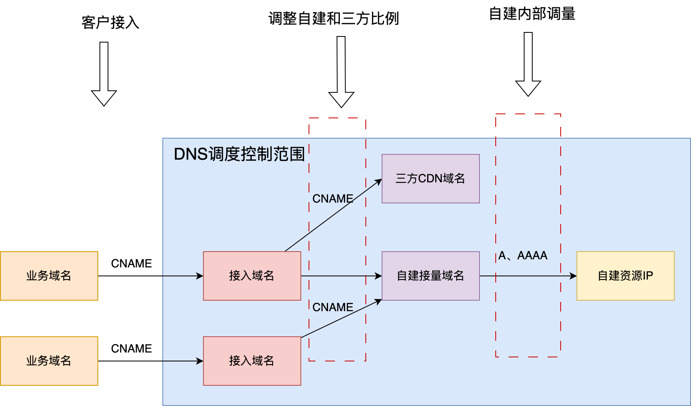


```
abc.business.com                 CNAME   abc.business.com.v1.ksydns.com
abc.business.com.v1.ksydns.com   CNAME   cover1.gslb.ksydns.com
cover1.gslb.ksydns.com           CNAME   123.43.56.45
cover1.gslb.ksydns.com           CNAME   123.43.56.46
cover1.gslb.ksydns.com           CNAME   123.43.56.47
```


1. ### **业界通用架构**

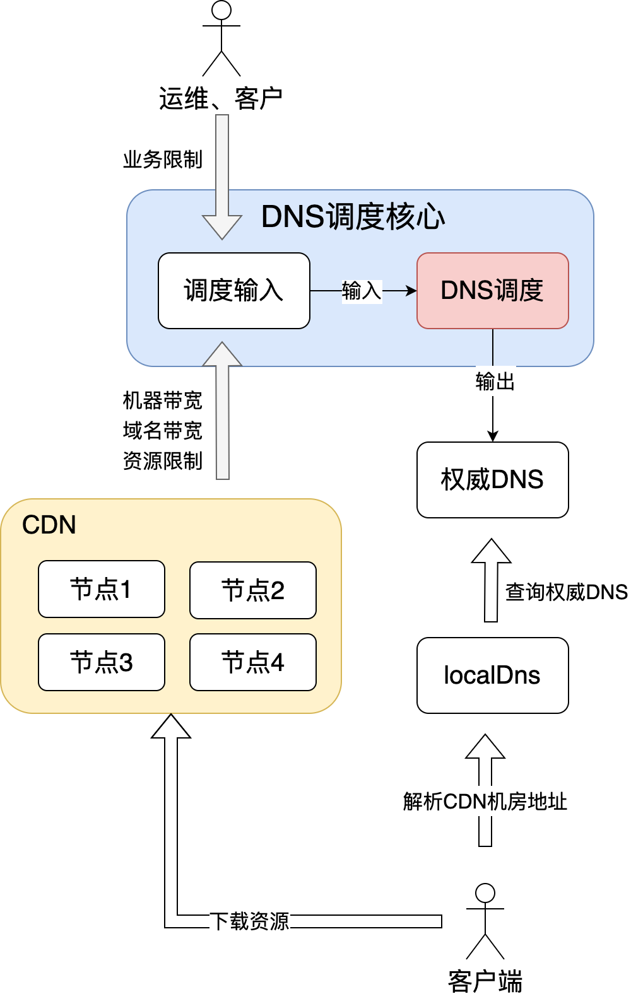

## **DNS调度设计**

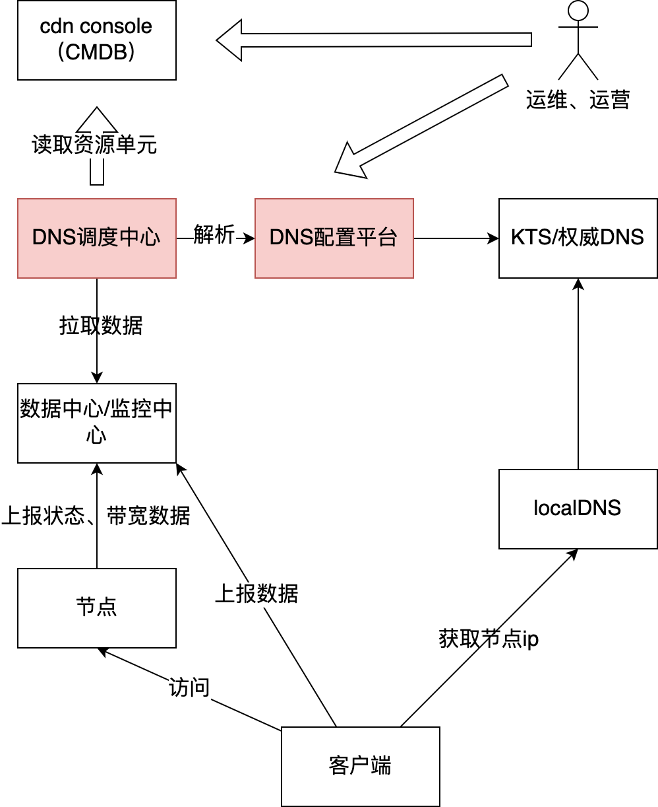

### **调度系统**

#### **能力**

1，基础功能

（1）具备 机房/VIP 故障后，自动切换流量；故障回复后自动切回；

（2）具备 机房/VIP 流量负载跑高后，自动压量；负载减轻后，自动切回流量；

（3）具备 3方CDN厂商 和 自建CDN机房 相互切量；

（4）支持 接入域名 和 接量域名 2级域名 联动调量。

2，故障降级

（1）支持多实例，主从热备切换；支持降级为 单例模式（避免底层依赖介质故障）；

（2）上游数据，正常获取后，进行基础校验；获取异常后，如果上次历史数据可用，以降级模式运行系统，并报警；如果不可用，系统维持原状，监控报警。

（3）部分模块和功能，具备人工强制介入功能：如，当上游批量误down节点后，造成大规模异常切量时，人工可在调度系统内部，写入覆盖数据，强制恢复。

3，其他

（1）人工可通过配置，独立控制系统各子模块运行；

（2）请求上游数据时，支持QPS和并发限流，防止打爆上游依赖系统。

（3）系统各子模块运行状态监控，运行失败报警。

#### **系统功能简图**

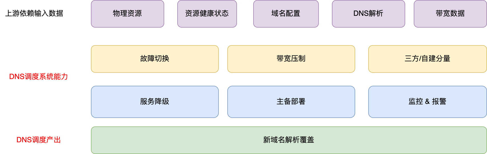

#### **系统框架图**

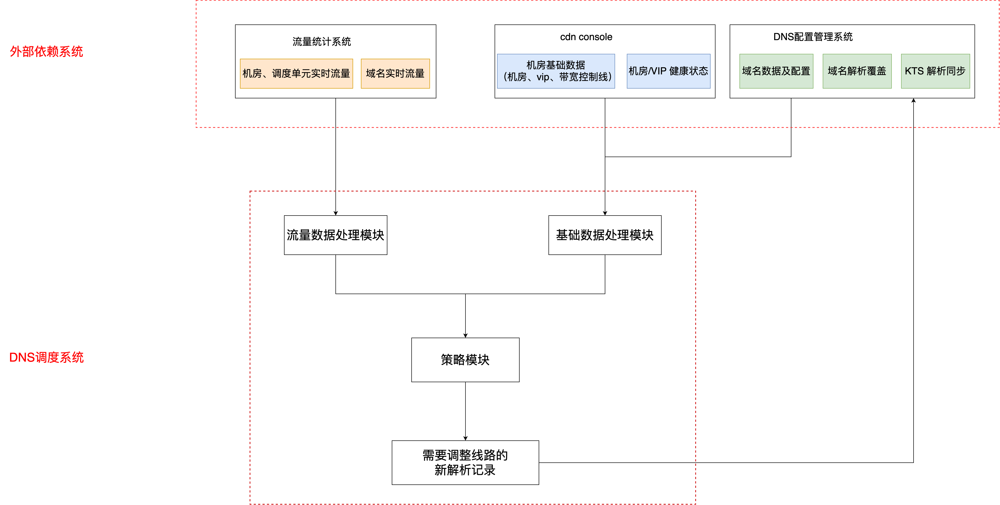

#### **DNS调度运行逻辑**

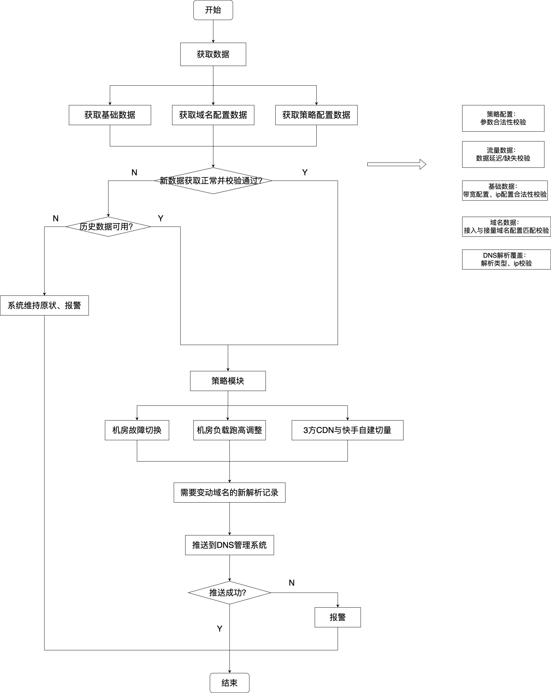

### **DNS配置管理系统**

#### **能力**

管理所有DNS调度的域名，包括：

1. 所有域名信息：顶级域、接入域名、接量域名
2. 域名对应调度规则：是否开启调度、调度优先级、可用的资源列表、DNS线路等
3. 管理域名下每个线路的资源，同步DNS解析到KTS

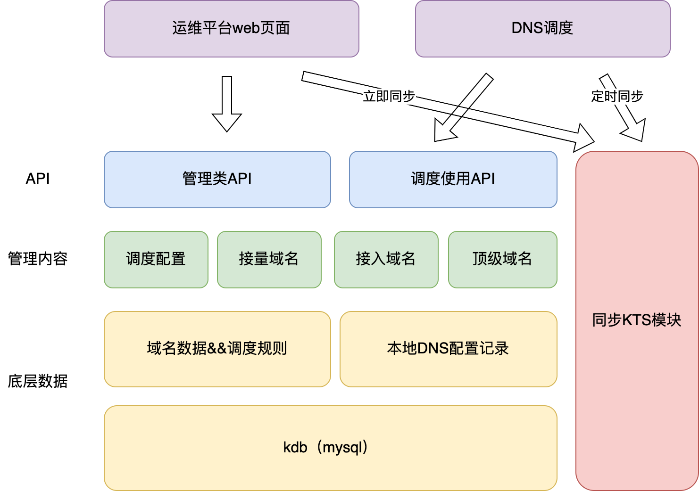

#### **域名数据ER图**

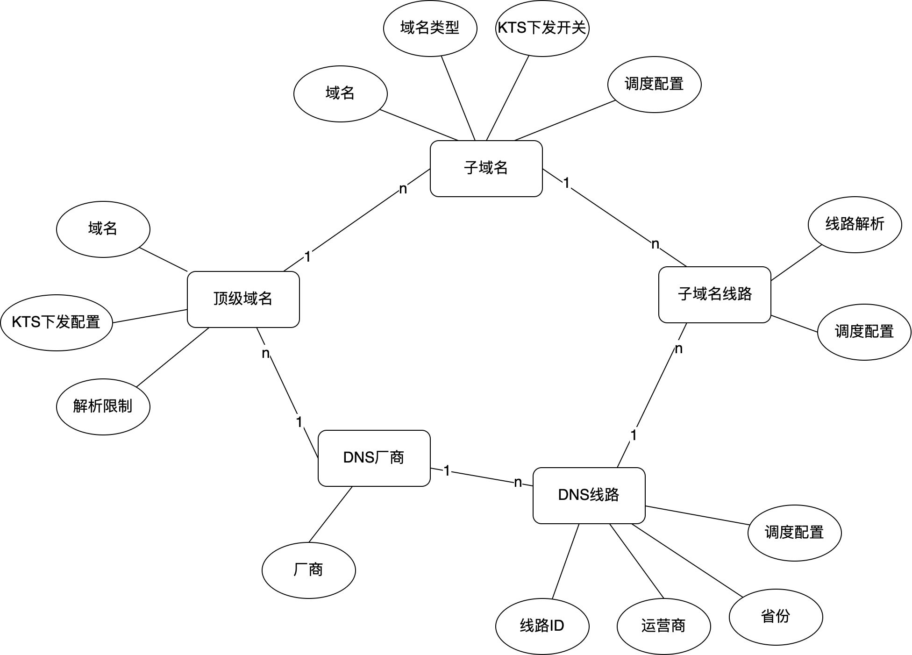

#### **KTS同步逻辑**

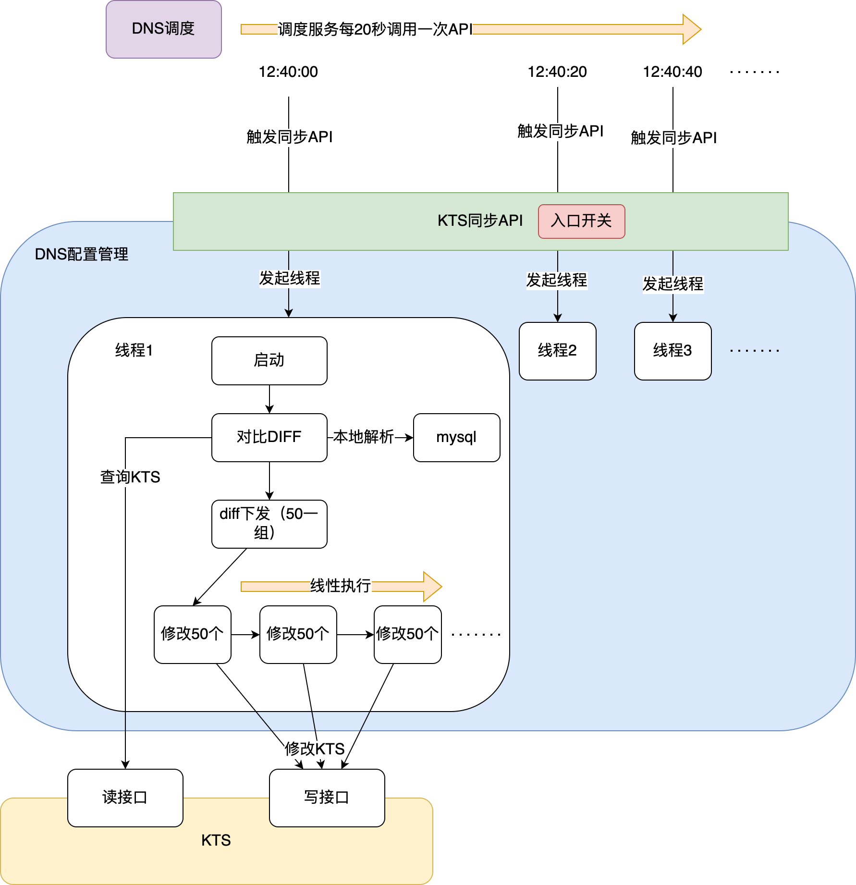

**diff对比流程**

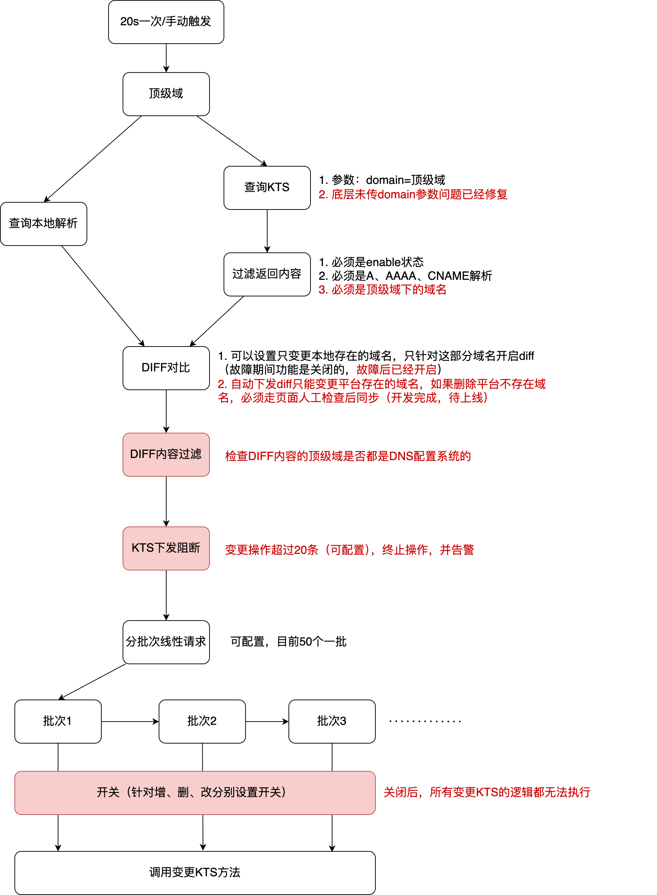

**红色部分是0417故障后新增的逻辑**

## **业界比较成熟的DNS管理模式**

> 目前阿里、腾讯、字节、百度等友商使用的管理模式

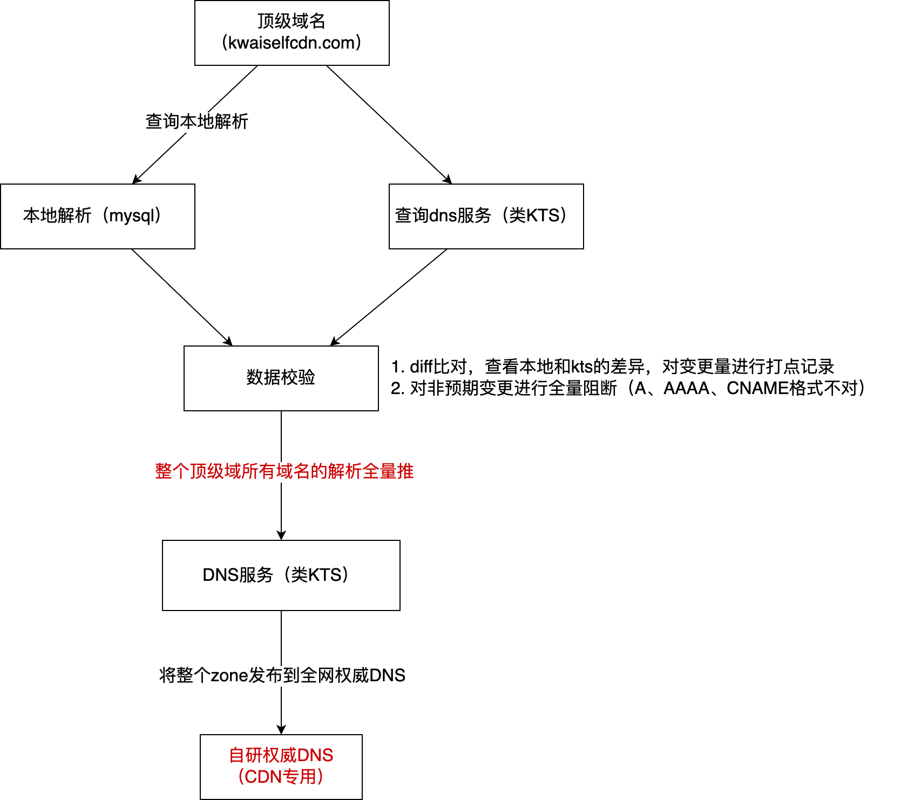

### **同步机制**

本地管理一份全量的DNS解析记录，定期向权威DNS侧同步解析（目前已知厂商都是全量解析一次性推送到自研的权威DNS，字节在有自己的权威DNS之前，使用的是diff比对后下发到aliDns）

### **容灾**

1. 每次下发前进行diff比对，对每次修改的差异进行监控打点。差异量过大进行阻断
2. 定期保存本地快照，出问题后将DNS解析回滚到某次快照，再重新全量同步到权威DNS

### **业务隔离**

1. 阿里、百度、腾讯：全链路隔离，CDN的权威DNS独立部署和其他业务使用的权威DNS没有任何交集
2. 字节：
   1. 国内：权限和API隔离，权威DNS混用
   2. 海外：全链路隔离，直播CDN和点播CDN的权威DNS都是隔离的

## **QA**

1. **为什么本地存储了一份DNS配置，而不是直接调用KTS？**

- 业界管理方案上一般是CDN本地存储一份全量的域名解析配置，让KTS和本地保持最终一致（业界是全量push，快手目前没有自研权威，只能使用diff下发）
- KTS无法支持DNS调度的所有解析管理形态
  - 调度需要支持SRE人工和调度程序分别进行解析管理，针对每次变更合并下发。
  - 调度需要支持DNS解析的人工锁，调度锁等信息（例如：某些线路只能人工操作；调度和人工冲突的时候需要平台解决冲突）
  - 调度自身要做DNS解析的快照（顶级域、域名、域名+线路级别的）和恢复，KTS不好支持域名+线路级别的快照

1. **长期来看，CDN为什么都要用自研的DNS服务？**

- 接量比较大以后，DNS变更非常频繁，靠常规接口一条一条改DNS，太慢了。同时DNS服务变更接口有QPS限制，很容易卡单，导致故障节点一直切不走流量
- 业务CDN对于权威DNS有额外的需求（快手目前还没有），例如：直接在权威DNS植入调度的代码，来提高调度最小粒度 
- 前期快手DNS调度接量还相对比较少，先使用dnsPod，后续流量大了之后也需要评估是否要自研DNS来保证CDN调度的正常使用

1. **为什么三方DNS服务不支持全量推送？**

- 目前dnsPod和aliDns都不支持全量推送，全量推送的方式一般只支持给阿里腾讯自己内部CDN业务使用（已知的是阿里的CDN部门没有使用阿里对外卖的DNS组件），不对外提供。

- CDN全量场景对于DNS云厂商来说太特殊了，可能引入其他稳定性风险，一般厂商都不会对外支持。友商的CDN只能推动各自公司自研来解决DNS配置同步的问题。

## **相关文档**

[DNS调度方案评审](https://docs.corp.kuaishou.com/k/home/VJKosBjlkmNA/fcABlxCn9ZKxWtvOtOCYM5pT7)

[DNS调度后端接口](https://docs.corp.kuaishou.com/k/home/VMhG84qgZuUU/fcAALWT16m7d_6pdBWkRAiVpc)

[20231119 DNS调度配置前端测试报告](https://docs.corp.kuaishou.com/k/home/VEiejDhT2UEQ/fcABdkDIK1nzDnWg7Q1qydzKC)

[DNS下发KTS测试用例](https://docs.corp.kuaishou.com/k/home/VBWmIXVgge0I/fcABGpnkJyHWqOvZSK8kaMY4a)

[20240422 dns调度下发KTS 加固与bugfix](https://docs.corp.kuaishou.com/k/home/VY9JP4AkGeUU/fcADCI-_mdUAxM0qe76eomnpS)